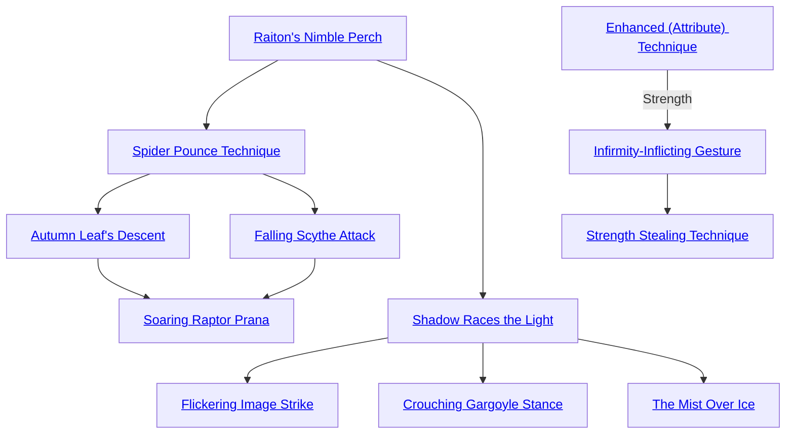

## Raiton's Nimble Perch

Cost: 3 motes
Duration: One scene
Type: Reflexive
Minimum Athletics: 1
Minimum Essence: 1
Prerequisite Charms: None

With this Charm, an Abyssal becomes preternaturally
deft and light. She can balance on objects ordinarily
too weak or delicate to support her without risk of falling
or breaking the object. The deathknight's player need
never make an Athletics roll for the Abyssal to move
gracefully or keep her footing, except in the most challenging
and improbable circumstances.

## Spider Pounce Technique

Cost: 1 mote
Duration: Instant
Type: Reflexive
Minimum Athletics: 1
Minimum Essence: 1
Prerequisite Charms: [[#Raiton's Nimble Perch]]

Muscles strengthened beyond human limits, the Abyssal
lunges impossibly far and fast in the blink of an eye. The
character can move (Strength x 3) yards vertically or twice
that distance horizontally in place of a normal movement
action. For leaps that are somewhere in between, the
Storyteller determines the character's jumping distance.
Characters may attack on the same turn that they employ
this Charm but receive no particular bonus for doing so
(except, possibly, the element of surprise). This Charm
can only be used once per turn.

## Autumn Leaf's Descent

Cost: 2 motes
Duration: Instant
Type: Reflexive
Minimum Athletics: 4
Minimum Essence: 2
Prerequisite Charms: [[#Spider Pounce Technique]]

Further buoying her body with Essence, the character
falls softly and quietly as a feather. The character can fall
noiselessly from any height up to a mile without suffering any
damage, so long as he invokes this Charm before he actually
lands. Once the character touches the ground, the protection
expires. Characters under the influence of this Charm are
virtually weightless and can crudely glide — but not fly — on
thermals and updrafts with a successful Dexterity + Athletics
roll at difficulty 2 but must continue to activate the Charm
from turn to turn, making it an expensive means of extended
flight. No roll is required if the character wishes to fall straight
down without such maneuvers.

## Falling Scythe Attack

Cost: 3 motes, 1 Willpower
Duration: Instant
Type: Supplemental
Minimum Athletics: 4
Minimum Essence: 2
Prerequisite Charms: [[#Spider Pounce Technique]]

The Abyssal springs into the air, adding deadly momentum
to her blow as she descends. Her attack is eerily
quiet and trails shadowy afterimages of the weapon or limb
used. The character makes her attack normally, but the
damage is doubled after it is rolled. Characters cannot move
in the same turn that they invoke Falling Scythe Attack,
which precludes it from being placed in a Combo with
Charms that involve or require movement, such as Flickering
Image Strike. This Charm can be placed in a Combo
with Spider Pounce Technique in order to extend the range
of the character's jumping attack, but this does not further
increase the strike's damage. This Charm is explicitly permitted
to be part of a Combo with Charms of other Abilities.

## Soaring Raptor Prana

Cost: 3 motes, 1 Willpower
Duration: Special
Type: Simple
Minimum Athletics: 5
Minimum Essence: 3
Prerequisite Charms: [[#Autumn Leaf's Descent]], [[#Falling Scythe Attack]]

Where he could only glide with Autumn Leaf's Descent,
an Abyssal with this Charm can truly — if briefly —
fly. The character must spend a full turn in concentration as
he floods his being with Essence. At the end of the turn, he
is borne aloft on spectral winds and may subsequently fly
wherever he wishes. These winds cause capes and cloaks to
billow and flutter, giving the illusion of wings if the character
is so attired. Characters may keep this Charm active as
long as they continue to spend 2 motes of Essence each turn,
but they fall normally once they stop paying this reflexive
upkeep. All Essence spent on Soaring Raptor Prana remains
committed until the character ceases flying. While propelled
by this Charm, Exalts move (Dexterity x 9) yards per
turn and may attack other aerial combatants normally or
assault targets on the ground using ranged weapons. Alternately,
they can swoop and strike as they pass.
Unless they are swooping, flying characters can only
be attacked with ranged weapons, by other flying/leaping
characters or on the initiative count when they strike a
ground based target in close combat. As usual, characters
rolling higher than the Abyssal can delay their initiative
to strike at the necessary moment. Due to the Exalt's speed,
individuals other than his target strike him at a -3 dice
penalty unless wielding a long weapon, such a spear. In
such cases, the penalty drops to -1. The Exalt's target may
attack him normally without penalty so long as she times
her strike accordingly.

## Shadow Races the Light

Cost: 2+ motes
Duration: One turn
Type: Reflexive
Minimum Athletics: 3
Minimum Essence: 2
Prerequisite Charms: [[#Raiton's Nimble Perch]]

With this Charm, a character may dramatically increase
her speed for short dashes. Upon activation, the
Exalt surges ahead as a muted blur of motion, her features
obscured in trailing wisps of shadow. She may increase her
sprinting speed by one factor for every 2 motes spent, up to
a maximum multiplier of her permanent Essence. For
example, a character with an Essence rating of 3 can spend
4 motes to triple her normal sprinting distance for the turn.
As an additional benefit, characters employing this Charm
can run without fear of getting winded or weary.

## Flickering Image Strike

Cost: 5 motes, 1 Willpower
Duration: Instant
Type: Supplementary
Minimum Athletics: 3
Minimum Essence: 2
Prerequisite Charms: [[#Shadow Races the Light]]

With this Charm, an Exalt delivers a single devastating
blow as he rushes past an opponent. While executing
this attack, the character is a flickering blur of violence
and shadow — his motions appear broken as if viewed by
the light of a pulsing strobe. The character makes his
attack normally, but the damage he inflicts is doubled after
it is rolled.
The Exalt can move up to his normal sprinting distance
without penalty on the same turn he activates this
Charm, although he is not required to do so. He must have
relative freedom of motion, however, so restrained characters
cannot use this Charm. Flickering Image Strike is
explicitly permitted to be part of Combos with Charm of
other Abilities.

## Crouching Gargoyle Stance

Cost: 3 motes
Duration: Special
Type: Reflexive
Minimum Athletics: 4
Minimum Essence: 2
Prerequisite Charms: [[#Shadow Races the Light]]

The character hunches over and stretches at inhuman
angles, gaining unnatural flexibility and balance for
as long as he maintains this Charm. The Exalt can scuttle
or dash along any surface without regard to gravity, allowing
him to scale sheer walls or dance on a ceiling with equal
facility. Alternately, the character may stand motionless
at odd angles or cling to an impossible perch. Storytellers
should assign bonuses as appropriate. While useful, the
character's distended limbs and joints reduce his Appearance
by 1, to a minimum rating of zero.
The Exalt must pay 1 mote each turn he maintains
this Charm; this expenditure is reflexive and requires no
concentration. If the character does not pay this upkeep,
his body returns to its normal configuration, and he once
again becomes subject to gravity and inertia. All Essence
spent on Crouching Gargoyle Stance remains committed
until the Charm expires.

## The Mist Over Ice

Cost: 5 motes
Duration: Special
Type: Reflexive
Minimum Athletics: 5
Minimum Essence: 2
Prerequisite Charms: [[#Shadow Races the Light]]

Stepping with the weightless poise of a ghost, a
character with this Charm can tread on water and other
fluid surfaces as easily as solid ground. Her silent footfalls
leave no ripples or wake, no sign to mark her passage as a
corporeal being. Although the character can walk on
dangerous liquids such as corrosive slime and magma
without sinking, such landscapes inflict normal injury to
the soles of her feet or shoes.
Characters must spend 2 motes each turn that they
maintain Mist Over Ice. This upkeep is reflexive and does
not require significant effort, but the overall concentration
necessary to maintain this Charm adds +1 to the
difficulty of all complex tasks (as decided by the Storyteller).
If a character fails to pay this upkeep, she sinks
normally. All Essence spent on this Charm remains com-
mitted until the Exalt stops using Mist Over Ice.

## Enhanced (Attribute) Technique

Cost: 3/5 motes per dot
Duration: One scene
Type: Simple
Minimum Athletics: 4
Minimum Essence: 2
Prerequisite Charms: None

Suffusing his flesh and bones with Essence, the
Abyssal briefly elevates his physical prowess to superhuman
levels. When he purchases this Charm, the character
must choose whether to heighten agility or power. This
choice determines whether the character increases his
Strength or Dexterity. This Charm cannot be purchased
again, so the character must decide if he wishes to focus
on Strength or Dexterity.
For every 3 motes spent, the character raises his
Strength by one dot. For every 5 motes spent, the
character increases his Dexterity by one dot. The character
cannot increase an Attribute by more that his
permanent Essence rating.

## Infirmity-Inflicting Gesture

Cost: 3 motes per dot, 1 Willpower
Duration: One scene
Type: Simple
Minimum Athletics: 4
Minimum Essence: 2
Prerequisite Charms: Enhanced Strength Discipline

With this Charm, an Abyssal can sap an enemy's
vigor and leave him briefly enfeebled. The character
gestures to any living target within five yards, and a wave
of smothering Essence leaps from her fingers. Her player
makes a Willpower roll against a difficulty equal to the
target's permanent Essence. If the roll is successful, the
victim loses 1 dot of Strength for every 3 motes spent.
Exalted targets (and other beings capable of channeling
Essence) cannot have their Strength reduced below their
permanent Essence with this Charm. Additionally, magical
victims can cancel their weakness by spending 5 motes per
dot, although such resistance requires concentration and
counts as a dice action. This Charm has no effect on targets
whose permanent Essence is higher than the Abyssal's.
Non-magical targets are not so lucky, however. If
their Strength is reduced to zero, they remain at Strength
1 for the rest of the scene, but they also lose a permanent
dot of Strength that can only be recovered with experi-
ence. This Charm cannot permanently reduce a victim's
Strength below 1.

## Strength Stealing Technique

Cost: 4 motes per dot, plus 1 Willpower
Duration: Instant
Type: Supplemental
Minimum Athletics: 5
Minimum Essence: 3
Prerequisite Charms: [[#Infirmity-Inflicting Gesture]]

With this Charm, an Abyssal can rob a living victim of
her potency and add it to his own might. The character must
successfully strike his target in hand-to-hand combat. Regardless
of whether the attack inflicts damage, the Abyssal's
player makes a Willpower roll against the target's permanent
Essence. If the Abyssal's player wins, the victim loses 1 dot of
Strength for every 4 motes the Abyssal spent (according to
the same rules as Infirmity Inflicting Gesture). In addition,
the character gains 1 dot of Strength for every 2 dots temporarily
taken. This bonus lasts for the rest of the scene.
The Exalt gains no Strength for reducing a mortal's
rating and cannot more than double his unmodified
Strength with this Charm. Victims regain all lost Strength
at the end of the scene unless their rating has been
permanently reduced. This Charm is explicitly permitted
to be part of a Combo with Charms of other Abilities. As
with Infirmity Inflicting Gesture, mortal crippled by the
Charm cannot recover except by spending experience.
