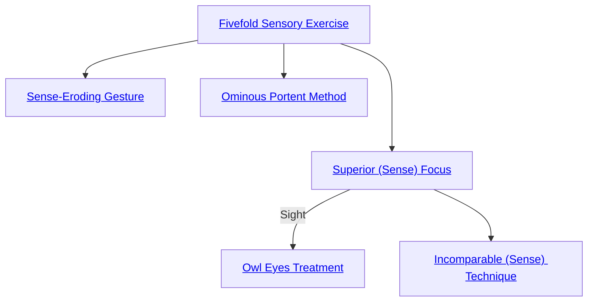

## Fivefold Sensory Exercise

Cost: 5 motes
Duration: One scene
Type: Simple
Minimum Awareness: 2
Minimum Essence: 2
Prerequisite Charms: None

Guiding and expanding his perception with a rush
of Essence, a character with this Charm experiences
every sensation magnified fivefold. Colors are deeper
and richer, sounds more melodic or discordant, and
scents somehow fuller and yet subtler at once. The
world is achingly beautiful to the Abyssal, a painful
realization indeed for those chosen to extinguish that
beauty and drown it in the Void. In addition to adding
his Essence to all Awareness rolls, the character employing
this Charm can differentiate sensations far
more readily than any mortal. It is incumbent upon the
Storyteller to relay information accordingly. Characters
using this Charm are no more susceptible to sensory
overload than normal.

## Sense-Eroding Gesture

Cost: 2 motes per turn
Duration: One scene
Type: Simple
Minimum Awareness: 4
Minimum Essence: 2
Prerequisite Charms: Fivefold Sensory Exercise

With a savage clawing motion, a character who
knows this Charm may indicate an enemy in her line of
sight and dull his awareness. The Abyssal's player rolls
Manipulation + Awareness against a difficulty of the
target's permanent Essence. Each success allows the
Abyssal to reduce all the target's Awareness dice pools by
one die for the duration of the Charm. This Charm
cannot reduce a victim's dice pool lower than his Essence
score. At the Storyteller's discretion, this penalty may
also apply to other tasks requiring precise sensory acuity,
such as Archery attacks. The Essence cost of this Charm
must be paid prior to the activation roll.

## Ominous Portent Method

Cost: None
Duration: Permanent
Type: Special
Minimum Awareness: 4
Minimum Essence: 2
Prerequisite Charms: Fivefold Sensory Exercise

The character gains a “sixth sense” that warns her
whenever immediate danger threatens. Such premonitions
require no roll, but the accompanying wave of horror
drains 1 mote from the Abyssal. Experiencing a premonition
does not count as a Charm use, allowing the character
to freely invoke other Charms on the same turn he receives
a warning, but Ominous Portent Method cannot be placed
in a Combo. The character's prescience warns her of any
physical threat, from a concealed pit of spikes to an
assassin's knife, but the Charm is not infallible and does
nothing to warn of purely spiritual or mental danger.

## Superior (Sense) Focus

Cost: 3 motes
Duration: One scene
Type: Simple
Minimum Awareness: 3
Minimum Essence: 2
Prerequisite Charms: Fivefold Sensory Exercise

This Charm precisely duplicates the effects of the
Solar Charm Keen (Sense) Technique (see Exalted, p.
196). Characters may not use Superior (Sense) Focus in
conjunction with Fivefold Sensory Exercise.

## Owl Eyes Treatment

Cost: Special
Duration: Permanent
Type: Special
Minimum Awareness: 3
Minimum Essence: 2
Prerequisite Charms: Superior Sight Focus

Once an Abyssal purchases this Charm, he can thereafter
see in darkness without penalty. His enhanced vision
pierces all shades of gloom, from moonlit night to the utter
blackness of the Labyrinth. However, this modification
also makes the character sensitive to bright light. Under
lighting comparable to the noonday sun or within close
proximity to a torch, the Abyssal suffers the penalty for
murky vision. The Exalt can suppress or reactivate his
night vision at will to avoid this problem, but each change
takes one full turn and costs 1 mote. This change counts as
a Charm, cannot be placed in a Combo and leaves the
character totally blind (-4 dice to attacks) during the turn
it happens. This Charm does not allow the character to see
more easily through fog or smoke, nor does it help him
perceive invisible objects or people.

## Incomparable (Sense) Technique

Cost: 5 motes
Duration: One scene
Type: Simple
Minimum Awareness: 5
Minimum Essence: 2
Prerequisite Charms: Superior (Sense) Focus

This Charm precisely duplicates the effects of the Solar
Charm Unsurpassed (Sense) Discipline (see Exalted, p.
196). Characters may only learn permutations of this Charm
to enhance senses they have already purchased with Superior
(Sense) Focus. This Charm is incompatible with Superior
(Sense) Focus and Fivefold Sensory Exercise.
