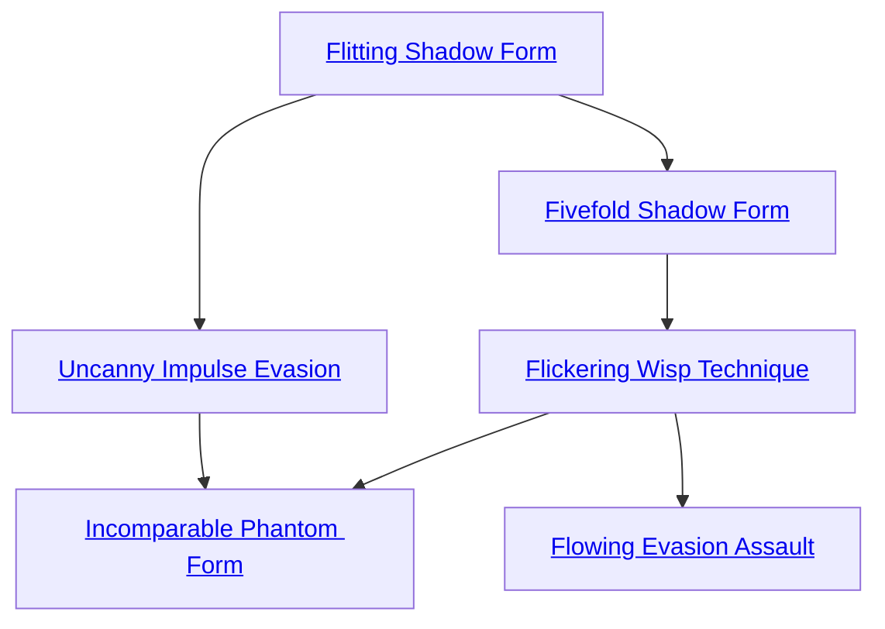

## Flitting Shadow Form

Cost: 1 mote per 2 dice
Duration: Instant
Type: Reflexive
Minimum Dodge: 2
Minimum Essence: 2
Prerequisite Charms: None

The Exalted channels Essence through his body and
movements, making him extremely difficult to strike. For
every mote spent, the Abyssal reduces the dice pool of a
single attack by two dice. This Charm can only target
attacks aimed specifically at the Exalt and may reduce a
dice pool to zero (ensuring that the attack misses). Characters
may activate this Charm any time after an attack is
declared but before dice are rolled. Flitting Shadow Form
can only target attacks the Exalt is aware of.

## Uncanny Impulse Evasion

Cost: 2 motes
Duration: Instant
Type: Reflexive
Minimum Dodge: 3
Minimum Essence: 2
Prerequisite Charms: [[#Flitting Shadow Form]]

Whenever a character with this Charm is attacked,
she feels a sense of impending dread and may attempt to
sidestep an unseen blow on impulse alone. The character's
dice pool for such a dodge equals her unmodified Dexterity.
This Charm cannot be placed in a Combo with other
Dodge Charms. If a deathknight's player does not choose
to activate this Charm in response to an unseen attack, the
Exalt does not sense the blow until it lands. This Charm
must be activated prior to the attack roll.

## Fivefold Shadow Form

Cost: 2 motes
Duration: Instant
Type: Reflexive
Minimum Dodge: 4
Minimum Essence: 2
Prerequisite Charms: [[#Flitting Shadow Form]]

Moving faster than the shadows cast by a guttering
candle, the Abyssal may evade blows with supernatural
prowess. The attacker loses a number of dice from a single
attack roll equal to the deathknight's Dodge + Essence.
If this reduces an attack dice pool to zero, the blow
automatically misses. This Charm must be activated
prior to the attack roll.

## Flickering Wisp Technique

Cost: 6 motes
Duration: Instant
Type: Reflexive
Minimum Dodge: 5
Minimum Essence: 2
Prerequisite Charms: [[#Fivefold Shadow Form]]

The Abyssal ripples and vanishes like smoke in a stiff
breeze, coalescing a split second later a short distance
away. This Charm allows the Abyssal to perfectly dodge
any one attack that he can perceive without a roll,
including those with an area effect. The character still
cannot dodge magical effects that explicitly prohibit
dodging, however. The character may not move more
yards with this technique than his permanent Essence
rating and cannot use the Charm to teleport through
solid barriers. Flickering Wisp Technique must be activated
prior to the attack roll.

## Flowing Evasion Assault

Cost: 6 motes
Duration: Instant
Type: Reflexive
Minimum Dodge: 5
Minimum Essence: 3
Prerequisite Charms: [[#Flickering Wisp Technique]]

In addition to teleporting out of harm's way, an
Abyssal with this Charm can ensure that she materializes
behind her opponent. Flowing Evasion Assault follows the
same rules as Flickering Wisp Technique with two exceptions.
First, the Exalt may reappear as far away as her Dodge
in yards. Secondly, if the attacker is within this range, the
Abyssal may automatically reappear behind her opponent.
If the Abyssal has any actions remaining to launch an
attack of her own, she gains the full benefits of attacking
from behind (see Exalted, p. 238).

## Incomparable Phantom Form

Cost: 5 motes, 1 Willpower
Duration: One scene
Type: Simple
Minimum Dodge: 5
Minimum Essence: 3
Prerequisite Charms: [[#Uncanny Impulse Evasion]], [[#Flickering Wisp Technique]]

Suffusing his body with spectral Essence, the Abyssal
becomes translucent and partially dematerialized. In addition
to unnerving opponents, this transformation allows
the Exalt to dodge all incoming attacks, perceived or
otherwise, with his full Dexterity + Dodge pool.
