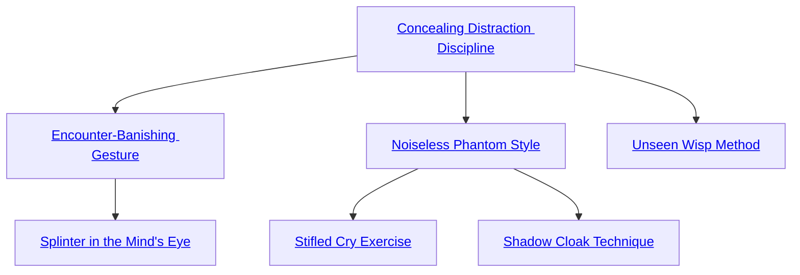

## Concealing Distraction Discipline

Cost: 4 motes
Duration: One scene
Type: Simple
Minimum Stealth: 3
Minimum Essence: 2
Prerequisite Charms: None

Briefly eroding the attention span of onlookers
with a gentle rush of Essence, an Abyssal with this
Charm becomes far more difficult to notice. Until the
end of the scene, all attempts to spot the Exalt increase
their difficulty by his permanent Essence. This increase
applies only so long as the Abyssal does not
draw undue attention to himself and remains unnoticed.
Once he is spotted by anyone, the Charm
immediately ends and cannot be reactivated until the
Exalt moves entirely out of sight.

## Encounter-Banishing Gesture

Cost: 3 motes per target
Duration: Instant
Type: Reflexive
Minimum Stealth: 4
Minimum Essence: 2
Prerequisite Charms: [[#Concealing Distraction Discipline]]

Despite their prowess, even the most stealthy and
nimble Day Castes get caught from time to time. With this
Charm, a character can rip the memory of an encounter
from a target's mind so that he forgets he ever saw the
Exalt. The Abyssal's player rolls Manipulation + Stealth
against a difficulty of the target's Essence (or highest
Essence in the case of a group). For every success rolled, the
target forgets the events of one turn. Thus, four successes
erase the past four turns of a target's memory. As an added
benefit, a befuddled target will not notice the Abyssal
again for a like number of turns unless she draws attention
to herself. This gives the Exalt a few seconds to escape and
conceal herself more thoroughly. This Charm has no effect
on beings with a higher permanent Essence than the
Abyssal or against beings who are physically agitated (for
example, those in combat).

## Splinter in the Mind's Eye

Cost: 8 motes, 1 Willpower
Duration: Instant
Type: Reflexive
Minimum Stealth: 5
Minimum Essence: 2
Prerequisite Charms: [[#Encounter-Banishing Gesture]]

This Charm duplicates the effects and rules of En-
counter-Banishing Gesture, except that its effects extend
to a number of witnesses equal to the Abyssal's Essence
rating x 10 without requiring motes for each observer.

## Noiseless Phantom Style

Cost: 4 motes
Duration: Stealth in minutes
Type: Reflexive
Minimum Stealth: 4
Minimum Essence: 3
Prerequisite Charms: [[#Concealing Distraction Discipline]]

Enveloped in the stillness of the grave, an Abyssal
with this Charm active makes no noise whatsoever. Her
footsteps do not echo or splash — she can jump or stomp
or shout in perfect eerie silence. Conversely, she cannot
speak or employ any magic that relies on sound. This
Charm only wards against sounds made by the character,
however. Her blade might slide soundlessly through a
victim's ribs, but the effect would not muffle the victim's
scream of pain or rasping death rattle.

## Stifled Cry Exercise

Cost: 1 mote
Duration: One turn
Type: Reflexive
Minimum Stealth: 5
Minimum Essence: 3
Prerequisite Charms: [[#Noiseless Phantom Style]]

The Abyssal focuses on a single victim within line of
sight and smothers his voice with Essence. Until the end
of the turn, the target cannot speak or make any other
vocalized noise. Day Caste assassins often employ this
Charm to prevent their victims from screaming. This
Charm has no effect on beings with a higher permanent
Essence than the Exalt.

## Shadow Cloak Technique

Cost: 2 motes per die
Duration: Stealth in turns
Type: Simple
Minimum Stealth: 5
Minimum Essence: 3
Prerequisite Charms: [[#Noiseless Phantom Style]]

The Abyssal cocoons himself in pure darkness, taking
on the wraithlike appearance of a solidified shadow.
So long as he remains in darkness or among other shadows,
he adds 1 die per 2 motes spent to all Stealth rolls.
The Exalt cannot purchase more dice with this Charm
than equal to twice his Essence rating. If a bright light is
shined on the hidden Exalt, his cloak dissolves immediately,
and the Charm ends.

## Unseen Wisp Method

Cost: 2 motes per turn
Duration: Varies
Type: Simple
Minimum Stealth: 5
Minimum Essence: 4
Prerequisite Charms: [[#Concealing Distraction Discipline]]

The Abyssal vanishes wholly from sight, dissolving in
a ripple of scattering shadows. For a number of turns equal
to half the number of motes invested, the Exalt is visible as
nothing more than a wavering in the air. Ranged attacks
against her are all but impossible without magical aid or
well-described stunts, while close-range attacks suffer a
difficulty penalty of the deathknight's permanent Essence.
