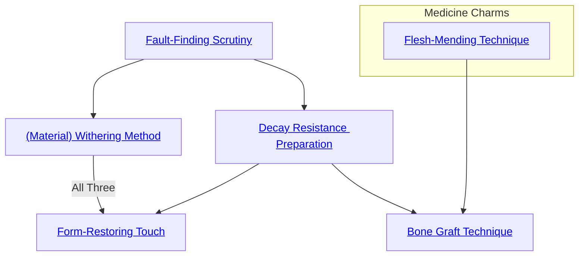

## Fault-Finding Scrutiny

Cost: 4 motes
Duration: Instant
Type: Simple
Minimum Craft: 3
Minimum Essence: 2
Prerequisite Charms: None

By attuning her gaze to the seeds of entropy in all
things, an Abyssal using this Charm can perceive the weak
points of any inanimate object. Fracture lines and hidden
cracks appear stained oily black, while even the slightest
traces of rot or rust glow hideous shades of brown and red.
With this knowledge, characters may exploit or repair the
flaws they find with greater facility.
Characters attempting to repair faults identified with
this Charm may double any Craft-related dice pool to do
so. However, such repairs require the same effort, time and
tools as normal. Similarly, characters attacking a scruti-
nized object's weak points count extra successes twice for
the purpose of determining damage with their first strike.
Subsequent attacks do not receive this bonus unless the
character uses Fault-Finding Scrutiny to reevaluate the
object's weaknesses.

## (Material) Withering Method

Cost: 5 motes
Duration: Instant
Type: Reflexive
Minimum Craft: 3
Minimum Essence: 2
Prerequisite Charms: [[#Fault-Finding Scrutiny]]

The Exalt channels corrosive Essence directly into an
object, triggering rapid decay. (Material) Withering
Method is actually three separate Charms, each encompassing
a different substance: wood, metal and stone.
Although the three versions decay their respective material
differently — rotting, rusting or crumbling as
appropriate — the final result is the same: The object
disintegrates to nothing within seconds. This Charm can
only be used on objects the size of a large weapon or a single
suit of armor. (Material) Withering Method has no effect
on enchanted items, including those made from or reinforced
by the Five Magical Materials. All versions of this
Charm have a range of (the Abyssal's permanent Essence
x 10) yards and may only be used once per turn.

## Decay Resistance Preparation

Cost: 10 motes, 1 Willpower
Duration: Instant
Type: Simple
Minimum Craft: 4
Minimum Essence: 2
Prerequisite Charms: [[#Fault-Finding Scrutiny]]

This Charm makes an object highly resistant to natu-
ral and unnatural forms of decay, including corrosion, rust,
rot and even simple weathering. For ordinary wear and
tear, treated objects endure at least 10 times as long as
untreated counterparts. Against more aggressive causes of
decay, such as acid baths or bolts of raw entropy, treated
objects have double the usual soak or resistance dice pool.
Although this enhancement is permanent, it only protects
against decay. Treated objects have no additional resilience
against other sources of damage and may be cut,
burnt or otherwise broken as easily as normal. This Charm
does not work on living beings.

## Bone Graft Technique

Cost: 10 motes
Duration: Instant
Type: Simple
Minimum Craft: 4
Minimum Medicine: 2
Minimum Essence: 2
Prerequisite Charms: [[#Decay Resistance Preparation]], [[Abyssal Daybreak Medicine#Flesh-Mending Discipline|Flesh-Mending Discipline]]
With this Charm, an Abyssal can fashion prosthetics
of iron and carved bone and affix them to living flesh as
replacements for missing limbs. The Exalt must first build
the actual prosthesis, which requires a number of creation
rolls as outlined on pages 245 and 246 of Exalted, usually
using Craft (Necrosurgery). If successful, the character can
use this Charm to join the implant with its host. The
recipient must commit Essence (or Willpower, in the case
of mortals) to attune the device to her life force. Generally,
a hand requires 3 motes or 1 point of Willpower, while a
full arm requires 5 motes or 2 Willpower. Entire legs can
take as many as 8 motes or 3 Willpower. So long as the cost
remains attuned, the prosthesis behaves entirely as its
organic counterpart. Owing to their sturdy construction,
prosthetics designed with this Charm have a +2L/2B soak
against damage of any sort.

## Form-Restoring Touch

Cost: 10 motes, 1 Willpower, one lethal health level
Duration: Instant
Type: Simple
Minimum Craft: 5
Minimum Essence: 3
Prerequisite Charms: [[#(Material) Withering Method|All three (Material) Withering Method Charms]], [[#Decay Resistance Preparation]]

This Charm allows a character to repair any broken
object, so long as some fragment remains. The character
must spend a number of hours working on the object equal
to (10 - her permanent Essence), while she painstakingly
joins shards and binds them with wisps of memory dredged
from the winds of the Underworld. This Charm cannot
remake intangible items (such as broken promises) or
restore objects more yards in radius than the character's
permanent Essence. Form-Restoring Touch can repair
items of First Age manufacture but can do nothing to mend
those whose magic has fled or been exhausted.
