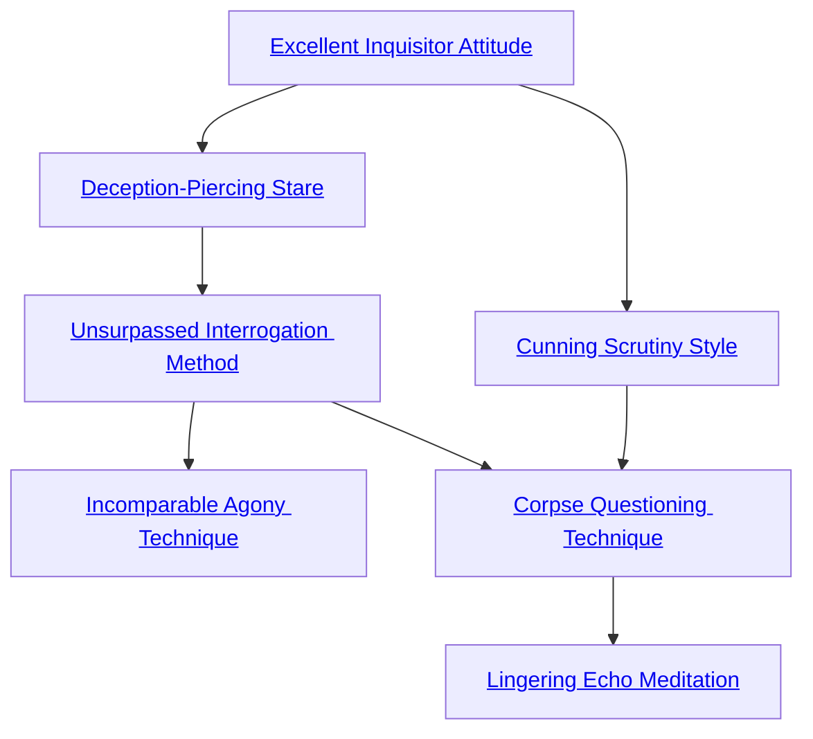

## Excellent Inquisitor Attitude

Cost: 1 mote per die
Duration: Until relaxed
Type: Supplementary
Minimum Investigation: 1
Minimum Essence: 1
Prerequisite Charms: None
The character grows cold and detached, studying the
world with heartless scrutiny. For each mote of Essence
spent, the player may add 1 die to an Investigation roll, but
the number of bonus dice cannot more than double the
character's base Attribute + Ability pool. This bonus may
be maintained for extended investigations, research or
interrogation sessions. However, the bonus only applies to
a single specific task that can last no longer than a scene.
This Charm can only enhance one task at a time.
For Example: Prince of Shadows has a prisoner brought
before him. He uses Excellent Inquisitor Attitude for the
purpose of interrogating her, spending 4 motes to gain four
bonus dice. Since he plans to spend the full scene torturing his
captive, this bonus applies to all related Investigation rolls for
the scene. However, he receives no bonus to search the
prisoner's belongings or to notice clues evident in her dress or
accent, since these tasks are unrelated to interrogation.

## Deception-Piercing Stare

Cost: 6 motes
Duration: One scene
Type: Reflexive
Minimum Investigation: 2
Minimum Essence: 1
Prerequisite Charms: [[#Excellent Inquisitor Attitude]]

This Charm allows a character to look at an individual
and perceive the slight taint of unrighteousness left
by deliberate lies. This Charm is infallible within its limits,
but only detects deliberate falsehoods. Characters who
sincerely believe a falsehood do not register as having lied,
nor do characters who answer in an unclear manner or
withhold information (including those who refuse to answer
at all). Deception-Piercing Stare cannot compel or
discern truth.

## Unsurpassed Interrogation Method

Cost: 5 motes, 1 Willpower
Duration: One scene
Type: Simple
Minimum Investigation: 4
Minimum Essence: 2
Prerequisite Charms: [[#Deception-Piercing Stare]]

With this Charm, an Abyssal inflicts terrible pain on
anyone who disrespectfully answers her questions with lies
or silence. This Charm only applies to the extended
interrogation of one individual whose Willpower + Essence
is less than the Exalt's Manipulation + Investigation.
The player of an affected character must reflexively roll
Willpower against a difficulty of the Exalt's permanent
Essence whenever he attempts to lie or withhold relevant
information. If the roll succeeds, the character can answer
or remain silent as he wishes, although the Exalt can repeat
the question on the following turn if she is dissatisfied with
the response. If the roll fails, the victim suffers one
unsoakable level of bashing damage and spends the rest of
the turn in agony. The Abyssal may not control or lessen
this damage after invoking Unsurpassed Interrogation
Method except by prematurely ending the Charm. It is
possible for victims to kill themselves with repeated lies,
although they are not punished for speaking falsehoods
they sincerely believe. The Abyssal can normally ask one
question per turn, though complicated questions may
require additional turns to phrase or answer. This Charm
can only be used on a given target once per week.

## Incomparable Agony Technique

Cost: 6 motes
Duration: Instant
Type: Simple
Minimum Investigation: 5
Minimum Essence: 3
Prerequisite Charms: [[#Unsurpassed Interrogation Method]]

Building on the principle of Unsurpassed Interrogation
Method, this Charm allows a character to torture
victims with the force of her preternatural will. The Exalt's
player must make a Conviction + Essence roll, resisted by
the victim's Willpower + Essence. For every success rolled
beyond the victim's, the Abyssal can psychically inflict
one level of unsoakable bashing or lethal damage or
remove one point of temporary Willpower from the victim's
pool. If so desired, the Abyssal's player can apply fewer
successes than he actually rolled. Characters reduced be-
low zero temporary Willpower with this Charm gain a
derangement chosen by the Storyteller and fall catatonic
for the remainder of the scene. Wounds inflicted by this
Charm take whatever form the Abyssal desires, although
stigmata and artistically broken bones are common motifs.
The Charm only affects a single restrained or willingly
motionless victim within 5 yards of the Exalt, severely
limiting its combat application. Additionally, the Charm
has no effect on characters with a higher permanent
Essence than the Abyssal.

## Cunning Scrutiny Style

Cost: 5 motes
Duration: Instant
Type: Simple
Minimum Investigation: 3
Minimum Essence: 1
Prerequisite Charms: [[#Excellent Inquisitor Attitude]]
Through careful examination of undisturbed physical
evidence at a scene, the character can mentally recon-
struct the process that led to that evidence. For example,
characters finding a dead body may analyze its wounds to
determine the angle of attack, the type of weapon used,
etc. Although primarily employed for forensic purposes,
this Charm may just as easily reconstruct the evidence left
by liaisons or the details of an abandoned campsite.
This Charm functions automatically only so long as
there is abundant physical evidence. Where evidence is
lacking — or has been disturbed — the player must instead
roll Perception + Investigation at a difficulty determined
by the amount of tampering. Success allows the character
to reconstruct events normally.

## Corpse Questioning Technique

Cost: 6 motes, 1 Willpower
Duration: One scene
Type: Simple
Minimum Investigation: 5
Minimum Essence: 3
Prerequisite Charms: [[#Unsurpassed Interrogation Method]], [[#Cunning Scrutiny Style]]

Potent memories linger in the flesh, even after death.
This Charm allows an Abyssal to extract those memories,
partially animating a corpse or disembodied head to answer
her questions. Cadavers ensorcelled by this Charm
open their mouths and speak in whispering monotones but
have no personality of their own. Although corpses cannot
lie, either directly or by significant omission, their memories
rot along with their flesh. For every full week a body has
been dead, its Intelligence is reduced by one dot, to a
minimum rating of 1. Corpses can only understand and
speak languages known in life and remain silent if asked
questions they do not understand. Unearthed skulls can
barely whisper “yes” or “no” to the simplest queries, while
freshly slain cadavers may answer virtually any question
put to them. Magic that forestalls physical rot also pre-
serves the Intelligence of a corpse.

## Lingering Echo Meditation

Cost: 10 motes, 1 Willpower
Duration: Instant
Type: Simple
Minimum Investigation: 5
Minimum Essence: 3
Prerequisite Charms: [[#Corpse Questioning Technique]]

Important or emotionally charged events leave a psychic
imprint on the location and objects involved. Such
imprints can last for years or even centuries, depending on
their potency. By touching such a marked place or object
and attuning his mind to its passion, an Abyssal with this
Charm may induce a vivid flashback of the events leading
to the imprint . If the scrutinized object has multiple
associations, the strongest passion usually prevails — but
not always. Visions triggered by this Charm affect all senses
— in effect, the character is mentally transported to the
time and place of the imprinted passion. Though flashbacks
only last a few seconds in reality, they can appear to take
minutes or even hours depending on their content and
intensity. Visions are always colored by their dominant
passion. A violent murder scene may have a slight red tint
or a frenetic jerkiness. Similarly, a couple shown at their
wedding might appear softer and more beautiful — almost
ethereal. In no case can a character take any action in a
vision or even choose his vantage point.
As an optional rule, a Storyteller can trigger this
Charm reflexively whenever a character touches an object
sufficiently charged with emotional energy. In such cases,
the Essence cost remains the same, but the Willpower
requirement is waived since the resulting vision is not an
act of will. Such flashbacks should enhance mood and
move a plot forward. They should never be used frivolously
or as an excuse to drain a character's Essence.
