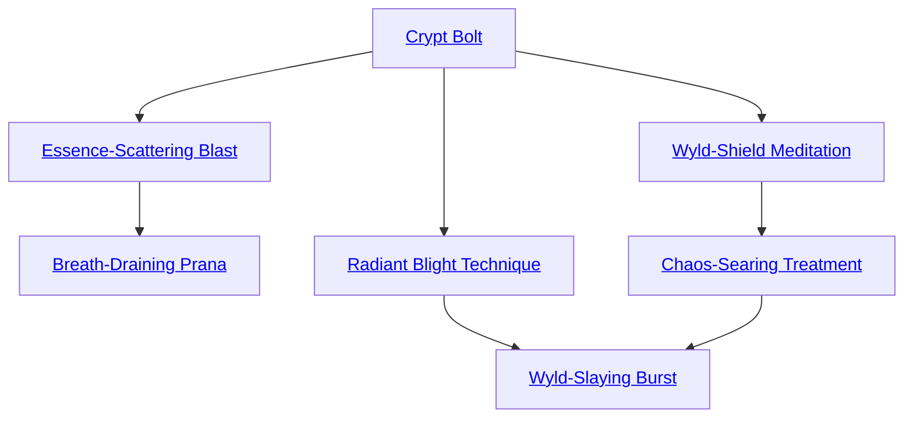

## Crypt Bolt

Cost: 1 mote per 2L damage
Duration: Instant
Type: Simple
Minimum Lore: 2
Minimum Essence: 2
Prerequisite Charms: None

The character reaches out his hand, and a bolt of
crackling darkness leaps from his outstretched palm. Damage
inflicted by this Charm manifests as sudden decay:
Metal corrodes or rusts, while wood and flesh wither away
as though blighted by disease and aging. The character's
player rolls Dexterity + Athletics or Thrown (whichever
he prefers) to hit, applying an Accuracy bonus equal to his
permanent Essence. This attack has a range of (the
character's permanent Essence x 10) yards and does a base
damage of 2L for each mote of Essence spent. Against Fair
Folk and creatures of the Wyld, Crypt Bolt inflicts aggravated
damage. A character cannot spend more motes on
this Charm than his Stamina + Lore.

## Essence-Scattering Blast

Cost: 1+ mote, 1 Willpower
Duration: Instant
Type: Simple
Minimum Lore: 3
Minimum Essence: 2
Prerequisite Charms: Crypt Bolt

The character extends his arm, and a bolt of coruscating
energy flies from his fingertips. If this bolt strikes a being
with an Essence pool, it envelops her in ribbons of black
lightning and drains her energy. Although it inflicts no
damage, Essence-Scattering Blast otherwise follows the
same rules as Crypt Bolt with regards to its Range, Accuracy
and roll to hit. Victims struck by this attack lose 1 mote of
Essence for every mote spent activating this Charm, plus a
number of additional motes equal to the Exalt's permanent
Essence. If applicable, victims always lose Peripheral Essence
before Personal Essence. This Charm dissipates
harmlessly if it hits anything besides a magical being,
including unExalted mortals. A character cannot spend
more motes on this Charm than his Stamina + Lore.

## Breath-Draining Prana

Cost: 1 mote
Duration: Instant
Type: Simple
Minimum Lore: 5
Minimum Essence: 2
Prerequisite Charms: Essence-Scattering Blast

With this Charm, an Abyssal may feed on a target's
life force directly without even touching her. The player
rolls Willpower. Each success inflicts one die of lethal
damage that can only be soaked with Stamina. For every
level of damage actually inflicted, the Abyssal regains 1
mote of Essence. This Charm can also target the Essence
pool of a magical being, with successes draining
motes directly on a one-for-one basis. So long as the
Exalt drains fewer motes than a target's Stamina, she
may not even notice the loss — attributing the sudden
weakness to some other cause. However, Essence drained
from another magical being's pool glimmers in the air as
it flows out of the victim's mouth and into the Abyssal's
own. This Charm can target any being in the
deathknight's line of sight.

## Radiant Blight Technique

Cost: 5 motes
Duration: Instant
Type: Simple
Minimum Lore: 3
Minimum Essence: 2
Prerequisite Charms: Crypt Bolt

By forcing death Essence into the land around her, the
deathknight can destroy all the plant life in the vicinity
and seriously damage the creatures that live there. The
Abyssal's player rolls Charisma + Lore. All plants within
a circular area with radius equal to the number of successes
rolled in yards wither and die. All animals and people
within that radius, including other Exalted, suffer dice of
lethal damage equal to the character's permanent Essence.
The damage from this Charm is soaked only with the
character's natural soak.

## Wyld-Shield Meditation

Cost: 10 motes, 1 Willpower
Duration: Special
Type: Simple
Minimum Lore: 3
Minimum Essence: 2
Prerequisite Charms: Crypt Bolt

Whereas the Wyld embodies growth and untamed
possibility, the Underworld represents death and ultimate
stagnation. As such, Abyssal Exalted with this
Charm can channel their death-tainted Essence to shield
them from the warping effects of Wyld energies. With
this Charm invoked, the character and her possessions
(an amount that can equal a fully laden horse if mounted)
can venture in the most chaotic regions of the Wyld
without suffering any change of form. Additionally, the
character can add her permanent Essence to her soak
(and other applicable rolls) to resist greater Fair Folk
magic. Wyld Shield Meditation lasts as long as the Exalt
desires, although each hour that the user maintains it
inflicts one level of unsoakable bashing damage to her.

## Chaos-Searing Treatment

Cost: 5 motes
Duration: One scene
Type: Simple
Minimum Lore: 3
Minimum Essence: 2
Prerequisite Charms: Wyld Shield Meditation

With this Charm, an Abyssal may channel soul-
numbing death Essence into a weapon. For the rest of the
scene, the weapon inflicts aggravated damage on Fair Folk
and Wyld beasts as though it was made of cold iron.

## Wyld-Slaying Burst

Cost: 30 motes, 1 Willpower, one lethal health level, 3 experience points
Duration: Instant
Type: Simple
Minimum Lore: 5
Minimum Essence: 3
Prerequisite Charms: Radiant Blight Technique, Chaos-Searing Treatment

With this Charm, an Abyssal may unleash the full
force of the Underworld against the twin enemies of life
and Wyld. This blast erupts as a spherical shockwave from
the deathknight, withering trees and eroding rocks even as
it sucks color and life from the landscape. The Abyssal's
player rolls Intelligence + Lore + Essence. All Fair Folk
and Wyld-spawned mutants in the area of effect suffer
levels of unsoakable aggravated damage equal to the number
of successes rolled. Fae slain by this Charm disintegrate
outright, the glamour of their bodies evaporating under
the onslaught of necrotic energy. Living beings inside the
blast zone suffer dice of lethal damage equal to the Abyssal's
Lore rating. This burst extends to a radius of (the character's
permanent Essence x 10) yards. Once this Charm has been
used on an area, nothing will grow within the barren circle
for months —or even years.
