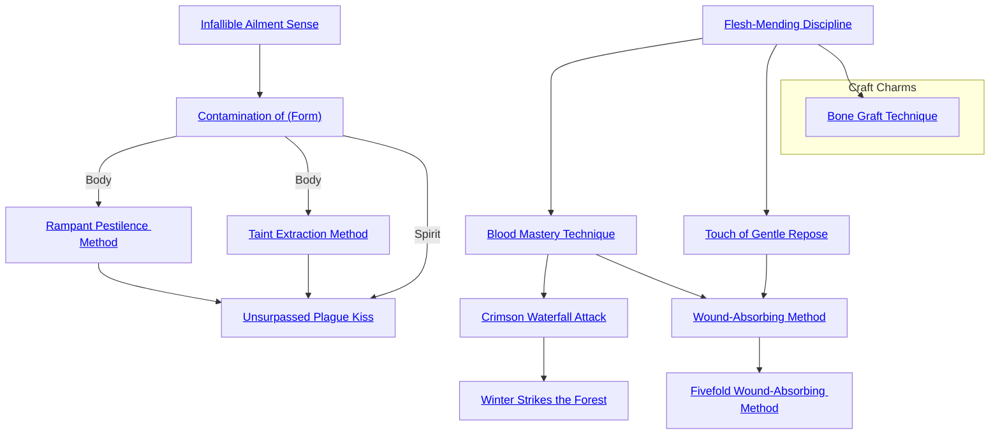

## Infallible Ailment Sense

Cost: 1 mote
Duration: Five minutes
Type: Simple
Minimum Medicine: 2
Minimum Essence: 2
Prerequisite Charms: None

By examining a patient and noting his symptoms, a
character with this Charm can unerringly diagnose any
physical illness with which she is familiar. Characters can
also attempt to diagnose mental illness with this Charm,
but this requires 30 minutes of examination and a successful
Perception + Medicine roll. This Charm does not
improve a character's actual medical knowledge, only her
ability to recognize and correctly discern known ailments.
If a character has never encountered or heard of a disease,
she can only diagnose its general type and ascertain whether
it is magical or not. Characters can diagnose their own
physical diseases with this Charm, although they cannot
objectively evaluate their own mental health.

## Contamination of (Form)

Cost: 5 motes, 1 Willpower
Duration: Instant
Type: Simple
Minimum Medicine: 3
Minimum Essence: 2
Prerequisite Charms: Infallible Ailment Sense

Disease is one of the doors to the Underworld. This
Charm allows an Abyssal to open that door somewhat,
temporarily infecting the target with a malady. When he
purchases this Charm, a character must choose the type of
illness he can inflict. Characters may purchase this Charm
more than once in order to spread different forms of
disease. In all forms, the character must be within three
yards of his intended victim in order to infect her.
The effects of each permutation are detailed below:
Body: The Abyssal's player chooses one of the plagues
listed in the Exalted rulebook (pp. 319-321) and makes an
Intelligence + Medicine roll with a difficulty equal to (the
disease's Virulence - 1, minimum 1). If the roll is successful,
the target must succeed on a Stamina + Resistance roll
to resist infection, just as if exposed to the disease in
question. The illness is noncommunicable.
Mind: The Abyssal's player chooses one of the derangements
listed in the Exalted rulebook (p. 281) and
makes a Manipulation + Medicine roll (difficulty 3). If this
roll is successful, the target succumbs to the chosen form of
madness unless her player makes a successful Willpower
roll against a difficulty of the Abyssal's permanent Essence.
Derangements induced by this Charm last a number of
days equal to the Exalt's Manipulation rating. The actual
game effects of madness are left to Storytellers to decide.
Spirit: The Abyssal's player makes a Conviction +
Medicine roll, resisted by his intended victim's Valor +
Essence. If the Exalt wins, the target immediately falls prey
to soul-numbing despair. Afflicted characters cannot re-
gain lost Willpower and suffer a -2 penalty to all dice pools.
This depression is not a derangement, but a form of soul
rot. As such, the infection cannot be cured through
mundane means or magical remedies that target mental
illness. Once per day, players of infected characters can roll
Willpower against a difficulty of the Abyssal's permanent
Essence. If successful, the character's soul recovers, and her
despair lifts. Ordinary mortals infected with despair for
more days than their Valor rating commit suicide. Characters
cannot learn Contamination of Spirit until they have
mastered the other two forms of this Charm.

## Rampant Pestilence Method

Cost: 20 motes, 1 Willpower, 3 experience points
Duration: Indefinite
Type: Simple
Minimum Medicine: 4
Minimum Essence: 3
Prerequisite Charms: Contamination of Body

This Charm duplicates the effects of Contamination
of Body with two notable exceptions. First, plagues created
with this Charm are more deadly and resistant to medica-
tion, adding +1 to the difficulty of any Endurance,
Resistance or Medicine-related roll to fight off or treat the
disease. In addition, such plagues are just that — plagues
— and may be spread to other victims by all the usual
vectors for the disease. The effects persist until the Abyssal
removes the Essence committed to the Charm. After that
point, the disease ceases to be contagious. Although
Abyssals are immune to diseases they personally create,
their fellows and allies are not, so they must be careful in
the use of this Charm: Plague does not distinguish between
friend and foe.

## Taint Extraction Method

Cost: 10 motes, 1 Willpower, one lethal health level
Duration: Instant
Type: Simple
Minimum Medicine: 4
Minimum Essence: 3
Prerequisite Charms: Contamination of Body

With this Charm, an Abyssal can expunge the corruption
of disease from his flesh or the flesh of another. All it
takes is a moment of concentration and a touch, and the
excised taint bursts from the patient's body as a viscous
sludge. The subject is immediately cured of all infected
wounds, as well as all diseases whose Difficulty to Treat is
less than or equal to the Exalt's Medicine rating. This
Charm can even cure the Great Contagion. Unfortunately,
the violent expulsion of taint is quite traumatic —
cured characters suffer a number of levels of lethal damage
equal to the Untreated Morbidity of their worst disease.
This damage can only be soaked with Stamina, assuming
the patient can soak lethal damage at all.

## Unsurpassed Plague Kiss

Cost: 15 motes, 1 aggravated health level
Duration: Instant
Type: Simple
Minimum Medicine: 5
Minimum Essence: 4
Prerequisite Charms:Contamination of Spirit, Rampant Pestilence Method, Taint Extraction Method

When the Great Contagion swept across Creation,
only one in ten survived. Unsurpassed Plague Kiss allows
an Abyssal to unleash this greatest of weapons with a
simple touch — albeit a weaker, noncommunicable strain.
In order to avoid contracting the Contagion, the victim's
player must make a reflexive Stamina + Resistance roll at
difficulty 5. If this roll fails, the player must then roll one
die to see if his character is blessed with natural immunity.
If the number rolled is less than or equal to the
victim's permanent Essence, she survives with only minor
fever. Otherwise, the character dies painfully after a
number of days equal to her Stamina. Characters that
survive infection are thereafter immune to all strains of
the Great Contagion.

## Flesh-Mending Discipline

Cost: 10 motes
Duration: One day
Type: Reflexive
Minimum Medicine: 1
Minimum Essence: 1
Prerequisite Charms: None

This Charm allows an Abyssal to force the undesired
taint of injury from his body, repairing broken bones and
torn flesh with equal facility. While Flesh-Mending Discipline
is active, the character heals bashing and lethal
damage at 10 times the normal rate. This Charm does not
allow the regeneration of amputated or destroyed tissue,
nor may it accelerate the healing of anyone other than the
Exalt. Characters may activate this Charm at any time,
even while unconscious.

## Blood Mastery Technique

Cost: None
Duration: Permanent
Type: Special
Minimum Medicine: 1
Minimum Essence: 2
Prerequisite Charms: Flesh-Mending Discipline

Though Exalted seldom have to worry about bleeding
to death, the Chosen can still be overcome by blood
loss. Once she masters this Charm, however, an Abyssal
transcends this limitation. She can reflexively stanch her
wounds without a roll, even while unconscious. Flesh
contracts and pulls tight, hungrily reabsorbing any blood
spilled by the original trauma. Within instants, the injury
seals completely. Blood Mastery Technique does not
speed healing — it only prevents additional damage from
bleeding. This Charm cannot mitigate Abyssal Caste
Mark stigmata.

## Touch of Gentle Repose

Cost: 5 motes
Duration: Instant
Type: Simple
Minimum Medicine: 2
Minimum Essence: 2
Prerequisite Charms: Flesh-Mending Discipline

Death is often a welcome release from suffering. With
this Charm, an Abyssal can grant that release to a willing
individual. The Exalt need only lay his hands on the subject
and whisper a prayer of dedication to the Malfeans. If the
patient truly wishes to die, she may spend a point of
Willpower to painlessly end her own life. This decision
cannot be coerced in any way, or the Charm fails. Subjects
of this Charm never rise as hungry ghosts, although they are
no more or less likely to linger as actual ghosts. Characters
cannot use this Charm to facilitate their own suicide.

## Crimson Waterfall Attack

Cost: 2 motes
Duration: Instant
Type: Supplementary
Minimum Medicine: 3
Minimum Essence: 2
Prerequisite Charms: Blood Mastery Technique

With her knowledge of anatomy, an Abyssal with this
Charm can aim her blows at an enemy's arteries. In addition
to inflicting normal damage, lethal attacks augmented with
Crimson Waterfall Attack bleed profusely. All rolls to
stanch the victim's bleeding have their difficulty increased
by (the Abyssal's permanent Essence rating - the target's
permanent Essence rating). Victims of this Charm also
bleed more quickly, suffering one health level of unsoakable
lethal damage every minute. Characters with Blood Mastery
Technique or similar magic are immune to this Charm.
Crimson Waterfall Attack is explicitly permitted to be part
of a Combo with Charms of other Abilities.

## Winter Strikes the Forest

Cost: 10 motes
Duration: Instant
Type: Supplementary
Minimum Medicine: 4
Minimum Essence: 2
Prerequisite Charms: Crimson Waterfall Attack

This Charm allows an Abyssal to infuse a target with
corrosive entropy. For a full day, the target heals all injuries
at one-tenth her normal rate. If the target has magic
increasing her healing speed, apply the reduction to her
new rating. For example, Solar Exalted employing Body-Mending
Meditation recover at their normal rate if cursed
with this Charm — their 10x bonus canceled by the one-tenth
penalty. This Charm does not inhibit magic that
directly restores health levels. Once this Charm's duration
expires, the target begins to heal any remaining wounds
normally with no lingering ill effects. Only one application
of this Charm can affect a given target at a time.
Winter Strikes the Forest can augment a hand-to-hand
attack or be delivered through any other form of touch.
However, characters can only use this Charm once per
turn. This Charm is explicitly permitted to be part of a
Combo with Charms of other Abilities.

## Wound-Absorbing Method

Cost: 2 motes per health level, 1 Willpower
Duration: Instant
Type: Simple
Minimum Medicine: 3
Minimum Essence: 2
Prerequisite Charms:Touch of Gentle Repose, Blood Mastery Technique

With this Charm, an Abyssal can channel Essence
into his wounds, drawing them closed with force of will.
Use of this Charm leaves discolored bruises in place of
deep gashes, audibly sets broken bones in place and
otherwise transforms serious injury into minor inconvenience.
For every 2 motes spent, the character can
convert one level of lethal damage into a bashing wound
level. Characters with a permanent Essence of 3 or higher
can also use this Charm to heal others, although such
healing is invariably quite painful. UnExalted characters
treated by this Charm lose a number of Willpower points
equal to the number of lethal levels converted unless they
are unconscious or anesthetized.

## Fivefold Wound-Absorbing Method

Cost: 4 motes and 1 Willpower per health level
Duration: Instant
Type: Simple
Minimum Medicine: 5
Minimum Essence: 3
Prerequisite Charms: Wound-Absorbing Method

This Charm allows the Abyssal to direct a surge of
eldritch power through his flesh, turning his most grievous
wounds into lesser cuts and breaks. For every 5 motes
spent, the character can instantly convert one level of
aggravated damage into a lethal wound level. Converted
wounds heal normally unless treated with further magic
(such as Wound-Absorbing Method).
Alternately, this Charm can be used to regenerate
destroyed tissue, amputated limbs, lost eyes, etc. Eyes,
tongues, hands, feet, mouths full of smashed teeth and
other lesser maimings are each the equivalent of one
health level. Lost limbs are the equivalent of two health
levels. Although regeneration fueled by this Charm is
continuous and requires no particular effort or rest on the
part of the Abyssal, such healing is not instantaneous.
Destroyed tissue takes one hour per health level to regrow.
