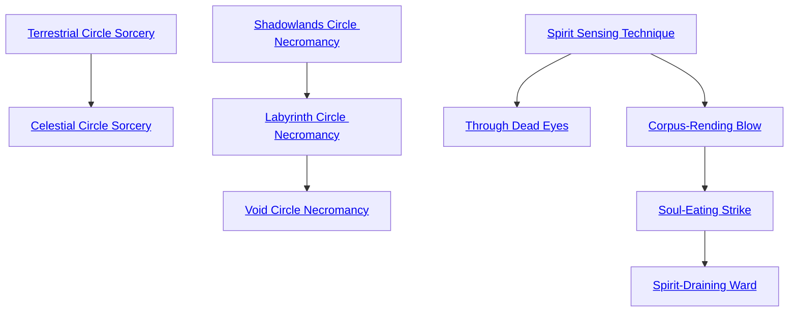

## Terrestrial Circle Sorcery

Cost: 1 Willpower
Duration: Instant
Type: Simple
Minimum Occult: 3
Minimum Essence: 3
Prerequisite Charms: None

Least of all sorcery and still worlds beyond the power
of the most talented mortal wizards, magic of the First
Circle sees much use among the deathknights.
Note that invoking this Charm only enables the
character to cast a single Terrestrial Circle Sorcery spell.
The actual spell itself has an Essence cost, often very high,
that the character must pay to actualize it. This cost is
listed in the spell's description. Terrestrial Circle Sorcery
can never be part of a Combo.

## Celestial Circle Sorcery

Cost: 2 Willpower
Duration: Instant
Type: Simple
Minimum Occult: 4
Minimum Essence: 4
Prerequisite Charms: [[#Terrestrial Circle Sorcery]]

Easily outstripping the most potent spells of the Dragon-Blooded,
the magic of the Second Circle is well known in the
Underworld as a weapon of the Deathlords and their Daybreak
Caste servants. Other Abyssal Exalted must often coax
or barter with these entities for power, though the sorcerer-
kings of the dead are notably reticent to share their secrets.
Celestial Circle Sorcery can never be part of a Combo.

## Shadowlands Circle Necromancy

Cost: 1 Willpower
Duration: Instant
Type: Simple
Minimum Occult: 3
Minimum Essence: 3
Prerequisite Charms: None

Where sorcery manipulates and channels the Essence
of Creation, its sister art of necromancy binds the dark
energies of the Underworld. The Essence of death is potent
but limited in scope. What it lacks in flexibility, however,
it makes up for in might. Those who delve into the mystical
lore of the Malfeans to master this Charm can hone will
and spirit to perform necromancy of the First Circle. Note
that, as with sorcery, the cost of this Charm only enables
the character to cast a single Shadowlands Circle spell.
The actual spell itself has an Essence cost, often very high,
that the character must pay to actualize it. This cost is
listed in the spell's description. Shadowlands Circle Necromancy
can never be part of a Combo.

## Labyrinth Circle Necromancy

Cost: 2 Willpower
Duration: Instant
Type: Simple
Minimum Occult: 4
Minimum Essence: 4
Prerequisite Charms: [[#Shadowlands Circle Necromancy]]

Above — or perhaps below — the necromancy of
the First Circle, Labyrinth Circle magic is the stuff of
nightmares and dreams best left to dead gods. Still, for
those who would master its secrets, this circle offers great
and terrible power. Labyrinth Circle Necromancy can
never be part of a Combo.

## Void Circle Necromancy

Cost: 3 Willpower
Duration: Instant
Type: Simple
Minimum Occult: 5
Minimum Essence: 5
Prerequisite Charms: [[#Labyrinth Circle Necromancy]]

In true poetic irony, the very death taint that denies
the Abyssal Exalted access to Solar Circle Sorcery also
grants them comparable power over the Oblivion they
serve. Masters of Void Circle Necromancy are thankfully
rare, but theirs is the power of unmaking, the power that
would devour all Creation in its hunger — and the
Underworld as well. Few spells of this potency exist
outside the personal libraries of the Deathlords; the
sorcerer-kings of the Underworld zealously hoard such
mighty lore as they hoard little else. Void Circle Necromancy
can never be part of a Combo.

## Spirit Sensing Technique

Cost: 5 motes
Duration: One scene
Type: Simple
Minimum Occult: 2
Minimum Essence: 2
Prerequisite Charms: None

This Charm allows the character to perceive dematerialized
spirits in her vicinity. Such beings appear as
translucent specters of their materialized form, although
ghosts appear more “solid” to the Abyssal than other types
of spirits. Every 5 motes spent above the Charm's base cost
allow the character to project one additional sense into the
spirit realm. However, even if a character can feel the
touch of a dematerialized spirit, she cannot actually touch
it without employing other magic.

## Through Dead Eyes

Cost: 6 motes
Duration: One scene
Type: Simple
Minimum Occult: 5
Minimum Essence: 2
Prerequisite Charms: [[#Spirit Sensing Technique]]

Even in the most verdant forests, the necrotic Essence
of the Underworld leaks through into Creation in
wisps and trails. With this potent Charm, an Abyssal can
perceive these energies directly. Beings and places suffused
with death glow with their own baleful radiance,
while objects imbued with living Essence appear shadowed
or empty. In addition to perceiving dematerialized
ghosts, the character can identify other Abyssal Exalted
with a glance and precisely determine the boundaries of
any shadowland. Deathknights employing this Charm
can also spot the seething ripples and whorls of Charms
and sorcery, allowing them to notice most magic without
a roll. With a successful Intelligence + Occult roll, a
character can even identify magic (although the difficulty
increases by 1 if the scrutinized magic does not
involve death energy).

## Corpus-Rending Blow

Cost: 2 motes
Duration: Instant
Type: Supplemental
Minimum Occult: 3
Minimum Essence: 2
Prerequisite Charms: [[#Spirit Sensing Technique]]

Charging his hand or weapon with spectral energy,
the character can make one strike against an immaterial
spirit. The character's player must still roll to hit the
creature normally, although the deathknight may elect to
attack the spirit's Essence in lieu of inflicting damage. This
decision must be made when activating the Charm, before
rolling the attack. If the Abyssal chooses to drain Essence,
roll her Conviction + Occult in place of damage, using the
spirit's Valor as its soak total. Each level of “damage”
inflicted in this fashion drains 2 motes of Essence from the
spirit's pool and adds it to the character's own. Drained
motes that would take a character above her normal
maximum are still drained but dissipate without benefit to
the Exalt. If the character uses this Charm to cause actual
injury, the attack is resolved normally. This Charm confers
no ability to perceive incorporeal spirits, so characters
attacking without other magic (such as Spirit Sensing
Technique) suffer the usual penalty for blind fighting. This
Charm has no effect on materialized spirits. Corpus-Rending
Blow is explicitly permitted to be part of a Combo with
Charms of other Abilities.

## Soul-Eating Strike

Cost: 5 motes
Duration: Instant
Type: Supplemental
Minimum Occult: 5
Minimum Essence: 3
Prerequisite Charms: [[#Corpus-Rending Blow]]

This Charm allows an Abyssal to infuse a single attack
with the chill of the Void. The character's blow can strike
incorporeal spirits. A successful hit inflicts aggravated damage
and drains Essence as Corpus-Rending Blow (roll
separately for each form of damage). Spirits slain by such
attacks are irrevocably destroyed. Against materialized spir-
its, this Charm allows the Abyssal to drain Essence as above,
but the attack does not inflict aggravated damage. Materialized
spirits killed via Soul-Eating Strike eventually
regenerate. This Charm is explicitly permitted to be part of
a Combo with Charms of other Abilities. Spirits can sense
Exalted who know this Charm and fear and loathe them.

## Spirit-Draining Ward

Cost: 10 motes
Duration: One scene
Type: Simple
Minimum Occult: 5
Minimum Essence: 3
Prerequisite Charms: [[#Soul-Eating Strike]]

Opening himself as a conduit to the Void, the Abyssal
spreads his arms, and a maelstrom of flickering shadows
billows out to fill a radius equaling his permanent Essence in
yards. This effect remains centered on the character for the
remainder of the scene. While visible in the material world,
the unnatural storm barely raises a light breeze. However,
immaterial spirits within the area of effect suffer battering
cold equivalent to an arctic gale. Against such creatures, this
Charm inflicts a number of levels of aggravated damage equal
to the Abyssal's permanent Essence minus the spirit's permanent
Essence. This damage is not rolled. It is simply applied
each turn unless the spirit has a means of soaking aggravated
damage. The character regains 2 motes of Essence for every
level of damage inflicted by the ward, up to his usual maximum.
Spirits killed by this Charm are sucked into the Void
and permanently destroyed. Although this Charm cannot
injure spirits whose Essence rating matches or exceeds the
character, the ward still discomfits them (adding +1 to the
difficulty of all actions inside its area of effect). Materialized
spirits are immune to this Charm. Spirits can sense Exalts who
knows this Charm and hate them for it.
