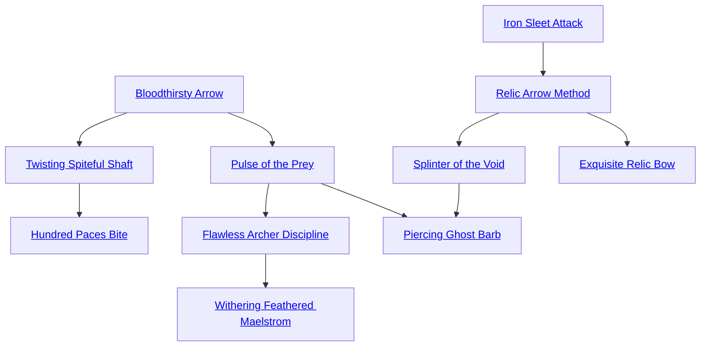

## Bloodthirsty Arrow

Cost: 1 mote per die
Duration: Instant
Type: Supplemental
Minimum Archery: 2
Minimum Essence: 2
Prerequisite Charms: None

The character extends a wisp of Oblivion through his
bow, filling his arrow with a thirst for blood and death. The
shaft eagerly adjusts its course to compensate for any
evasive action. For every mote of Essence the Abyssal
spends, he may either reduce the dice pool of his target's
first defensive action by one die or add one die to the
damage of an attack against a living target. This Charm
cannot reduce a character's dice pool lower than her
Essence score, nor can it add more damage than the
activating Abyssal's permanent Essence. The Exalt can
use both effects of this Charm at the same time, provided
he can afford the Essence expenditure.

## Twisting Spiteful Shaft

Cost: 3 motes
Duration: Instant
Type: Supplemental
Minimum Archery: 3
Minimum Essence: 2
Prerequisite Charms: [[#Bloodthirsty Arrow]]

Empowered with rage and seething Essence, the
Abyssal's arrow twists cruelly within its target to inflict
horrible rending wounds. Even after impact, it continues
to bore deeper into the flesh until forcibly removed.
Arrows enchanted with this Charm add the character's
permanent Essence to their base damage. In addition, if
the arrow inflicts damage, the head continues boring into
the target, inflicting its normal damage modifier at the
beginning of each subsequent turn until pulled free, for a
maximum number of turns equal to the firing character's
permanent Essence.
This damage cannot be lower than one die. Thus, a
standard broadhead arrow inflicts 2L each turn, a frog
crotch 4L and a target arrow 1L. Damage inflicted by a
boring arrow can only be soaked with Stamina and other
natural soak. Removing an arrow requires a successful
Strength + Athletics roll against a difficulty equal to the
permanent Essence of the firing character. This difficulty
can never rise above 5. Once a victim dies or the arrow has
been pulled free, its magic immediately fades. Only arrows
that naturally inflict lethal damage can be enchanted with
this Charm.

## Hundred Paces Bite

Cost: 1 mote
Duration: Instant
Type: Supplemental
Minimum Archery: 3
Minimum Essence: 2
Prerequisite Charms: [[#Twisting Spiteful Shaft]]

With this Charm, an Abyssal's arrow becomes a
conduit for his life-draining anima. The Exalt regains one
mote of Essence for every health level of damage his arrow
inflicts on a living target. If this Charm is placed in a
Combo with Twisting Spiteful Shaft, the Essence cost
increases to 3 motes, but the arrow continues to absorb
Essence as long as it burrows.

## Pulse of the Prey

Cost: 3 motes + special
Duration: Instant
Type: Simple
Minimum Archery: 4
Minimum Essence: 2
Prerequisite Charms: [[#Bloodthirsty Arrow]]

The character's eyes glint with power as he attunes his
gaze to the glow of Essence in his victim. For 3 motes, the
Exalt may make a single Archery attack without penalty
for visual conditions, although other environmental fac-
tors may interfere with his accuracy. For every additional
mote spent, the character may also add one die to his
Archery attack roll, although he cannot add more dice
than his target's Essence score. This Charm does not aid in
targeting inanimate objects.

## Flawless Archer Discipline

Cost: 2 motes, 1 Willpower
Duration: Instant
Type: Supplemental
Minimum Archery: 5
Minimum Essence: 2
Prerequisite Charms: [[#Pulse of the Prey]]

Guided by the grim certainty of death, the Abyssal
blocks out all distractions. From the time he draws his
arrow to the moment of release, the deathknight perceives
and knows nothing but his target and his cold desire to end
its existence. The player still rolls an attack as normal, but
successes only matter for purposes of damage. Even in the
case of a botch, he still hits the target, inflicting the arrow's
base damage. Although this Charm permits feats of impossible
accuracy, such as cutting ropes or picking off objects
at the maximum range of the bow, it does not allow called
shots to bypass armor.

## Withering Feathered Maelstrom

Cost: 8 motes, 1 Willpower
Duration: Instant
Type: Extra Action
Minimum Archery: 5
Minimum Essence: 2
Prerequisite Charms: [[#Flawless Archer Discipline]]

Her arms and fingers a flickering blur of motion, an
Abyssal with this Charm may empty her entire quiver
before her opponents have time to register surprise. So
long as the character hits her intended target, she may
make another attack at her full Archery dice pool. The
character must concentrate all her attacks on one target.
This Charm ends when the character exhausts her ammunition
or when she has done damage a number of times
equal to her Archery score.

## Iron Sleet Attack

Cost: 4 motes
Duration: Instant
Type: Supplemental
Minimum Archery: 3
Minimum Essence: 2
Prerequisite Charms: None

Infused with the chill of the Void, the character's
arrow freezes in flight and trails wisps of glowing frost. This
supernatural cold adds the character's Essence score to the
arrow's damage, as well as inflicting debilitating frostbite.
Victims of Iron Sleet Attack lose one dot of Dexterity
every time the Iron Sleet Attack successfully does damage
to them. Characters reduced to zero Dexterity can only
huddle in misery, assuming they can move at all. Frostbitten
characters regain lost Dexterity at the rate of one dot
per hour. This Charm has no effect on the undead or on
other beings immune to extreme cold.

## Relic Arrow Method

Cost: 1 mote per arrow
Duration: Instant
Type: Supplemental
Minimum Archery: 3
Minimum Essence: 2
Prerequisite Charms: [[#Iron Sleet Attack]]

The character draws his bow, and a savagely barbed
shaft materializes under his touch. Arrows created with
this Charm have normal statistics for their type of ammunition
but shimmer like spun glass and evaporate moments
after impact.

## Splinter of the Void

Cost: 1 mote per 2L
Duration: Instant
Type: Simple
Minimum Archery: 4
Minimum Essence: 2
Prerequisite Charms: [[#Relic Arrow Method]]

The Abyssal draws a bolt of crackling Oblivion across
his bow. This bolt is fired as a normal arrow, but inflicts a
base damage of 2L for every mote of Essence spent. The
character's bow does not add to this total. Against Fair
Folk, mutants and other creatures of the Wyld, the necrotic
energy inflicts aggravated damage. Characters killed
by this Charm disintegrate in a shrieking flash of barrow-
flame and leave no ghosts. Oblivion bolts do not suffer
penalties for distance or wind, and have a maximum range
of (the archer's permanent Essence x 100) yards. Characters
cannot spend more Essence powering this Charm than
their Archery score. Splinter of the Void is incompatible
with arrow-enhancing Charms.

## Exquisite Relic Bow

Cost: 5 motes, 1 Willpower
Duration: One scene
Type: Simple
Minimum Archery: 4
Minimum Essence: 3
Prerequisite Charms: [[#Relic Arrow Method]]

Sculpting his anima with a thought, the Abyssal
summons a bow of calcified Essence and memory into her
hands. This bow has an Accuracy equal to the character's
Essence but otherwise has the same statistics as a composite
bow fitted to its creator's Strength. Despite their
common Traits, each Abyssal's bow is a unique expression
of her soul — no two are exactly alike. Exquisite Relic Bow
does not manifest with ammunition, so characters without
arrows must employ Relic Arrow Method.

## Piercing Ghost Barb

Cost: 6 motes, 1 Willpower
Duration: Instant
Type: Simple
Minimum Archery: 5
Minimum Essence: 3
Prerequisite Charms: [[#Pulse of the Prey]], [[#Splinter of the Void]]

As with Relic Arrow Method, the Exalt summons a
shaft of pure Essence. This translucent arrow glows softly
and moans as it flies. The shaft is fired like a normal arrow,
but dematerializes as it leaves the bow. The arrow remains
visible but incorporeal, capable of passing through solid
matter without a trace. The arrow only rematerializes if it
intersects a living being in its path. Since the bolt bypasses
walls and armor, victims can only soak the attack with
their Stamina and other natural soak. Trees and other
living barriers provide cover normally, as does armor that
is somehow alive, such as a perronele (see Games of
Divinity, p. 119-120). This Charm also allows the character
to hit dematerialized spirits, although it does not kill
them permanently. Any incorporeal spirit struck by a
Piercing Ghost Barb manifests to all onlookers for the rest
of the scene as a luminous but intangible apparition.
