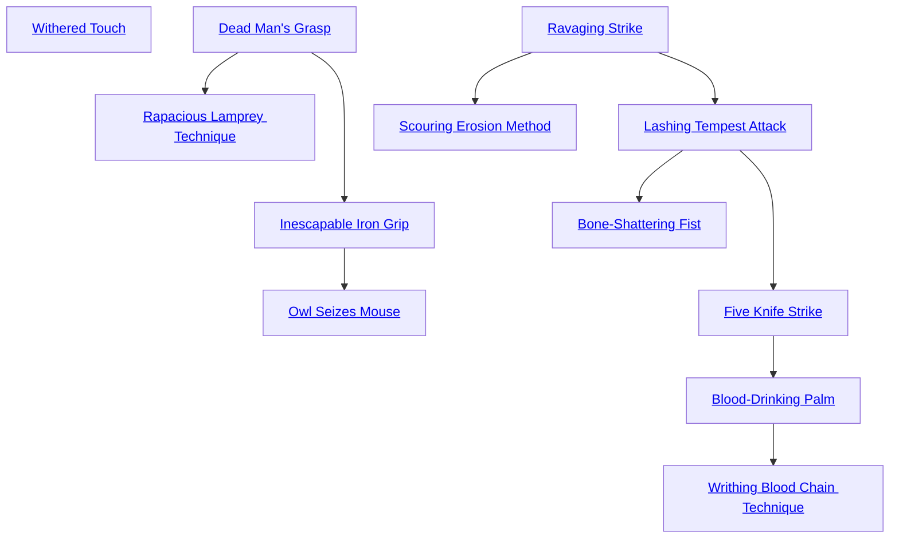

## Withered Touch

Cost: 1 mote
Duration: One turn
Type: Supplemental
Minimum Brawl: 3
Minimum Essence: 1
Prerequisite: None

The Exalted focuses the Essence of the Underworld
into his hands. Any attacks the character makes without
a weapon that turn cause lethal rather than bashing
damage. However, this Charm only works against bare or
cloth-covered flesh. Characters in metal armor are im-
mune to this Charm. Abyssals who use this Charm often
Combo it with the Rust Charm.

## Dead Man's Grasp

Cost: 1 mote per turn
Duration: Until released
Type: Reflexive
Minimum Brawl: 2
Minimum Essence: 2
Prerequisite Charms: None

The Abyssal seizes his opponent and crushes her with
the unnatural strength of the risen dead. The character
makes a clinch attack as normal (see Exalted p. 239), but
he inflicts lethal damage with his initial grab. So long as
the Exalt continues to reflexively activate the Charm at
the beginning of the turn, his clinch inflicts lethal damage
rather than bashing. In addition, the deathknight's damage
pool increases by +1L for every full turn the Charm is
maintained. This bonus is cumulative over successive
turns, but resets to zero if the Abyssal stops spending
Essence or relaxes his grip for even a moment.

## Rapacious Lamprey Technique

Cost: 2 motes
Duration: One turn
Type: Reflexive
Minimum Brawl: 3
Minimum Essence: 2
Prerequisite Charms: [[#Dead Man's Grasp]]

Fueling his hunger with Essence, an Abyssal with this
Charm can drain blood far more quickly. The Exalt can
drink up to his Essence x 3 health levels in a turn, rather
than the usual one. Blood loss afflicts the target normally.
This Charm does not accelerate the rate at which the
Abyssal can devour flesh.

## Inescapable Iron Grip

Cost: 5 motes
Duration: Until released
Type: Supplemental
Minimum Brawl: 3
Minimum Essence: 2
Prerequisite Charms: [[#Dead Man's Grasp]]

With this Charm, an Abyssal can grab a victim and
choke him to death without making a sound. The player
rolls for a standard hold attempt (see Exalted, p. 240),
adding her character's Essence score in automatic successes
to the initial roll to grab. As usual, this attack inflicts
no damage. If the Exalt succeeds, she tightly — and silently
— seizes her victim by the throat. He cannot breathe at all,
either to inhale or to scream a warning, although he may
still try to escape on his next action. However, the victim
cumulatively loses one die from his Strength + Brawl/
Martial Arts dice pool for every successive turn the hold is
maintained. Once a victim has no dice remaining, he can
no longer struggle. Incapacitated characters caught in an
Inescapable Iron Grip suffocate as though drowning (see
Exalted, p. 243). Players of victims may roll Stamina +
Resistance against a difficulty of the Abyssal's permanent
Essence to hold their breath longer. Victims begin breathing
immediately if released before death.

## Owl Seizes Mouse

Cost: 5 motes
Duration: Instant
Type: Supplemental
Minimum Brawl: 4
Minimum Essence: 2
Prerequisite Charms: [[#Inescapable Iron Grip]]

The character surges forward in a burst of speed,
allowing him to grab and pin an enemy before she can
respond. The Exalt makes a normal clinch or hold attack,
but his target cannot parry or dodge. Clinches enhanced by
this Charm do no damage, but in the case of both clinches
and holds, the characters immediately have a reflexive
contest to maintain the clinch or hold as though it was a
subsequent round. If the defender wins, she retains her
action for the round, but the actual clinch attack cannot
be parried or dodged. As an added benefit, the character
may move up to his normal sprinting distance without
penalty on the turn he uses this Charm, to allow the
character to clinch opponents ordinarily beyond his reach.
The character need not make this extended action.

## Ravaging Strike

Cost: 1 mote
Duration: Instant
Type: Supplemental
Minimum Brawl: 1
Minimum Essence: 1
Prerequisite Charms: None

The Abyssal channels wrath and Essence through his
hands to deliver terrible blows. The character makes his
attack normally but counts extra successes twice for the
purposes of determining damage. This Charm can be
activated after the attack roll.

## Scouring Erosion Method

Cost: 1 mote per 1 or 2 soak reduction
Duration: Instant
Type: Supplemental
Minimum Brawl: 2
Minimum Essence: 2
Prerequisite Charms: [[#Ravaging Strike]]

The Abyssal concentrates his anima into a roiling
corona of Oblivion. His attack inflicts normal damage,
but its withering aura of entropy reduces the target's
soak by 1 point for every mote spent, or 2 points per
mote in the case of inanimate objects. This reduction
only applies for resisting the character's one attack.
Animate targets cannot have their soak reduced below
their permanent Essence.

## Lashing Tempest Attack

Cost: 1 mote per 2 yards
Duration: Instant
Type: Supplemental
Minimum Brawl: 3
Minimum Essence: 2
Prerequisite Charms: [[#Ravaging Strike]]

With this Charm, the character envelops her hand in
a cyclone of howling shadows. With a normal strike or
even a gentle touch, the Abyssal blasts her opponent back
two yards for every mote spent. If the victim strikes a solid
object, he suffers one bashing health level of damage for
every yard he would have otherwise continued to fly. This
damage is bashing unless the target collides with spikes or
other lethal obstructions. Characters cannot spend more
motes powering this Charm than their Strength.

## Bone-Shattering Fist

Cost: 3 motes
Duration: Instant
Type: Supplementary
Minimum Brawl: 4
Minimum Essence: 2
Prerequisite Charms: [[#Lashing Tempest Attack]]

The character strikes with horrible crushing force,
inflicting lethal wounds with her assault. If she inflicts at
least one level of damage with her attack, her victim
doubles all wound penalties until he fully heals. If this
Charm is used on a target more than once, each subsequent
attack increases the victim's total wound penalty by one
die. Once a character completely heals, his wound penalties
reset to normal. UnExalted victims of this Charm do
not lose their additional penalties until they receive medical
treatment to set their broken bones.

## Five Knife Strike

Cost: 4 motes
Duration: One scene
Type: Reflexive
Minimum Brawl: 4
Minimum Essence: 2
Prerequisite Charms: [[#Lashing Tempest Attack]]

The character sprouts wicked bone claws from his
fingers, allowing him to inflict Strength + 1 lethal damage
with all hand-to-hand attacks. In addition, the character
can safely parry weapons and other lethal blows.

## Blood-Drinking Palm

Cost: 2 motes
Duration: Instant
Type: Supplementary
Minimum Brawl: 5
Minimum Essence: 2
Prerequisite Charms: [[#Five Knife Strike]]

The Abyssal delivers a vicious open-handed blow to
an enemy. In addition to inflicting lethal damage, her
attack forcibly siphons blood through the target's skin.
The Abyssal regains 1 mote of Essence per point of raw
damage inflicted before applying the target's soak. This
Charm is an exception to the usual rule that Abyssal
Exalted can only regain Essence for actual damage inflicted.
However, the Abyssal cannot absorb more motes
from a single attack than the victim's Stamina + Essence.
Blood-Drinking Palm only works against living beings and
Fair Folk and, then, only if the Exalt strikes bare or cloth-covered
skin. Storytellers should require a well-described
stunt for an Abyssal to successfully use this Charm against
an armored opponent.

## Writhing Blood Chain Technique

Cost: 10 motes, 1 Willpower, 1 health level
Duration: One scene
Type: Simple
Minimum Brawl: 5
Minimum Essence: 3
Prerequisite Charms: [[#Blood-Drinking Palm]]

With a painful surge of Essence, the Abyssal transforms
her blood into deadly weapons. At the end of the
turn, chains of iron-hard congealed blood erupt from her
back or arms. The character grows a number of chains
equal to her permanent Essence, and each is tipped with a
razor-sharp claw. For the rest of the scene, the character
gains a number of extra actions each turn equal to the
number of chains grown. These actions can only be used to
attack or parry. If a character uses any chains to attack, he
cannot split his dice pool that turn, and vice versa. Blood
chains have a length in yards and a Speed, Accuracy and
Defense rating equal to their creator's Essence and inflict
a base lethal damage of the character's Strength + Essence.
They are wielded using the Brawl Ability. Once this
Charm expires, the chains revert to fluid blood and disintegrate
in a splash of gore. A character using Writhing
Blood Chain Technique cannot use Extra Action-type
Charms or take advantage of extra actions granted by
other magic while this Charm remains active.
