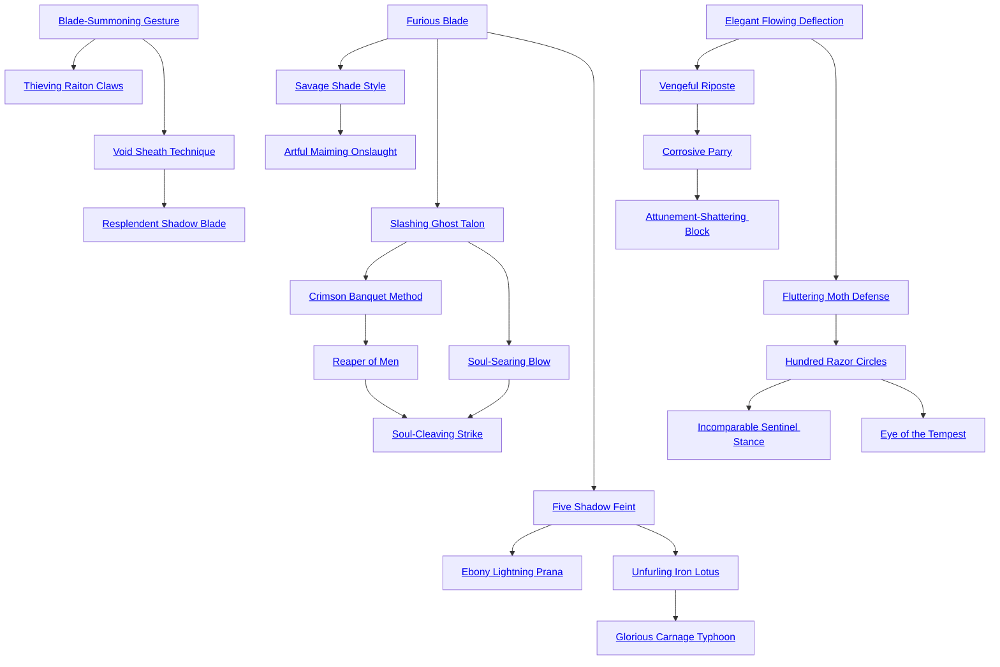

## Furious Blade

Cost: 1 mote per die
Duration: Instant
Type: Supplemental
Minimum Melee: 1
Minimum Essence: 1
Prerequisite Charms: None

Enveloped in a corona of roiling darkness, the Abyssal's
weapon moves with predatory zeal to cut down enemies.
The character may add one die to a single attack for every
mote spent but cannot more than double his Dexterity +
Melee dice pool.

## Savage Shade Style

Cost: 1 mote
Duration: Instant
Type: Supplemental
Minimum Melee: 2
Minimum Essence: 1
Prerequisite Charms: Furious Blade

With this Charm, the Abyssal focuses fury and Essence
through his weapon to strike horrible rending blows.
The character makes his attack as normal, but successes
count twice for the purposes of determining damage. This
Charm must be invoked before making the attack roll.

## Artful Maiming Onslaught

Cost: 5 motes
Duration: Instant
Type: Supplemental
Minimum Melee: 4
Minimum Essence: 2
Prerequisite Charms: Savage Shade Style

Striking with cruel precision, an Abyssal with this
Charm aims his blow to sever limbs and mutilate his
opponent. Add the Abyssal's Dexterity to the damage of
his attack, but this attack has a difficulty of at least 3.
Severing an arm or leg (or tentacle or similarly sized
appendage) is difficulty 3 and requires the Exalt to inflict
at least two health levels of damage after soak.
Severing a hand or putting out an eye increases the
attack difficulty to 4 but only requires a single level of
damage. Regardless of the actual damage rolled, the
Abyssal's strike only inflicts the minimum levels necessary
for the maiming. Thus, a character who rolls five health
levels of damage after the target's soak only inflicts two
levels on an attempt to sever an arm. Victims still must
contend with bleeding and shock, however. Consider the
amputee's wound penalty to be twice its usual value until
her bleeding is stanched (however, Exalted make their
normal difficulty 1 roll).
Additionally, victims' players must make a successful
reflexive Stamina + Resistance roll for their characters to
take any action on the turn they lose a limb. The Story-
teller should assign other penalties or restrict actions as
appropriate for maimed victims (see Exalted, p. 234).

## Slashing Ghost Talon

Cost: 1 mote
Duration: Instant
Type: Supplemental
Minimum Melee: 2
Minimum Essence: 2
Prerequisite Charms: Furious Blade

The character's blade shrieks and moans as it be-
comes a conduit for her insatiable hunger. The
deathknight makes her attack as normal but regains 1
mote of Essence for every health level of damage inflicted.
If the Abyssal uses a soulsteel weapon to strike a
being with an Essence pool, she also absorbs the motes
stolen by her weapon. This latter bonus only applies if the
character is attuned to her weapon.

## Crimson Banquet Method

Cost: 5 motes, 1 Willpower
Duration: One scene
Type: Simple
Minimum Melee: 4
Minimum Essence: 2
Prerequisite Charms: Slashing Ghost Talon

With this Charm, the character harvests power
from every blow that draws blood. Crimson Banquet
Method duplicates the effects of Slashing Ghost Talon,
but the bonus applies to every attack made during the
scene. This Charm cannot be stacked with itself to gain
multiple motes per health level inflicted, nor may the
Abyssal use Slashing Ghost Talon while employing this
Charm. A character cannot gain more Essence in a
single turn from the use of this Charm than the
character's Essence + Lore.

## Reaper of Men

Cost: 10 motes, 1 Willpower
Duration: One scene
Type: Simple
Minimum Melee: 5
Minimum Essence: 2
Prerequisite Charms: Crimson Banquet Method

The deathknight suffuses her body and weapon with
necrotic Essence, wreathing herself in a nimbus of cold
baleful energy. Any living being who touches her or strikes
her with a hand-to-hand attack suffers lethal damage equal
to the Abyssal's Essence score. The character's hand-to-
hand attacks also inflict lethal damage and add her Essence
to the damage of the attack. Mindless ghosts and walking
dead fear characters using this Charm and will not attack
them unless mystically compelled.

## Soul-Searing Blow

Cost: 2+ motes
Duration: Instant
Type: Supplemental
Minimum Melee: 3
Minimum Essence: 2
Prerequisite Charms: Slashing Ghost Talon

Projecting the spiritual cold of Oblivion through
his weapon, the Abyssal can assault the very soul and
will of a foe. If the character's attack hits (it need not
inflict damage), the victim loses 1 point of temporary
Willpower for every 2 motes spent. Exalted and other
beings with control over their Essence pools may choose
to lose 2 motes of Essence for every Willpower point
they would have otherwise lost. If this Charm reduces a
character's temporary Willpower below zero, she suffers
lethal damage equal to the difference. Thus, a victim
with 3 Willpower remaining who loses 5 points suffers
2L damage. This damage is soaked only with the
character's permanent Essence score and nothing else.
The Abyssal cannot spend more motes powering this
Charm than twice her Conviction.

## Soul-Cleaving Strike

Cost: 10 motes, 1 Willpower, 1 health level
Duration: Instant
Type: Simple
Minimum Melee: 5
Minimum Essence: 4
Prerequisite Charms:Reaper of Men, Soul-Searing Blow

The greatest swordsmen of the deathknights can slice
through souls as easily as others carve flesh. Upon invoking
this Charm, the Abyssal's weapon flares with cold fire and
shrieks loud enough to be heard up to a mile away. The
character makes one attack at his full dice pool, which is
fully effective against both material beings and incorporeal
spirits and does normal damage in addition to this Charm's
effects. If the blow hits, the victim's player must immediately
roll permanent Essence at standard difficulty.
If this roll succeeds, the victim suffers unsoakable dice
of lethal damage equal to the Abyssal's own Essence rating.
If the roll fails, the victim loses one dot of permanent
Essence. A botch inflicts permanent Essence loss and
damage. If a character's permanent Essence drops to zero,
her life force is instantly snuffed out, and her maimed soul
falls screaming into Oblivion.
Spirits and Fair Folk slain in this manner are likewise
destroyed. Damage inflicted by Spirit-Cleaving Strike is
purely spiritual and cannot be soaked or prevented with
magic that solely defends against physical assault. All
effects of this Charm are applied before resolving the
strike's normal damage. This Charm does not work on
automata, the walking dead or other beings without souls.

## Five Shadow Feint

Cost: 1 mote per die
Duration: Instant
Type: Supplemental
Minimum Melee: 2
Minimum Essence: 1
Prerequisite Charms: Furious Blade

The Abyssal's arm and weapon flickers, blossoming
into a confusing spray of shadows and afterimages. The
character makes his attack normally, but the target loses
one die from her first defensive dice pool for every mote
spent. The Abyssal may not reduce a character's dice pool
below her Essence rating. If Five Shadow Feint is placed in
a Combo with Furious Blade, the Essence cost of both
Charms increases to 2 motes per die.

## Ebony Lightning Prana

Cost: 4 motes
Duration: Instant
Type: Reflexive
Minimum Melee: 4
Minimum Essence: 2
Prerequisite Charms: Five Shadow Feint

Drawing his blade and lunging in a single fluid mo-
tion, an Abyssal with this Charm may strike faster than
mortal eyes can follow. The character suffers no penalty for
drawing a sheathed weapon and strikes whenever he
wishes without regard for initiative. Although the
character's first action must be a Melee attack, he can still
split his dice pool normally to take other actions later in
the turn. However, the character cannot take any dice
actions after the first attack until his regular initiative. If
the character faces an opponent with similar magic, nor-
mal initiative determines who acts first. A character can
only use Ebon Lightning Prana once per turn, and in order
to use it, his weapon must be sheathed. For the purposes of
this Charm, sheathing a sword as part of a split action is a
dice action that requires no roll, but is counted as one of
the character's actions for the turn.

## Unfurling Iron Lotus

Cost: 3 motes per attack
Duration: Instant
Type: Extra Action
Minimum Melee: 3
Minimum Essence: 2
Prerequisite Charms: Five Shadow Feint

The Abyssal spins and thrusts in a rapid cascade of
blows. The Charm takes its name from the wispy con-
trails left by each strike, which, taken together, resemble
the petals of a blooming flower. The character may make
one additional attack at his full dice pool for every 3
motes spent, although he may not purchase more extra
attacks than his Essence score. Characters must activate
this Charm before taking their first action and may not
split their dice pool on the same turn they employ
Unfurling Iron Lotus. Defenders must dodge or parry
each attack separately.

## Glorious Carnage Typhoon

Cost: 8 motes, 1 Willpower
Duration: Instant
Type: Extra Action
Minimum Melee: 5
Minimum Essence: 3
Prerequisite Charms: Unfurling Iron Lotus

Blade flashing in a spiral of blood and pain and death,
the Abyssal scythes through her opponents like a tornado.
So long as the character hits her intended target and
inflicts damage, she may immediately make another attack
at her full dice pool. Each attack must be leveled at a
different victim, and the Exalt cannot move more yards
than her Melee score between each target. This Charm
ends when the character misses or strikes every possible
victim within reach of her blade.

## Blade-Summoning Gesture

Cost: 1 mote
Duration: Instant
Type: Simple
Minimum Melee: 2
Minimum Essence: 1
Prerequisite Charms: None

Extending his will and anima in a grasping tendril,
the Abyssal calls his weapon to his hand. Summoned
weapons can overcome friction and gravity — even pull
free from bodies — but cannot defeat walls, chains or
similar obstacles. The character must be able to see his
weapon and have a hand free to receive it. Furthermore,
this Charm can only call weapons the Exalt has previously
wielded.

## Thieving Raiton Claws

Cost: 3 motes
Duration: Instant
Type: Simple
Minimum Melee: 3
Minimum Essence: 2
Prerequisite Charms: Blade-Summoning Gesture

Instead of retrieving her own weapon, an Abyssal
with Thieving Raiton Claws may attempt
to steal the weapon of a foe.
The Exalt reaches out an empty hand,
and her player rolls Dexterity + Melee
at difficulty 3. This effect cannot
be parried or dodged. If this roll is
successful, the effect is resolved as a
normal disarming attempt (see Exalted,
p. 238). If the disarming
succeeds, the targeted weapon is torn
from the enemy's grasp and flies to
the Abyssal's own. This Charm can
steal any weapon in the character's
line of sight, although it cannot seize
magical weapons attuned to their
wielders or weapons made entirely of
Essence. Otherwise, this Charm duplicates
the effects and limitations of
Blade-Summoning Gesture.

## Void Sheath Technique

Cost: 1 mote
Duration: Indefinite
Type: Simple
Minimum Melee: 3
Minimum Essence: 2
Prerequisite Charms: Blade-Summoning Gesture

With a moment's concentration,
an Abyssal who knows this
Charm may banish a weapon from
his grasp and the world. The weapon
shimmers and vanishes Elsewhere,
remaining hidden and inaccessible
until the character reflexively ends
the Charm and draws his weapon
forth. This Charm can only banish
a single weapon at a time, one the
Abyssal is intimately familiar with
— typically his most prized implement
of battle.

## Resplendent Shadow Blade

Cost: 6 motes, 1 Willpower
Duration: One Scene
Type: Simple
Minimum Melee: 4
Minimum Essence: 2
Prerequisite Charms: Void Sheath Technique

Raising her hand imperiously, a character with this
Charm freezes raw Essence into her ideal weapon. This
weapon appears sculpted of black crystal and glitters with
power and malice. Although most deathknights prefer
variations of slashing swords, this Charm can create any
bladed weapon from ornate scythes to jagged tiger claws.
When Resplendent Shadow Blade is purchased, the
Abyssal's player must decide the form of the weapon. He
then divides a number of points equal to twice the
character's Melee score between the weapon's Speed,
Damage, Accuracy and Defense. As usual, the damage
bonus of the weapon is added to the character's Strength
to determine its base lethal damage.
Once selected, this Charm always summons the
same weapon. The blade's statistics remain constant
unless the character raises his Melee score, permitting
him to divide two more points to its characteristics. The
Abyssal must purchase this Charm again to conjure a
different form of blade. Weapons created with this Charm
have the tensile strength of soulsteel — and likewise
drain motes equal to their owner's permanent Essence on
any hit that inflicts actual damage.

## Elegant Flowing Deflection

Cost: 1 mote per 2 dice
Duration: Instant
Type: Reflexive
Minimum Melee: 1
Minimum Essence: 1
Prerequisite Charms: None

The Exalt moves with preternatural grace, shifting
his weapon without breaking form or stride to parry any
hand-to-hand attack he is aware of. The character's
player rolls two dice for every mote spent but cannot
purchase more dice than his normal defensive pool for
the weapon. This total includes applicable specialties
and weapon bonuses in addition to the character's Dexterity
+ Melee. If the character has an odd number of dice
in his pool, the fractional mote remaining after buying
the last die is lost.

## Vengeful Riposte

Cost: 1 mote
Duration: Instant
Type: Reflexive
Minimum Melee: 2
Minimum Essence: 1
Prerequisite Charms: Elegant Flowing Deflection

Shifting quickly from defense to offense, the char-
acter parries one incoming strike with a swift blow to
the attacker's weapon hand or limb. If the deathknight's
player rolls more successes than the attacker, any leftover
successes are treated as a Melee attack against the
aggressor. Thus, a parry that rolls five successes to
deflect an attack with three successes becomes a two-
success attack. This counterstrike cannot be blocked or
dodged without magic. A character may not use Vengeful
Riposte in response to other counterattack Charms.
Note that this Charm does not grant the character a free
parry or extra parry dice.

## Corrosive Parry

Cost: Weapon damage + 1 motes
Duration: Instant
Type: Reflexive
Minimum Melee: 3
Minimum Essence: 2
Prerequisite Charms: Vengeful Riposte

Filling his blade with necrotic Essence as he parries, the
Abyssal rots or rusts his opponent's weapon to dust as it strikes
his block. The Abyssal character's player rolls Dexterity +
Melee in response to any close-range attack. If even one
success is achieved, the attacker's weapon shatters to mildewed
splinters and rust without injuring the defender. The
deathknight must spend motes equal to the weapon's base
damage modifier plus one, so it costs 3 motes to disintegrate
a short sword, 8 for a great axe, etc. The character can only
disintegrate actual weapons — so no rotting off an aggressor's
fist or claws. Also, this Charm cannot damage weapons made
of Essence or the Five Magical Materials.

## Attunement-Shattering Block

Cost: 3 motes, 1 Willpower
Duration: Instant
Type: Reflexive
Minimum Melee: 4
Minimum Essence: 3
Prerequisite Charms: Corrosive Parry

With this Charm, an Abyssal can dissipate the Essence
empowering a magical weapon, rendering it
temporarily useless. Attunement-Shattering Block may be
activated whenever the deathknight parries a magical
weapon. Her parry need not deflect the attack entirely, but
the Abyssal character's player must roll at least one success
on the block attempt. This Charm costs 3 motes and 1
temporary Willpower.
The defending character's player then makes a reflexive
Essence + Melee roll, with a difficulty equal to the
target's permanent Essence. If it succeeds, the weapon
becomes an inert hunk of steel and Magical Materials,
although it may be reattuned normally by its owner. Of
course, this reattunement takes between 15 and 30 minutes.
The victim can avert deattunement by immediately
spending a number of motes equal to the attunement cost
of the weapon.

## Fluttering Moth Defense

Cost: 2 motes
Duration: Instant
Type: Reflexive
Minimum Melee: 3
Minimum Essence: 2
Prerequisite Charms: Elegant Flowing Deflection

With growing mastery, the Abyssal's weapon dances
to intercept attacks as a moth spiraling a torch. The
deathknight's player may roll her character's full Dexterity
+ Melee dice pool to parry any one close-range attack the
Abyssal is aware of.

## Hundred Razor Circles

Cost: 5 motes
Duration: One turn
Type: Reflexive
Minimum Melee: 4
Minimum Essence: 2
Prerequisite Charms: Fluttering Moth Defense

Sometimes, the best defense is a good offense. Building
on this principle, the Abyssal stands motionless and traces
a lightning-fast pattern of strikes and slices around him.
Anyone entering this warded circle risks terrible injury. The
Exalt cannot actively attack, dodge or move faster than one
yard per turn without breaking the Charm, but his player
automatically rolls a full Dexterity + Melee attack against
everyone who is currently within or who subsequently
approaches within three yards of the character.
The character may also reflexively attack incoming
projectiles of which he is aware. This is a difficulty 4
Dexterity + Melee roll and adds the weapon's Parry modi-
fier as well. Success destroys or swats aside the offending
missile. Note that this Charm does not distinguish between
friend and foe — the Exalt must attack everyone in range.

## Incomparable Sentinel Stance

Cost: 3 motes, 1 Willpower
Duration: Instant
Type: Reflexive
Minimum Melee: 3
Minimum Essence: 2
Prerequisite Charms: Hundred Razor Circle

The Abyssal may effortlessly deflect any attack she is
aware of without her player making a roll. This Charm can
turn aside assaults normally impossible to parry, such as
gouts of caustic slime or the falling boulders of a landslide.
The character can even parry the attacks of greater spirits
and demon lords, although such onslaughts invariably
shatter any non-magical weapon in the process. This is a
perfect defense.

## Eye of the Tempest

Cost: 5 motes, 1 Willpower
Duration: One scene
Type: Reflexive
Minimum Melee: 5
Minimum Essence: 3
Prerequisite Charms: Hundred Razor Circle

With this Charm, the Abyssal becomes a point of
serene calm in a vortex of steel and howling shadows. The
deathknight's player may use his character's full Dexterity
+ Melee dice pool to parry all physical attacks of which the
Abyssal is aware.
