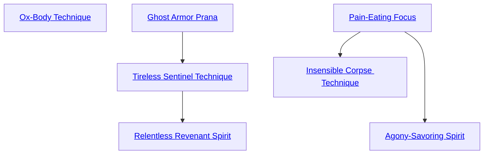

## Ox-Body Technique

Cost: None
Duration: Permanent
Type: Special
Minimum Endurance: Varies
Minimum Essence: 1
Prerequisite Charms: None
As befitting the champions of the Underworld, Abyssal
Exalted are far more resilient than mere mortals and
may purchase extra health levels as if they were a Charm.
This Charm can be taken as many times as a character has
dots of Endurance. Each Ox-Body Technique purchased
provides one of the following, decided by the player at the
time of purchase:
• One -0 health level
• Two -1 health levels
• One -1 health level and two -2 health levels

## Ghost Armor Prana

Cost: 3 motes per point
Duration: One hour
Type: Simple
Minimum Endurance: 3
Minimum Essence: 2
Prerequisite Charms: None
The Abyssal enfolds his anima about his armor, grant-
ing it surreal lightness for an hour. For every 3 motes spent,
the character reduces the fatigue value and mobility penalty
of his armor by one point, to a maximum possible reduction
equal to his permanent Essence. A fatigue value of zero
indicates the character need never roll to see if he becomes
fatigued from wearing his armor. This Charm cannot reduce
a character's mobility penalty or fatigue value below zero.

## Tireless Sentinel Technique

Cost: 3 motes
Duration: One day
Type: Simple
Minimum Endurance: 3
Minimum Essence: 2
Prerequisite Charms: Ghost Armor Prana

An Abyssal with this Charm may revivify himself with
Essence, allowing him to act at full strength without penalties
for sleep loss or exhaustion. There is no limit to how many
days this Charm can be used in a row, but animating death
Essence is a poor substitute for natural rest. After a number of
days equal to the character's Stamina + Endurance, the Exalt
begins to suffer one unsoakable level of bashing damage each
time the Charm is used. This damage does not heal until the
character stops using the Charm. Once a character ends use
of Tireless Sentinel Technique, he cannot safely reactivate it
until all damage from the Charm has been healed. Doing
otherwise only continues the process of decay.

## Relentless Revenant Spirit

Cost: None
Duration: Permanent
Type: Special
Minimum Endurance: 4
Minimum Essence: 2
Prerequisite Charms: Tireless Sentinel Technique

Once an Abyssal learns this Charm, death itself
cannot stop him. If slain, his spirit rises again as a ghost. He
loses his Exaltation and its commiserate powers, but he
gains the full advantages of unlife, retains the ability to use
any supernatural martial-arts forms he may know up to and
including the Form (but not more advanced techniques)
and gains twice as many Arcanoi as a starting ghost. The
Storyteller has final say on what Traits the character keeps
and how many ghost Charms he can purchase, etc.

## Pain-Eating Focus

Cost: 1 mote
Duration: Instant
Type: Reflexive
Minimum Endurance: 1
Minimum Essence: 2
Prerequisite Charms: None

More than any of the other Chosen, the Abyssal
Exalted understand the power of suffering and hate. A
character with this Charm may invoke it whenever she is
struck in combat. For every die of pre-soak damage the
attack inflicts, her player may roll one die. Each success on
this roll restores 1 mote of Essence, up to the character's
usual limit. A character cannot harvest more Essence from
a single attack than her Essence rating.

## Insensible Corpse Technique

Cost: None/1 mote per -1
Duration: Permanent/one scene
Type: Special/Reflexive
Minimum Endurance: 3
Minimum Essence: 2
Prerequisite Charms: Pain-Eating Focus

Many Abyssal Exalted show disturbing indifference
to suffering. When this Charm is purchased, the player
must decide whether to permanently inure the Exalt
against the worst of his pain or cultivate a more powerful
numbing for short-term use. In the former case, the Exalt
permanently subtracts 2 from all wound penalties. Such
anesthetizing does not accelerate healing, so a -2 level
reduced to -0 still regenerates as a -2. However, this
penalty reduction is cumulative, so characters buying this
Charm twice subtract 4 from their wound penalties. Once
this Charm is purchased three times, the Exalt is thereafter
immune to all but the most unimaginably terrible agony.
In its configuration as a temporary anesthetic, this
Charm allows characters to dampen pain with Essence.
For every mote spent, the Exalt can ignore one die of
wound penalties. This Charm can be used multiple times
in a scene, with cumulative effect. Characters can even
negate more dice of wound penalties than they currently
suffer from in preparation for future injury. Exalted who
know the temporary and permanent form of this Charm
combine both effects when determining their final wound
penalty reduction.

## Agony-Savoring Spirit

Cost: 1 Willpower
Duration: Instant
Type: Reflexive
Minimum Endurance: 3
Minimum Essence: 2
Prerequisite Charms: Pain-Eating Focus

Where an Abyssal with Pain-Eating Focus draws
power from her own torment, a character with this Charm
may feed on the suffering of others. A character can use
this Charm whenever she slays an individual single-
handedly. The Abyssal's player rolls Conviction. Each
success restores one point of Willpower.
