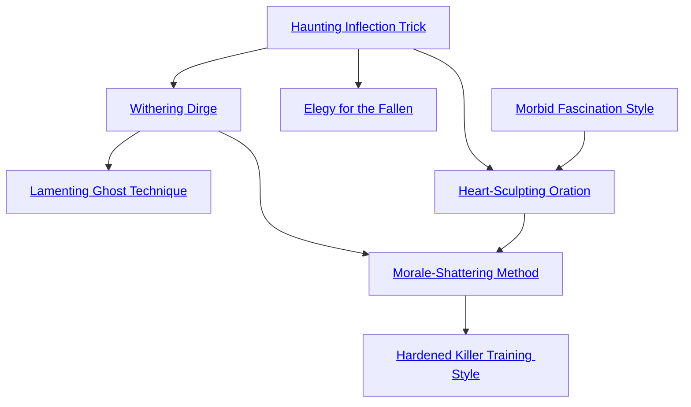

## Haunting Inflection Trick

Cost: 1 mote per 2 dice
Duration: Instant
Type: Supplemental
Minimum Performance: 2
Minimum Essence: 2
Prerequisite Charms: None

As the Exalt speaks, her voice takes on an
otherworldly tone. Whether shattered into multiple discordant
pitches or augmented to mellifluous grace, her
augmented tone adds emotional weight to everything she
says. The character can add 2 dice to a Performance or
Presence dice pool for every mote spent, although she
may not more than double her pool. The character must
be employing her voice to invoke this Charm, whether
for singing, teaching or oration.

## Withering Dirge

Cost: 2 motes per 1L damage
Duration: Instant
Type: Reflexive
Minimum Performance: 3
Minimum Essence: 2
Prerequisite Charms: Haunting Inflection Trick

A deathknight can channel Essence into a mourn-
ful song so that members of his audience, willing or
otherwise, start to die as they listen to it. Their bodies
weaken as their life Essence is sucked away into the
Underworld. Each listener suffers 1L for every 2 motes
spent on the Charm, up to a maximum damage equal to
the deathknight's permanent Essence. This damage
leaves no physical mark and may only be soaked with
Stamina or soak-boosting Charms. Characters can only
use this Charm once per turn, although they may acti-
vate it on subsequent turns to continue their song
unabated. The exact nature of a Withering Dirge de-
pends on the Abyssal, but there is no mechanical
difference between an achingly beautiful requiem and a
piercing scream of anguish. Nonliving beings and the
deaf are immune to this Charm.

## Lamenting Ghost Technique

Cost: 1 mote per 1L damage
Duration: Instant
Type: Simple
Minimum Performance: 5
Minimum Essence: 2
Prerequisite Charms: Withering Dirge

An Abyssal with this Charm can transform her voice
into a terrible weapon. The character opens her mouth
wide and screams, pouring Essence into a devastating sonic
blast. The character's player rolls Manipulation + Performance
to hit a single target, inflicting a base damage of 1L
for every mote of Essence spent. Extra successes add as
normal. This attack cannot be parried, only dodged, and
may be soaked only with Stamina and other natural soak
enhancers. Lamenting Ghost Technique has a range of
(the character's Performance x 10) yards. An Abyssal may
not spend more motes powering this Charm than her
Stamina + Essence.

## Elegy for the Fallen

Cost: 5 motes
Duration: Special
Type: Simple
Minimum Performance: 4
Minimum Essence: 2
Prerequisite Charms: Haunting Inflection Trick

Preaching the veneration of death and the dead is
seen as a sacred obligation by many deathknights. Such
adulation serves two purposes: strengthening the power of
the Underworld and garnering useful allies among the
dead. To these ends, Abyssal Exalted with this Charm may
channel the prayers of a living congregation to empower
the dead. A memorial service can be directed at a single
ghost or the dead in general, as decided by the Exalt, but
such worship can only be carried out at night.
If targeting a single ghost, the Abyssal spends one or
more hours leading his assembled congregation in prayers
to the honored deceased. Such prayers can take the form
of a high ritual, a mournful song or dance — even a
lighthearted wake. After each hour, the character's player
rolls dice equal to the number of active participants. The
total number of dice cannot be greater than twice the
deathknight's Charisma + Performance. A ghost who is
subject of such a celebration regains 1 mote of Essence for
every success rolled — or half that number if she is not
physically present at the memorial.
If used to facilitate general worship of death, this
Charm uses the same system. However, the total Essence
generated is divided evenly among all ghosts through the
mausoleums of Stygia.

## Morbid Fascination Style

Cost: 5 motes
Duration: One scene
Type: Simple
Minimum Performance: 2
Minimum Essence: 2
Prerequisite Charms: None

With this Charm, an Abyssal may instantly command
fear and respect from an assembled crowd. Audience
members may not like her performance or believe her
words, but they recognize the implicit malice she embodies
and treat her accordingly. In short, they may not like her,
but they know better than to heckle or depart before the
end of the show. A few disturbed souls may actually find
the Abyssal more alluring as a result of her dangerous edge,
but these are the exception, not the rule. This Charm only
works on non-magical beings.

## Heart-Sculpting Oration

Cost: 6 motes, 1 Willpower
Duration: One scene
Type: Simple
Minimum Performance: 5
Minimum Essence: 2
Prerequisite Charms: Haunting Inflection Trick, Morbid Fascination Style

An Abyssal with this Charm can inflame or harden
the passions of the living and the dead alike. The character
speaks with smoldering fervor or cold certainty, lending
supernatural conviction to her words and mannerisms.
The Abyssal's player selects an emotion and rolls Manipulation
+ Performance at difficulty 2. If the desired emotion
is innately negative — such as hate, fear or sorrow—this
roll is made at standard difficulty.
Targets whose Willpower score is less than the number
of successes rolled are completely overwhelmed by the
emotional onslaught and act accordingly. A crowd suffused
with rage is apt to riot, while a celibate monk
overcome with lust seeks to indulge his previously repressed
desire. Targets with a Willpower less than twice
the number of successes rolled may make a Willpower roll
(difficulty 1) to resist the emotion. Individuals whose
Willpower exceeds twice the successes rolled are completely
unaffected. The emotional tampering caused by
this Charm only lasts for one scene, although low Temperance
characters may continue to indulge themselves for
some time afterward, at Storyteller discretion.
This Charm can also induce apathy, rather than
passion. This requires the same roll, but affected characters
find themselves emotionally numbed. Everything
feels crushingly bleak and hollow. This effect can be
used to quell riots, as apathetic mobs quickly lose inertia
and disperse.

## Morale-Shattering Method

Cost: 10 motes, 1 Willpower
Duration: One scene
Type: Simple
Minimum Performance: 5
Minimum Essence: 3
Prerequisite Charms: Withering Dirge, Heart-Sculpting Oration

An Abyssal Exalt who knows this Charm can radiate
a nimbus of cold dread that saps the morale of enemies. All
enemy troops within a radius of (the character's Conviction
x 100) yards feel terror seize their hearts. Soldiers
ensorcelled with this Charm lose 1 die from all combat dice
pools and their players suffer a +1 difficulty on all Valor
rolls. The effect of this Charm on the overall outcome of
a battle rests within the Storyteller's discretion, but its
influence should be considerable.

## Hardened Killer Training Style

Cost: 10 motes, 1 Willpower
Duration: One week
Type: Simple
Minimum Performance: 5
Minimum Essence: 3
Prerequisite Charms: Morale-Shattering Method

Although many deathknight generals prefer mute
legions of zombies to unpredictable mortal troops, a few
recognize the power of the human spirit — and the beauty
in crushing that spirit to serve the will of the Deathlords.
Abyssals who know this Charm can transform a motley
crew of peaceful farmers and children into competent
merciless killers with disturbing ease.
Characters may supervise a maximum of (their Es-
sence rating x 100) soldiers in a given week. Soldiers
trained for a month or longer are considered elite troops.
They are quite disciplined, with relevant combat Abilities
rated at 3 or higher and usually a specialty or two in a
favored weapon.
More importantly, this brutal training regimen gradu-
ally wears away humanity and replaces it with psychotic
malice. For every two weeks that a soldier undergoes this
instruction, she loses one dot of Compassion and gains a
dot of either Valor or Conviction. By the time they
graduate, the new soldiers typically have Compassion 1
and five or more dots divided between Conviction and
Valor. Continued use of this Charm only further increases
the combat prowess of the Abyssal's troops.
