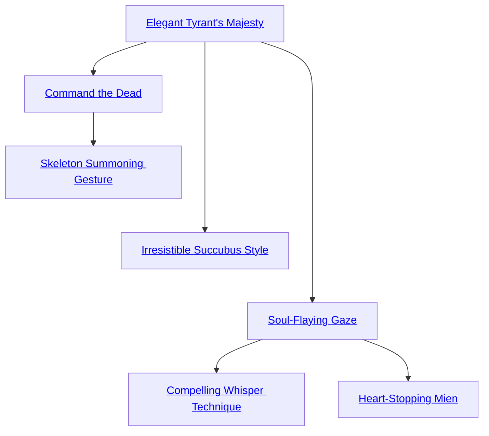

## Elegant Tyrant's Majesty

Cost: 6 motes
Duration: One hour
Type: Simple
Minimum Presence: 3
Minimum Essence: 2
Prerequisite Charms: None

An Abyssal using this Charm radiates terrible allure. His
words resound with unholy power and conviction, while his
every gesture bespeaks grace and nobility. The Exalt's player
adds a number of dice equal to his character's permanent
Essence to all Presence, Socialize and Bureaucracy rolls
involving one-on-one interaction. This bonus also applies to
all intimidation attempts, regardless of the number of onlook-
ers present. Note that this Charm engenders respect and fear
— it does not win friends or make the Exalt more likeable.

## Command the Dead

Cost: 5/10 motes, 1 Willpower + 1/3 motes per additional target
Duration: One day
Type: Simple
Minimum Presence: 3
Minimum Essence: 2
Prerequisite Charms: Elegant Tyrant's Majesty

An Abyssal using this Charm may issue orders to the
dead and demand their obedience. If targeting mindless
undead or hungry ghosts, the cost of the Charm is 5 motes,
plus 1 mote for every additional target beyond the first.
Actual ghosts require 10 motes, plus 3 motes per additional
target, and the Exalt must have a permanent Essence of 3
or higher to control such beings.
The Exalt's player rolls Manipulation + Presence against
a difficulty of the target's permanent Essence. If targeting
multiple beings, use the highest Essence rating in the group.
The amount of control the character has depends on the
number of successes rolled. One success is sufficient to bark
simple harmless commands that do not violate the target's
Nature (“Back off!” for example). With three successes, the
target must completely obey the Exalt, although sentient
targets may ignore commands that would cause them physical
harm. With five successes, the target does anything the
Exalt commands for the duration of the Charm.
Keep in mind that the walking dead aren't the brightest
creatures and have difficulty comprehending anything
more complicated than a simple sentence. While more
intelligent, ghosts are similarly limited by language. The
dead cannot obey instructions they do not understand,
regardless of their degree of obedience. Ensorcelled targets
never attack their master, however — at least, not until
they regain their own free will.
An Abyssal may also use Command the Dead to usurp
control of walking dead and ghosts from other necromancers.
This follows the same rules, except that the difficulty
is the Essence rating of the targets' current master. Characters
cannot usurp control from necromancers with a
higher permanent Essence than their own.

## Skeleton Summoning Gesture

Cost: 5 motes, 1 Willpower
Duration: Instant
Type: Simple
Minimum Presence: 3
Minimum Essence: 3
Prerequisite Charms: Command the Dead

The Abyssal channels a burst of Essence into the
ground beneath her feet. If a largely whole skeleton is in
the vicinity, it claws its way out of the ground and
emerges at the beginning of the next turn. Skeletons
raised with this Charm obey their maker to the best of
their limited intelligence and have the same statistics as
common zombies (see Exalted, p. 298). These monsters
are always extras.

## Irresistible Succubus Style

Cost: 8 motes
Duration: One scene
Type: Simple
Minimum Presence: 5
Minimum Essence: 3
Prerequisite Charms: Elegant Tyrant's Majesty

Irresistible Succubus Style heightens an Abyssal's
cold beauty, transforming her visage to match her idealized
form. Deathknights using this Charm are alabaster angels
or onyx goddesses, achingly beautiful apparitions with
flawless skin and ruby lips. A character adds her permanent
Essence to her Appearance rating as long as she remains
enchanted. This metamorphosis is no illusion, however,
but an ideal brought to life with Essence. As such, the
character's altered beauty cannot be pierced by magic that
detects glamour or illusions.
In addition to augmenting her beauty, this Charm
also causes the Abyssal to exude an aura of seduction.
Players of characters who behold the Exalt or interact with
her must make a successful Temperance roll. If the roll
fails, the characters find the Abyssal overwhelmingly
desirable regardless of their normal sexual preference.
They will not harm the Exalt and are likely to behave
irrationally in an attempt to impress her. If the Exalt
actually wishes to seduce a smitten character, she may do
so without a roll.
This aura has no effect on beings with an Essence
rating higher than the Exalt invoking the Charm, nor does
it affect the Fair Folk. Similarly, this aura has no effect on
characters engaged in combat or who otherwise believe
the Abyssal means them harm. Overtly hostile acts on the
part of the Exalt may render a particular subject immune
but do not prevent this Charm from enthralling others.

## Soul-Flaying Gaze

Cost: 8 motes, 1 Willpower
Duration: One turn
Type: Simple
Minimum Presence: 4
Minimum Essence: 3
Prerequisite Charms: Elegant Tyrant's Majesty

By staring intently at a target, an Abyssal with this
Charm can sap that victim's will and subjugate her spirit.
The target must be within five yards and must be able to see
the Exalt when Soul-Flaying Gaze is invoked. If these
conditions are met, the target finds her vision drawn to the
deathknight's own eyes.
As their gazes connect, the Abyssal's player rolls
Manipulation + Presence in a resisted roll against the
target's Willpower. If the Exalt wins, the target is immediately
entranced and can take no further actions that turn.
Additionally, the victim loses a number of points of
Willpower equal to the Abyssal's permanent Essence.
If the target wins, the Charm has no effect. A
character who loses all Willpower from this Charm
become highly suggestible to the Abyssal. Although she
cannot be ordered to do anything to harm herself or
others (unless naturally predisposed to do so), such a
hapless individual otherwise obeys the Exalt for the rest
of the scene. This control shatters immediately if the
victim suffers actual damage, although she must regain
lost Willpower normally.

## Compelling Whisper Technique

Cost: 10 motes, 1 Willpower
Duration: Special
Type: Simple
Minimum Presence: 5
Minimum Essence: 3
Prerequisite Charms: Soul-Flaying Gaze

Layering his speech with a haunting chorus of voices,
the Abyssal may implant hidden commands in a target's
psyche. Roll the character's Manipulation + Presence in a
resisted contest against the target's Willpower. If the target
wins, she immediately knows what the Exalt attempted to
do and the precise conditions of the suggestion. If the Exalt
wins, however, he may issue one order.
This instruction can be as simple or complicated as
desired, but the intended task cannot take longer than the
Abyssal's Essence rating in turns. The suggestion remains
until its conditions are met or a number of days equal to the
Manipulation of the Exalt have passed. During this time,
the target has no conscious recollection of her orders. Even
after the target carries out her instructions, she does not
recall the act unless specified to do so. Even if she remembers
her actions, she does not connect them with a hypnotic
suggestion unless she has other reason to believe such
tampering occurred. This Charm cannot make characters
hurt themselves or others unless they are already strongly
predisposed to do so.

## Heart-Stopping Mien

Cost: 10 motes, 1 Willpower
Duration: One scene
Type: Simple
Minimum Presence: 5
Minimum Essence: 3
Prerequisite Charms: Soul-Flaying Gaze

An Abyssal with this Charm blazes with unholy
power and radiates unimaginable soul-chilling horror,
causing his anima to flare as if he had spent 15 motes of
Peripheral Essence. While Heart-Stopping Mien is in
effect, a successful reflexive Valor roll is required each turn
to attack the character or to voluntarily approach within
two yards of him. If an aggressor fails, she suffers unsoakable
lethal damage equal to the Abyssal's Essence rating. Characters
that suffer more damage in this fashion than their
Stamina spend the rest of the turn writhing in agony and
lose their action.
Injuries inflicted by this Charm typically manifest as
heart attacks or strokes, although more exotic torments are
not unheard of. Magical beings (including other Exalts) do
not suffer this damage but, instead, cannot attack the
deathknight on a turn that their players fail a Valor roll.
Those who can attack the Abyssal do so at a die penalty
equal to the deathknight's permanent Essence. This Charm
is not compatible with the Dusk Caste anima power.
