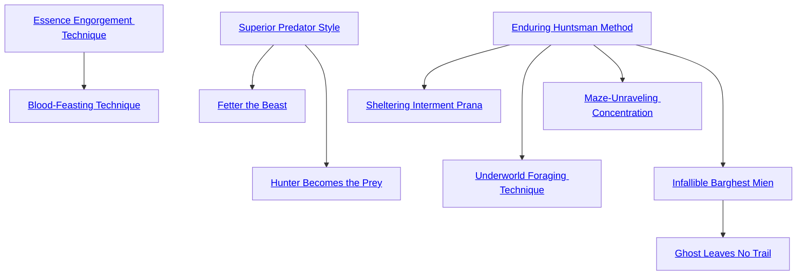

## Essence Engorgement Technique

Cost: None
Duration: Permanent
Type: Special
Minimum Survival: 1
Minimum Essence: 2
Prerequisite Charms: None
Lacking ready sources of Essence apart from cannibal-
ism, Abyssal Exalted must often conserve their power in
Creation. Deathknights with this Charm can offset this
weakness somewhat by bloating their animas with stolen
power. For each time this Charm is taken, the Abyssal adds
an additional 10 motes to his Peripheral Essence pool.
However, the Exalt can only fill this extra capacity by
consuming flesh or blood or by using Essence-draining
magic. The character cannot recharge this bonus pool
with Hearthstones, respiration or any other passive means.
Characters cannot take this Charm more times than their
permanent Essence rating.

## Blood-Feasting Technique

Cost: None
Duration: Permanent
Type: Special
Minimum Survival: 2
Minimum Essence: 2
Prerequisite Charms: [[#Essence Engorgement Technique]]

Once an Abyssal masters this Charm, he can subsist
entirely on a diet of human blood. The character must drink
a number of health levels per day equal to his permanent
Essence if he wishes to replace his body's need for regular
food. While subsisting on blood, characters suffer no dietary
deficiencies. Many deathknights who learn this Charm find
their palettes prefer the sweet taste of life to blander solid
food. Note that blood consumed specifically as sustenance
for this Charm does not provide Essence.

## Superior Predator Style

Cost: 10 motes
Duration: One day
Type: Simple
Minimum Survival: 1
Minimum Essence: 2
Prerequisite Charms: None

With this Charm, an Abyssal can intensify his aura of
menace to ward off animals. Herbivores and domesticated
beasts avoid the character completely and panic if directly
confronted. Most non-magical predators keep their distance,
fighting only as a last resort if cornered. This Charm
has less effect on magical beasts and super-predators such
as tyrant lizards and siaka. Such beings can overcome the
aversion with a successful Willpower roll, although they
still suffer a +1 difficulty to attack the Exalt.

## Fetter the Beast

Cost: 10 motes, 1 Willpower, 1 experience point
Duration: Instant
Type: Simple
Minimum Survival: 3
Minimum Essence: 2
Prerequisite Charms: [[#Superior Predator Style]]

By beating an animal into submission or otherwise
abusing it to establish dominance, an Abyssal with this
Charm can mystically chain a beast to her will. The
character gains one dot of the Familiar Background each
time she uses this Charm, although she can only have one
Familiar at a time. Thus, it would take three applications
of this Charm to enslave a wild omen dog and another two
to gain communication and sharing of senses. Although
dangerous animals make superior slaves, it takes consider-
ably more work to tame them. Beating an angry bear until
it cowers in obedience can be problematic at best, to say
nothing of subduing a full-grown tyrant lizard. Characters
should prepare for appropriately epic combat unless they
plan on raising such monsters from birth.

## Hunter Becomes the Prey

Cost: None
Duration: Permanent
Type: Special
Minimum Survival: 3
Minimum Essence: 2
Prerequisite Charms: [[#Superior Predator Style]]

While most deathknights can only absorb Essence
from the blood and flesh of other sentient beings, a few
have learned to draw power from lesser creatures. Once a
character purchases this Charm, he can devour animals to
regain Essence. Such prey must be consumed within minutes
of death and cannot be cooked or otherwise prepared.
Additionally, the animal must be a predator or scavenger.
If these conditions are met, the Exalt regains 1 mote for
every two health levels eaten. Otherwise, the meal affords
only physical sustenance.

## Enduring Huntsman Method

Cost: 5 motes
Duration: One day
Type: Simple
Minimum Survival: 3
Minimum Essence: 1
Prerequisite Charms: None

With this Charm, a character gains unnatural resilience
to hostile environments, regardless of attire or preparation.
She can withstand brutal extremes of temperature without ill
effect and need never fear hypothermia, frostbite, parasites,
sand blindness or any other hazard of the wilderness. This
resistance applies to virtually any condition a human body
could actually survive, however briefly. Thus, a character
could trudge naked through a blizzard without discomfort but
would not have an easier time breathing underwater or
surviving a raging bonfire. Ultimately, the limits of this
Charm are left to Storyteller discretion.

## Sheltering Interment Prana

Cost: 3 motes per hour, plus 1 Willpower
Duration: Until released
Type: Simple
Minimum Survival: 5
Minimum Essence: 3
Prerequisite Charms: [[#Enduring Huntsman Method]]

Pulling his arms and legs together like a corpse ready for
burial, an Abyssal with this Charm can mystically sink into
the earth. This process buries the character a full yard
underground, leaving no trace of excavation on the surface.
The character slips into a state of suspended animation for
the duration of the Charm and does not breathe, although
he still hungers normally. Sheltering Interment Prana lasts
one hour for every 3 motes spent, unless the torpid character
is injured or uncovered by digging. Once the Charm ends for
whatever reason, the character arises to the surface in a
shower of dirt and immediately regains consciousness. Characters
may regain Essence while interred (assuming they are
in a location that permits it), although motes used to power
the Charm remain committed during its duration.

## Underworld Foraging Technique

Cost: 5 motes
Duration: One hour
Type: Simple
Minimum Survival: 4
Minimum Essence: 2
Prerequisite Charms: [[#Enduring Huntsman Method]]

By definition, few environments are as inhospitable
and lifeless as the dim recesses of the Underworld. The
food of ghosts is a poor substitute for the fruits of Creation,
and the strange beasts that lurk in the realm of the dead
afford little in the way of palatable meat. With this Charm,
however, an Abyssal may readily consume spectral food
and derive full nourishment from her meal.

## Maze-Unraveling Concentration

Cost: 3 motes
Duration: Instant
Type: Simple
Minimum Survival: 4
Minimum Essence: 2
Prerequisite Charms: [[#Enduring Huntsman Method]]

With this Charm, an Abyssal can mentally unlock the
twisting paths of a labyrinth to find a desired course or
egress. The character may add his permanent Essence in
automatic successes to a single attempt to navigate a maze
or similarly convoluted network of passages. This Charm
also aids in navigating the Labyrinth beneath the Under-
world, although to a lesser degree. The Ebon Maze defies
sane comprehension, both for its size and alien geometry.
Characters can only unravel short stretches at a time, and
this Charm only applies to a single navigation roll.

## Infallible Barghest Mien

Cost: 1 mote per die, plus 1 Willpower
Duration: Until released
Type: Simple
Minimum Survival: 5
Minimum Essence: 2
Prerequisite Charms: [[#Enduring Huntsman Method]]

With this Charm, an Abyssal can pursue a quarry with
supernatural prowess and determination. The player can
add one die per mote to any roll to track a single target
individual. This target must be decided when the Charm
is invoked and cannot later be changed. Bonus dice gained
from this Charm apply to all tracking attempts until the
character finds his quarry or gives up his hunt, although
this Charm cannot more than double a character's dice
pool. Infallible Barghest Mien aids in tracking regardless of
environment; the character can stalk his quarry through
the twisting streets of a necropolis as readily as any wilder-
ness. Characters may only benefit from one application of
this Charm at a time. Characters using this Charm are
considered supernatural trackers.

## Ghost Leaves No Trail

Cost: 5+ motes, 1 Willpower
Duration: One day
Type: Simple
Minimum Survival: 5
Minimum Essence: 3
Prerequisite Charms: [[#Infallible Barghest Mien]]

For the duration of this Charm, the character passes as
unobtrusively as a phantom. She leaves no footprints or
scent or any sign of her passing that can be detected by
conventional means. The character can also extend this
protection to a maximum number of companions equal to
her permanent Essence rating at a cost of 5 motes each.
Only characters with supernatural tracking abilities can
hope to follow an Exalt shrouded by this Charm, and such
attempts are resolved through a normal tracking contest.
