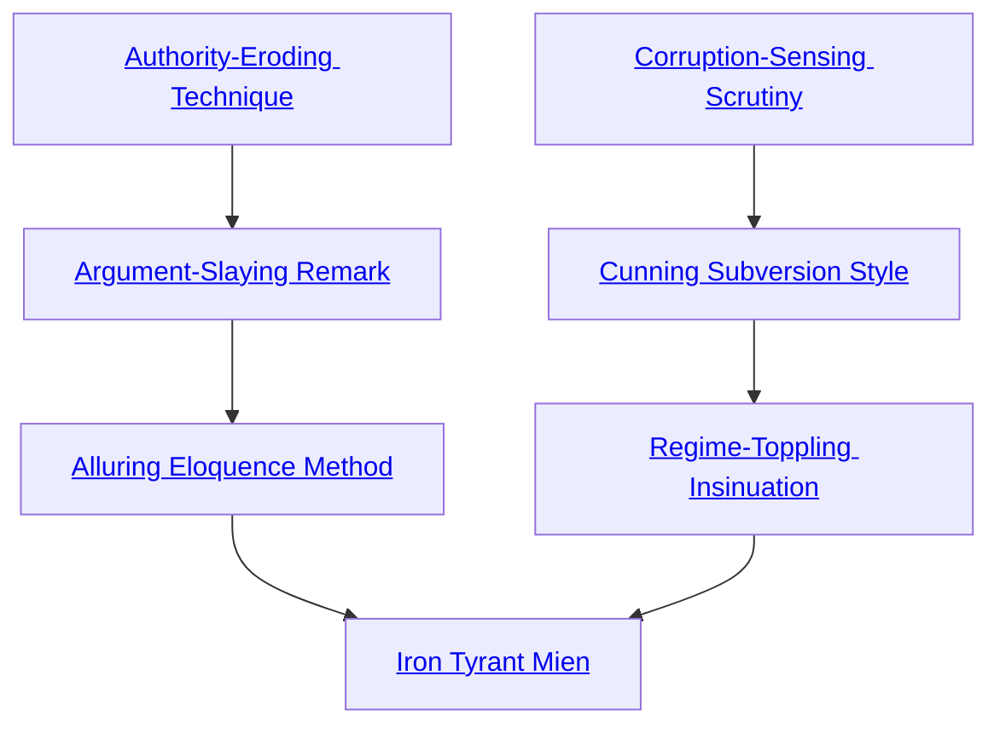

## Authority-Eroding Technique

Cost: 1 mote per die
Duration: Instant
Type: Reflexive
Minimum Bureaucracy: 1
Minimum Essence: 1
Prerequisite Charms: None

Through this Charm, an Abyssal can momentarily
confuse a target and weaken her effectiveness in a critical
moment. For every mote spent, the target loses one die
from a single Bureaucracy roll. This Charm cannot reduce
a victim's dice pool lower than her Essence, however.
Authority-Eroding Technique may be invoked any time
after an appropriate action is declared but before dice are
rolled. The Abyssal can even set up the targeted roll, such
as by asking a pointed question in a meeting.

## Argument-Slaying Remark

Cost: 3 motes
Duration: Instant
Type: Reflexive
Minimum Bureaucracy: 2
Minimum Essence: 2
Prerequisite Charms:Authority-Eroding Technique

By speaking brusquely and projecting an aura of
menace, an Abyssal with this Charm can cut through the
drawn-out process of debate. The targeted argument ends
within moments with the best resolution that the Exalt
could have achieved with continued discussion. For ex-
ample, a character could use this Charm to derive the best
price from a merchant, saving minutes or perhaps even
hours of haggling. Note that Argument-Slaying Remark
isn't a perfect “final word” Charm—if an answer would be
no regardless of what the Abyssal might say or argue, then
the answer remains no. This Charm simply brings the
matter to a conclusion instantly.

## Alluring Eloquence Method

Cost: 4 motes
Duration: Instant
Type: Supplementary
Minimum Bureaucracy: 4
Minimum Essence: 2
Prerequisite Charms: Argument-Slaying Remark

This Charm allows an Exalt to vocalize a course of
action or point of view with such eloquence and grace that
opponents find it difficult or even impossible to argue. The
Abyssal's player makes the Bureaucracy or Performance
roll as normal, but all rivals add the deathknight's Essence
rating to the difficulty of their counterarguments.

## Corruption-Sensing Scrutiny

Cost: 2 motes
Duration: Instant
Type: Simple
Minimum Bureaucracy: 2
Minimum Essence: 2
Prerequisite Charms: None

With this Charm, an Abyssal can perceive corrupt
officials and bureaucrats by a distinctive oily stain on their
aura. Alternately, she can intuitively gauge a “clean”
official's susceptibility to corruption. Her player rolls Perception
+ Bureaucracy against a difficulty of the target's
Essence score. The amount of information gleaned depends
on the number of successes rolled.
Simple success allows the Abyssal to sense whether
the target has ever engaged in corruption or not (i.e.,
accepted a bribe, doctored a report, etc.). With three
successes, the character can measure the depth of a target's
corruption or her overall vulnerability to such. Thus, she
can distinguish the minor blotches of a plagiarizing poet
from the inky coils of a politician who secretly assassinated
his rivals. With five successes, the Abyssal gains a vague
sense of the target's offenses, though not the context or
specifics. This hunch enables the deathknight to take
advantage of an official's hidden weakness or vice — or
simply to know whom best to bribe.

## Cunning Subversion Style

Cost: 10 motes, 1 Willpower
Duration: One week
Type: Simple
Minimum Bureaucracy: 5
Minimum Essence: 3
Prerequisite Charms: Corruption-Sensing Scrutiny
With a few artfully placed rumors and whispers, an
Abyssal with this Charm can sow the seeds of discord and
mistrust within a particular bureau or organization. Tem-
pers flare, growing mistrust leads to outright hostility and
factionalism; the bureau steadily grinds to a halt and
implodes under the weight of indolence and excess. This
Charm can fully affect a department whose total mem-
bership is no greater than (the deathknight's Essence
rating x 20). If the character wishes to affect a larger
organization, he must use this Charm multiple times or
settle for a slower, lesser effect as the magic strikes
randomly. Regardless, it takes time for infighting and
paranoia to build to an extent that it actually impedes
efficiency. While this is left to Storytellers to adjudicate,
the overall corruption and rivalry or lack thereof plays a
significant role, as does the quality and strength of
leadership within the organization. Generally, this Charm
is beyond the scope of rules and has little tangible effect.
Its intangible effects can be quite dramatic, however. Few
organizations of mortals can withstand more than a
month of this Charm without utterly disintegrating.

## Regime-Toppling Insinuation

Cost: 10 motes, 1 Willpower
Duration: One week
Type: Simple
Minimum Bureaucracy: 5
Minimum Essence: 3
Prerequisite Charms: Cunning Subversion Style

This Charm closely parallels Cunning Subversion
Style. Rather than targeting an organization, however, the
Abyssal may focus the havoc against a specific leader. Even
if there is no actual coup or assassination attempt —
though there might well be — the concomitant treachery
and distrust makes all but the most tyrannical despot
utterly ineffective. The victim's orders are twisted or
disregarded by subordinates, while overall morale drops to
an all-time low. Each application of this Charm may affect
a number of people equal to the character's Essence rating
x 20. As with Cunning Subversion Style, this Charm is
primarily a matter of roleplaying rather than rules. Still, it
is unlikely that any mortal leader can last more than a
month with a hierarchy that hates and mistrusts him.
Whether he is pushed out of office or stabbed to death in
an alley depends very much on the character and nature of
the victim's subordinates and the type of organization.
Ironically, true tyrants have little to fear from this Charm,
as they already know how to retain authority in the face of
negative popular opinion.

## Iron Tyrant Mien

Cost: 12 motes, 1 Willpower
Duration: One week
Type: Simple
Minimum Bureaucracy: 5
Minimum Essence: 4
Prerequisite Charms: Alluring Eloquence Method,
Regime-Toppling Insinuation
Exuding menace and prowess in equal measure, an
Abyssal can enchant his very authority to sow fear and
discourage rebellion. The character must have some
recognized leadership position in order to use this Charm,
although the type and scope of leadership doesn't mat-
ter. A caravan master can surpass a king in brutal
tyranny. While this Charm is active, no one with a
Willpower score lower than the character's Essence can
bring herself to consider disobedience, let alone partici-
pate in outright rebellion.
Individuals with a Willpower rating equal to the
character's Willpower may act against the despot, but their
players suffer a difficulty increase of the deathknight's
permanent Essence on all Social rolls to rally others to the
cause. Characters whose Willpower exceeds the Abyssal's
are immune to this Charm, as are all magical beings. Also,
this Charm only affects members of the hierarchy over
which the Exalt presides. A great monarch could order any
subject about but would have no authority over a foreign
citizen. Storyteller discretion is particularly important in
preventing abuse of this Charm. Of course, a large sphere
of influence carries its own risks. Besides the increased
likelihood that a strong-willed champion will organize a
coup, infamous dictators may attract jealous rivals who
wish to usurp their power.
