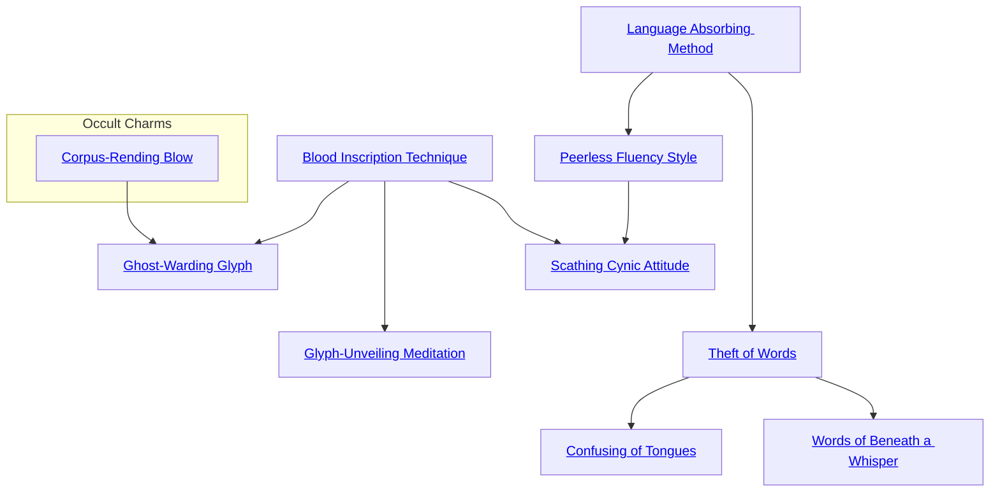

## Language Absorbing Method

Cost: 5 motes, 1 Willpower
Duration: One week
Type: Simple
Minimum Linguistics: 2
Minimum Essence: 2
Prerequisite Charms: None

With this Charm, an Abyssal may absorb a victim's
knowledge of language even as he devours her Essence.
The character must have consumed at least 1 mote from
the target sometime during the scene — whether through
blood drinking, Charms, etc. His player then rolls Wits +
Linguistics, with a difficulty of (5 - the total number of
motes taken). If this lowers the difficulty below one, no roll
is needed. If the roll succeeds, the Abyssal instantly learns
one language of his choice known to the target. This
knowledge is absolute — the deathknight speaks with
perfect fluency and no trace of accent and may read and
write in the tongue so long as the target knew how to do so.
If the character consumes more than 5 motes, he may also
spend double the requisite experience point cost to digest
the stolen knowledge and permanently increase his Linguistics
rating on the spot. Otherwise, languages absorbed
with this Charm fade completely when the Charm expires.

## Peerless Fluency Style

Cost: 1 mote per die
Duration: One scene
Type: Reflexive
Minimum Linguistics: 4
Minimum Essence: 2
Prerequisite Charms: [[#Language Absorbing Method]]

As the warrior-poets of the Underworld, many Abyssal
Exalted speak and write with haunting skill and
eloquence. For every mote spent on this Charm, the
character may add one die to all Linguistics rolls for a
specific known language. These dice are mechanically
identical to a Linguistics specialty (see Exalted, p. 140)
and may similarly add to other communication-related
rolls, at Storyteller discretion. The character cannot purchase
more bonus dice for any language than her
Intelligence score. Note that characters with four or more
dice of fluency convey superhuman grace, as is immediately
evident to any listener or reader. Indeed, slow-witted
mortals may have trouble following the cadence and
intricate vocabulary of such characters.

## Theft of Words

Cost: 2 motes + 4 motes per language
Duration: One hour
Type: Simple
Minimum Linguistics: 4
Minimum Essence: 2
Prerequisite Charms: [[#Language Absorbing Method]]

With this Charm, an Abyssal can temporarily excise
a victim's comprehension of a particular language. The
Exalt whispers softly in the maddening dialect of the
Malfeans and indicates a target within line of sight. His
player then rolls Manipulation + Linguistics against a
difficulty of the target's permanent Essence. For every
success rolled, the character may spend 5 motes to remove
a random language or pick a language known the Abyssal
and suppress it. The latter is a gamble, however, unless the
Exalt is certain his target knows the language in question.
Individuals deprived of all languages cannot speak or write
at all, although they may attempt to grunt and crudely
pantomime their intentions. Once the duration ends, the
target regains full memory of all her forgotten languages.
This Charm has no effect on beings with a higher permanent
Essence than the Exalt.

## Confusing of Tongues

Cost: 8 motes, 1 Willpower
Duration: One scene
Type: Simple
Minimum Linguistics: 5
Minimum Essence: 3
Prerequisite Charms: [[#Theft of Words]]

Cursing sharply in the lost tongue of the Malfeans,
the Abyssal distorts all communication in a zone around
her person. No one inside this area of effect can
understand written or spoken language. Familiar letters
run together into baffling glyphs, while every
spoken phrase twists into complete gibberish. Clever
characters may communicate simple concepts with
pantomime or crude drawings, but formal or established
hand signs convey no more meaning than any
spoken tongue. The character makes a Manipulation +
Linguistics roll against the targets, with a difficulty
equal to the targets' highest permanent Essence. This
Charm has no effect on characters whose permanent
Essence matches or exceeds the Abyssal's. However,
while such beings hear and see languages as they truly
are, their own words remain twisted to affected beings.
The zone of distortion extends to a radius of (the
character's permanent Essence x 3) yards.

## Words of Beneath a Whisper

Cost: 3 motes, 1 Willpower
Duration: Until released
Type: Simple
Minimum Linguistics: 5
Minimum Essence: 3
Prerequisite Charms: [[#Theft of Words]]

An Abyssal with this Charm may bypass language
entirely and communicate telepathically. The character
must be able to directly sense her target to invoke
this Charm. If at any time the Exalt cannot perceive
her target, the connection instantly breaks, and the
Charm ends. While the link remains, however, the
Abyssal can project her thoughts at will as a reflexive
action, enabling her to speak with someone she does
not share a language with. The target knows the
thoughts come from outside his mind, although he
cannot pinpoint their source without other magic
unless the Exalt identifies herself. Similarly, the target
may project his own thoughts and replies along the
link. As with vocalized speech, neither party projects
information they do not intend to convey — this
Charm does not allow deeper mind reading or memory
probing, nor does it preclude deception.

## Blood Inscription Technique

Cost: 4 motes
Duration: One scene
Type: Simple
Minimum Linguistics: 1
Minimum Essence: 1
Prerequisite Charms: None

By channeling Essence-laden blood through his fingertips,
an Exalt who knows this Charm always has a
means of writing. As the Abyssal traces glyphs with his
fingers, his touch leaves runes of indelible crimson.
Marks etched with this Charm are virtually indistinguishable
from ink stains and can be cleaned or removed
as such if the writing surface permits. It is far easier to
scrub stone than paper, after all. If used to mark living
beings, the glyphs resemble tattoos, but gradually fade
over a period or days or weeks like any applied dye.
Characters using this Charm write with uncanny precision,
easily matching the graceful calligraphy of even a
very fine stylus or brush.

## Ghost-Warding Glyph

Cost: 8 motes
Duration: One day
Type: Simple
Minimum Linguistics: 2
Minimum Occult: 4
Minimum Essence: 2
Prerequisite Charms: [[Abyssal Daybreak Occult#Corpus-Rending Blow|Corpus-Rending Blow]], [[#Blood Inscription Technique]]

By tracing a mystical blood rune on a target's forehead,
an Abyssal with this Charm may protect an individual from
hungry ghosts and walking dead. The mark cannot be
washed off and retains a slick appearance even after it dries.
For the duration of the Charm, no zombie or bestial ghost
will attack the target unless compelled to do so by a necro-
mancer, an Abyssal, a ghost using Arcanoi or some other
supernatural compulsion. Sentient ghosts generally leave
the character alone out of fear of the Deathlords but are not
compelled to do so. This Charm can enchant any human,
including Exalted, but any display of an anima banner or
Caste Mark burns away the rune and revokes the protection.
The Abyssal may use the Ghost-Warding Glyph on himself.

## Glyph-Unveiling Meditation

Cost: 5 motes, 1 Willpower
Duration: One reading
Type: Simple
Minimum Linguistics: 3
Minimum Essence: 2
Prerequisite Charms: [[#Blood Inscription Technique]]

By touching a sample of writing, an Abyssal with this
Charm can attune his mind to the lingering wisps of
memory left by the author. The Exalt can read the targeted
work with perfect fluency, but loses attunement and
comprehension as soon as he stops reading or reaches the
end of the document. Note that it is not necessary to read
in a linear manner: He may skim passages, jump ahead and
reread sections as many times as desired. However, once
the Abyssal halts to pursue another task, the Charm end.
Although an Exalt cannot quote specific passages or recall
exact wording after the Charm ends, he still remembers
what he read and what it meant.
This Charm does not work against artificial languages,
codes and other such methods of deliberately
obscuring the content of a work, as the author's intent is
devious and the traces left behind are opaque.

## Scathing Cynic Attitude

Cost: 6 motes, 1 Willpower
Duration: One scene
Type: Reflexive
Minimum Linguistics: 5
Minimum Essence: 2
Prerequisite Charms: [[#Peerless Fluency Style]], [[#Blood Inscription Technique]]

A character using this Charm becomes preternaturally
resistant to all forms of persuasion, from simple
argument to outright mind control. For the duration of
the Charm, the character's Nature changes to Critic.
Any time the deathknight is subjected to words or magic
that would alter his point of view or perceptions, his
player may reflexively roll Willpower against a difficulty
of the offending character's Essence. Success allows the
Abyssal to scornfully shrug off the suggestion. Characters
using this Charm are notably brusque and bitter, which
adds +1 to the difficulty of all Charisma rolls. Scathing
Cynic Attitude cannot defend against persuasion by
beings with a higher permanent Essence than the
character's Willpower.
