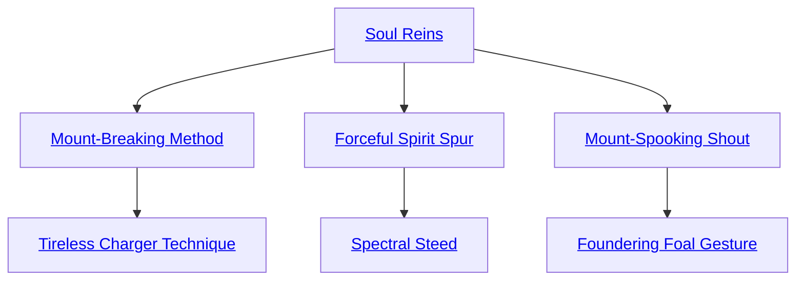

## Soul Reins

Cost: 1 mote per point
Duration: One scene
Type: Simple
Minimum Ride: 2
Minimum Essence: 1
Prerequisite Charms: None

A character with this Charm can subdue a mount
with his supernatural will. For every mote spent, the
targeted animal has its Control Rating reduced by one
point. If this reduces the steed's Control Rating to zero, it
obeys unhesitatingly and will jump to its death if so
directed. Mounts tamed with this Charm only obey the
Exalt. All other characters must contend with the beast's
normal Control Rating. Soul Reins only affects animals
trained for riding — characters cannot jump on the back
of a wild tyrant lizard and expect compliance.

## Mount-Breaking Method

Cost: 10 motes, 1 Willpower
Duration: One scene
Type: Simple
Minimum Ride: 4
Minimum Essence: 2
Prerequisite Charms: Soul Reins

Similar to Soul Reins, this Charm allows a deathknight
to dominate a steed and subsume its will to her own. Unlike
the lesser Charm, however, the effects of Mount-Breaking
Method are permanent. The character's player rolls Strength
+ Ride against a difficulty of the animal's Control Rating.
Each success permanently reduces the mount's Control
Rating by one point, to a minimum score of one. If the
Abyssal's player actually rolls enough successes to reduce a
Control Rating to zero, the beast gains immunity to terror
when ridden by the Exalt. Although the final outcome is a
foregone conclusion based on the results of the roll, the
character must still spend the rest of the scene aggressively
taming her steed. Unless this roll is botched, the Exalt will
not suffer injury during the training session. This Charm
actually weakens the spirit of the beast rather than simply
compelling obedience, so the mount's new Control Rating
applies to all riders. Mount-Breaking Method may affect any
animal that can possibly be trained to accept a rider, even
dangerous beasts such as hybroc and bear. The character
must have a permanent Essence of 3 or higher to train exotic
or deadly animals, however.

## Tireless Charger Technique

Cost: 6 motes, 1 Willpower
Duration: Varies
Type: Simple
Minimum Ride: 5
Minimum Essence: 2
Prerequisite Charms: Mount-Breaking Method

With this Charm, a mounted character can briefly
sustain and push his horse with raw Essence. Tireless
Charger Technique lasts until the Abyssal dismounts or a
number of hours have passed equal to the deathknight's
Ride score. Enchanted steeds have boundless energy and
never need to stop for food or water. However, the necrotic
Essence powering this Charm also eats at the animal's life
force. For every hour or fraction thereof that the Charm is
maintained, the horse suffers one level of unsoakable
lethal damage. This damage is deferred until the Charm
ends. After a horse suffers injury from this Charm, it
cannot be safely re-enchanted with this Charm until it
fully heals its wounds. Doing otherwise allows the horse to
act at full strength again, but immediately kills the mount
when the forced march ends.

## Forceful Spirit Spur

Cost: 3 motes
Duration: Instant
Type: Simple
Minimum Ride: 3
Minimum Essence: 2
Prerequisite Charms: Soul Reins

An Abyssal with this Charm can silently summon her
mount from great distances. The steed feels the bite of
phantom spurs digging harshly into its flanks unless it
moves at best possible speed toward the Exalt. This Charm
has a range of (the character's permanent Essence x 10)
miles. The Abyssal must have clearly exerted dominance
over the summoned animal at least once before it will
answer a summons. Such dominance can have been
achieved through physical (such as through beating or
rough use of actual spurs) or mystical (as in the case of Soul
Reins) means. While animals under the influence of this
Charm never get distracted or become lost, they cannot
circumvent complex obstacles any better than normal.
The compulsion and pain inflicted by this Charm remain
in force until the animal reaches its master or moves
beyond range.

## Spectral Steed

Cost: 10 motes, 1 Willpower
Duration: One day
Type: Simple
Minimum Ride: 5
Minimum Essence: 3
Prerequisite Charms: Forceful Spirit Spur

With this Charm, a character may summon a ghost
horse from the Essence of the Underworld. Materializing
out of dusky smoke, the beast has the appearance of a pure
black stallion with eyes like smoldering coals and sharp
teeth no horse alive should have. It has the same statistics
as a war horse of excellent quality (see Exalted, p. 316), but
it is utterly tireless, fearless and inflicts 4L with a successful
bite. Spectral steeds do not need food or drink, but enjoy
the taste of human flesh and blood. If a character uses this
Charm again before its duration expires, a new horse
appears, and the old one dissolves with a screaming whinny.

## Mount-Spooking Shout

Cost: 5 motes, 1 Willpower
Duration: Instant
Type: Simple
Minimum Ride: 4
Minimum Essence: 2
Prerequisite Charms: Soul Reins

The Abyssal pours Essence into his voice, unleashing
an unholy shriek that terrifies most steeds. All living
mounts within earshot of the character rear and bolt unless
the players of their riders or team drivers makes a successful
Charisma + Ride roll against a difficulty of the shouting
Abyssal's Essence. Even if this roll succeeds, affected
mounts remain skittish and add one to their Control
Rating for the rest of the scene. This increase is cumulative
if the Abyssal emits more than one such scream in a scene.
Mount-Spooking Shout does not terrify the Abyssal's own
steed, nor does the Charm have any effect on beasts other
than pack animals or actual mounts.

## Foundering Foal Gesture

Cost: 4 motes per animal, plus 1 Willpower
Duration: One scene
Type: Simple
Minimum Ride: 4
Minimum Essence: 3
Prerequisite Charms: Mount-Spooking Shout

Gesturing sharply at a mount in her line of sight, the
Abyssal curses her target with weakness and pain. The
steed cannot move any faster than a walk unless pushed for
short agonizing bursts by its rider. Foundering Foal Gesture
can affect multiple animals at a cost of 4 motes each. As
with Mount-Spooking Shout, this Charm only affects
pack animals and steeds, although magical beasts and
those strengthened with magic are also immune.
