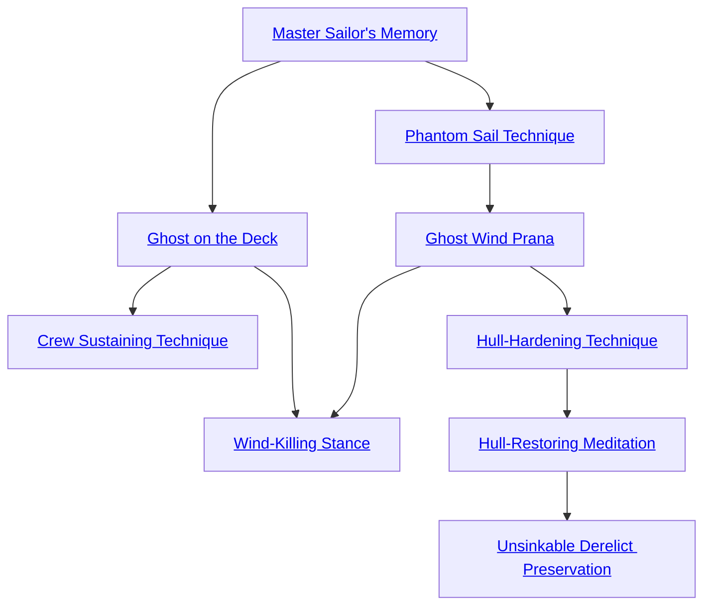

## Master Sailor's Memory

Cost: 1 mote per dot
Duration: One scene
Type: Reflexive
Minimum Sail: 2
Minimum Essence: 2
Prerequisite Charms: None

The character momentarily closes his eyes and dredges
memories from the drowned dead of the Underworld.
When he opens his eyes, he intuitively understands the
craft of sailing as though from decades of experience at sea.
The Exalt adds one dot to his Sail rating for every mote
spent, although this Charm cannot raise a character's Sail
above 5. In addition, Exalted using this Charm never
botch a roll to keep their balance in tumultuous seas,
although they can still fall normally.

## Ghost on the Deck

Cost: 3 motes
Duration: One day
Type: Reflexive
Minimum Sail: 3
Minimum Essence: 2
Prerequisite Charms: [[#Master Sailor's Memory]]

The character digs deeper into the memories of sailors
long dead, allowing the stolen expertise to guide his every
movement. While this Charm is in effect, the Exalt has
perfect balance and may effortlessly stride about the deck
or scurry up rigging without requiring a roll, even in the
middle of a howling typhoon or on impact with a submerged
reef. The rest of the crew may fly overboard from
the impact or lashing winds, but the Exalt stands eerily
unruffled. Characters using this Charm are also completely
immune to seasickness.

## Crew Sustaining Technique

Cost: Varies
Duration: One day
Type: Simple
Minimum Sail: 5
Minimum Essence: 3
Prerequisite Charms: [[#Ghost on the Deck]]

Channeling the Essence of the Underworld and his
own life force, the character may reduce a crew's need for
food and rest. The character must spend one point of
Willpower, plus 1 mote for every four crewmembers or
fraction thereof that he wishes to enchant. If there are rats
or other vermin aboard, their life energy is absorbed into
powering the Charm, reducing the cost to 1 mote per six
crewmen. This side effect steadily kills off all pests, including
the inevitable weevils in the ship's biscuits, which
most sailors regard as a bad omen. Unless a ship is very large
or very infested, it takes only two or three applications of
this Charm to completely eradicate all vermin aboard.
A sailor ensorcelled with Crew Sustaining Technique
needs only a quarter of the food, water and rest that she
normally does. She does not suffer from scurvy or other
dietary deficiencies from substandard rations and feels
unusually enervated. Long-term exposure is dangerous,
however. If this Charm is used on a character for more days
than her Stamina, each successive day reduces her Stamina
by one dot. Characters reduced to zero Stamina die. Lost
Stamina returns at the rate of one point per day. Only after
a character has fully recovered her Stamina can she be
safely enchanted again. This Charm has no effect on
Exalted or other magical beings and cannot be used except
to sustain the crew and passengers of a ship.

## Phantom Sail Technique

Cost: 6 motes
Duration: One day
Type: Reflexive
Minimum Sail: 3
Minimum Essence: 2
Prerequisite Charms: [[#Master Sailor's Memory]]

With this Charm, a character channels Essence to
patch the rips and tears of a damaged sail and rigging. The
character concentrates and raises his hand, summoning a
morass of shadows to spread over the targeted sail. For the
next 24 hours, the sail behaves as if undamaged and
provides appropriate propulsion. If a ship has multiple
sails, the Exalt may have to use this Charm more than
once. While Phantom Sail Technique can restore clinging
tatters to full function, it cannot create a sail from nothing.
At least some identifiable vestiges must remain.

## Ghost Wind Prana

Cost: 10 motes
Duration: One scene
Type: Simple
Minimum Sail: 5
Minimum Essence: 2
Prerequisite Charms: [[#Phantom Sail Technique]]

The Abyssal stands on deck, arms upraised and
crackling with Essence as she summons a cold wind from
the Underworld. This wind only exists to propel her
vessel and displaces all natural breezes for that purpose,
but otherwise, it does not disturb the water or the wind
for other ships (though they may hear its eerie howling).
Ships so enchanted move as though the wind were full in
their sails, regardless of the prevailing wind's direction or
the course set by the helmsman. The spectral wind has
the same intensity as the winds around it, however, so
ships sailing in a hurricane must still contend with the
dangers of such a gale.

## Wind-Killing Stance

Cost: 20 motes, 1 Willpower
Duration: One scene
Type: Simple
Minimum Sail: 5
Minimum Essence: 3
Prerequisite Charms: [[#Ghost on the Deck]], [[#Ghost Wind Prana]]

With this Charm, an Abyssal can extend a zone of
stillness from him, displacing even the fiercest gales
within its periphery. The Exalt stands on deck and
concentrates, tracing a horizontal arc with his arms. At
the conclusion of the gesture, a spherical wave of Essence
flashes out from the arc to a radius of (the character's
permanent Essence x 15) yards. This wave vanishes
almost immediately, but its magic kills all breezes inside
its boundary. This artificial stillness moves with the Exalt
and lasts for one scene or until its creator dies or moves
more than a yard from his original location on deck. The
character can still speak and gesture normally while
maintaining this Charm, however. Wind-Killing Stance
cannot stop magical breezes or breezes called by magical
beings unless their creator is substantially less powerful
than the Abyssal (Storyteller's discretion). This Charm
is primarily used to weather storms and to prevent enemy
sailing vessels from escaping.

## Hull-Hardening Technique

Cost: 1 mote per 1L of soak, plus 1 Willpower
Duration: One scene
Type: Reflexive
Minimum Sail: 5
Minimum Essence: 2
Prerequisite Charms: [[#Ghost Wind Prana]]

By laying hands against a ship and willing Essence to
flow through its timbers, an Abyssal with this Charm can
mystically reinforce her vessel. The ship gains 1L soak per
mote spent, although the deathknight cannot purchase
more points of soak than his Stamina + Sail. This limit
applies to all applications of the Charm in a scene. Hull-Hardening
Technique does not require Willpower if used
to strengthen a ship while another application the Charm
remains active. Hulls regularly treated with this Charm
look bleached and weathered before their time, although
they retain the durability of their true age.

## Hull-Restoring Meditation

Cost: Varies, plus 1 Willpower
Duration: Special
Type: Simple
Minimum Sail: 5
Minimum Essence: 3
Prerequisite Charms: [[#Hull-Hardening Technique]]

The Abyssal extends his anima in a myriad of tendrils
through the hull, caulking and patching breaches
and split seams with raw Essence. Within moments, this
energy calcifies into a durable material with the consistency
and appearance of bleached bone. Repairing combat
damage requires the Abyssal to spend motes equal to the
ship's damaged or destroyed rating, as appropriate to the
severity of damage. For non-combat repairs and general
caulking, the Storyteller should assign an Essence cost
based on the severity of damage and the ship's size.
Sealing a leaky warship requires considerably more Essence
than a river yacht.
While this Charm can stave off certain destruction by
sealing massive breaches, it does not remove handling
penalties for water trapped in the hull. Such penalties
remain until the water is pumped or bailed out normally.
This Charm requires something resembling an intact hull to
work. It cannot regenerate entire missing segments, let alone
restore a ruined hulk. Ships repeatedly treated with this
Charm look far more like floating skeletons of behemoths
than vessels fashioned by human hands. This Charm cannot
repair ships of First Age design. This Charm lasts for a
number of hours equal to the Abyssal's Essence in Creation,
but if the ship is in or enters a shadowland or the Underworld
while the hull is so patched, the patches will endure so long
as it does not leave that shadowland or the Underworld.

## Unsinkable Derelict Preservation

Cost: 10 motes, 2 Willpower
Duration: One day
Type: Simple
Minimum Sail: 5
Minimum Essence: 4
Prerequisite Charms: [[#Hull-Restoring Meditation]]

Although it is possible to strengthen and repair vessels
with lesser Charms, an Abyssal with Unsinkable
Derelict Preservation can enchant a ship to ignore damage
entirely. The Exalt channels Essence through the ship's
hull, temporarily sealing all breaks and gashes with translucent
wisps of relic from the Underworld. Ships ensorcelled
with this Charm act entirely as if whole, keeping out water
and moving with their normal maneuverability and speed.
Further damage is also similarly ignored for the Charm's
duration. Once the Charm's protection ends, severely
damaged vessels take on water and sink normally. This
Charm can even restore a rotting hulk to full operation, so
long as enough of the hull remains to identify the ship.
Vessels that have broken asunder cannot be enchanted, as
they lack the material foundation to accept relic grafts.
Ultimately, the Storyteller is the final arbiter of whether or
not a ship retains enough substance to preserve. This
Charm can affect First Age ships.
