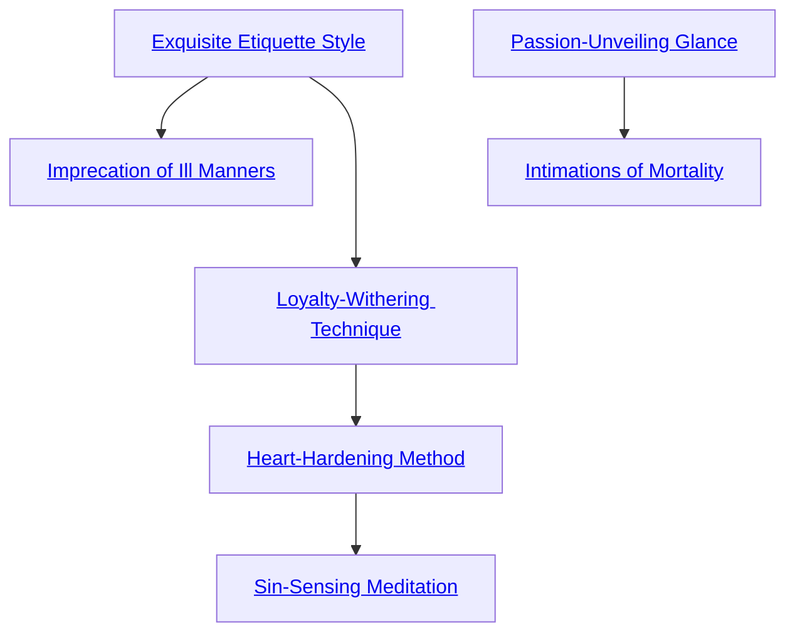

## Exquisite Etiquette Style

Cost: 3 motes
Duration: One scene
Type: Reflexive
Minimum Socialize: 2
Minimum Essence: 1
Prerequisite Charms: None

The Abyssal attunes his mind to the communal memo-
ries of the dead to act with due propriety and decorum.
Characters under the effects of this Charm become fault-
lessly — but not officiously — polite. They instinctively
know the appropriate greeting customs or table manners
for their situation and never run the risk of making an
unintentional faux pas. This Charm is of paramount im-
portance when dealing with ancient ghosts whose cultures
and customs have long since fallen to the passing of Ages.

## Imprecation of Ill Manners

Cost: 1 mote per 1 die
Duration: One turn
Type: Reflexive
Minimum Socialize: 3
Minimum Essence: 2
Prerequisite Charms: Exquisite Etiquette Style

The Abyssal concentrates on a victim in his line of
sight, silently projecting a surge of visceral anger into her
subconscious. For the rest of the turn, the target loses one
die from all Socialize dice pools for every mote spent. This
reduction manifests as poor manners, Freudian slips and
other, similar gaffes. It is impossible to determine that the
Charm's target is acting under the influence of a curse
without magical means, although astute observers (Perception
+ Awareness 4+) may suspect that something is
amiss (Perception + Presence, difficulty equal to the
Abyssal's Essence). Abyssal Exalted normally employ Imprecation
of Ill Manners to sabotage negotiations at a
critical juncture or to discredit rivals.

## Loyalty-Withering Technique

Cost: 3 motes
Duration: Varies
Type: Simple
Minimum Socialize: 3
Minimum Essence: 2
Prerequisite Charms: Exquisite Etiquette Style

Caressing a victim's mind with the corrupting taint of
the Void, an Abyssal with this Charm can plant seeds of
doubt in the faithful and erode trust in favor of treachery.
The character need only spend a few minutes talking with
her target; her player then rolls Manipulation + Socialize
against a difficulty chosen by the Storyteller. This difficulty
reflects the overall devotion of the target to the
selected individual or cause. If she rolls enough successes,
the target becomes suspicious and hostile toward whomever
or whatever the Abyssal desires. This treacherous
dislike lasts a number of hours equal to the deathknight's
permanent Essence. If the Exalt receives more successes
than necessary, this duration is measured in days rather
than hours. This Charm has no effect on beings with a
higher Essence rating than the Abyssal.

## Heart-Hardening Method

Cost: 6 motes
Duration: Instant
Type: Simple
Minimum Socialize: 4
Minimum Essence: 2
Prerequisite Charms: Loyalty Withering Technique

By infecting a target's very soul with festering Essence,
the Abyssal can scour a heart of honor and righteousness.
The Exalt must spend several minutes talking to the target,
casting doubt on the importance of a particular Virtue. Her
player then rolls Manipulation + Socialize, with a difficulty
equal to the targeted Virtue. The victim temporarily
loses one dot of the appropriate Virtue for every success in
excess of its rating. If the number of successes exceeds the
target's Willpower score, the target also loses a permanent
dot of the Virtue. Whether temporary or permanent, this
Charm cannot reduce a Virtue below a rating of one.
Virtues that are temporarily diminished return at the rate
of one dot per hour. The Abyssal can even use this Charm
on herself, with appropriate successes detracting from the
targeted Virtue as normal. While this rationalization process
has its uses — particularly in situations when scruples
are a liability — the Abyssal risks permanent Virtue loss if
she rationalizes too well.
Although a victim ensorcelled by this Charm retains
his Nature, his behavior reflects his new Virtue rating. A
Thrillseeker deprived of his once-considerable Valor will
be torn by desires and a curiosity he can no longer bring
himself to express. Likewise, a Survivor dropped to Compassion
1 will do practically anything to anyone in order to
preserve his existence.

## Sin-Sensing Meditation

Cost: 10 motes, 1 Willpower
Duration: Instant
Type: Simple
Minimum Socialize: 5
Minimum Essence: 2
Prerequisite Charms: Heart-Hardening Method

As cynical as they are pragmatic, characters with this
Charm recognize that everyone can be bought. Their price
might not be in jade or jewels — perhaps in a guiltier
pleasure, a secret vice instead — but regardless, there is
always something a person cannot resist or refuse. To have
the object of her desire, an individual will betray her
closest friends or worse. Upon activating this Charm, an
Abyssal knows precisely what that object is for his target.
He may not have the means of satisfying the desire in
question, particularly if it is nigh impossible to acquire, but
at least, he knows. The Storyteller should decide the
nature of a target's weakness, keeping in mind her Nature
and Temperance score. Low Temperance characters are
less disciplined and, thus, have easier wants to satisfy. High
Temperance characters are invariably more difficult and
complicated to satiate. It is always possible that some
beatific saint exists on whom this Charm would have no
effect, but no deathknight has ever met such a person in
the decadent Age of Sorrows.

## Passion-Unveiling Glance

Cost: 3 motes
Duration: Instant
Type: Simple
Minimum Socialize: 3
Minimum Essence: 2
Prerequisite Charms: None

With this Charm, an Abyssal perceives the flickering
aura of emotion and passion overlaying her target. The
Abyssal's player rolls Perception + Socialize. This roll is
made at standard difficulty if the target is not trying to
conceal or misrepresent his feelings. Otherwise, the target's
player reflexively rolls Manipulation + Performance to
resist. The amount of information the Abyssal gleans
depends on the number of successes rolled beyond any the
target may have garnered. Simple success reveals the
target's most dominant surface emotion. With three successes,
the Abyssal can sense all of a target's surface feelings
and gauge their rough proportion to one another (i.e.,
strong admiration with a touch of jealousy). Five or more
successes allow the Abyssal to sense all emotions her target
currently feels, as well is giving her a rough sense of the
target's permanent Willpower and Virtue allocation (weak,
unremarkable, strong, overpowering, etc.). Regardless of
the successes rolled, this Charm does not provide context.
Even if a deathknight notices coiling tendrils of hatred in
a target's aura, she doesn't automatically know who he
hates or why he hates them.

## Intimations of Mortality

Cost: 5 motes
Duration: One day
Type: Simple
Minimum Socialize: 3
Minimum Essence: 2
Prerequisite Charms: Passion-Unveiling Glance

Some Abyssal Exalted are particularly adept at seed-
ing the minds of mortals with such doubts about the true
nature of life and death that they come to be obsessed with
their own mortality. A deathknight must speak with a
target at least briefly (the exchange need be only a few
sentences), and the Abyssal's player then makes a Manipulation
+ Socialize roll with a difficulty of the target's
permanent Essence. If successful, the target becomes depressed
and withdrawn, suffering a +2 difficulty to all
Social rolls for the next 24 hours. If this Charm is used
continuously on an unExalted target for more days than
her Conviction rating, her depression blossoms into an
actual derangement. Targets thus afflicted continue to
suffer Social penalties even after the Charm wears off.
