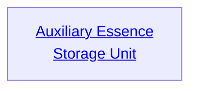

## Auxiliary Essence Storage Unit

Cost: None
Installation Cost: 2 motes
Duration: Permanent
Type: Special
Minimum Manipulation: 1
Minimum Essence: 2
Prerequisite Charms: None

This Charm installs extra Essence reservoirs on an
Alchemical, allowing him to use more power at the cost of
subtlety. For each time this Charm is taken, the Alchemical
gains an additional 10 points of Peripheral Essence.
The Exalted cannot take this Charm more times than he
has points of permanent Essence or more times than he can
afford to pay the Personal Essence for.
