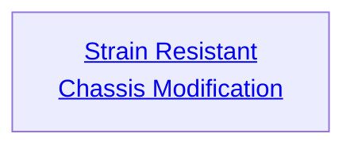

## Strain Resistant Chassis Modification

Cost: None
Installation Cost: 1 mote
Duration: Permanent
Type: Special
Minimum Stamina: 1
Minimum Essence: Varies
Prerequisite Charms: None

Through the implantation of armored plates, reinforcing
struts and redundant parts, the Alchemical is made more
resistant to damage. When the Exalt takes this Charm, he
may choose to permanently gain either two - 1 health levels
or three -2 health levels. The choice can be made each time
the Charm is taken and cannot be changed without reinstallation
of the Charm. The Alchemical may take this Charm
as many times as he has points of permanent Essence.
This Charm is the Alchemical equivalent of Ox-Body
Technique. If members of the Eclipse Caste take it, it counts
against their Endurance as if they had taken Ox-Body
Technique. The Strain Resistant Chassis Modification is
obvious when applied to an Exalt — his joints and vitals are
clearly armored, and his frame is square and powerful.
