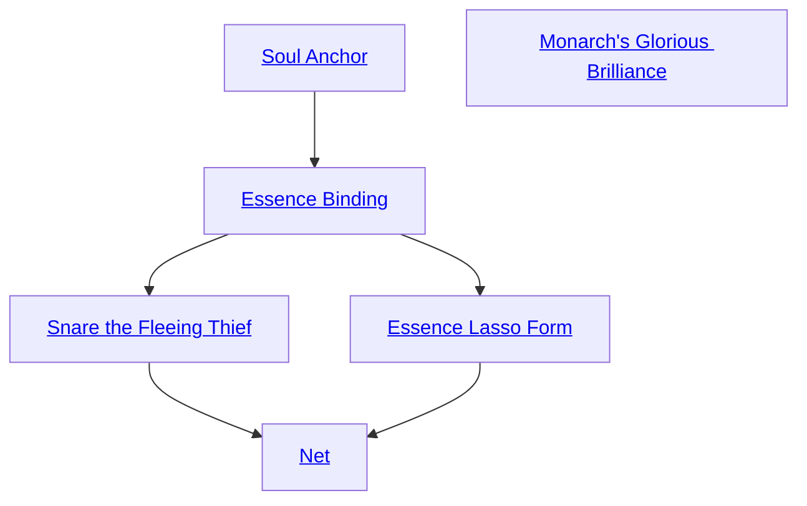

## Soul Anchor

Cost: 2 motes, 1 Willpower
Duration: 10 minutes per success
Type: Simple
Minimum Temperance: 2
Minimum Essence: 1
Prerequisite Charms: None

Minions of various dead monarchs use this Arcanos
to keep criminals and battlefield foes from escaping
justice. When Soul Anchor is active, no one within 25
yards of the ghost using it is able to use supernatural
abilities to move faster than they could at a full sprint.
This prohibition even extends to the ghost using Soul
Anchor! The ghost may be able to fly or run up walls,
and he is still able to do that, but he cannot move faster
than he could at an ordinary run. Ghosts and other
entities with an Essence higher than that of the ghost
using Soul Anchor may spend a Willpower point to
overcome the effect of this Arcanos.

## Monarch's Glorious Brilliance

Cost: 3 motes
Duration: One turn
Type: Simple
Minimum Conviction: 2
Minimum Essence: 2
Prerequisite Charms: None

The ghost using Monarch's Glorious Brilliance
channels some of the splendor of his undead liege lord
(whether a Deathlord or another monarch) into a coruscating
white aura. This brilliance makes the ghost
visible from quite a long way off — the light can be seen
from a mile away on an ordinary day in the Underworld
and from the horizon at night. Entities within 20 yards
who happen to be looking in the ghost's direction at the
time this Arcanos is activated are temporarily blinded,
and their players must make a Wits + Resistance roll for
the characters to look away as quickly as possible.
Targets are blinded for three turns, minus one for every
success on that Wits + Resistance roll. Those targets
that are not blinded by the brilliance must still look
away from the glorious light or be blinded, so they are
considered to be blind with respect to the ghost using
this Arcanos. Foes immune to blindness and those
wearing heavy whole-face helmets are immune to this
Charm. The effects of blindness are described in Exalted,
pages 237-238 — a blind character loses two
successes from all attack rolls.

## Essence Binding

Cost: 5 motes
Duration: One turn per success
Type: Simple
Minimum Conviction: 2
Minimum Essence: 2
Prerequisite Charms: Soul Anchor

Essence Binding calls up bands of Essence representing
the ghost's authority in the name of his ruler(s). He
then uses those bands to temporarily restrain his foe's
hands or feet. This Arcanos works only on corporeal foes
(ghosts in the Underworld, mortals anywhere). The
ghost-magistrate spends his Essence, and his player then
rolls Dexterity + Bureaucracy at + 2 accuracy to extend
his sovereign's influence. The ghost must determine
whether he plans to bind the target's hands or feet. The
attack works only within hand-to-hand combat range,
and the target may dodge or block this attack if he is able
to do so. If the Essence Binding succeeds, the target's
hands or feet are bound. If the target's hands are bound to
his body, he may use no weapon that requires two hands,
and he is considered to be held as the victim of a hold
attack. If the target's feet are bound, he is restricted to
using unusual modes of locomotion (walking on his
hands, swinging by a rope, flying) or to hopping no more
than one-fifth his normal movement per turn. This
binding lasts for one turn for every success achieved on
the Dexterity + Bureaucracy roll, above. The bonds can
be broken by main strength. A total of four successes is
required on a Strength + Athletics roll to break them
(and this is a simple action).

## Snare the Fleeing Thief

Cost: 5 motes
Duration: One turn per success
Type: Simple
Minimum Conviction: 3
Minimum Essence: 2
Prerequisite Charms: Essence Binding

A ghost with Snare the Fleeing Thief can use his
Essence and his dedication to his liege to halt an enemy in
her tracks for a short period of time. This Charm doesn't
merely create binding ropes of Essence. Instead, it encases
the enemy's body in a light somewhat reminiscent of
Monarch's Glorious Brilliance. The enemy can still move
around while encased in this brilliance but at a greatly
reduced speed — no more than one-fifth her normal
movement per turn, no matter what form of locomotion is
being used. Snare the Fleeing Thief requires a hand-to-hand
attack using a Dexterity + Bureaucracy roll at +4
accuracy. This attack can be dodged or blocked as normal.
If the ghost bypasses such defenses, the target is bound as
described above for one minute per success.

## Essence Lasso Form

Cost: 6 motes
Duration: One turn per net success
Type: Simple
Minimum Conviction: 3
Minimum Essence: 2
Prerequisite Charms: Essence Binding

This Charm works similarly to Essence Binding, save
that it works at a range of up to 10 yards per point of
Conviction and that it cannot be blocked, only dodged.
The ghost calls up a binding in the name of his sovereign,
points at the target and spends his Essence, and his player
rolls Dexterity + Bureaucracy at +2 accuracy. This attack
cannot be parried, as it bypasses such defenses. The
target's hands or feet are bound for one turn per success.
If the target's hands are bound to his body, he may use no
weapon that requires two hands, nor may he swing his
arms around to make effective Melee or Brawl attacks
against any foe that isn't right up against him. If the
target's feet are bound, he is restricted to using unusual
modes of locomotion (walking on his hands, swinging by
a rope, flying) or to hopping no more than one-fifth his
normal movement per turn.

## Net

Cost: 7 motes
Duration: 1 minute
Type: Simple
Minimum Conviction: 3
Minimum Essence: 3
Prerequisite Charms: Snare the Fleeing Thief, Essence Lasso Form

Net allows a ghostly magistrate to ensnare a group of
enemies, binding them hand-and-foot in the name of his
lord. The ghost spends his Essence and designates a target
location no more than five yards away per dot of Conviction.
Everyone within five yards of that location is
ensnared in a binding net of Essence, unless they successfully
leap to safety — the ghost uses Dexterity +
Bureaucracy to target the net, and targets must successfully
dodge (not block) it to get out of the area of effect
in time. Those caught in the net are considered to be held
(see Exalted, p. 240) until the effect ends or they expend
a point of Willpower to free themselves from the Arcanos.
