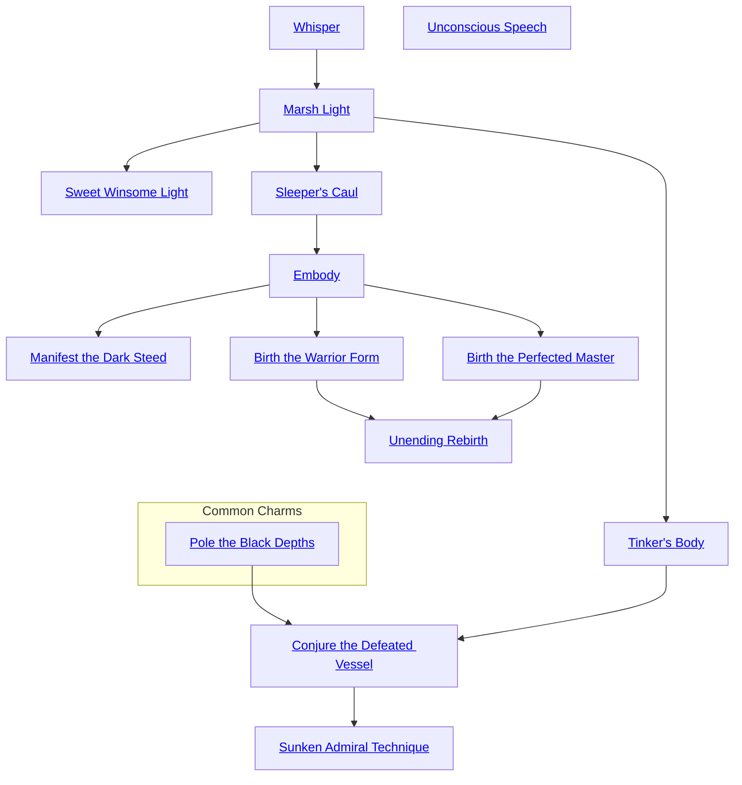

## Whisper

Cost: 1 mote
Duration: One scene
Type: Simple
Minimum Valor: 1
Minimum Essence: 1
Prerequisite Charms: None

This Charm allows a ghost's whispered voice to be
heard in the portion of the living world that corresponds
to his location in the Underworld. The ghost must literally
whisper as he uses this ability — if he speaks at normal
volume, those near him in the lands of the dead hear him
normally, but those in the living world do not. The ghost's
whispers can be heard clearly within one yard of his
location. A successful Perception + Awareness roll must
be made for those within 10 yards to hear the whispers, and
an additional success must be achieved for every 10 yards
distance for anyone further away.

## Marsh Light

Cost: 1 mote
Duration: One scene
Type: Simple
Minimum Valor: 1
Minimum Essence: 1
Prerequisite Charms: [[#Whisper]]

Marsh Light allows a ghost to create a light or a small
group of lights in the living world in the spot correspond-
ing to her current location in the Underworld. The light
or lights must form simple shapes and can only move with
the ghost.
The lights often pique the curiosity of the living.
Players of living creatures who see the lights and aren't
actively engaged in something they consider to be important
(combat, critical craftwork, healing a friend, etc.)
must make a successful Conviction roll for their characters,
or they spend a turn considering the lights. Living
creatures or spirits with an Essence higher than the ghost's
are immune to this effect.

## Sweet Winsome Light

Cost: 4 motes
Duration: One minute per success
Type: Simple
Minimum Valor: 2
Minimum Essence: 2
Prerequisite Charms: [[#Marsh Light]]

Sweet Winsome Light creates a beautiful bobbing
light that attracts all who see it. Ghosts use this Arcanos
to lure their prey — or their enemies — to their doom. The
light dances in the wind, eternally just five or ten yards out
of reach, and it appears to be a traveler's torch or a glowing
talisman. The Sweet Winsome Light can be created within
20 yards of the ghost's current location or (for an additional
mote of Essence) at the spot in Creation
corresponding to the ghost's current location in the Underworld.
To create the light, the ghost's player rolls
Charisma + Occult, and it lasts for one minute per success.
The light attracts all who see it. Animals that notice
it automatically move toward it (though they don't charge
with all their will — their handlers or riders may resist the
Arcanos with standard Ride feats if they can keep their
own heads about them). Living beings (even Exalted)
resist the Sweet Winsome Light with a Conviction roll.
For each turn that the light is visible, the target's player
must get at least one success on the Conviction roll, or the
target moves toward it at his best possible speed. A spent
point of Willpower negates the effect of the Sweet Winsome
Light for a full minute.

## Tinker's Body

Cost: 4 motes
Duration: One scene
Type: Simple
Minimum Valor: 2
Minimum Essence: 2
Prerequisite Charms: [[#Marsh Light]]

A ghost using Tinker's Body can assemble a patch-
work body for himself in the living world out of nearby
scraps, trash and trinkets. The ghost remains intangible
but is able to motivate the collection of objects and feel
through the Tinker's Body as though it was his own flesh
and blood — at least to some extent. The ghost cannot
speak through the Tinker's Body, though he can clap,
stomp and make similar gross-motor sorts of sounds. The
ghost loses two dice from all Social dice pools while
“wearing” the Tinker's Body — a penalty that may be
reduced if the ghost's player succeeds in an appropriate
Craft roll for his character to fabricate a suitably expressive
face. The ghost's Mental Attributes are unchanged in the
Tinker's Body, while his Physical Attributes depend on
the composition of the body.
The Tinker's Body gets one dot in each of the three
Physical Attributes, and the ghost gets an additional four
dots to be split between the Physical Attributes based on the
objects out of which he constructs the Tinker's Body — a
Tinker's Body made of twine and straw may have a Dexterity
of ••••• and Strength and Stamina of • each, while one
made of loose brick and stone may have a Dexterity of • and
Strength and Stamina of ••• each. The Tinker's Body is
only a shell; it has four health levels (-0/-1/-2/-4). Wound
penalties represent bits of the body being knocked off or
otherwise destroyed, rather than pain and shock.

## Sleeper's Caul

Cost: 3 motes
Duration: One scene
Type: Simple
Minimum Valor: 2
Minimum Essence: 2
Prerequisite Charms: [[#Marsh Light]]

Sleeper's Caul enables a ghost to make a static solid
body in the land of the living. This body is not truly the
ghost's own body; it is a shell, and even if it is destroyed, the
ghost remains unharmed. The Sleeper's Caul has a Strength
and Dexterity of 0; it cannot move. Its Stamina is equal to
the ghost's Stamina. The Sleeper's Caul can hear, speak
and see (even blink and move its eyes). The ghost has a
sense of touch, even if it cannot move, so it does feel pain.
The Sleeper's Caul has three health levels (no wound
penalties apply, since the body can never perform actions).

## Embody

Cost: 5 motes
Duration: One scene
Type: Simple
Minimum Valor: 2
Minimum Essence: 3
Prerequisite Charms: [[#Sleeper's Caul]]

Embody allows a ghost who is disembodied in the
material world to create himself a temporary body out of
Essence. This body takes the ghost's likeness (which may
not be exactly the same as his appearance in life!). The
meat-body that the ghost pulls together with Embody is
not a fully functional body by comparison to the ghost's
normal abilities in the Underworld, a shadowland or
during Calibration. The ghost has its normal Intelligence,
Wits and Social Attributes while in this temporary body,
but as an improvised bag of flesh, its other Attributes are
all reduced by two dots (to minimum of •). The meat-body
has four health levels (-0/-1/-2/-4), and the ghost really
does feel the pain of any wounds it takes — and it is
obviously not well suited for combat.

## Manifest the Dark Steed

Cost: 3 motes
Duration: One scene
Type: Simple
Minimum Conviction: 2
Minimum Essence: 2
Prerequisite Charms: [[#Embody]]

This Arcanos allows a ghost to bring a single ghost
animal into a manifest form when he manifests. He must
be touching the animal to do so. The animal retains all of
its Attributes, Abilities, soak and health levels. Other
animals of its species will recognize it to be strange and shy
away from it. The ghost animal returns to incorporeal
ghost form at the end of the scene — or sooner than that,
if the ghost using this Arcanos ends his manifestation
before the end of the scene.

## Birth the Warrior Form

Cost: 20 motes, 1 Willpower
Duration: Five minutes per success
Type: Simple
Minimum Valor: 4
Minimum Essence: 3
Prerequisite Charms: [[#Embody]]

Birth the Warrior Form allows the ghost to use his
Essence and Willpower to create a body that is prepared for
combat — the ghost also creates temporary armor and
weapons that manifest in the living world. The player
should roll Valor + Occult to create the body, and for each
success, the Warrior Form lasts for five minutes. This body
takes the ghost's likeness and has his full Attributes. The
Warrior Form also has the ghost's full health levels. Additionally,
the ghost may fabricate any single nonmagical
weapon and single nonmagical set of armor, each of whose
Resources cost is less than or equal to his Essence. For
instance, if the ghost's Essence is 3, he may create a great
sword and a chain hauberk, but not plate-and-chain. The
ghost may dissolve the Warrior Form at any time before the
end of the Charm's rolled duration, in which case, the
Warrior Form is considered to have ended. When the
Charm ends, the armor and weapon created by it dissolve
along with the Warrior Form.

## Birth the Perfected Master

Cost: 20 motes, 1 Willpower
Duration: Five minutes per success
Type: Simple
Minimum Valor: 2
Minimum Essence: 3
Prerequisite Charms: [[#Embody]]

Ghosts exist outside of the formal strictures of Creation.
The body that a ghost creates for himself does not
have to match the characteristics of his dead flesh, if he
knows Birth the Perfected Master. Birth the Perfected
Master creates a meat-body like Embody, except that it has
the ghost's full Ability scores. The flesh that Birth the
Perfected Master creates reflects the ghost's idealized self-image.
The ghost may split six dots among the following
Attributes: Strength, Dexterity, Stamina and Appearance.
This body is created stark naked, and it lasts for five
minutes for each success that the player achieves on a
Valor + Occult roll.

## Unending Rebirth

Cost: 8 motes, 1 Willpower
Duration: One turn per success
Type: Simple
Minimum Valor: 4
Minimum Essence: 4
Prerequisite Charms: [[#Birth the Warrior Form]], [[#Birth the Perfected Master]]

The ghost experiences his first birth in Creation, and
his second birth comes when he enters the Underworld as
one of the Restless Dead. This Arcanos allows the ghost to
flicker back and forth between living and ghostly forms.
Use of this Charm does not permit a ghost to take on a flesh
form — in order to do that, he must use Materialize,
Weighted With the Anchor of Flesh (see Exalted: The
Abyssals) or one of the other Arcanoi in this tree. However,
once manifest in a physical form, Unending Rebirth
allows him to switch from immaterial to physical and back.
The ghost can only activate this Charm once he is manifested,
and it requires a Wits + Occult roll. If that roll
succeeds, he may change back and forth from manifest to
immaterial as he wishes until the duration of Unending
Rebirth (or his manifestation Charm) expires. Each switch
from flesh to ghost or back requires 1 mote of Essence and
is a simple action. A “switch” of this nature does not
terminate a manifestation Arcanos.
For Example: The long-dead Master Cotep, manifest
to visit his namesake in a village in the South, finds himself
surrounded by angry villagers. He is already manifest in
Creation. Cotep spends 8 motes and 1 Willpower (and his
player rolls Wits + Occult) to activate Unending Rebirth,
and he becomes immaterial. He runs through the wall of
his namesake's hut and past his foes. The next turn, he
spends another mote to rematerialize and fight on his own
terms. A few turns later, things are going badly, so he
spends another mote to dematerialize and run for safety.

## Conjure the Defeated Vessel

Cost: 5 motes
Duration: One hour per success
Type: Simple
Minimum Conviction: 3
Minimum Essence: 3
Prerequisite Charms: [[Arcanoi Common#Pole the Black Depths|Pole the Black Depths]], [[#Tinker's Body]]

Conjure the Defeated Vessel allows a ghost to bring a
single ship, regardless of size, from the Underworld into
Creation. Ordinarily, a ship crossing into Creation from a
shadowland becomes intangible, just as ghosts do. Conjure
the Defeated Vessel is used once the ship has entered the
physical realm, and it makes the boat fully physical. The
ghost's player must roll Intelligence + Sail, and the boat
remains fully physical for one hour per success. The ghost
may spend additional Essence and his player reroll the
Charm's duration at any time — the duration of Conjure
the Defeated Vessel is measured from that point onward
and uses the new roll (in other words, if the Arcanos still
has three hours duration left to it and the ghost spends 5
motes of Essence and his player rerolls, getting four successes,
the boat will stay physical for another four hours,
not seven). Essence spent activating this Charm is committed
until the effect's duration expires, so ghosts will be
drained of Essence if they attempt to maintain it overlong.
The ship's Traits are all just as they would be in the
Underworld (in other words, the same as any other boat of
the same type and materials in Creation). It is considered
to be intact (despite any appearances to the contrary) and
has all its health levels (unless it suffers from unrepaired
damage from the Underworld, in which case, it retains that
damage). Once so manifested, the boat remains physical
until its pilot or the ghost using this Arcanos becomes
incorporeal again. The boat is blasted to ash and dust by
direct sunlight (though if it stays in caves, travels only
when it's overcast or is shrouded by fog, it can survive until
the Charm's duration expires).

## Sunken Admiral Technique

Cost: 8 motes per boat, 2 Willpower
Duration: One hour per success
Type: Simple
Minimum Conviction: 4
Minimum Essence: 4
Prerequisite Charms: [[#Conjure the Defeated Vessel]]

While Conjure the Defeated Vessel enables a boat's
pilot to make that single vessel manifest in Creation,
Sunken Admiral Technique lets a lone ghost pull every
boat within sight into Creation — within the limitations
of his Essence. The ghost's player rolls Manipulation +
Sail, and the ghost spends his Essence. For every success,
the fleet can remain in Creation for one hour. As with
Conjure the Defeated Vessel, each boat retains its full
Traits in Creation. Its weapons work normally, and its hull
is considered to be whole even if it has massive ancient
rents in its side.

## Unconscious Speech

Cost: 1 mote
Duration: One turn
Type: Simple
Minimum Conviction: 2
Minimum Essence: 1
Prerequisite Charms: None

This simple art allows an incorporeal ghost in the
material world to sneak words out through the mouth of a
living person. The ghost must “touch” the target and spends
a mote of Essence, and his player rolls the ghost's Dexterity +
Expression. If he succeeds, the target involuntarily says what
the ghost intended him to say — one word for every success
achieved. The target does not immediately realize that she is
speaking at all, but she can figure it out by her player
succeeding at an Intelligence + Occult roll after someone
around the character points out that she said words she
doesn't remember speaking. A conscious target who is aware
that a ghost is manipulating her can resist such manipulation
for the scene by spending a Willpower. If the target wishes to
allow the ghost to speak through her, the ghost must spend 1
mote of Essence per sentence but no roll needs to be made.
