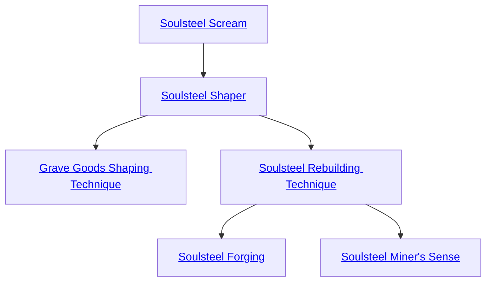

## Soulsteel Scream

Cost: 1 mote
Duration: Instant
Type: Simple
Minimum Compassion: 1
Minimum Essence: 1
Prerequisite Charms: None

The ghost with this Arcanos needs only for her player
to successfully roll Perception + Craft to gain insight about
the origins of a piece of soulsteel or a soulsteel artifact. For
every success, the ghost can ask one simple, straightforward
question about the physical details of previous handlers
of an item or events for which the object was present or
used. These events can predate the item's destruction in
Creation, if the object is in fact an echo of Creation.

## Soulsteel Shaper

Cost: 1 mote
Duration: One day
Type: Simple
Minimum Conviction: 2
Minimum Essence: 2
Prerequisite Charms: [[#Soulsteel Scream]]

Soulsteel Shaper allows a ghostly artisan to aid in the
creation of soulsteel items. With Soulsteel Shaper, a ghost
can serve as a “trained thaumaturge” for the purposes of
assisting an Exalt or other master craftsman in creating a
soulsteel artifact, even if he lacks the necessary levels of
Craft, Lore and Occult. See Savant and Sorcerer, Chapter
Two, for details on assistants and crafting. Activation of
this Arcanos simply allows the ghost to serve in this role
during its duration on soulsteel projects. It does not enable
him to assist with artifacts crafted from other substances.

## Grave Goods Shaping Technique

Cost: 2 motes
Duration: One day
Type: Simple
Minimum Conviction: 3
Minimum Essence: 3
Prerequisite Charms: [[#Soulsteel Shaper]]

As the ghost artisan approaches master status, he
gains the ability to modify relics that echo into the deadlands
from the living world as part of a character's Grave Goods
Background. With this Arcanos, a ghost artisan can (slowly)
transform a grave good into another form without changing
its nature or magical Traits. The artisan cannot remove
more than about 10 percent of the grave good's mass if he
wants it to retain any magical properties, nor can he add
more than about 10 percent in new materials. For example,
the artisan might transform a relic sword into a shield or a
group of steel mugs. The transformed item remains composed
of the same materials — a transformed sword remains
mostly steel, a transformed chair mostly wood. If the relic
is transformed into a group of items, those items only retain
any magical properties when they are together. It takes
seven days per dot of the Grave Goods Background to
modify a relic in this fashion, which means that a ghost
who wishes to change any potent grave good must be
prepared to spend a great deal of Essence to do so.

## Soulsteel Rebuilding Technique

Cost: 3 motes
Duration: One day
Type: Simple
Minimum Conviction: 3
Minimum Essence: 4
Prerequisite Charms: [[#Soulsteel Shaper]]

As the ghost artisan approaches master status, he gains
the ability to modify soulsteel artifacts. With this Arcanos,
a ghost artisan can (slowly) transform an artifact made
mostly or entirely of soulsteel into another form without
changing its nature or magical Traits. The artisan cannot
remove more than about 10 percent of the artifact's mass if
he wants it to retain its magical properties, nor can he add
more than about 10 percent in new materials. The artisan
might transform a soulsteel suit of armor into a different sort
of armor, for example, or a mated pair of swords.
Essentially, any purely physical transformation can be
made that does not alter the item's various artifact sub-ratings,
such as Usefulness, Game Impact or Script
Immunity, as per Savant and Sorcerer, Chapter Two. It is
possible that the Storyteller will allow changes to the
item's Usefulness or Game Impact through this Charm,
but changes to the item's Power, Script Immunity and
Essence Drawback are explicitly forbidden. If a single
artifact is transformed into a group of items, those items
only retain their magical properties when they are together.
It takes seven days per dot of the Artifact Background
to modify a soulsteel artifact in this fashion, which means
that a ghost who wishes to change any potent artifact must
be prepared to spend a great deal of Essence to do so.

## Soulsteel Forging

Cost: 5 motes
Duration: One day
Type: Simple
Minimum Conviction: 4
Minimum Essence: 4
Prerequisite Charms: [[#Soulsteel Rebuilding Technique]]

Given a quantity of raw soulsteel, a ghost-artisan with
this Charm may help to forge it into a new artifact. Such
an artifact lacks magical Traits beyond the standard abilities
conveyed by soulsteel as a Magical Material (in the
hands of an Abyssal Exalt, a soulsteel melee weapon gets
+1 accuracy and drains Essence from the target when
damage is done, while soulsteel armor gets +2 soak when
attuned by an Abyssal, and so on — see Exalted, Chapter
Nine, for details). Creation of the soulsteel item takes as
long as it would take to craft an item out of ordinary steel
in Creation, but this Arcanos must be activated every day
in order to do so.

## Soulsteel Miner's Sense

Cost: 5 motes
Duration: One hour per success
Type: Simple
Minimum Conviction: 3
Minimum Essence: 3
Prerequisite Charms: [[#Soulsteel Rebuilding Technique]]

While active, this Charm gives a ghost the same sense
that a spectre has within the Labyrinth — the ability to
more easily detect soulsteel veins within the stone of the
Labyrinth itself. The player of the ghost using this Arcanos
rolls Perception + Craft, and for every success, the ghost
can aid in the search for soulsteel for one hour. This aid
comes in the form of a -1 difficulty on any roll to find or
mine soulsteel.
