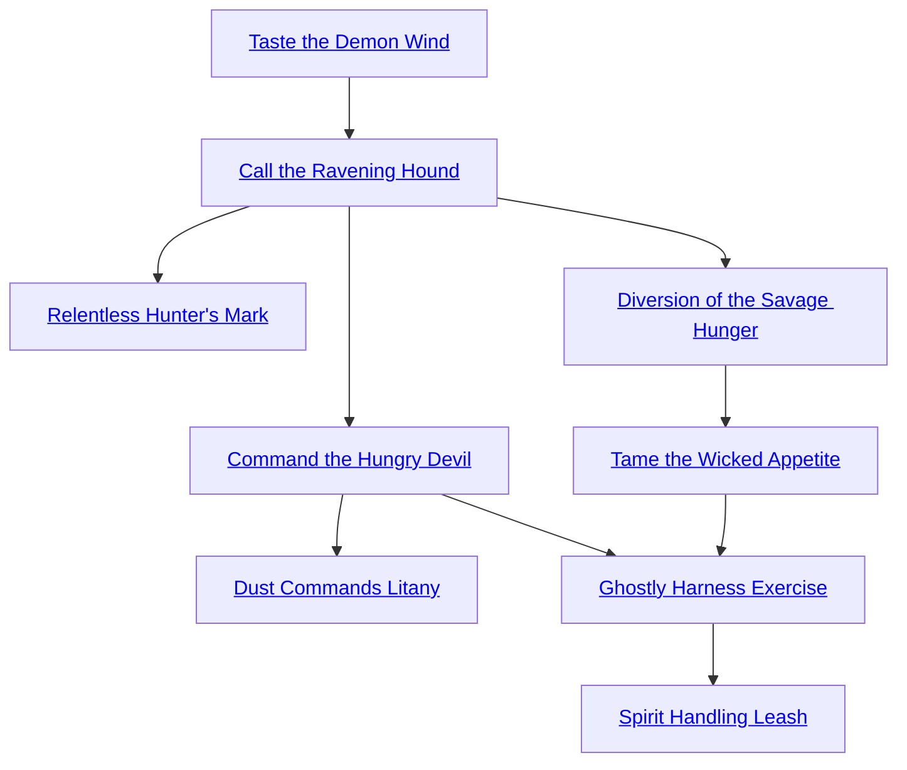

## Taste the Demon Wind

Cost: 2 motes
Duration: Instant
Type: Simple
Minimum Valor: 1
Minimum Essence: 1
Prerequisite Charms: None

One of the most common hazards of ghostly existence
are roving packs of hungry ghosts. Mindless and driven by
inhuman appetites, they roam the across the worlds, constantly
searching for prey, living or otherwise. As such, it
behooves a clever ghost to be aware of these potential
hazards, and Taste the Demon Wind allows a ghost to do
exactly that.
When a ghost uses this power, a successful roll of
Perception + Presence renders her aware of the number,
direction and location of any hungry ghosts in the vicinity.
The more successes rolled, the further out hungry ghosts
can be detected.

Number of Range Successes
1 100 yards
2 250 yards
3 500 meters
4 1 mile
5 5 miles

Taste the Demon Wind must be used consciously. The
ghost must be actively listening for hungry ghosts, or else,
this Arcanos is useless. The way in which the power manifests
varies from spirit to spirit. Some detect hungry ghosts
as a foul odor or a sudden chill, while others claim to be able
to suddenly hear their howling, even from great distances.
Once a ghost has detected a hungry ghost, she is then
aware of its location at all times until it leaves her range.
Hungry ghosts are not aware they've been found out, nor
are they usually clever enough to lope outside of range and
then return, undetected.

## Call the Ravening Hound

Cost: 8 motes, 1 Willpower
Duration: Instant
Type: Simple
Minimum Valor: 2
Minimum Essence: 1
Prerequisite Charms: Taste the Demon Wind

Summoning a hungry ghost — or a pack of them — is
not the brightest thing a ghost can do. However, there are
times when it makes sense to do so. The arrival of a pack
of hungry ghosts can provide excellent cover for an escape,
and some of the more advanced Arcanoi also provide uses
for hungry ghosts that arrive.
The use of Call the Ravening Hound requires a
successful Manipulation + Presence roll. The more successes
scored, the further away the hungry ghosts may be
that are summoned (and the more who are likely to heed
the call). Bear in mind, however, that if one hungry ghost
suddenly bolts in response to a summons, the rest of his
pack may follow of its own volition.

Number of Successes Range Maximum Number of Hungry Ghosts Called
1 100 yards 250 yards 1
2 250 yards 2
3 500 yards 4
4 1 mile 8
5 5 miles 20

When a ghost uses this power successfully, a cold,
unearthly shrieking rises up from where he is standing.
This radiates outward to the limits of the Arcanos'
effective range. Any hungry ghosts within the range will
howl in response, and the nearest to the summoning
ghost will respond. This initial call is very distinctive,
and those who are familiar with the use of the Arcanos
will be able to recognize it for what it is. This practice is
highly illegal in civilized portions of the Underworld.
Those caught using Call the Ravening Hound face enslavement
or worse as punishment for deliberately
attracting the scourge of hungry ghosts.

## Relentless Hunter's Mark

Cost: 10 motes, 1 Willpower
Duration: One hour
Type: Simple
Minimum Valor: 4
Minimum Essence: 3
Prerequisite Charms: Call the Ravening Hound

Hungry ghosts are relentless, savage hunters. This is why
many ghosts find it useful to unleash them on their enemies.
Placing the Relentless Hunter's Mark on a victim immediately
makes that individual the center of attention for any
hungry ghost in the vicinity, as well as any he stumbles across
while the Mark endures. A pale white handprint outlined in
angry red, the Mark calls hungry ghosts to itself like raw meat
calls hungry dogs, and it whips those hungry ghosts into a
frenzy of anger against the Mark's bearer.
The Mark can be placed on an individual or on an
item such as a breastplate or weapon. To place the Relent-
less Hunter's Mark, a ghost's player must make a successful
Dexterity + Brawl roll for his character to touch the target,
then succeed on a Manipulation + Presence roll (difficulty
2). The Mark then remains in place on the target for an
hour, highly visible to all. Hungry ghosts will react to the
Mark immediately and will pursue the victim relentlessly
until either they or their target is brought down. Once the
Mark fades, hungry ghosts will no longer be unnaturally
drawn to the character, but if they're already hunting her,
they won't suddenly stop.
While the basic Mark fades after an hour, some ghosts
are skilled at prolonging its effects. The expenditure of a
single experience point when placing the Relentless
Hunter's Mark on a target seals it in place for a year and a
day. Spending 2 makes it permanent.

## Diversion of the Savage Hunger

Cost: 12 motes
Duration: One scene
Type: Simple
Minimum Valor: 2
Minimum Essence: 1
Prerequisite Charms: Call the Ravening Hound

The flip side of detecting the location of a nearby
hungry ghost is preventing it from detecting you. While
ghosts of power can deal with even a pack of hungry ghosts
with minimal risk of destruction, not every restless spirit is
so capable. Even those who can put down a hungry ghost
should the situation require it often prefer to avoid any
confrontation on general principle.
With that in mind, many ghosts become skilled in the
exercise of Diversion of the Savage Hunger. The successful
use of this Arcanos effectively removes a ghost from the
perception of any nearby hungry ghosts. A successful
Perception + Presence roll is required (difficulty 2), but
once success is achieved, the hungry ghost or ghosts are no
longer a problem — a single successful use hides a ghost
from all hungry ghosts until the end of the scene. Any
attack on the hungry ghosts or otherwise ostentatious
display of the hiding ghost's presence negates the effect of
Diversion of the Savage Hunger and leaves the ghost
vulnerable to attack once again.

## Tame the Wicked Appetite

Cost: 8 motes
Duration: One scene
Type: Simple
Minimum Valor: 2
Minimum Essence: 2
PrerequisiteCharms: Diversion of the Savage Hunger

Tame the Wicked Appetite does exactly what its
name suggests: It soothes the driving passion of hungry
ghosts, rendering them passive and calm. Hungry ghosts
that are affected will simply lay down in their tracks or
wander around dazed. If attacked, they will return to their
customary savagery, but if not attacked, they will be dull
and passive until the Arcanos' power wears off. They will
not even resist attempts to chain or muzzle them, though
once they feel their bonds they may become more violent.
Using Tame the Wicked Appetite requires a roll of
Charisma + Presence. The more successes obtained, the
more hungry ghosts that can be dealt with. Any hungry
ghost struck by the usage of Tame the Wicked Appetite
will fall prey to it immediately, whether it is wandering the
shadowlands or in mid-pounce. This Charm has a maximum
range of (the ghost's Valor x 10) yards.

Number of Successes Number of Hungry Ghosts Tamed
1 1
2 3
3 5
4 10
5 20

The hungry ghosts' hunger remains sated for the
duration of a single scene, though for the cost of another
mote of Essence, the ghost using the Arcanos can extend
the effect for an hour. Furthermore, by spending an experience
point, the ghost can make the effect permanent,
rendering the affected hungry ghosts permanently deprived
of their appetites. This expenditure releases any
Essence committed to the Charm.

## Command the Hungry Devil

Cost: 8 motes, 1 Willpower
Duration: Instant
Type: Simple
Minimum Valor: 3
Minimum Essence: 2
Prerequisite Charms: Call the Ravening Hound

There are times when it is not enough to divert a
hungry ghost. Occasionally, it is useful to harness the
ravening power of a hungry ghost to one's own ends. Thus
was developed the ability to Command the Hungry Devil.
This Arcanos allows a ghost to issue a single, irresistible
command to a hungry ghost. The command itself must be
obeyed to the letter and to the best of the hungry ghost's
ability, even if it leads to swift destruction.
To Command the Hungry Devil requires a successful
Manipulation + Presence roll, difficulty 2. The more successes
achieved, the more hungry ghosts can be commanded.

Number of Successes Number of Hungry Ghosts Commanded
1 1
2 3
3 5
4 10
5 20

The command need not be a single word, as a relatively
simple sentence can be understood by a hungry
ghost. “Stop” is a perfectly acceptable use of Command the
Hungry Devil, with the understanding that the hungry
ghost is free to start again a moment later. More effective
are commands such as “Attack him!” or “Go back to the
corpse that spawned you!” On the other hand, any ghost
who issues a complex command such as “Invade the Prince
of Shadows' citadel and bring me his left-handed gauntlet”
is going to be disappointed. If the order given is too
complex, the target ghost will remain motionless for a turn
and then resume its former attitude. Hungry ghosts will,
however, attempt to fulfill impossible commands, so long
as they are simple enough to be understood.

## Dust Commands Litany

Cost: 12 motes, 1 Willpower
Duration: One scene
Type: Simple
Minimum Valor: 2
Minimum Essence: 3
Prerequisite Charms: Command the Hungry Devil

Dust Commands Litany is an extension of the power
of Command the Hungry Devil. Rather than a single
command, however, it grants mastery over the hungry
ghost for an entire scene. Furthermore, it can be extended
for an additional scene by an additional mote's expenditure.
Dust Commands Litany is useful for ghosts who keep
penned herds of hungry ghosts or who employ the beasts as
watchdogs and the like.

## Ghostly Harness Exercise

Cost: 5 motes, 1 Willpower
Duration: One month
Type: Simple
Minimum Valor: 3
Minimum Essence: 3
Prerequisite Charms: Tame the Wicked Appetite, Command the Hungry Devil

There are some among the dead who devote their
existence to dealing with the scourge of hungry ghosts in
a most unusual fashion — by taming them. These spirits
are masters of Ghostly Harness Exercise, which allows
them to soothe hungry ghosts' savage nature for extended
periods of time. While hungry ghosts marked by this
power maintain their capacity for savagery, they are no
longer constantly ravenous and can be trained. They
even form a bond of sorts with the ghost who tames them,
and so long as they are tamed, they will not attack him
under any circumstances. This includes while under the
influence of Command the Hungry Devil. Of course, the
hungry ghost trainer must keep his end of the bargain,
taking care of his charges, spending time with them and
feeding them appropriately.
Hungry ghosts tamed with this power can be used as
watchdogs or bodyguards. Some ghosts use them as fight-
ing animals in tournaments and underground betting pits,
but most feel that this is an unnecessary expense. Without
the effects of Ghostly Harness Exercise, the task of training
a hungry ghost is utterly impossible. Even with the Charm,
training is a time-consuming process and requires a month
of intense work with harness, whip and fist. However, once
the hungry ghost has been trained, it is trained forever.
Tamed hungry ghosts function in much the same way
trained hounds do for mortals, obeying simple commands,
leaping to their owners' defense and eagerly awaiting the
chance to hunt.

## Spirit Handling Leash

Cost: 5 motes, 2 Willpower
Duration: Instant
Type: Simple
Minimum Valor: 3
Minimum Essence: 3
Prerequisite Charms: Ghostly Harness Exercise

Spirit-Handling Leash is not nearly so powerful as its
prerequisite. It does, however, have one virtue that Ghostly
Harness Exercise lacks: versatility. It allows a trainer to
transfer a tamed hungry ghost's loyalty to a new owner,
quickly, easily and permanently. The trainer is still regarded
with some, for lack of a better term, affection, but
it is to its new owner that the hungry ghost now shows its
utter devotion. The Spirit-Handling Leash will remain in
place permanently, and the hungry ghost whose affections
have been transferred will regard its owner with the same
affection it once gave its trainer. The hungry ghost will
hunt, guard or attack at its owner's command and will
never attack the holder of the Spirit-Handling Leash. It is
not uncommon to see servants of wealthy and noble ghosts
walking the streets of the necropoli with leashed packs of
hungry ghosts snuffling out ahead of them, a plain symbol
of their power for all to see.
