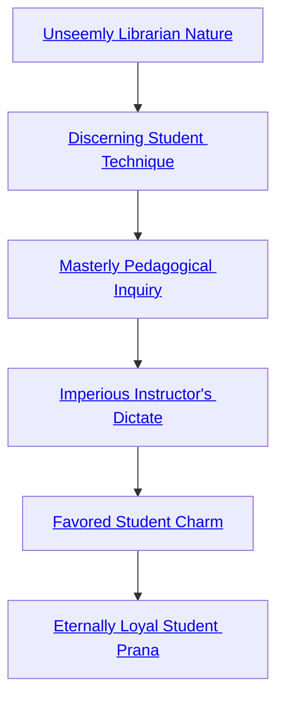

## Unseemly Librarian Nature

Cost: 2 motes
Duration: One hour per success
Type: Simple
Minimum Temperance: 1
Minimum Essence: 1
Prerequisite Charms: None

The studious ghost-librarian is well in tune with the
knowledge of the Ages. After all, many evenings he has
nothing better to do than to read scrolls and books found
in the Underworld — materials forever lost to Creation.
By activating this Arcanos with 2 motes and his player
making a successful Intelligence + Lore roll, the scholarly
ghost receives one automatic success with all Daybreak
Caste Abilities (Craft, Investigation, Lore, Medicine and
Occult) for one hour per success.

## Discerning Student Technique

Cost: 2 motes
Duration: One minute per success
Type: Simple
Minimum Temperance: 3
Minimum Essence: 2
Prerequisite Charms: [[#Unseemly Librarian Nature]]

The ghost scholar who knows Discerning Student
Technique has whole libraries of information buried within
his ghostly mind, and he can easily compare the known
facts of a situation against the statements of another being.
The ghost's player rolls Perception + Empathy as the ghost
activates this Arcanos. Throughout the duration, he gains
one automatic success to detect most falsehoods. Discerning
Student Technique provides insight (that automatic
success) into statements that the speaker knows to be lies.
It also provides the same level of insight when a speaker
misstates objective fact, so long as that objective fact is
recorded in a public, scholarly storehouse of knowledge
located in the Underworld (it would prove to be of no use
if a scholar's allies began saying “…the Scarlet Empress is
in Sijan! …the Scarlet Empress is in Chiaroscuro! …the
Scarlet Empress is in Wangler's Knob!” until they found
one statement that did not register as false — it only works
on matters of scholarly record). This Charm does not
provide the ghost with insight into the truth of a situation
in any circumstances, only awareness of whether a statement
is false.

## Masterly Pedagogical Inquiry

Cost: 3 motes
Duration: Instant
Type: Simple
Minimum Temperance: 3
Minimum Essence: 2
Prerequisite Charms: [[#Discerning Student Technique]]

The ghost-scholar using Masterly Pedagogical Inquiry
can force his subject to answer a single question
truthfully. The ghost simply spends the necessary Essence
and asks a direct question of the target, and the ghost's
player rolls Manipulation + Presence; the target's player
rolls Willpower to resist. If the ghost achieves more successes
than the target, the target must answer the question
as fully and truthfully as possible — though generally
speaking, this Arcanos cannot get more than a 100-word
answer out of anyone with a single question. This Charm
does not work on individuals with an Essence higher than
the ghost's.

## Imperious Instructor's Dictate

Cost: 5 motes + 1 Willpower
Duration: One day
Type: Simple
Minimum Conviction: 4
Minimum Essence: 3
Prerequisite Charms: [[#Masterly Pedagogical Inquiry]]

Imperious Instructor's Dictate allows a ghost to issue
a single command to her subject, which must be followed
to the best of the subject's ability. The scholar spends her
Essence and Willpower and immediately issues a single
command, a short imperative sentence. The ghost's player
rolls Charisma + Presence, and the target's player rolls
Willpower to resist. If the ghost achieves more successes
than the target, the target will obey the command — and
not realize that he's been given a command, but rather,
think that this is his own idea. The target loses interest in
fulfilling the command after about a day, so the ghost using
this Arcanos should make the command relatively easy to
accomplish within that period. If the ghost's player manages
to botch the roll on this Charm, the target instantly
knows that he is being magically manipulated and is likely
to respond angrily. This Charm does not work on individuals
with an Essence higher than the ghost's.

## Favored Student Charm

Cost: 10 motes + 1 Willpower
Duration: Varies (see below)
Type: Simple
Minimum Compassion: 4
Minimum Essence: 3
Prerequisite Charms: [[#Imperious Instructor's Dictate]]

The ghost with this Charm manipulates another
ghost's hun, rendering that ghost friendly to the Arcanos'
user. This ability, unlike most of the previous Arcanoi in
this art, works only on ghosts. Typically, the Charm
induces the sort of camaraderie seen between a skilled
student and a wise instructor (the ghost using this Arcanos
may choose to impose either role on the target). The target
of the Arcanos generally can't be forced to act in contradiction
to his Nature or strongly held Virtues. He also
won't sacrifice his unlife or livelihood for the ghost, but he
will do his best to assist the ghost as much as possible.
The ghost cannot use this Arcanos on another ghost
with a higher Essence than hers. The player of the ghost
using Favored-Student Charm makes a Charisma + Socialize
roll, after the ghost spends her Essence and
Willpower, and the target may resist with Willpower. A
botch on the roll to activate this Arcanos immediately
reveals the ghost's intentions to the target, probably with
dire consequences. When the Arcanos wears off, if it is not
renewed with the expenditure of more Essence and Willpower,
the target will have a vague idea of what was done
to him and may feel somewhat uneasy around the user (+1
difficulty to all Social rolls between target and user). The
number of net successes determines the duration:

Successes Duration
1 One hour
2 Until the next dawn
3 One full day
4 One week
5 One month

This Charm does not work on individuals with an Essence
higher than the ghost's.

## Eternally Loyal Student Prana

Cost: 10 motes + 1 Willpower
Duration: Special (see below)
Type: Special (see below)
Minimum Compassion: 5
Minimum Essence: 3
Prerequisite Charms: [[#Favored Student Charm]]

The wise ghost-scholar can manipulate a student's
hun sufficiently to permanently implant an order in another
ghost's mind. Like Favored-Student Charm, Eternally
Loyal Student Prana can be used only on other ghosts,
rather than the living or other spirits. The scholar must
first spend a full day with the target. At the end of this time,
he spends the Essence and Willpower to insert the command
into the target's mind. The ghost cannot use this
Charm on a ghost with an Essence higher than his own.
The Arcanos requires a roll of Manipulation + Presence,
and the target's player may resist with a Willpower roll.
The scholar's player must achieve at least two net successes
on his roll. The orders cannot be more complex than about
100 words' worth unless the ghost achieves five or more net
successes (in which case, they can be as complex as he
wishes, down to subclauses and special cases). As with
Favored-Student Charm, no orders may be implanted that
directly contradict the target's Nature or high Virtues.
