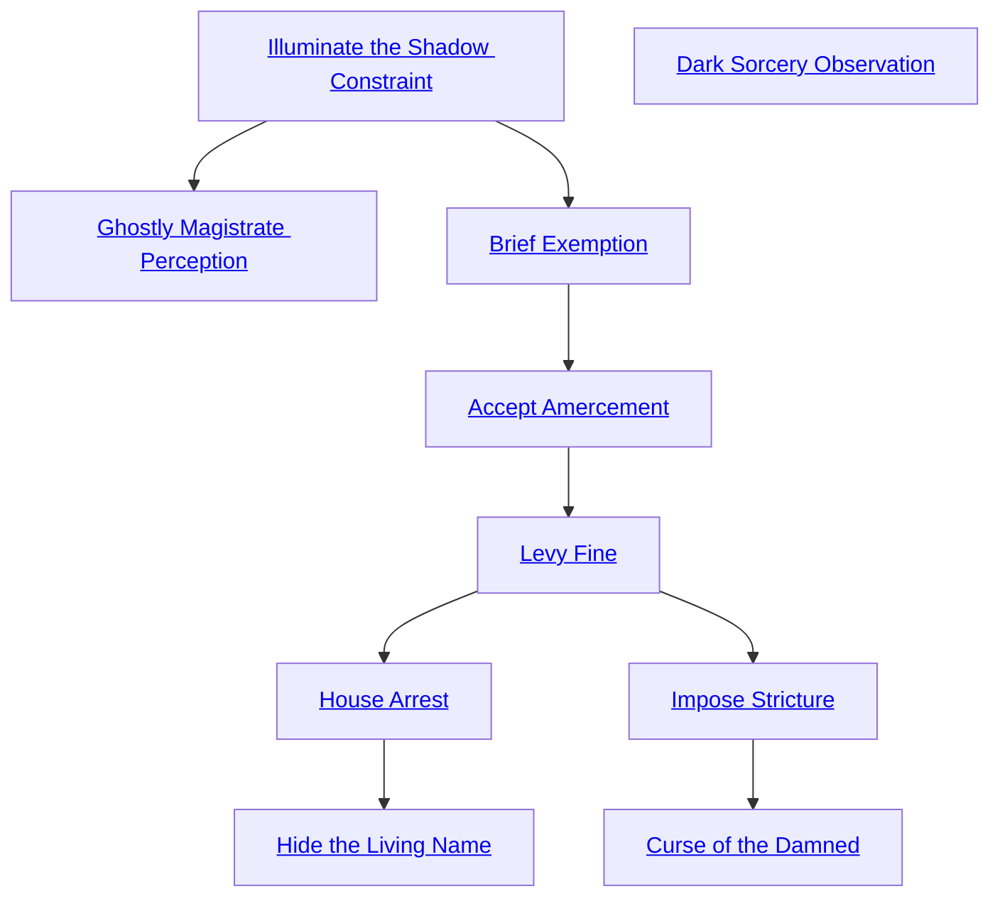

## Illuminate the Shadow Constraint

Cost: 1 mote
Duration: One minute
Type: Simple
Minimum Temperance: 1
Minimum Essence: 1
Prerequisite Charms: None

Throughout the Underworld, subtle laws apply to the
activities of ghosts. Most such laws stem from the use of
ancient and wide-ranging necromancy, but others are
restricted in their area of effect, are new or have nothing
to do with necromancy itself — they are inherent to the
fabric of the Underworld. Ghosts can create temporary
taboos with the Impose Stricture Arcanos (see p. 45).
Illuminate the Shadow Constraint reveals any taboos
that apply to any locations within sight. Alternately, the
ghost's player may roll Perception + Bureaucracy when her
character uses this Charm in order to determine any taboos
that apply to a particular person or ghost. Studious and
careful ghosts learn Illuminate the Shadow Constraint in
order to remain aware of taboos and strange laws of reality
as they travel from realm to realm.

TWENTY TABOOS
The Storyteller may use any of these as local taboos, while players may choose to create them with
necromancy or some of the Arcanoi in this art. This list should be seen only as inspiration. These are not the only
possible taboos by any means.
• The living may not eat food grown in this place (or they may not eat a particular food, such as pomegranates).
• Slay no ghost animals.
• Do not say the word “love.”
• Touch no other ghost.
• Never let your feet touch the ground.
• Look at no other ghost's eyes.
• Do not speak of Creation or of your mortal life.
• Wear no woven clothing.
• Never speak your name.
• Light no new fires.
• Give thrice-daily veneration to the Dual Monarchy.
• Drink only collected rainwater.
• Do not fight with thrown weapons.
• Carry a piece of stone against your flesh at all times.
• Speak only in whispers.
• Eat only the flesh of carrion eaters such as hyenas or vultures.
• Sleep only under the open sky.
• Cook only using implements crafted from cold iron (or bone).
• Sleep in a bed crafted for children.
• Cover every inch of your flesh save your eyes (or face).

## Dark Sorcery Observation

Cost: 1 mote
Duration: Instant
Type: Simple
Minimum Temperance: 1
Minimum Essence: 2
Prerequisite Charms: None

A ghost who activates Dark Sorcery Observation
instantly notices the presence of any active necromantic
effects within his field of vision, so long as his player
succeeds in a simple Perception + Occult roll. Ensorcelled
people, objects or areas emit a dark, pulsing aura to the
character's eyes for a moment or two. With three or more
successes, the ghost is aware of the circle (Shadowlands,
Underworld, Void) of the necromancy, and with five or
more successes, he learns a one-word description of what
every effect in the area is doing.

## Ghostly Magistrate Perception

Cost: 1 mote
Duration: One scene
Type: Instant
Minimum Temperance: 2
Minimum Essence: 1
Prerequisite Charms: [[#Illuminate the Shadow Constraint]]

This simple Charm allows a ghost to detect the
presence of criminals against the local natural order. It
immediately points out any living being in line of sight
within the Underworld (even if he attempts to conceal his
presence through non-magical disguises or the like). Additionally,
with a Perception + Bureaucracy roll at standard
difficulty, the ghost-magistrate notices any entity that has
violated a taboo of the Underworld within the last 24
hours and not had his violation forgiven through the use
of Accept Amercement.

## Brief Exemption

Cost: 3 motes
Duration: One scene
Type: Simple
Minimum Temperance: 3
Minimum Essence: 2
Prerequisite Charms: [[#Illuminate the Shadow Constraint]]

Brief Exemption allows a ghost to tiptoe around a
taboo of the Underworld, whether it is a “natural” taboo,
one imposed by necromancy or one created by Impose
Stricture (see p. 45). A Manipulation + Stealth roll is
required. An “ordinary” natural taboo requires just one
success to ignore. One imposed by Necromancy or Impose
Stricture requires a number of successes equal to the
Essence of the entity who created the taboo (a default of
four if unknown).

## Accept Amercement

Cost: 3 motes, 1 Willpower
Duration: One scene
Type: Simple
Minimum Temperance: 4
Minimum Essence: 2
Prerequisite Charms: [[#Brief Exemption]]

Accept Amercement allows a learned ghost to forgive
another's trespass of local taboo. The violator does not
have to be truly repentant; the Charm simply eliminates
the negative effect of the taboo for the scene. If the taboo
act is a simple, instant thing — eating pomegranates, for
instance — this Charm “erases” the act, and the target of
the Charm will suffer no further ill effects from his past
violation. If the taboo is a state of being — for instance,
wearing shoes when it is forbidden to do so — the Arcanos
allows the target to continue to violate the taboo for the
duration of a single scene.

## Levy Fine

Cost: 3 motes
Duration: One scene
Type: Simple
Minimum Temperance: 4
Minimum Essence: 2
Prerequisite Charms: [[#Accept Amercement]]

The intensity of punishment for violating a taboo varies
wildly. This Arcanos allows a ghostly magistrate to add his
own penalty to a violation. This additional punishment can
take one of several forms, at the magistrate's discretion:
• -2 dice to all dice pools
• A visible or audible sign that the violator is a
criminal (such as a brand or a phantom crow that shouts
“Violator!” from the character's shoulder)
• All forms of movement reduced by 1/3 due to some
visible impediment
Similarly scaled punishments may also be levied, at
the Storyteller's discretion. All such effects last until the
end of the scene in which Levy Fine is invoked but require
no dice roll to impose so long as the target of the Charm has
violated a local taboo. No punishment can be used if the
target has not violated a local taboo. This Charm may be
applied multiple times to a single target, but only if he has
violated multiple laws of the Underworld.

## House Arrest

Cost: 5 motes, 1 Willpower
Duration: Permanent (see below)
Type: Simple
Minimum Temperance: 4
Minimum Essence: 3
Prerequisite Charms: [[#Levy Fine]]

The successful use of House Arrest forces a living
violator of an Underworld taboo to remain in the Under-
world or a shadowland until such time as he is forgiven for
his transgression. This forgiveness can only come from
the use of Accept Amercement (above) by a ghost with
equal to or higher Essence than the ghost who uses this
Arcanos. This Arcanos has no effect on ghosts, nor even
on Ghost-Blooded.

## Hide the Living Name

Cost: 10 motes, 1 Willpower
Duration: Instant (see below)
Type: Simple
Minimum Temperance: 4
Minimum Essence: 4
Prerequisite Charms: [[#House Arrest]]

Hide the Living Name turns a living transgressor into
a ghost for all intents and purposes until his crime is
forgiven by a ghostly magistrate with equal or higher
Essence than the user of this Arcanos. The Charm strips
away the subject's physical form and life-essence, impris-
oning it in an unknown location (many suspect the
Labyrinth — which might have dire consequences in the
long run, see below). What's left, the target's higher soul
(or hun), persists as any other ghost might. The subject of
the Charm can leave the Underworld through a shadowland
and even enter Creation, but no matter where he goes, he
remains a ghost (and is incorporeal in Creation, etc.). His
physical body does, apparently, age — a few centuries ago,
in a rare case, a mortal was stricken to ghosthood by a
vengeful magistrate and left in that state for several years.
When he returned to a living state, he found that his hair
had grayed and that lines had crept across his face.
Living targets of this Charm with particularly high
scores in any Virtue and low Willpower may find that their
bodies become possessed by spectres while they are under
the influence of this Arcanos. Spectres are attracted to the
bodies of the particularly virtuous (regardless of the Vir-
tue), but are repelled by the leftover Willpower that
anchors the living body's mind. If the sum of the character's
two highest Virtues exceed his Willpower, that character's
body is a potential possession target. A possessing spectre
takes a living body back into Creation and wreaks havoc
as it sees fit. It cannot read the victim's mind, so it cannot
necessarily destroy the character's life, but it can certainly
break laws and cause trouble no matter where it goes. If a
possessed body is killed in Creation, it returns to the
Labyrinth and slowly regenerates, and the spectre that
took it to Creation is ejected.
If the character's body is possessed at the time that his
sentence ends, he cannot return to it until the spectre
residing in it is somehow ejected. It is the Storyteller's call
as to whether the target's body has been possessed at all and
particularly whether the body is “out” at the time that the
target is ready to return to it.

## Impose Stricture

Cost: 10 motes, 1 Willpower
Duration: Three days per success
Type: Simple
Minimum Temperance: 4
Minimum Essence: 4
Prerequisite Charms: [[#Levy Fine]]

The ghost using Impose Stricture can create a short-
term taboo in his local area — within one mile per point
of permanent Essence (or the size of a small village). This
taboo should be relatively simple — nearly all taboos
either preclude a single simple behavior (such as eating
pomegranates) or require a single behavior (such as wear-
ing a particular garment at all times). No taboo can be
impossible to adhere to — even taboos that are logical
impossibilities (“Everyone in this area must be male and
female at the same time”) has to have a possible symbolic
solution (ritual transvestitism, for instance). Taboos created
by Impose Stricture only apply within the Underworld.
Impose Stricture implies only a single, relatively minor
penalty — violators of a taboo suffer a one-die penalty to
all dice pools until one hour past the time that they stop
violating the taboo. That is, if the taboo is a single action,
violators suffer a one-hour penalty. If it is a continuous
action (“Wear no leather”), the penalty applies as long as
the criminal violates the taboo and then an additional
hour after that. The one-hour duration can be cut short if
the violator receives the use of Accept Amercement by a
ghost magistrate.

## Curse of the Damned

Cost: 10 motes, 1 Willpower
Duration: Instant
Type: Special
Minimum Temperance: 4
Minimum Essence: 4
Prerequisite Charms: [[#Impose Stricture]]

A magistrate-ghost uses Curse of the Damned to
apply a permanent taboo to another being — be it a spirit,
a ghost or a living being. The target of this Arcanos must
have an Essence lower than the ghost using it, and it is
difficult to apply — the ghost's player makes a Manipulation
+ Lore roll, while the target's player resists with
Willpower. If the ghost achieves more successes, the
target suffers from a taboo for the rest of its existence. As
with Impose Stricture, above, violation of the taboo
results in a one-die penalty to all dice pools for at least
one hour after the violation. The taboo should be straightforward,
as described in Impose Stricture (with examples
given in the boxed text on p. 43). The Curse of the
Damned can be removed if the ghost who inflicted it uses
Accept Amercement or if any other entity with an
Essence higher than the ghostly magistrate who invoked
the taboo uses Accept Amercement.
