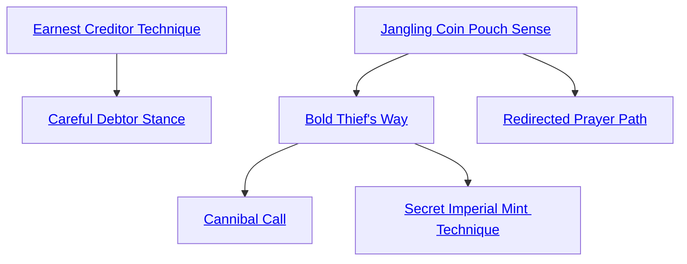

## Jangling Coin Pouch Sense

Cost: 1 mote
Duration: 10 minutes per success
Type: Simple
Minimum Temperance: 1
Minimum Essence: 1
Prerequisite Charms: None

With a successful Perception + Bureaucracy roll
made by his player, the user of this Arcanos can detect the
existence of nearby money, whether its “real” money
minted by a kingdom of the living or dead, burned
sacrificial “hell money” sent to the Underworld by suitably
pious descendants of the dead or Essence-minted
money created by one of the other Arcanoi in this art.
Jangling Coin Pouch Sense lasts for 10 minutes per
success rolled, but during its duration, it only enables the
user to detect actual money — not mere valuables, gems
or jewelry, but money that may be used in exchange for
goods or services or in payment of taxes.

## Earnest Creditor Technique

Cost: 3 motes
Duration: Instant
Type: Simple
Minimum Compassion: 1
Minimum Essence: 1
Prerequisite Charms: None

The wise merchant knows when to extend credit to a
favored customer — the kind of customer who will bring
plenty of business back to the merchant over the long run.
This Arcanos allows a ghost to give Essence to another
entity — ghost, mortal, god or Exalt. The ghost need only
touch the subject of the Arcanos, and the subject receives
2 motes of Essence. The ghost may use this Arcanos as
often as he likes, on whichever subjects he likes, and it may
be used multiple times upon the same subject. The subject
does not need to be willing, but if for some reason he is not,
the ghost must succeed in touching the subject before
transferring the Essence.

## Careful Debtor Stance

Cost: 1 Willpower
Duration: Instant
Type: Simple
Minimum Conviction: 2
Minimum Essence: 2
Prerequisite Charms: [[#Earnest Creditor Technique]]

The wise customer takes on only as much debt as he
knows he can afford to pay back. This Arcanos allows a
ghost merchant to take motes of Essence from a willing
creditor. The ghost and the subject must touch one
another to enact this Arcanos. The subject of the Charm
must be willing — if he is in any way resistant to the
transfer of Essence, the Arcanos automatically fails. The
ghost may take as many motes of Essence as his player
achieves successes on a Conviction + Bureaucracy roll.

## Bold Thief's Way

Cost: 3 motes
Duration: Instant
Type: Reflexive
Minimum Conviction: 2
Minimum Essence: 2
Prerequisite Charms: [[#Jangling Coin Pouch Sense]]

Unlike Careful Debtor Stance, Bold Thief's Way
enables a ghost-thief or unethical ghost-merchant to
steal Essence from an unwilling target. Any time the
ghost comes into contact with another entity (ghost,
god, mortal or Exalt) he may reflexively take Essence
from them by spending 3 motes and his player rolling
Conviction + Larceny. The ghost takes 1 mote for every
success on this roll (so unless his intention is simply to
drain the target of Essence, he had better get at least three
successes). The ghost may not use this ability if he hits a
target with a melee weapon. He must hit with a Brawl or
Martial Arts attack.

## Redirected Prayer Path

Cost: 1 Willpower
Duration: Instant
Type: Simple
Minimum Temperance: 2
Minimum Essence: 3
Prerequisite Charms: [[#Jangling Coin Pouch Sense]]

Living descendants of ghosts who have sufficient
filial piety to remember and honor their ancestors often
make sacrifices to their ancestors' ghosts. These sacri-
fices become Essence and Willpower in the Underworld
(see Exalted: The Abyssals, p. 33, for details). Each
such sacrifice appears in the Underworld as a black-jade
token inscribed with the name of the ghost for whom it
is intended. The token appears in the Underworld
location corresponding with the spot in Creation at
which the sacrifice is performed. A canny ghost with
Redirected Prayer Path can intercept these sacrifices.
While standing within five yards of the Underworld
spot where the token arrives, the ghost can spend
Willpower and activates this Charm. The black jade
token appears, with this ghost's name inscribed on it,
and for all intents and purposes, the token and its
contents are considered to be his.
If two or more ghosts use this Charm simultaneously,
each one's player must make a Manipulation + Larceny
roll. The ghost achieving the most successes wins, and the
token is inscribed with his name.

## Cannibal Call

Cost: 1 Willpower
Duration: Instant
Type: Simple
Minimum Temperance: 3
Minimum Essence: 3
Prerequisite Charms: [[#Bold Thief's Way]]

Ghosts have a difficult time healing damage. Typically,
they must use Arcanoi or enter Slumber to do so.
Cannibal Call allows a ghost to heal damage by biting
another ghost and literally devouring its corpus. This
requires a successful bite attack (if the ghost has no
special abilities that enable a bite attack like an animal's
bite, the bite is at –3 speed, 0B damage and -2 accuracy
and defense, and if using Exalted Power Combat, its rate
is 3). If the ghost succeeds, he heals one health level for
every two health levels damage done to the target.

## Secret Imperial Mint Technique

Cost: 2 motes per dot, 1 Willpower
Duration: Instant
Type: Simple
Minimum Temperance: 3
Minimum Essence: 3
Prerequisite Charms: [[#Bold Thief's Way]]

This Arcanos turns Essence into coinage. To properly
replicate the local coin, the ghost's player rolls
Intelligence + Larceny, and the ghost spends as many
motes of Essence as he wishes, to a maximum of his
Temperance. If the player succeeds in the roll, the ghost
creates a pile of local coinage sufficient to provide a
bonus to his Resources level equal to one dot per 2
motes of Essence spent. This is a temporary Resources
level (though the coinage is permanent) — it is sufficient
to make a single purchase at that Resources level.
Once that purchase is made, the coinage is disbursed
into the population, and the ghost reverts to his normal
Resources Background (which represents his sustainable
income).
