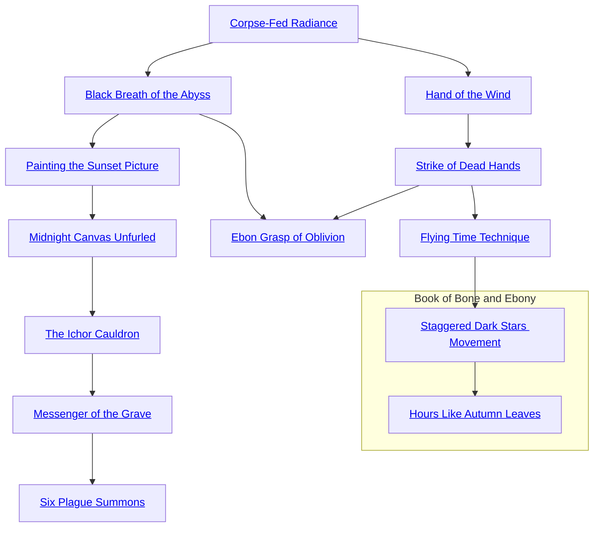

## Corpse-Fed Radiance

Cost: 2 motes
Duration: One scene
Type: Simple
Minimum Conviction: 1
Minimum Essence: 1
Prerequisite Charms: None

Ghosts are most comfortable in the dark of night, but
that does not mean they always wish to go unseen in the
darkness. Some ghosts wish to be seen, either to terrify the
mortals who behold them or to illuminate the steps of
those foolish enough to trust the dead as guides. By
releasing 2 motes of Essence, a ghost can cause herself to
glow with radiance as bright as the setting sun. Two or
more ghosts acting in unison can combine their radiance,
and when seven act in concert, the effect is as bright as the
noonday sun in the Far Southern deserts. A ghost may
choose to display any color, from the hideous green of
grave mold to the warm gold of afternoon sunshine. When
performed in the living world, the Corpse-Fed Radiance is
visible even if the ghost is dematerialized.

## Black Breath of the Abyss

Cost: 8 motes
Duration: One scene
Type: Simple
Minimum Conviction: 1
Minimum Essence: 2
Prerequisite Charms: Corpse-Fed Radiance

Darkness is more potent than light. Every dead man
knows this. Thus does Black Breath of the Abyss surpass
Corpse-Fed Radiance in the hierarchy of ghostly skills.
When summoned, the Black Breath of the Abyss is
more than just a cloud of darkness. It is an utter absence of
light that boils out of the ghost's mouth, ears, nose and
eyes. Devouring any normal source of light, the cloud
extends for 10 feet around the ghost. If the ghost expends
a Willpower point, the cloud will move in any direction of
his choosing. Those caught in the cloud are utterly blinded
— except ghosts, who can see through the darkness clearly.
No light can penetrate its inky depths, and those trapped
within subtract two successes from all attack rolls. The
boundary for the Arcanos' effect is as insubstantial as air
and can be crossed simply by moving out of the area of
effect, but the disorienting effect of the total darkness
makes this difficult.
The Black Breath of the Abyss cannot be dispelled by
normal light, though it will fade away in due time. The
manifestation of a Solar anima banner within the cloud of
darkness will also dispel it.

## Painting the Sunset Picture

Cost: 4 motes
Duration: One scene
Type: Simple
Minimum Conviction: 2
Minimum Essence: 2
Prerequisite Charms: Black Breath of the Abyss

Mere light is not always enough to work a ghost's will.
Storytellers among the dead use illusions to illustrate their
tales, and artisans of terror regard well-crafted images as
the most basic tools of their trade.
The illusions the dead craft by Painting the Sunset
Picture are simple ones — a single image in three dimensions,
with a basic color palette, immobile and faintly
transparent. They can be as large as the ghost creating
them wishes, though most of the Restless Dead prefer to
keep their creations man-sized or smaller. Often, the
images flicker or blur, revealing their artificial origins.
Painting the Sunset Picture requires a successful Wits
+ Craft (Pandemonium) roll against a difficulty of 1. More
complicated illusions, such as the image of a tree individual
leaves or a detailed reconstruction of the Palace
Sublime are more difficult, and may reach as high as
difficulty 3. The illusion's appearance may move as fast or
as slow as the ghostly creator wishes.
A ghost can sustain a Sunset Picture for an hour if she
wishes by feeding it a point of Willpower. She can also
create multiple illusions simultaneously, each with their
own cost in Essence. Sunset Pictures that have run their
course slowly fade away into transparency. The illusions of
Painting the Sunset Picture are visible even when created
in the lands of the living. The ghost need not materialize
to make the illusions visible.

## Midnight Canvas Unfurled

Cost: 5 motes + 1 Willpower; 5 motes/additional sense
Duration: One scene
Type: Simple
Minimum Conviction: 3
Minimum Essence: 2
Prerequisite Charms: Painting the Sunset Picture

Any ghost with a modicum of training can create a
simple illusion. It is far more difficult to create a complex
one, one that moves, speaks and gives the appearance of life.
Midnight Canvas Unfurled is the tool of choice for
these masters of illusion, and it serves them well. By
utilizing this Arcanos, a ghost may craft an illusion that
exists in three dimensions and is capable of movement.
With a successful Wits + Craft (Pandemonium) roll by his
player, the ghost summons the fleshed out illusion. The
difficulty of this Charm is the same as that of Painting the
Sunset Picture; the larger and more complex the illusion is,
the higher the difficulty. By spending 5 additional motes of
Essence, the master of the illusion can cause the illusion to
affect a sense beside sight. Sound is most often used, but
true craftsmen among the dead take delight in creating
illusions so complex that they fool the living. These
phantasms will even obey their creator's wishes to move or
speak, so long as the wishes are simple. The image lasts a
single scene, unless sustained with an investment of Will-
power. A single point of Willpower will extend the illusion's
lifespan to an hour.
Only the past masters among the dead have ever
created a Midnight Canvas larger than a behemoth,
though the Deathlords do so with some regularity and
disdain. However, the artisans of the dead have compensated
by learning how to add other touches of realism to
their creations.
The illusions of Midnight Canvas Unfurled, like
those of Painting the Sunset Picture, are visible even when
created in the lands of the living. The ghost need not
materialize to make the illusions visible. They can be seen,
even if he cannot.

## The Ichor Cauldron

Cost: 6 motes
Duration: One hour
Type: Simple
Minimum Conviction: 3
Minimum Essence: 2
Prerequisite Charms: Midnight Canvas Unfurled

This Charm gives the user the ability to summon large
quantities of any sort of foul, harmless fluid out of thin air,
and it can be employed to terrify, disgust or disturb with
equal ease. Those using it can summon up to (their
Conviction rating x 10) gallons of any harmless fluid they
choose — blood and squirming but harmless maggots are
acceptable, acids and flammable oils are not. This liquid
manifests on the walls, floors, ceilings and other surfaces
nearby, at the ghost's discretion.
The uses of this power can be as benign as filling a pot
with water or as malicious as making blood drip out of
walls. The fluid will remain in place until it dries up or
drains away, but in that time, it will have no visible source,
and its flow cannot be stemmed. While the ichor that is
created cannot be directly harmful, it can have dangerous
secondary effects, such as rendering a steep staircase slip-
pery or smearing the ink on a precious document.

## Messenger of the Grave

Cost: 4 motes, 1 Willpower
Duration: One hour
Type: Simple
Minimum Conviction: 3
Minimum Essence: 2
Prerequisite Charms: The Ichor Cauldron

This Charm creates vermin and gives them brief life.
The Messenger takes the form of a deathwatch beetle, rat
or other small creature. Instantly responsive to the will of
its creator, the creature scuttles forth to work his will. At
the end of an hour, the Messenger will shrivel and die, but
its life can be extended another hour by the expenditure of
another point of Willpower by the ghost who summoned
it. Messengers can be killed as per normal creatures of their
type; a simple sword thrust or even a well-placed boot heel
will do for most.
Creating a Messenger requires a Wits + Pandemonium
roll. The difficulty is 2 for an insect or similarly small
creature, difficulty 3 for anything else up to the size of a
large rat. Nothing larger can be created through the use of
this Charm. The Messenger appears at the ghost's feet and
goes forth into the world to do his bidding. While the
Messenger has enough rudimentary intelligence to obey
the ghost's mental commands, it is not a familiar and still
cannot be pushed beyond its innate capabilities. For ex-
ample, a summoned rat may be able to climb walls, but it's
still not going to be able to transcribe a document or make
complex judgments about humans.
Messengers may have fangs or claws, but even those
created in the image of a poisonous creature such as a spider
do not have venom. A ghost need not be materialized in
order to use this Charm. Her odious minion will appear in
the world of the living unless this Charm is used in the
Underworld or in a shadowland at night.

## Six Plague Summons

Cost: 20 motes, 2 Willpower
Duration: One hour
Type: Simple
Minimum Conviction: 3
Minimum Essence: 3
Prerequisite Charms: Messenger of the Grave

One rat. One spider. One serpent. A single example
of any of these species can be overlooked, swatted or
stepped on. A flood of them, however, is not so easy to
dismiss. Six Plague Summons lets a ghost create and send
forth an entire horde of vermin, which will happily swarm
over, devour or trample anything before it. All that is
required is the investment of Essence and Willpower and
a successful Wits + Pandemonium roll (difficulty 2 for
anything up to a mouse in size, 3 for anything up to a rat).
A Six Plague Summons can include anywhere from a
half-dozen to thousands of creatures, depending on the
success of the initial roll. The more successes scored, the
more creatures, with the number going up by a factor of five
for each success.
Number of Successes Approximate Number of Creatures Summoned
0 1-10
1 50
2 250
3 1250
4 6250

Successes beyond four produce what is, for all
intents and purposes, a numberless swarm.

The downside is that a plague thus summoned is
extremely difficult to control. The ghost who brings it
forth can give it some rough direction (“Go east!” or
“Chase him!”) but not much more than that. Vermin
brought forth through this Charm are also ravenously
hungry, making them even more difficult to control.
Fortunately, the plague lasts one hour and one hour only
and cannot be extended beyond that. A ghost need not be
materialized in order to use this Charm. In fact, her
festering swarm always appears in the world of the living,
unless she invokes this Charm in the Underworld or at
night in a shadowland.

## Hand of the Wind

Cost: 3 motes, 1 Willpower
Duration: Instant
Type: Simple
Minimum Conviction: 1
Minimum Essence: 1
Prerequisite Charms: Corpse-Fed Radiance

Not all of the dead are content to paint pictures in the
air. Some wish to affect the lands of the living in a more
tangible way. Hand of the Wind lets these ghosts reach out
with more-than-ghostly force.
By exercising this Arcanos, the ghost fortifies his
being with his will for an instant. During that time, he is
capable of one action that affects the world of flesh as if he
were a part of it. Whether that consists of striking a blow,
stealing a trinket or pushing an archer lining up a shot is
entirely up to the ghost. Any action the ghost takes is
subject to an appropriate roll (The player of a ghost trying
to snatch a First Age relic out of an enemy's hand would
have to roll Dexterity + Larceny, for example, while the
player of one seeking to pick up an abandoned dagger and
hurl it would roll Dexterity + Thrown). The ghost himself
cannot be struck by mortal weapons during this time, as he
is not actually materialized.
Note that Hand of the Wind can be used for only
one action at a time, though with a loose definition of
“one action.” Picking something up and throwing it is
considered one action; holding a pen and writing a
several thousand line epic poem is not. In general, there
is not enough time for characters to split their dice pool.
Hand of the Wind cannot be used in the Underworld.
Its uses are limited to the living world and during the
day in the shadowlands.

## Strike of Dead Hands

Cost: 5 motes, 1 Willpower
Duration: Instant
Type: Supplemental
Minimum Conviction: 2
Minimum Essence: 2
Prerequisite Charms: Hand of the Wind

What Strike of Dead Hands gives a ghost is physical
power, pure and simple. By adding brute force to a blow
enabled by Hand of the Wind, the ghost suddenly makes
his interactions with the world of the living that much
more devastating.
Strike of Dead Hands lasts, like its antecedent, for just
one attack, but it is far more potent. Any attacks or
Strength-based actions undertaken with this Arcanos
have one additional automatic success, and any blow
struck has additional lethal damage dice equal to the
ghost's Strength rating, meaning that the ghost's Strength
effectively doubles for the purposes of damage on the blow.
Ghosts can use this Charm to strike blows with weapons,
and a ghost armed with a daiklave can be a menace to an
Exalt who cannot attack spirits. The ghost has no fine
control of Strike of Dead Hands and, thus, cannot temper
a blow or pull a punch when using it.

## Ebon Grasp of Oblivion

Cost: 16 motes, 3 Willpower
Duration: One scene
Type: Simple
Minimum Conviction: 3
Minimum Essence: 3
Prerequisite Charms: Black Breath of the Abyss, Strike of Dead Hands

One of the ultimate powers of the dead, Ebon Grasp of
Oblivion strikes mercilessly and takes its victims back with
it into the depths of the Abyss. Emerging from the ghosts
facial orifices like the Black Breath, the Ebon Grasp mauls
those it strikes, savaging their flesh and spirits. Those who
are struck down by the Ebon Grasp are seized by it and taken,
screaming, into the depths of the Underworld.
All who are within a five-yard radius of the ghost's
mouth and eyes (other than the ghost activating the
Arcanos) are subject to the Ebon Grasp's hideous effects.
Each turn the Ebon Grasp touches a target gives the cloud
a reflexive Strength + Brawl attack against the victim,
using the summoning ghost's statistics. A successful attack
does Strength + 2 lethal damage. If the target is reduced to
Incapacitated or below, the next turn the cloud picks him
up and begins dragging him into the Abyss. This process
takes two turns to complete, during which time he can be
rescued by a contested Strength roll against the cloud.
Victims who are not rescued are drawn into the Abyss
through the physical form of the summoning ghost, a
disturbing and obscene process. The Ebon Grasp can be
fought like any other physical threat. It does not dodge, has
a soak of 6L/12B, has eight health levels and takes no
wound penalties. It uses the characters Traits and acts on
initiative 10. The Ebon Grasp of Oblivion ignores all
attacks that do less that its soak, and weapons not made
from the Five Magical Materials, subjected to Elemental
Enchantment or otherwise enhanced do only bashing
damage to the Ebon Grasp.

## Flying Time Technique

Cost: 8 motes, 1 Willpower
Duration: Instant
Type: Extra Action
Minimum Conviction: 3
Minimum Essence: 2
Prerequisite Charms: Strike of Dead Hands

By exploiting their ghostly nature, the dead can cause
the distortions of time, space and speed peculiar to night-
mares to become manifest reality. The ghost possessing
this Charm can move with incredible speed, cover impossible
distances and strike many times as time for her victim
slows to a dreamy crawl.
Though the special effects of this Charm are of night-
mare sensory distortion, the mechanical effect is one of
extra actions. The player of the ghost invoking the Arcanos
rolls Intelligence + Craft (Pandemonium). For every success,
the ghost gains an extra action that turn, but the
number of extra actions cannot exceed the ghost's permanent
Essence. These extra actions cannot be saved from
turn to turn. Other than its unusual special effects, Flying
Time Technique is a normal Extra Action Charm and
subject to the usual restrictions.

## Staggered Dark Stars Movement

Cost: 5 motes, 1 Willpower
Duration: Varies (see below)
Type: Simple
Minimum Compassion: 4
Minimum Essence: 4
Prerequisite Charms: Flying Time Technique

Staggered Dark Stars Movement allows a powerful
ghost to take advantage of Setesh's Calendar in such a way
as to allow hours to pass like moments for himself. The
ghost simply pushes his own path further along Setesh's
Calendar than those around him. The Charm allows the
ghost to “skip” over minutes or hours. To the ghost, it
seems as though time simply jumps forward a few minutes
or hours. To those watching, the ghost seems to disappear,
only to return after a few minutes or hours. The ghost's
player must roll Intelligence + Occult, and for every
success, the ghost can jump forward up to 30 minutes. The
player rolls and determines the maximum amount of time
the character can leap forward. After that maximum
duration is determined, the character picks any amount of
time up to that maximum that he wishes to jump. Note
that the ghost cannot perceive events that happen in the
interim, nor can he make conditional jumps — “jump
forward until these guys leave” is not permitted. This
Arcanos is a fine way to escape combat, but the ghost
cannot jump backward. Any time he skips over is forever
lost to him. This Charm can only be used in the Under-
world, as Setesh's Calendar has no power over Creation.

## Hours Like Autumn Leaves

Cost: 6 motes and 1 Willpower per person
Duration: Varies (see below)
Type: Simple
Minimum Compassion: 4
Minimum Essence: 5
Prerequisite Charms: Staggered Dark Stars Movement

Hours Like Autumn Leaves allows the most powerful
ghosts to pull themselves and nearby companions
forward along Setesh's Calendar. For all ghosts caught in
the pull of this Charm, the world seems to flicker as they
jump forward in time. Observers see all ghosts affected by
the Charm vanish, only to reappear later. The player of
the ghost using this Charm must roll Intelligence +
Occult and the ghost must spend 6 motes for himself and
every entity to be dragged forward with him, as well as 1
Willpower per being. For every success, the whole group
can be moved forward in time up to 30 minutes. The
player rolls and determines the maximum amount of time
the group can leap forward, and after that maximum
duration is determined, the character picks any amount
of time up to that maximum that he wishes to jump. Note
that the ghost cannot perceive events that happen in the
interim, nor can he make conditional jumps — “jump
forward until these guys leave” is not permitted. The total
span jumped is at the discretion of the ghost using this
Charm (those brought along have no control over the
span of time over which they jump). Willing subjects of
this Charm should be within 10 yards of the ghost using
it. An unwilling subject can only be brought along if the
ghost is physically touching her.
It is rumored that the ghosts of Stygia have a more
powerful version of this Charm that allows ghosts to leap
forward years, rather than hours.
