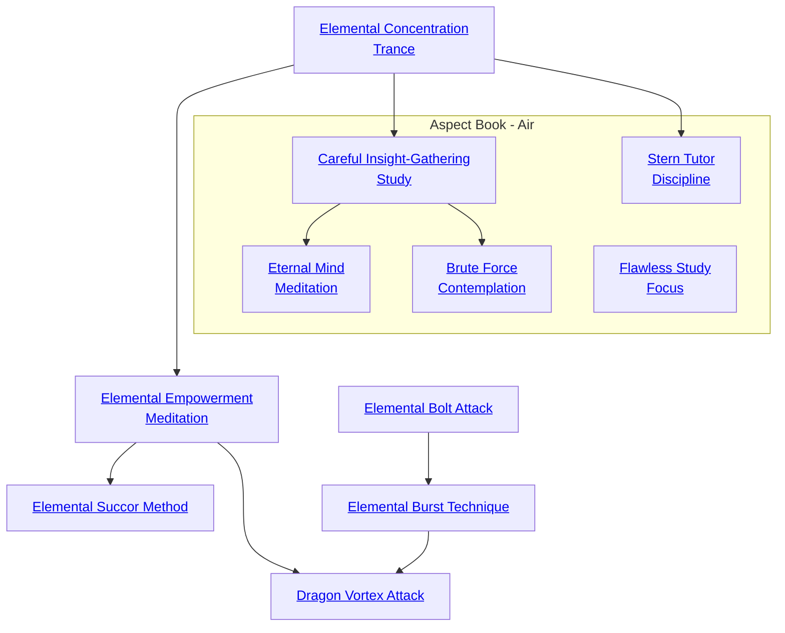

## Fire Blast Trap Trick

Cost: 1 mote
Duration: Until triggered
Type: Simple
Minimum Lore: 3
Minimum Essence: 2
Prerequisite Charms: None

This peculiar Charm finds use among Dragon-Bloods
who worry about thieves. It takes a clever hand, though, to
trap a fire inside a box, jar or bottle so that it can't go out.
The Dynast must place a bit of fuel inside the container —
firedust from the far south works best — set it on fire, then
slap the lid shut and seal it just right. When someone opens
the container, the captive fire explodes, much larger and
hotter from anger at being trapped. A typical use for the
fire trap is to rig it inside a trunk or cupboard so that anyone
who opens it the wrong way pops open the hidden container
and set off the trap.
Like most Charms with long-term effects, the fire trap
&quot;ties up&quot; the mote of Essence used to set it up. For this
reason, the Aspects of Fire do not manufacture fire traps by
the dozen. Creating a fire trap takes just a minute, but the
trap itself can last indefinitely. The trap lasts even after its
creator's death, if she never reclaimed its Essence. The fire
trap's explosion has a three-foot radius. The player rolls
Dexterity + Lore. As well as causing a flash and loud bang,
for each success the player rolls, the trap does a number of
points of lethal damage equal to the Essence of the Exalted
who set the trap, soaked normally. Obviously, fire traps are
unsuitable for guarding anything that flame could destroy.
Cascade Charms:
• The Fire Blast Trap Trick needs few improvements.
One possibility is an improved fire trap whose flame fills a
larger area.

## Ten Season's Growth Discipline

Cost: 1 mote per minute of use
Duration: Instant
Type: Simple
Minimum Lore: 2
Minimum Essence: 2
Prerequisite Charms: None

By communing with the living spirit of a plant, a
Dragon-Blooded character can rouse it to grow with impossible,
supernatural speed. A seed can grow into a flower.
A seedling can become a sturdy sapling. What's more, the
character can shape the plant's growth. Although instant
topiary is an esthetically pleasing application, a character
can also grow trees so they crack stone walls with their
roots, produce living ladders from ivy or perform other
useful tricks.
To employ this Charm, the character must lightly
stroke the target plant, softly hum or sing to the spirit
within it and supply it with water. For every minute and
mote of Essence expended, the plant experiences up to a
full year's worth of growth. Thus, growing an annual flower
from a seed requires only one minute and one mote of
Essence; growing an oak tree 20 years old from an acorn
takes 20 minutes and 20 motes of Essence.
Cascade Charms:
• With greater Lore or Essence, the character could
learn to grow and shape trees with greater speed and less
cost of Essence.
• A plant might actually animate for a short time to
work the Dragon-Blooded character's will.
• A plant could grow supernaturally large. A bower of
giant flowers aids any courtship; more bizarre options
include giant gourds or pumpkins as houses or boats.
• A really powerful Dynast might be able to make a
tree grow around a captured enemy, trapping him in
ageless slumber until someone cuts the tree down.

## Elemental Concentration Trance

Cost: 5 motes, 1 Willpower
Duration: One day
Type: Simple
Minimum Lore: 2
Minimum Essence: 1
Prerequisite Charms: None

This Charm is the most basic of Lore techniques
known by the Dragon-Blooded. Through the use of this
Charm, the character concentrates on her aligned element,
centering herself and opening her mind. The Exalt
can compact a week's worth of learning into a single day,
assuming she has access to all the necessary materials. This
Charm can be used on sequential days, but use of it for more
days than the character's Lore skill causes one level of
unsoakable lethal damage per day. This damage can only
be healed by time, and it does not begin healing until one
week after the characters suffers it.

## Elemental Empowerment Meditation

Cost: 1+ Willpower
Duration: Instant
Type: Simple
Minimum Lore: 4
Minimum Essence: 3
Prerequisite Charms: Elemental Concentration Trance

Proper knowledge of the Elemental Dragons allows a
Dynast to draw energy directly from an elemental source,
restoring depleted reserves in times of crisis.
The Elemental Empowerment Meditation requires
the character to spend Willpower points while in contact
with her aligned element. The character must be able to
physically touch the element she is aligned with to draw
Essence from it. For every point of willpower spent in this
way, the character instantly gains Essence motes equal to
her Lore. These motes can be spent normally.
There is a price to be paid for handling elementals
energy in such a raw fashion. If a character spends more
Willpower in a single day to draw elemental energy than
her permanent Essence score, each additional use of Willpower
to increase her Essence causes one unsoakable level
of bashing damage.

## Elemental Succor Method

Cost: 5 motes and 1 Willpower per lethal health level, 2 motes per bashing health level
Duration: Instant
Type: Simple
Minimum Lore: 5
Minimum Essence: 3
Prerequisite Charms: Elemental Empowerment Meditation

In addition to providing raw energy, a Dynast's
connection to the Elemental Dragons can be a source of
great resilience and strength in desperate times. Elemental
Succor Method lets a Dragon-Blood tap into
the elemental energy of the Dragons to restore her body,
healing her injuries. That character must be able to
immerse herself in her favored element to the greatest
degree possible (standing in a burning fire, submerged
in water, etc.) and must spend 5 motes and 1 Willpower
for every lethal health level to be healed of 2 motes per
bashing health level to be healed. The Elemental Succor
Method will not restore lost limbs or repair other
such mutilations.

## Elemental Bolt Attack

Cost: 1 mote per 2L damage
Duration: Instant
Type: Simple
Minimum Lore: 2
Minimum Essence: 2
Prerequisite Charms: None

The character extends her hand, and a bolt of elemental
force flashes forth from it — a shaft of ice, a blast
of fire, a barbed wooden javelin, a stroke of lightning or
slashing shards of crystal. The character's player rolls
Dexterity + Athletics or Archery (whichever she prefers)
to hit. This attack has a range of 20 yards x the character's
permanent Essence, and it does a base damage of 2L for
every mote of Essence spent. The accuracy of the attack
is equal to the character's Essence. A character cannot
spend more motes on this Charm than her Stamina.

## Elemental Burst Technique

Cost: 1 more per IL damage
Duration: Instant
Type: Simple
Minimum Lore: 3
Minimum Essence: 2
Prerequisite Charms: Elemental Bolt Attack

This Charm has effects similar to Elemental Bolt
Attack but it creates a blast of elemental power rather
than hurling a bolt. The character's player rolls Dexterity
Athletics or Archery (whichever he prefers) to hit,
with an accuracy bonus equal to the character's permanent
Essence. This attack has a range increment of 20
yards x the character's permanent Essence. The Elemental
Burst Technique affects a circular area with a radius
equal to the character's permanent Essence in yards.
Anyone in that area who fails to dodge or parry the attack
takes a base damage of 1L for every more the Dragon-Blooded
invested in the Charm.

## Dragon Vortex Attack

Cost: 10 motes, 1 Willpower
Duration: One scene
Type: Simple
Minimum Lore: 5
Minimum Essence: 4
Prerequisite Charms: Elemental Empowerment Meditation, Elemental Burst Technique

Rather than just summoning a temporary damaging
burst of elemental energy, this Charm creates a deadly
maelstrom of the character's elemental aspect. Whether it
is a sudden rain of fire, a roiling whirlwind of air or a
grinding cloud of stone and earth, all within the area of
effect suffer the character's wrath.
Anyone in the area of the Dragon Vortex Attack,
other than the character who summoned it, takes lethal
damage equal to the character's Essence every turn, as she
is battered by flying shards of stone, sliced by razor-thin ice
crystals, burned by swirling gouts of flame, and so on. This
damage cannot be dodged or parried. The Dragon-Blooded
who created it is exempt from these effects, and may act
normally in all respects. The Dragon Vortex extends 10
feet from the character per point of his permanent Essence.
It is stationary once invoked, and not even the character
can voluntarily terminate it before its duration expires,
although killing the character will end it.

## Careful Insight-Gathering Study

Cost: 2 motes and one hour per success
Duration: Varies
Type: Supplemental
Minimum Lore: 3
Minimum Essence: 2
Prerequisite Charms: Elemental Concentration Trance

Diligence and intellect, properly applied, can
surmount the most difficult of systemic or academic
pursuits. Diligence and intellect coupled with the
magical acumen of a talented Exalt can accomplish in
a matter of hours what could otherwise require months
of work from a dedicated team of scholars.
Through the use of this Charm, a Dragon-Blooded
scholar can virtually guarantee high-quality results on
any academic or systemic task by using Essence to
strengthen and structure his thoughts and mind, gain-
ing a crystalline clarity. For each hour of dedicated
work and 2 motes of Essence, the Dragon-Blood's
player gains an automatic success on any roll pertain-
ing to academic studies, research, analysis or any
other type of &quot;book work&quot; the character is conducting,
to a maximum of the character's Lore Ability (including
specialties, if applicable).
The hours spent in study for the use of this Charm
must be concurrent, and any interruption of the
character's activities will require him to begin anew,
losing any Essence spent in the Charm's activation.
Due to the highly structured changes worked on the
mind by use of this Charm, characters suffer an effective
-1 penalty to their Compassion Virtue Trait for a
number of hours after using this Charm equal to the
number of hours of study (even if the Charm fails due
to interruption). Those who make repeated, long-term
use of this Charm grow detached and often cold
toward others. Storytellers may reduce the Compas-
sion of characters who rely overmuch on this Charm
but should warn players if they think their characters
are overusing the Charm. Generally, more uses per
lunar month than a character's Essence should be
considered abuse.

## Brute Force Contemplation

Cost: 2 motes per success
Duration: Instant
Type: Supplemental
Minimum Lore: 4
Minimum Essence: 4
Prerequisite Charms: Careful Insight-Gathering Study

Sometimes, solutions to complicated problems
are needed on the spot, without the luxury of analysis
by engineers or scholars. When a dam or other vital
structure is damaged, for example, an effective plan
must be made before the structure fails and further
hampers normal operating procedures.
A Terrestrial scholar may bring the full force of
his mind and accumulated academic training to bear
on a single problem with the use of this Charm,
straining his mind with Essence and condensing days
of analysis into a single, staggering moment of insight.
For every 2 motes of Essence spent, the character
may purchase an automatic success on any roll involving
an analytical or scholarly task, up to a limit
of his Lore Ability. The remainder of the pool is then
rolled normally. The character's player must then
roll to soak, using the Dragon-Blood's Wits At-
tribute, a number of bashing health levels equal to
the total successes on the roll, as the Exalt attempts
to mentally digest and sort the rush of information.
It is common, after using this Charm, for a character
to experience violent nosebleeds, sporadic weakening
of vision and hearing and excruciating headaches.
Regardless of the results of the soak roll, each use of
this Charm counts as a full day's exertion for the
character, who must then deal with the effects of
sleep deprivation or use a Charm or item to counter
it. The bashing damage dealt through the use of this
Charm may be healed using whatever methods are
available to the character.

## Eternal Mind Meditation

Cost: 2 motes, 1 Willpower
Duration: Instant
Type: Simple
Minimum Lore: 3
Minimum Essence: 3
Prerequisite Charms: Careful Insight-Gathering Study

With a potential lifespan of centuries, and those
centuries almost surely densely packed with all manner
of both excitement and study, the memories of the
Dragon-Blooded can become quite cluttered. Dedicated
scholars especially, who have a long lifetime's
worth of books and observations on which they likely
wish to meditate, find that the enervation of the
memory with Essence can allow them near-perfect
recall of any event they have witnessed or any mate-
rial they have read.
After spending the required Essence, a Dragon-Blood
spends a moment in contemplation, and his
player rolls the Exalt's Intelligence + Lore, with the
number of successes indicating how far into his memory
the Dragon-Blood may explore. One success is enough
to recall a hurried conversation from a few years prior,
while five allows the user to reexperience events from
primary school. Some savants have even claimed to
recall memories of time spent in their mothers' wombs
through the use of this Charm.
While using this Charm, the character is not
helpless or unaware of his surroundings, as he is not
truly immersed in reexperiencing the events of his
past. He experiences them normally, as memories,
simply perfectly detailed and accurate memories.

## Flawless Study Focus

Cost: 3 motes per success
Duration: Instant
Type: Supplemental
Minimum Lore: 3
Minimum Essence: 3
Prerequisite Charms: Any 3 Lore Charms

Savants entertain a great variety of individually
focused fields of study. Nearly every scholar, dabbler
and professional alike, has her favored era of history,
mathematical discipline or school of philosophy. True
pundits, through the use of this Charm, can enjoy
flawlessly reliable intuition and produce repeatable
results within their chosen areas of focus.
For every 3 motes of Essence spent to fuel the
use of this Charm, one of the character's levels of a
Lore specialty can be converted to an automatic
success. The rest of the character's Lore pool is
rolled normally.

## Stern Tutor Discipline

Cost: 2 motes + 1 mote per student
Duration: One day
Type: Simple
Minimum Lore: 4
Minimum Essence: 2
Prerequisite Charms: Elemental Concentration Trance

Individual study, for a savant, may be a relaxing
and prestigious pastime, regardless of the specific area
of endeavor. Professional undertakings and the work
of students do not allow for the slow pace and low
pressure necessary to produce the results enjoyed by
those who study for leisure. In such cases, and others,
it is efficient and effective to establish a hierarchy
within which the more skilled savants are on hand to
advise and to proof the work of the lesser savants or
students. An overseer who uses this Charm can take
this methodology a step further, weaving connections
of Essence between herself and those under her to
maximize the collective cognition of the group.
On activation of the Charm, the player rolls his
character's Charisma + Lore. For the remainder of the
day's study, the character may use these successes as a
pool from which he can reflexively allocate additional
dice to rolls made by those under his tutelage, including
during a roll that has resulted in a failure or botch.
The character can, for example, add dice one at a time
to his charge's roll until the pool of extra dice is
depleted or the charge cancels his botch or failure.
