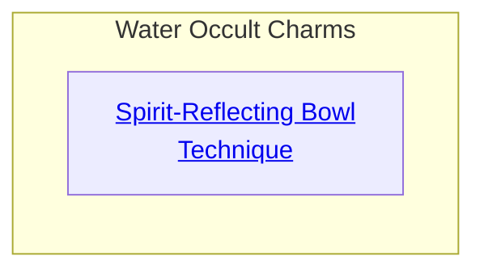
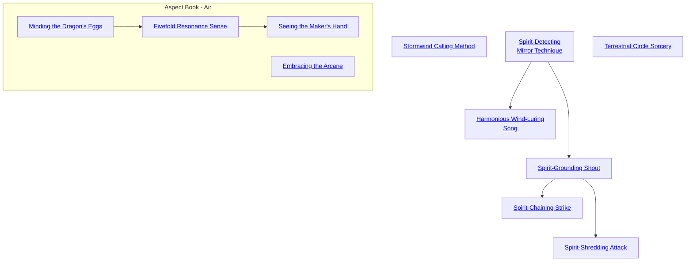

## Spirit-Reflecting Bowl Technique

Cost: 3 motes
Duration: Until disrupted
Type: Simple
Minimum Occult: 2
Minimum Essence: 1
Prerequisite Charms: None

Water has deep connections to the spirit world.
Dragon-Blooded characters with occult interests can use
this connection to see and communicate with the unseen
spirits of the world. The character requires nothing more
than an ordinary bowl of water. As long as the Dynast
concentrates, she can see nearby spirits reflected in the
water and hear what they say. A clever Dragon-Blood
might even do this without the spirits noticing - for
instance, by using a goblet of water and taking a sip now
and then, while pretending to do something else.
Cascade Charms:
• More powerful and learned Dynasts can actually
search for a spirit using a bowl of water, and communicate
with it at a distance.

## Stormwind Calling Method

Cost: 5 motes
Duration: 1 hour
Type: Simple
Minimum Occult: 2
Minimum Essence: 1
Prerequisite Charms: None

The Dragon-Blooded are not born occultists and
magicians like some Celestial Exalted, but many of them
study the supernatural lore of their favored element. Many
Aspects of Air learn the ways of the spirits who create the
weather through their dances and processions in the sky.
Exalted who know the ways of the sky-spirits can call them
to direct the wind. One must speak to the elementals in
their own tongue: the sounds of wind sighing over stony
crags and through treetops, and the rumbles of thunder.
Some Aspects of Air imitate such sounds with their voice
and a bullroarer. Others might play a flute or position a
harp so the wind plucks its strings. Inviting the winds to
blow takes five minutes.
This basic Charm evokes nothing more than a stiff
breeze — still enough to interfere with archery or send a
sailing ship scudding through the waves at top speed
During the hour of the Charm's effect, the character can
control the magic wind's direction by singing and whirling
his bullroarer for a turn.
Cascade Charms:
• As the character's Essence rating rises, Charms for
more powerful winds become possible, all the way up to
gale force. Old tales mention the great Lords of Air who
could evoke hurricanes and tornadoes by working together.
That may be true, but nobody has done it recently.
• A character can also show greater mastery of the air
through Charms to command lightning, hail, snow and
other sorts of storms. (Some of these Charms are also
suitable for Dragon-Blooded attuned to Water.)

## Spirit-Detecting Mirror Technique

Cost: 2 motes
Duration: One scene
Type: Simple
Minimum Occult: 2
Minimum Essence: 1
Prerequisite Charms: None

Air is the most closely connected to the spirit world of
all of the five elements. As such, it is easier for the Aspects
of Air to pierce the veil and see the unseen.
To invoke a Spirit Mirror requires an ordinary mirror,
a piece of polished metal or some other reflective surface.
Even a pool of still water will suffice. For the remainder of
the scene, the Exalt using this Charm can see nearby spirits
reflected in such surfaces and, if they are reflected, hear
what they say. A clever Dragon-Blood might even do this
without the spirits noticing — for instance, by using a
goblet of water and taking a sip now and then or by
polishing a sword blade.

## Harmonious Wind-Luring Song

Cost: 5 motes
Duration: One hour
Type: Simple
Minimum Occult: 2
Minimum Essence: 1
Prerequisite Charms: Spirit-Detecting Mirror Technique

The Dragon-Blooded are not born occultists and
magicians like some Celestial Exalted, but a number of
them study the supernatural lore of their favored element.
Many Air-aspected Dragon-Blooded learn the ways of the
spirits who create the weather through their dances and
processions in the sky. Exalted who know the ways of the
sky-spirits can call them to direct the wind. To do so, the
Exalted must speak to the elementals in their own tongue:
the sounds of wind sighing over stony crags and through
treetops, and the rumbles of thunder. Some Aspects of Air
imitate such sounds with their voice and a bull-roarer.
Others might play a flute or position a harp so that the
wind plucks its strings. Whatever the method used, inviting
the winds to blow takes five minutes.
This basic Charm evokes nothing more than a stiff
breeze — still enough to interfere with archery or send a
sailing ship scudding through the waves at a good speed.
During the hour of the Charm's effect, the character can
control the magic wind's direction by singing for a turn.

## Spirit-Grounding Shout

Cost: 5 motes
Duration: Instant
Type: Simple
Minimum Occult: 3
Minimum Essence: 3
Prerequisite Charms: Spirit-Detecting Mirror Technique

The Dragon-Bloods must protect the common people
of the Realm from the various supernatural beings that
roam the landscape. Often, the most effective method of
accomplishing this task with regard to spirits is to simply.
force them into the physical world and defeat them there.
This Charm aids greatly in that tactic. The character utters
the Spirit-Grounding Shout, and reflexive opposed Essence
rolls are made for both her and the target spirit. If the
Exalt wins, the spirit is forced to materialize, If she loses,
the spirit may remain dematerialized.
A successful Spirit-Grounding Shout forces the spirit
to manifest itself for no less that the Exalt's permanent
Essence in minutes. The Essence for this materialization
(assuming the spirit is naturally immaterial and must pay.
to materialize) is first drained from the spirit's reserves, but
any remaining cost is drained from the Exalt uttering the
shout. If there is not enough Essence between the spirit
and the character to pay for the manifestation, the spirit
remains immaterial, but the Essence is still lost.
This Charm has no effect on spirits with permanent
Essences higher than the Dragon-Blood's.

## Spirit-Chaining Strike

Cost: 3 motes, 1 Willpower
Duration: 5 minutes
Type: Supplemental
Minimum Occult: 4
Minimum Essence: 3
Prerequisite Charms: Spirit-Grounding Shout

This Charm allows the Dragon-Blooded to immobilize
spirit beings, which is often the first step toward
eliminating them.
The character must strike the spirit with an attack,
and then his player immediately makes a reflexive Intelligence
+ Occult roll with a difficulty equal to the spirit's
Essence. Each extra success imposes as a one-die penalty
to any and all actions taken by the spirit. If the penalty
exceeds the spirit's Essence rating, it is immobilized and
unable to act for the rest of the scene. Subsequent uses of
this Charm are additive, so long as the Charm never
lapses. Additionally, Spirit Chains used by other Dragon-Blood
are additive as well.
Spirit Chains affect a spirit whether it is manifested
or not, but the character must be able to perceive and
strike the spirit to bind it. Spirit-Chaining Strike is
explicitly permitted to be made part of a Combo with
Charms of other Abilities.

## Spirit-Shredding Attack

Cost: 4 motes
Duration: Instant
Type: Supplemental
Minimum Occult: 5
Minimum Essence: 3
Prerequisite Charms: Spirit-Grounding Shout

Sometimes, restraining a spirit is not enough, and
destruction becomes necessary. The Spirit-Shredding
Attack is an effective tool for this. Invoking this Charm
requires a successful physical attack against a Spirit. This
means that the spirit must be materialized and/or the
character must have some method of actually affecting the
spirit, whether it is a weapon or an attack that can affect
incorporeal beings.
A blow struck with this Charm does its normal damage
to spirits. In addition, the attacking Exalt's player
reflexively rolls his characters Willpower + Essence against
a difficulty of the spirit's Essence: Each extra success reduces
the spirit's temporary Essence by an amount equal to the
Dragon-Blooded characters permanent Essence. The character
does not absorb the essence a it just dissipates. If a
spirit is destroyed by a Spirit-Shredding Arrack it is
irrevocably gone.
This Charm is explicitly permitted to be part of a
Combo with Charms of other Abilities.

## Terrestrial Circle Sorcery

Cost: 1 Willpower
Duration: Instant
Type: Simple
Minimum Occult: 3
Minimum Essence: 3
Prerequisite Charms: None

Handling the mysteries of sorcery is a much more
difficult endeavor for Terrestrial Exalted than for the
Anathema. The enchantments of the Celestial and Solar
circles are far beyond the grasp of the Dragon-Blooded.
However, sorcery of the Terrestrial Circle is available to
them, assuming this Charm is learned.
Note that invoking this Charm only enables the
character to cast a single Terrestrial Circle sorcery spell.
The actual spell itself has an Essence cost, often very high,
that the character must pay to actualize it. This cost is
listed in the spell's description. Terrestrial Circle Sorcery
can never be part of a Combo.

## Minding the Dragon's Eggs

Cost: 2 motes
Duration: One scene
Type: Simple
Minimum Occult: 2
Minimum Essence: 1
Prerequisite Charms: None

All Dragon-Blooded can harmonize themselves
with the elemental pole with which they share aspect
in order to orient themselves. Study, in ages past, of
the mechanism of this phenomenon provided the
inspiration for a number of techniques by which Terrestrial
Exalts could learn to harmonize their Essences
in other ways. Most common of these techniques is
this Charm, which allows harmony with the Magical
Material of the Dragon-Blooded: jade. This Charm is
a staple of surveyors, criminals and the Jade Sniffers of
the Thousand Scales.
A character using this Charm can sense the direc-
tion to jade of her elemental aspect up to a range of her
Essence x 200 yards without rolling. Successes on a
Perception + Occult roll allow the character to glean
more detailed information from the Charm, with each
success allowing for either the perception of another
of the four remaining elemental forms of jade or a
rough indication of the amount of an already-detected
quantity of jade.
This Charm is ineffective against jade that is
attuned to someone other than the character using
the Charm, due to the interference of the attuned
individual's anima. Jade that is on the person of
someone using magic to conceal his presence or in a
site that has had such magic worked on it will only be
detected if the Perception + Occult roll succeeds
versus a difficulty equal to the successes rolled to
activate the obfuscatory magic or the Essence of the
character using the magic (whichever is higher).

## Fivefold Resonance Sense

Cost: 2 motes
Duration: One scene
Type: Simple
Minimum Occult: 3
Minimum Essence: 2
Prerequisite Charms: Minding the Dragon's Eggs

Using a refined version of the technique behind
Minding the Dragon's Eggs, a Terrestrial occultist can
now use her Essence sense to detect quantities of the
other Magical Materials: starmetal, orichalcum,
moonsilver and soulsteel. This Charm works exactly
as Minding the Dragon's Eggs, but only to a range of
the character's Essence x 50 yards.

## Seeing the Maker's Hand

Cost: 4 motes, 1 Willpower
Duration: Instant
Type: Simple
Minimum Occult: 4
Minimum Essence: 3
Prerequisite Charms: Fivefold Resonance Sense

With much of the documentation lost on how
magical artifacts were crafted in the First Age, modern
savants must often reverse engineer items as best they
are able in order to better understand how to recreate
or service them. Additionally, many artifacts of mod-
ern make are one-of-a-kind constructions, and it is
safest to have the fullest possible knowledge of an
unfamiliar item before attempting to work with it. To
this end, Terrestrial technicians have learned to apply
the sensory techniques of Essence-harmonizing to
better analyze the fundamental material construction
and Essence-channeling of artifacts.
To enact this Charm, the character must handle
the item in question as if he were attempting to
attune to it before spending the required Essence and
before his player makes a Perception + Occult roll
with a difficulty of the item's Artifact rating. Arti-
facts specifically designed so that their properties are
difficult to identify may have a higher difficulty.
Success on this roll immediately gives the character
a rough indication of the item's power level, as
reflected by the Artifact rating, with additional suc-
cesses providing more detailed insight about the
specific abilities of the item. Very powerful or complex
artifacts may require multiple uses of Seeing the
Maker's Hand over time to fully understand their
workings. This Charm is ineffective on artifacts that
are attuned to an owner.

## Embracing the Arcane

Cost: 3 motes per success
Duration: Instant
Type: Supplemental
Minimum Occult: 3
Minimum Essence: 3
Prerequisite Charms: Any three Occult Charms

Sorcery and magical engineering are inherently
dangerous undertakings, as many crippled former
Heptagram servants can attest. The slightest misstep
when summoning a demon or miscalculation in Manse
design can have spectacular and fatal consequences
for everyone in the area. Diligence is, of course, the
most important habit to develop to avoid these is-
sues, but the frequency with which dangerous magic
must be worked in the Realm means that it is often
only a matter of time before a disaster occurs. High-
end professional magical practitioners use this Charm
as one of many safeguards against terrible accidents,
in addition to the obvious advantages of straightforward
mastery of a particular discipline.
This Charm allows a character to convert his
Occult specialty dice into automatic success for 2
motes of Essence per die converted. This only works if
the character is exercising his specialty.
