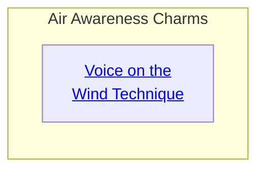
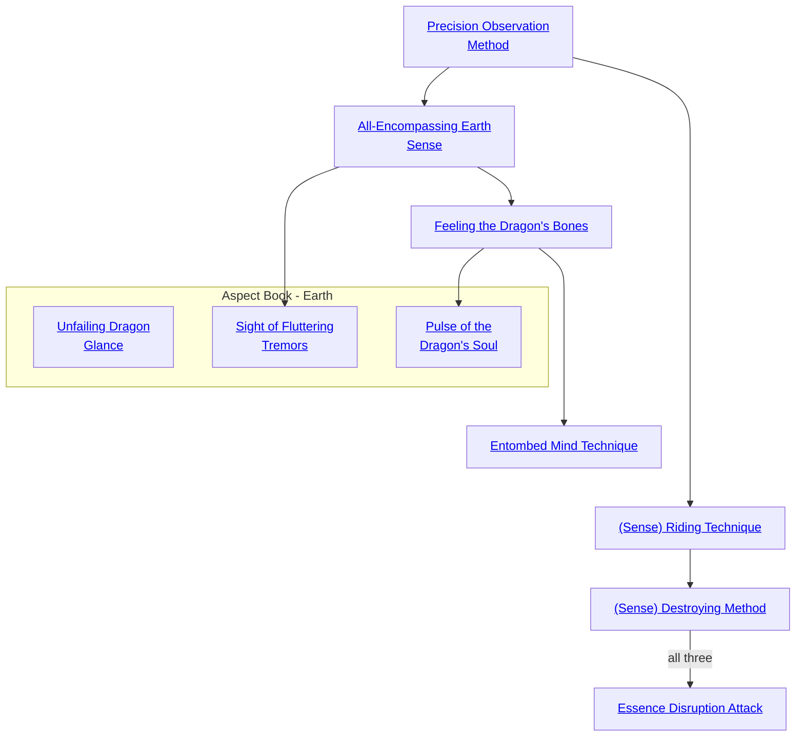

## Voice on the Wind Technique

Cost: 3 motes
Duration: 1 minute
Type: Simple
Minimum Awareness: 2
Minimum Essence: 2
Prerequisite Charms: None

Speech requires breath, the very air of life. Some
Dynasts of Air can extend their senses through the air and
so listen to what people say far away. The farther away a
character wants to eavesdrop, the more difficult the Charm
becomes: For a simple success, an Aspect of Air can clearly
hear normal speech from a hundred feet away. The character
also gets a general sense of the target's direction (assuming
she doesn't know already). For each additional point of
difficulty, that range increases by a factor of ten. For each
additional dot of Essence the character has, the base distance
increases by a factor of ten. A powerful Air-attuned lord can
- with great difficulty — hear voices throughout the world.
(The Empress certainly seemed to have this knack.)
This Charms comes with limitations. The character
must specify a single person he wants to spy upon: He
cannot, for instance, declare that he will &quot;listen for people
plotting against me.&quot; At most, he can make a list of
suspected enemies and eavesdrop on them one by one. The
character cannot hear anything spoken in an airtight
chamber. Many of the powerful Dynasts build such cham-
bers for their privy councils, specifically to defeat this
Charm. Finally, listening to a person from so far away
demands total concentration: The character cannot per-
form any other action while hearing voices on the wind.
Cascade Charms:
• A more powerful Charm could have a longer dura-
tion, allowing a character to listen in on another character
for a full hour, or even longer — but still only one person
at a time.
• Alternatively, the character can listen to any
conversation or other noises at a specific location far away.
In this case, the character must objectively define a precise
spot (such as &quot;the kitchen in Lord Peleps' villa&quot; or &quot;the
interior of that carriage down the street&quot;).

## Precision Observation Method

Cost: 1 mote per two dice
Duration: Instant
Type: Reflexive
Minimum Awareness: 2
Minimum Essence: 1
Prerequisite Charms: None

Everything that walks, flies or swims is in some way
connected to the earth, and the elements of air and water
both rest upon the firmament. By grounding her Essence
into the earth, a Dragon-Blood can greatly increase her
sensitivity to things around her. Each mote invested in this
Charm enhances the character's Awareness by two dice
for a single roll only. The character cannot more than
double her Awareness with this Charm.

## All-Encompassing Earth Sense

Cost: 2 motes
Duration: One scene
Type: Simple
Minimum Awareness: 2
Minimum Essence: 2
Prerequisite Charms: Precision Observation Method

While under the aegis of this Charm, the character
cannot be surprised by any means, magical or otherwise.
This doesn't make her able to see the invisible or anything
of the sort. It just means that she cannot be struck by an
attack she is not aware of.
This Charm can be extended to the character's companions
by merely spending 2 extra motes per person to be
so affected. All-Encompassing Earth Sense is not effective
unless the character is standing on the ground. She need
not be touching the earth itself - the Charm functions
just fine inside structures, etc. — but may not be flying,
swimming and so forth. Engaging in any of these activities
breaks the Charm immediately.

## Feeling the Dragon's Bones

Cost: 2 motes
Duration: Instant
Туре: Simple
Minimum Awareness: 3
Minimum Essence: 2
Prerequisite Charms: All-Encompassing Earth Sense

By taking a few moments to attune herself to the pulse
of the Earth Dragon, the Dragon-Blooded invoking this
Charm can sense the shape of things that sit upon the Earth
Dragon's back, as well as those beings that walk upon it.
The Dragon-Blood's player rolls Intelligence + Awareness.
With a simple success, the character instantly gets a
complete but vague mental picture of the surrounding
area, up to her Awareness x 25 feet distant. This mental
picture includes living beings. Further successes refine the
image. One success might yield, &quot;The next room is about
10 x 10 with three humanoid beings in it.&quot; Three successes
might impart, &quot;The next room is obviously a guardroom,
containing three Wyld barbarians, each carrying a large
stone club.&quot; Five successes would yield all of the above
information, plus estimates of the various strengths of the
three barbarians, what armor they are wearing and exact
details on where they are standing.
To be properly sensed, an object or being must actually
be touching the earth or touching something directly
touching the earth in some fashion Objects floating in the
air or immersed in water would not be affected for instance.
The range of this Charm is doubled for every additional
mote of Essence spent. This Charm is especially
effective underground or in all stone structures, since they
are actually embraced by the earth. Double the range while
using the Charm, in such circumstances, and all details of
the surrounding areas are perceivable.

## Entombed Mind Technique

Cost: 5 motes
Duration: Five minutes
Type: Simple
Minimum Awareness: 4
Minimum Essence: 2
Prerequisite Charms: Feeling the Dragon's Bones

Earth is the most static and quiescent of the elements,
and while it's all encompassing nature enhances the awareness
of the Earth-aspected Dragon-Bloods, it also allows
them to suppress this awareness in others.
This Charm enables a Dragon-Blooded character to
infuse some of stone's somnolent stasis into another person's
mind, putting them to sleep. Some Dynasts work this
Charm by speaking in a low, droning voice; others prefer
to use a glittering gemstone, such as the jewel in a ring, to
fix their victim's attention and convey the flow of Essence.
The character can only bury someone's mind if she can
keep them sitting still for five minutes, so this Charm calls
for a fair bit of guile.
The Dragon-Blood's player rolls Manipulation + Presence,
with a difficulty equal to the target's Essence. Simple
success causes the target to sleep for an hour, and each
extra success adds one hour to the total. During that time,
nothing, not noise, light or movement, will awaken the
victim. You could send the entire Red-Piss Legion past
with clashing cymbals, and he wouldn't wake up. At the
end of this period, the victim passes into normal slumber.
While in the grip of magic sleep, the victim dreams
strange, still dreams of the caves beneath the earth and the
mysteries within them. Once in a while, someone wakes up
afterward knowing where to dig a well that never goes dry
or the location of a deposit of ore.

## Sense Riding Technique

Cost: 4 motes
Duration: Until disrupted
Type: Simple
Minimum Awareness: 3
Minimum Essence: 2
Prerequisite Charms: Precision Observation Method

A Dragon-Blood truly in tune with the world can
project her sense into others, riding along and perceiving:
things from a great distance.
This Charm is actually three separate Charms, together
encompassing all of the five senses. The target must
be visible to the character when the Charm is activated but
may leave the character's sight after the activation. The
maximum range at which these Charms function is the
character's permanent Essence in miles.
When activated, a roll is made; pitting the Dynast's
Awareness + Essence against the target's in a reflexive
opposed roll. The Dynast needs but a single success to
invoke the Charm. If the Dynast ties the target, there is no
effect. If the target is an Exalted and beats the Dragon-
Blood, his player gers to make a reflexive Awareness roll
with a difficulty of 3 to sense that someone was trying to
Sense Ride him. Players of normal mortals get no such roll,
and they remain unaware of the enchantment.
While Sense Riding, a character may not take any sort
of disruptive action whatsoever. It is best to sit quietly and
just observe the sense ridden. Simple actions such as sitting
on a slowly walking horse may be possible at the Storyteller's
option, but the character may be in danger of missing
important details of what is being observed. If the target is
injured (takes any health levels of damage) while being
sense ridden, the character takes an unsoakable level of
bashing damage, and the Charm is disrupted.
The effects of riding each sense are detailed below:
Sight: The character may perceive anything the target
sees, including any magical enhancements that the target
applies to his own senses while the character is &quot;riding&quot; him.
The character may only observe through the ridden target's
eyes. The character cannot use Charms or sorcery or other-
wise affect the world around the target through the channel
of the shared sense, though it might provide targeting
information for some other sort of attack.
Hearing &amp; Touch: The character may perceive
anything the target hears or touches, including any magi-
cal enhancements that the target applies to his own senses
while the Exalt is &quot;riding&quot; him. This perception does not
give the Dragon-Blooded the ability to understand languages
she doesn't know, even if the person being ridden
understands them.
Smell &amp; Taste: This Charm is probably the least used
of the three, but a truly thorough Dynast may wish to leam
it. When combined with the other three Charms, it
provides a complete picture of the target's environment
and surroundings. As with the other (Sense)-Riding
Charms, the character may perceive anything the target
does with his sense of smell and taste, including any
magical enhancements that the target applies to his own
senses while the character is &quot;riding&quot; him.

## Sense Destroying Method

Cost: 3+ motes, 1 Willpower
Duration: One turn per point of permanent Essence
Type: Supplemental
Minimum Awareness: 4
Minimum Essence: 3
Prerequisite Charms: (Sense)-Riding Technique for the appropriate sense

This Charm is a cluster of three Charms just like
(Sense) Riding Technique, and it functions in much the
same way. However, instead of tapping into the target's
senses, the character simply shuts them down. When this
Charm is activated, the Dynast's player makes an Essence
+ Awareness roll with a difficulty equal to the target's
Perception. The effects for each sense are detailed below.
Sight: Each extra success subtracts one die from the
target's Awareness rolls relating to sight and adds a -1
penalty to any task involving sight. If the character's extra
successes exceed the target's Perception, the target is
blinded completely for the Charm's duration.
Hearing & Touch: Each success subtracts one die
from the targer's Awareness rolls relating to these senses
and allows him to ignore one level of wound penalties. If
the character's roll exceeds the target's Perception, the
target is rendered completely deaf but also suffers no
wound penalties for the Charm duration. Some enterprising
Dynasts use this Charm on their minions before
sending them into combat — but are careful to give them
explicit instructions before doing so.
Smell & Taste: Each success subtracts one die from
the target's Awareness rolls relating to these senses. If the
Exalt gains more successes than the target's Perception, he
is rendered completely unable to smell or taste for the
Charm's duration.
A Dynast may not use this Charm on herself.

## Essence Disruption Attack

Cost: 3+ motes, 1 Willpower
Duration: One turn per dot of permanent Essence
Type: Supplemental
Minimum Awareness: 5
Minimum Essence: 4
Prerequisite Charms: All three (Sense) - Destroying Method Charms

After perfecting the art of suppressing another's physical
sense, a truly skilled Earth-aspected Dynast can actually
use his own Essence to suppress his victim's ability to
perceive and manipulate Essence. The character must pay
the base cost of the Charm, plus any additional motes. The
maximum number of additional motes that the Exalt can
spend is equal to her permanent Essence.
Her player then makes an Awareness + Essence roll with
a difficulty of 3 for the Exalt to correctly judge the patterns of
Essence around the target, who must be insight and no farther
away than 10 x the character's permanent Essence in feet. If
the roll succeeds, the player makes a Willpower + Essence roll
against a difficulty of the target's Essence. Each extra success
on this toll adds I mote to the cost of all Charms and sorcery
used by the target, to a maximum penalty equal to the amount
of extra Essence the character spent activating this Charm.
This surcharge applies to.every activation ofa Charm,
meaning it may be paid multiple times per turn if an Exalt,
for example, uses reflexive defensive Charms, If Combos
are involved, then the surcharge is applied to every Charm
in the Combo, every time one of those Charms is activated.
The effects of the Charm linger for a number of
turns equal to the Exalt's permanent Essence.

## Unfailing Dragon Glance

Cost: 2 motes
Duration: Instant
Type: Reflexive
Minimum Awareness: 2
Minimum Essence: 2
Prerequisite Charms: None

The character hesitates and looks more carefully, a
quick flare of Essence pushing aside all distractions. Her
player may reroll a single Awareness roll but must take
the new results over the old. The Dragon-Blood cannot
use this Charm more than once for the same action. If
Unfailing Dragon Glance is part of a Combo, Essence
must be spent to reactivate all the other Charms in that
Combo when the reroll takes place. If those Charms
have separate dice rolls associated with them, they are
not rerolled.

## Sight of Fluttering Tremors

Cost: 4 motes
Duration: Indefinite
Type: Simple
Minimum Awareness: 5
Minimum Essence: 3
Prerequisite Charms: All-Encompassing Earth Sense

Upon activating this Charm, cataracts like white
jade cloud over the character's eyes, and he becomes
blind for the duration of the effect. In exchange, the
Dragon-Blood gains a preternatural awareness of vibrations
echoing through the air and ground. He can &quot;see&quot;
in any or all directions at once as desired, simultaneously
perceiving the shape and exact location of all objects
within half the range of his normal vision or his (Awareness
x 10) yards, whichever is less. Beyond this range,
objects and sounds blur together and have no coherent
meaning. Darkness and environmental conditions impairing
true vision do not normally hinder the &quot;vision&quot;
granted by this Charm, although magical obfuscations
and effects that muffle sound may create regions of
murky vision. Within a radius of (Awareness + Essence)
yards, the character can even see through and around
thin walls and other blocking physical obstructions by
sensing the vibrations passing through the interrupting
objects. Thick walls obscure and disrupt echoes too
much to allow vibration sight to peer around them
without a substantial crack or flaw through which sounds
can flow. This omnidirectional perception makes the
character difficult to surprise, adding one automatic
success to all Awareness rolls made to avoid ambush.
Despite the obvious utility of sensing vibrations, the
sense is not sight and cannot fully replace vision. Vibrations
do not convey colors or shades, making it impossible
to read or otherwise notice exclusively visual information.
Characters can recognize people and objects they
have &quot;viewed&quot; with vibration sight previously, using
their memory of profiles and surface contours.
Dragon-Blooded who know this Charm can reflexively
spend four additional experience points as insurance
against blindness. Should such characters ever become
truly blind for any reason (whether temporarily as the
result of magic or permanently from maiming), they gain
the full effects of this Charm for the duration of their
blindness without spending any Essence. This special
benefit vanishes if a character regains her sight.

## Pulse of the Dragon's Soul

Cost: 1 or 3 motes
Duration: One turn
Type: Reflexive or Simple
Minimum Awareness: 5
Minimum Essence: 3
Prerequisite Charms: Feeling the Dragon's Bones

The Dragon-Blood concentrates and spends 3 motes
as a simple action, allowing his consciousness to flow
down and outward through the Essence currents of the
earth. For a moment, he experiences the land as an
extension of his own body and perceives the unnatural
wounds and blights of all shadowlands and Wyld zones
within a number of miles equal to his permanent Essence.
He cannot gauge the strength or direction of these
tainted regions unless they are within a mile, in which
case he can determine the rough size, shape and potency
of the blights. The character can also sense all Manses
and Demesnes within a mile, but only as wellsprings of
power. He knows where these sites are and whether they
are weak (rating 1-2) or strong (3-5), but he cannot
differentiate between Manses and Demesnes or identify
a site's type (Earth, Solar, Celestial, etc.). At the end of
a turn, the mystical perception fades, and the character's
senses withdraw back into his flesh.
In addition to the Charm's active use, Pulse of the
Dragon's Soul activates reflexively for a cost of 1 mote
whenever a character crosses into a shadowland or Wyld
zone without realizing it. The Charm does not activate
itself if the character already knows the nature of his
location. The character becomes immediately aware of
the blighted energies of his new location and their
overall type, but he does not gain the full awareness of
the surrounding terrain as with conscious activation of
the Charm.
