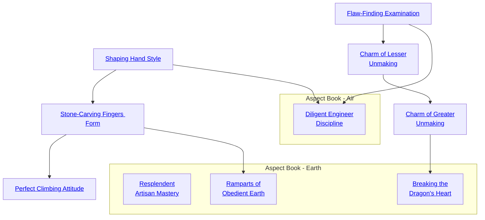

## Shaping Hand Style

Cost: 2 motes
Duration: One hour
Type: Simple
Minimum Craft: 2
Minimum Essence: 1
Prerequisite Charms: None

The Terrestrial Exalted's basic and close connection
with the things of the earth gives them great facility in
manipulating the rude stuff that makes up the world. The
most basic trick any Exalted craftswoman learns is that
tools are, to a large extent, an illusion. It is the force of will
that drives the act of creation, not the material items one
uses to shape things.
This Charm bears that out. While the Charm is in
effect, one of the character's hands may perform the
function of any one normal tool. The character must
decide what tool he wants to emulate when the Charm is
activated. Whether it be a pick axe, hatchet or hammer,
the Dragon-Blooded's bare hand fulfills the function quite
nicely. The character takes no damage that a normal tool
would not normally endure and can perform any normal
function the tool is capable of - and can use her hand
normally as well. The Exalt's hand does not take on the
appearance of the tool in question.
The shaping hand only emulates the selected tool. If
the character wants to switch functions, she has to activate
the Charm again. Both hands can be enchanted separately
using this Charm.

## Stone-Carving Fingers Form

Cost: 1 mote per cubic foot
Duration: Instant
Type: Simple
Minimum Craft: 3
Minimum Essence: 2
Prerequisite Charms: [[#Shaping Hand Style]]

This Charm is extremely popular with Earth-aspected
Exalts because it forms the prerequisite for so many others.
It enables the character to split stone with uncanny
precision. Aside from its usefulness in siege — craft breach.
ing walls and the like — the character can make all manner
of useful items out of stone.
The character must spend at least a full minute care.
fully striking at the stone. Most characters will use a hammer,
pick of chisel, but a sword pommel or another rock will do
just as well. Characters trained in martial arts might strikes
with their bare hands. An the end of the minute the
character strikes a final blow and the excess rock shatters,
leaving behind the shape the character wanted.
Roll Wits + Craft. With a simple success, a character
can quarry stone blocks ready for use in building or knock
a doorway in a wall. With three successes, she can craft an
obsidian vase, already hollowed out. With five successes,
she can produce a portrait statue so realistic that a person
might mistake it for the actual person, turned to stone.
The Essence cost of this Charm depends on the
volume of the finished object: 1 mote of Essence per cubic
foot of stone.

## Perfect Climbing Attitude

Cost: 1 mote
Duration: One scene
Type: Simple
Minimum Craft: 3
Minimum Essence: 2
Prerequisite Charms: [[#Stone-Carving Fingers Form]]

The Dragon-Blooded of Earth include some superb
mountaineers and rock-climbers, many as a result of this
Charm. Not only may a character using this Charm cling
to a rock face like a limpet, she leaves indentations in the
rock that other people can use as hand- and footholds,
making the climb easier for them. The Earth-aspected
Exalt literally crafts a ladder out of a sheer rock surface as
she climbs it.
The character can climb a sheer stone wall at a rate of
10 feet per turn, 20 feet or more per turn up a rough cliff-face
(or a surface where someone already made handholds
in the rock). No Ability roll is needed. Those following the
character up the cliff face are considered to have two
automatic successes for any climbing check.
Surfaces that are worse than sheer, such as overhangs,
call for multiple successes.

## Flaw-Finding Examination

Cost: 1 mote for touch, 3 for sight
Duration: One minute
Type: Simple
Minimum Craft: 3
Minimum Essence: 1
Prerequisite Charms: None

By simply studying any crafted or created item, object
or structure, a Dragon-Blooded using this Charm may
determine that item's weakest point. This knowledge can
be used to locate and eliminate flaws – or exploited to
destroy the object.
To use this Charm, the character must study the
object in question for at least a full minute. If the Exalt is
able to handle or touch the thing being studied, the Charm
costs only a single mote. Studying an object from a distance
costs 3 motes.
Once the flaw has been determined, the character
has two options. If the Dynast wants to try and eliminate
the flaw, roll her Intelligence + Craft score and
spend a point of Willpower. If the roll succeeds, the
object is repaired - this Charm can effect the most
serious repairs without tools, though something badly
broken may have many flaws.
If the character wants to damage the thing in ques-
tion, the Flaw-Finding Examination is much simpler. The
next successful physical attack the character makes on the
target does double normal damage. If the Exalt is targeting
something such as armor or a weapon, treat it as doubling
the extra successes of a disarming attempt. If the disarming
attempt succeeds, the weapon or armor is destroyed.

## Charm of Lesser Unmaking

Cost: 5 motes
Duration: Instant
Type: Simple
Minimum Craft: 5
Minimum Essence: 3
Prerequisite Charms: [[#Flaw-Finding Examination]]

The Charm of Lesser Unmaking allows a Dynast to
disassemble an object or structure without actually damaging
any of its components. An item affected by this Charm
is broken down into its component pieces.
For instance, if a Dragon-Blood was to use the
Charm of Lesser Unmaking on a heavy wooden door
bound in steel bands, the end result would be a stack of
timbers, some hammered steel bands and a small pile of
rivets. Items disassembled in this manner are rendered
useless until put back together. Enchanted items are
neutralized until reconstructed, but the Charm does not
permanently disrupt such enchantments.
When the Charm of Lesser Unmaking is invoked, the
character's player makes an Essence + Craft roll. The
difficulty for this roll is 1 for simply constructed items
(crudely made stone hatchets, huts lashed together with
vines), 3 for sturdily or competently made items (a well-
constructed sword, iron chains, the aforementioned door)
and 5 for intricately or masterfully made items (a finely
crafted piece of jewelry, a finely forged weapon). If the item
in question is enchanted in any way, add i to the difficulty,
meaning most enchanted items are difficulty 6 to disassemble.
The maximum volume that a Dynast can affect.
with the Charm of Lesser Unmaking is equal to her
Essence in cubic yards.
Unmaking will hot work on any item that is made in
one piece (i.e., a vase, stone carving or the like). However,
it will undo knots and reduce chains to their component
links. Lesser unmaking is a somewhat time-consuming
process. The Exalt must also remain in contact with the
item for a number of turns equal to the unmaking difficulty,
and it cannot be done as a combat maneuver.

## Charm of Greater Unmaking

Cost: 10 motes, 1 Willpower
Duration: Instant
Type: Special
Minimum Craft: 5
Minimum Essence: 4
Prerequisite Charms: [[#Charm of Lesser Unmaking]]

This Charm functions much like Lesser Unmaking
but with much more dramatic effects. Rather than just
being taken apart, an item affected by Greater Unmaking
is actually reduced back to its raw materials. Sword blades
melt into hunks of raw iron. Timbers turn to freshly cut
logs. Glittering gemstones return to their uncut state. Fine
pottery melts to clay.
When the Charm is used, roll the character's Essence
+ Craft. This roll is difficulty 1 for normal items constructed
through standard methods, but difficulty 3 for
exceptionally crafted or constructed things and 5 for items
forged from the Five Magical Materials. The Exalt must
also remain in contact with the item for a number of turns
equal to the difficulty. The maximum volume that a
Dynast can affect with the Charm of Greater Unmaking is
equal to her Essence in cubic yards. This Charm is only
effective against items made of materials in some way
derived from the earth.
Items that are unmade are completely destroyed,
reduced to their component materials. Whatever is un-
made must be remade from scratch. The raw materials
retain any inherent value, of course.

## Diligent Engineer Discipline

Cost: 3 motes, 1 Willpower
Duration: Instant
Type: Simple
Minimum Craft: 4
Minimum Linguistics: 1
Minimum Essence: 3
Prerequisite Charms: [[#Shaping Hand Style]], [[#Flaw-Finding Examination]]

Not every project can have a top-notch savant on
hand to oversee it at every stage, and many of the most
skilled savants are kept far too busy to personally
attend to every detail of execution, even of the projects
they do supervise. Through the use of this Charm, a
savant may produce a detailed and comprehensive
report and set of instructions that encapsulate the
research and design phases of a project. This plan may
then be given to the person or people actually performing
the work, who will benefit from the expertise
of the planning savant.
The character using Diligent Engineer Discipline,
after familiarizing herself appropriately with the details
of the proposed undertaking, pays for the
activation of the Charm and takes the normal amount
of time to prepare a plan, the player rolling her
character's Intelligence + Craft at a difficulty of 2.
Anyone faithfully working from this plan can avoid a
total number of difficulty penalties during the under-
taking equal to the number of successes rolled by the
planning savant. In addition, he cannot fail to at least
achieve at least minimal success on the finished project
so long as no circumstances arise that would result in
difficulty penalties greater than those the Charm's
effects cancel.

## Resplendent Artisan Mastery

Cost: 3 motes per success
Duration: Instant
Type: Supplemental
Minimum Craft: 3
Minimum Essence: 3
Prerequisite Charms: Any three Craft Charms

A Dragon-Blooded with this Charm learns to apply
divine majesty to his chosen art, developing a
signature style of breathtaking prowess. The character
may convert specialty dice for any Craft roll into
automatic successes for a cost of 3 motes per die converted.
Exalted may use this Charm to benefit any Craft
they have a rating in, provided they are exercising a
specialty for that Craft.

## Ramparts of Obedient Earth

Cost: 2 motes per cubic yard
Duration: Instant
Type: Reflexive
Minimum Craft: 4
Minimum Essence: 3
Prerequisite Charms: [[#Stone-Carving Fingers Form]]

The Dragon-Blood stamps hard or smites the earth
with his fist, and a shockwave of Essence and force
ripples across the ground from the point of impact. This
shockwave can crudely shape and pack one cubic yard of
soil for every mote spent, but the continuous structure
must have at least one edge within a yard of its creator.
Ramparts of Obedient Earth can only shape soil, but it
may affect mud, sand and even hard-packed dirt liberally
strewn with pebbles. The Charm has no effect on solid
rock of any density.
Dragon-Blooded chiefly use this Charm on the
battlefield to quickly erect cover for themselves or others
(using the standard rules for cover on pages 229-230 of
Exalted), though creative applications can wreak havoc
on a cavalry charge and disrupt formations of infantry.
Anyone unfortunate enough to be standing on the
ground when it buckles or collapses into a sinkhole
suffers no damage unless an extremely deep excavation
prompts an injurious fall, but such characters suffer
immediate knockdown unless their players make a successful
Dexterity + Athletics roll at standard difficulty.
Outside of combat, this Charm has considerable utility
for excavation work of all kinds, especially since the
heavy compression of displaced earth allows for the
creation of extremely stable tunnels. In general, walls of
packed earth roughly a yard thick have a soak of 5L/8B
and require 20 health levels to damage and 30 to destroy
outright. These statistics will fluctuate wildly depending
on a given structure's thickness and architectural stability.
Characters may only use this Charm once per turn.

## Breaking the Dragon's Heart

Cost: 5 motes, 1 Willpower, 1 health level
Duration: Instant
Type: Simple
Minimum Craft: 5
Minimum Essence: 4
Prerequisite Charms: [[#Charm of Greater Unmaking]]

The Dragon-Blood holds a Hearthstone in his hand
and crushes the gem in his fist. Such is the power and
exacting skill of this grip that the stone shatters. Use of
this Charm requires a Wits + Craft (Jewelry) roll against
a difficulty of the Hearthstone's rating + 2. A botch
causes the stone to explode, inflicting dice of unsoakable
aggravated damage to the Exalt equal to the difficulty of
the Craft roll. If the character suffers two or more levels
of damage from a botch, the explosion of Essence also
costs him the hand holding the gem. On a failure, the
Hearthstone remains undamaged. Success breaks the
gem safely, releasing its store of Essence in a surge of
power. If attuned to the Manse generating the Hearthstone,
the Exalt regains a number of motes equal to the
rating of the Hearthstone x 10. If this surge would bring
his Essence pool above maximum, the excess motes
bleed into his anima banner as if spent from his Peripheral pool.
The act of shattering a Hearthstone with this
Charm manifests as a deafening thunderclap and a flash
of light brighter than the noonday sun.
This Charm is chiefly intended to break Hearthstones
removed from settings. It cannot be used in
combat or against Hearthstones still in their settings.
Breaking a Hearthstone has negative effects on the
geomancy of the Manse. Dragon-Blooded Dynasts
who use this Charm to cannibalize family Hearthstones
without an extremely good reason may not be
permitted to reclaim the gems when they reform.
Soldiers of Lookshy can expect even harsher sanctions
from their superiors. Other outcastes may or may
not suffer social ramifications for use of this Charm,
depending on who owns the Manse generating the
Hearthstone they destroyed.
