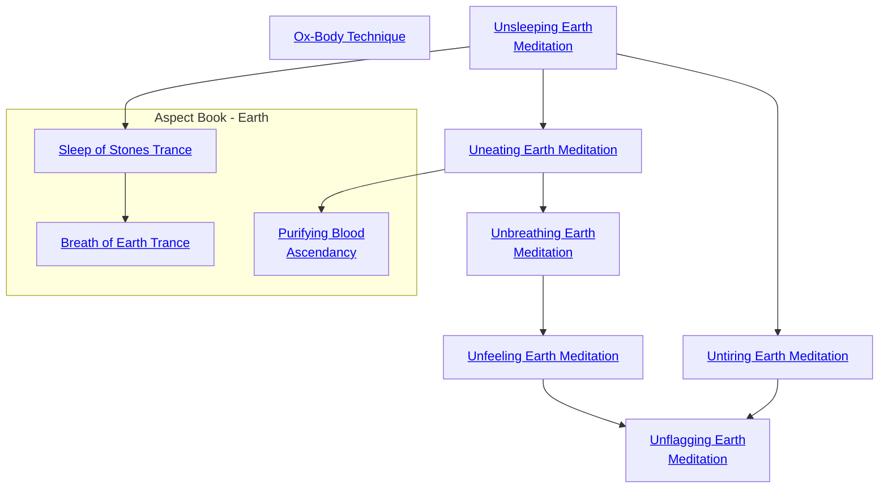

## Ox-Body Technique

Cost: Permanent
Duration: None
Type: Special
Minimum Endurance: Varies
Minimum Essence: 1
Prerequisite Charms: None

The Terrestrial Exalted may not be quite as resilient
as the Anathema they oppose, but they can still take a good
deal more punishment than normal humans. Like their
Solar enemies, the Dragon-Blooded may buy extra health
levels as if they were a Charm.
Each level of the Dragon-Blooded Ox-Body Technique
provides one - 1 and one -2 health level. Characters
cannot take Ox-Body Technique more times than they
have points of Endurance.

## Unsleeping Earth Meditation

Cost: 1 mote
Duration: One day
Type: Simple
Minimum Endurance: 2
Minimum Essence: 2
Prerequisite Charms: None

By simply invoking the strength of the Earth Dragon, a
Dragon-Blooded using this Charm is able to go without sleep
for 24 hours without ill effect. The character suffers no penalties
of any kind during this period due to fatigue from sleep and is
fully alert. The character still has to rest from physical exertion.
Using this Charm for more than the character's Essence
+ Endurance days is not recommended. For every
day past that point, the Exalt loses one temporary Willpower
per day. This Willpower cannot be recovered until
he has had at least 24 hours of uninterrupted sleep.

## Uneating Earth Meditation

Cost: 2 motes
Duration: One day
Type: Simple
Minimum Endurance: 3
Minimum Essence: 2
Prerequisite Charms: [[#Unsleeping Earth Meditation]]

Stone does not need nourishment, and with this Charm,
neither do the Dragon-Blooded. A character under the influence
of this Charm does not need to eat or drink. The Exalted
functions perfectly well with no nourishment whatsoever and
suffers none of the penalties associated with hunger.
Using this Charm for more than the character's Essence
+ Endurance days is remarkably hard on the body. For
every day past that point, the character loses one bashing
health level per day, which cannot be healed until use of the
Charm is discontinued. Most Terrestrial Exalted using this
Charm for extended periods tend to go without its effects for
a day or two before reinvoking it.

## Unbreathing Earth Meditation

Cost: 2 motes
Duration: One scene
Type: Simple
Minimum Endurance: 4
Minimum Essence: 2
Prerequisite Charms: [[#Uneating Earth Meditation]]

The mountains do not breathe, Neither need a Dynast who
has mastered this Charm. For the rest of the scene after activating
this Charm, the Dragon-Blooded does not breathe. She can
survive under water, in clouds of poison gas and in other
asphyxiating environments with no ill effects whatsoever,
Keep in mind that, for the duration of the Charm, the
character is incapable of breathing. This also means that
speech is out of the question, since the noise of it is caused
by expelled air. This Charm can be used on others, if they
are willing. All the character need do to affect a voluntary
target is to simply touch him.

## Unfeeling Earth Meditation

Cost: 3 motes, 1 Willpower
Duration: Varies
Type: Reflexive
Minimum Endurance: 3
Minimum Essence: 2
Prerequisite Charms: [[#Unbreathing Earth Meditation]]

The pain and frailty of mortal flesh may be avoided for very
short periods of time by the invocation of this Charm. Once
active, the character may ignore all wound penalties fora number
of turns equal to his Stamina + Endurance. This Charm does
nothing to actually protect the character from damage — it only
temporarily alleviates the symptoms of injury.

## Untiring Earth Meditation

Cost: 5 motes, 1 Willpower
Duration: One day
Type: Simple
Minimum Endurance: 3
Minimum Essence: 2
Prerequisite Charms: [[#Unsleeping Earth Meditation]]

This Charm roots the Dragon-Blooded's Essence down
into the elemental Earth, magically sustaining him. As long as
the Dragon-Blood's feet touch the earth once every two turns,
he incurs no fatigue whatsoever from any source, whether it be
armor, encumbrance, great physical exertion or magical effect.
This Charm does not relieve fatigue already present when it is
invoked, however. The Dynast under the influence of the
Charm also may ignore wound penalties up to his permanent
Essence rating. If the character does not touch the earth at least
once every two turns, this Charm is instantly disrupted.

## Unflagging Earth Meditation

Cost: 3 motes + 1 Willpower per person
Duration: Until satisfied
Type: Simple
Minimum Endurance: 4
Minimum Essence: 4
Prerequisite Charms: [[#Unfeeling Earth Meditation]], [[#Untiring Earth Meditation]]

As well as protecting an Exalted's flesh from harm, the
steady strength of the Earth Dragon can be used to fuel the
inner flame of vengeance. This Charm is invoked through
speaking aloud the terms of the vendetta, to which the
character commits himself with all his soul: The goal must be
a simply stated purpose such as: &quot;Find the person who killed my
father&quot; or &quot;Avenge the stain to my honor inflicted upon me
by the cowardly vassal of the Lord of Singing Birds.&quot;
Until the terms of the vendetta are fulfilled, the Exalted
does not need to eat, sleep or rest, so long as he remains in
pursuit of the vendetta. The character incurs no penalties
from any sort of fatigue, whether it be magical or natural. He
will walk tirelessly and fight tirelessly in pursuit of his aim
and takes no fatigue from armor. He may soak both lethal
and bashing damage with his Stamina, and he adds his
Endurance to both his lethal and bashing soaks.
Unflagging Vengeance Meditation can be sustained without
ill effect for up to the Exalt's Essence in days. After that, the
character begins losing one health level of unsoakable bashing
damage every time his Essence in days passes. The Exalted
grows pale and draw, his face ser into a mask of vengeance.
These health levels may be healed only after the Charm is
allowed to lapse. Healing damage taken from this effect of the
Unflagging Vengeance Meditation takes twice as longas usual.
A number of additional characters can join the vendetta
equal to the Essence of the character initiating the oath. Other
characters involved must each pay a point of temporary Willpower
to take the oath. Unflagging Vengeance Meditation ends
when either the vendetta is satisfied or the individual who
invoked it consciously stops it. If anyone involved terminates her
part in the oath prematurely, she takes a number of unsoakable
levels of lethal damage equal to sum of the permanent Essences
of the characters involved. This damage may not be reduced in
any fashion, either with armor or natural protection.

## Sleep of Stones Trance

Cost: 1 mote
Duration: One hour
Type: Simple
Minimum Endurance: 4
Minimum Essence: 2
Prerequisite Charms: [[#Unsleeping Earth Meditation]]

The Exalt assumes a meditative position and becomes
perfectly still, clearing his mind of all thoughts as
he locks his gaze forward without really seeing. The
character does not actually sleep or dream in this trance
and regains no Essence for meditating, but remains
peripherally aware of his surroundings. If the character
experiences any substantial distraction or interruption,
he may prematurely and reflexively snap out of his torpid
reverie to confront the situation. Ignoring the distraction
and remaining in the trance requires a Temperance
roll at standard difficulty. If the character goes a full hour
without leaving the trance, roll one die. Success restores
one point of Willpower, while a failure or botch indicates
the meditation provided no real benefit except to
pass the character's body. Characters may not use this
Charm more times in a day than their Endurance rating,
and trances broken by distractions count against this
limit. Dragon-Blooded with Essence 3+ may explicitly
use Sleep of Stones Trance to regain Willpower points
lost by overusing Unsleeping Earth Meditation, allowing
these disciplined stoics to go indefinitely without
sleep so long as they regularly meditate.

## Breath of Earth Trance

Cost: 2 motes
Duration: Until broken
Type: Simple
Minimum Endurance: 4
Minimum Essence: 3
Prerequisite Charms: [[#Sleep of Stones Trance]]

The character sinks into deep meditation, opening
her consciousness and soul to the breath of the Elemental
Dragons flowing through the world. Whenever the
character experiences a substantial distraction and after
each hour that passes, roll her Temperance to maintain
the trance. The difficulty starts at one and increases by
+1 after every two successive checks. A failure or botch
on any of these Temperance rolls breaks the meditation
and ends the Charm. For each hour the Exalt remains in
the trance, she recovers (her permanent Essence + 8)
motes. Hours spent using Breath of Earth Trance refresh
the soul even better than time spent asleep, possibly
supplanting the need for sleep altogether. Characters
using Breath of Earth Trance for at least four consecutive
hours may regain Willpower with a standard Conviction
roll, but players of Exalted only receive one Conviction
roll for their characters to regain Willpower each day
regardless of the number of hours they sleep or meditate
with this Charm.
Breath of Earth Trance only functions within
Creation. Dragon-Blooded cannot concentrate on
the Essence of their patrons inside the tainted energies
of a shadowland or Wyld zone, let alone in the
Deep Wyld, Malfeas, Autocthonia or the Underworld.
The sanctums of the little gods and the Celestial
City of Yu-Shan are considered part of Creation for
the purpose of this Charm.

## Purifying Blood Ascendancy

Cost: 5 motes, 1 Willpower
Duration: Instant
Type: Reflexive
Minimum Endurance: 4
Minimum Essence: 2
Prerequisite Charms: [[#Uneating Earth Meditation]]

The Terrestrial Exalted calls upon the blood of the
Elemental Dragons to awaken and cleanse her body of
dangerous impurities. Liquid Essence glows visibly as it
spreads through the arteries and veins beneath her skin,
growing into a web of vibrant pulsing light the color of
her anima. Characters can use this Charm to completely
rid themselves of a single disease they have contracted or
to completely nullify a single toxin currently present in
their bodies. Once this Charm has purged a disease or
poison, the character becomes completely immune to
that impurity and may ignore any and all future exposure
without a Resistance roll for a number of days equal to
her permanent Essence. Characters may also use this
Charm to cleanse all wounds of infection, which also
serves to make their bodies immune to any infection for
days equal to Essence. Purifying Blood Ascendancy does
not aid against magical plagues and poisons. Characters
may use this Charm while unconscious or otherwise
incapacitated, making this an effective defense against
paralytic venom.
