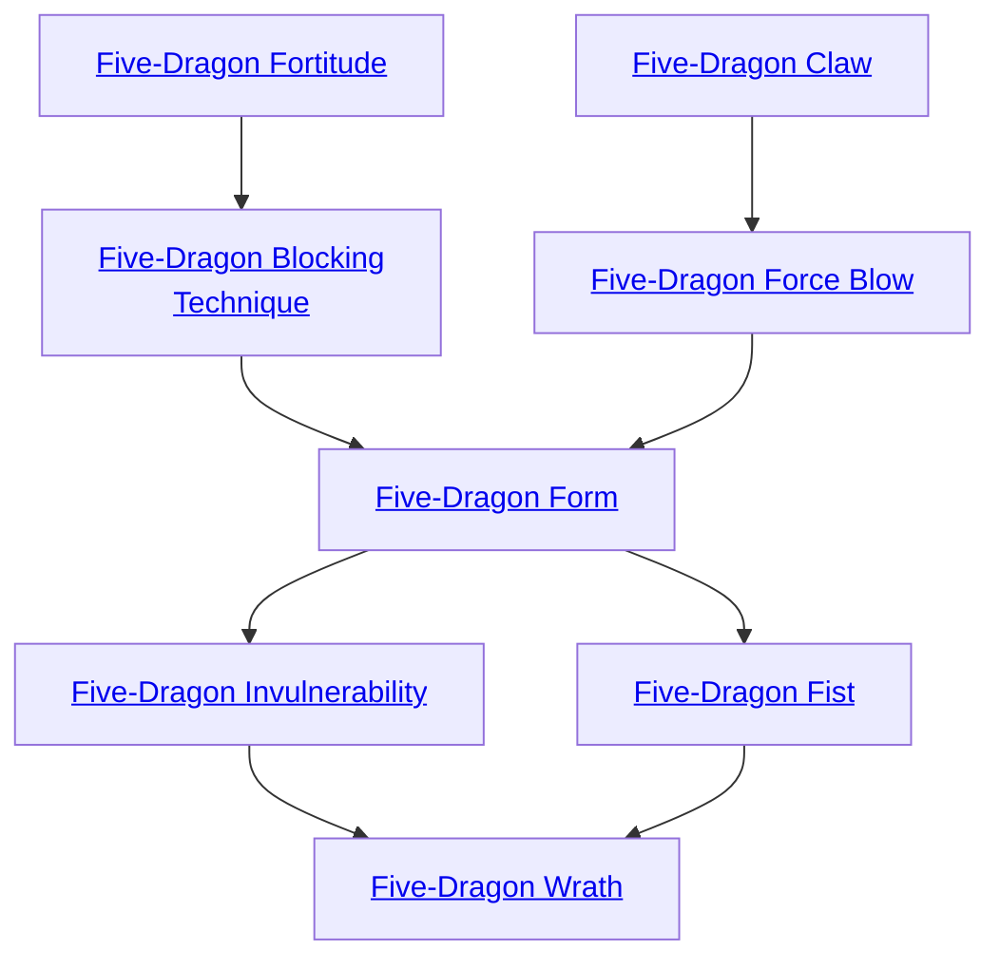
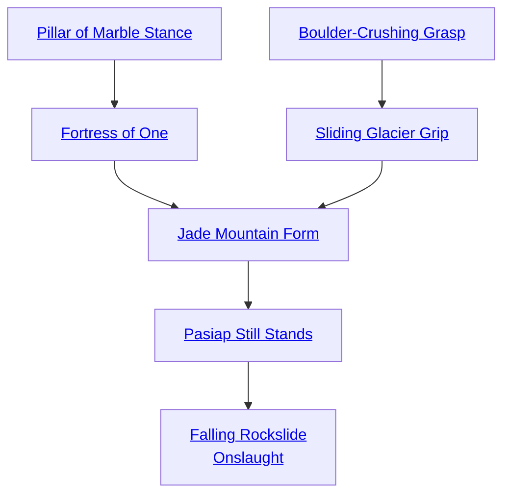

## Five-Dragon Fortitude

Cost: 1 mote per 2B or 1L
Duration: Instant
Type: Reflexive
Minimum Martial Arts: 3
Minimum Essence: 2
Prerequisite Charms: None

The armored scales of the Elemental Dragons can
afford great protection to their disciples. The Dragon-
Blooded using this Charm may invoke the colossal stamina
of the Dragons and soak the damage from one particular
attack by paying Essence. Soaking bashing damage costs 1
mote per two health levels of raw damage reduced. Lethal
damage costs 1 mote per health level of raw damage. This
soak is applied before damage is rolled and is compatible
with the use of armor.

## Five-Dragon Blocking Technique

Cost: 4 motes, 1 Willpower
Duration: One scene
Type: Simple
Minimum Martial Arts: 3
Minimum Essence: 2
Prerequisite Charms: Five-Dragon Fortitude

The powerful claws of the Elemental Dragons easily
bat away attacks upon them. This Charm lets a Dragon-Blood
emulate this ability, boosting parry prowess with a
weapon or allowing the Exalt to turn attacks aside with his
bare hands. For the remainder of the scene, the Dragon-Blood
may add his permanent Essence to all parry rolls,
even those made with Abilities other than Martial Arts.
This bonus is applied to parries made with split dice pools
after the multiple action penalty is applied, and the Charm
also allows the character to make reflexive parries at his
permanent Essence if he has no other way to parry an
attack. If he is unarmed, the character may parry lethal
damage without a stunt.

## Five-Dragon Claw

Cost: 1 more
Duration: Instant
Type: Supplemental
Minimum Martial Arts: 3
Minimum Essence: 1
Prerequisite Charms: None

The power of the Five Elemental Dragons can empower
a Dragon-Blooded's blows with deadly force. The
character does lethal rather than bashing damage on an
unarmed attack.

## Five-Dragon Force Blow

Cost: 2 motes
Duration: Instant
Type: Simple
Minimum Martial Arts: 3
Minimum Essence: 2
Prerequisite Charms: Five-Dragon Claw

The character makes a normal martial arts attack, but
he does double the normal base damage (extra successes do
not double). In addition to the normal damage of the
attack, roll the character's Strengths + Martial Arts in a
reflexive opposed roll against the targets Strength +
Resistance. If the character wins, the target is knocked
down and must spend an action clearing her head and
getting back to her feet See the knockback and knockdown
rules on pages 234-235 of the Exalted main rulebook.

## Five-Dragon Form

Cost: 5 motes
Duration: One scene
Type: Simple
Minimum Martial Arts: 4
Minimum Essence: 3
Prerequisite Charms: Five-Dragon Blocking Technique, Five-Dragon-Force Blow

Once a Dragon-Blooded has mastered the basic of the
Five-Dragon Path, she may master the physical emulation
of the Five Dragons. The Dynast tries to take on the aspect
and attitude of the Elemental Dragons. Her demeanor
becomes haughty and arrogant, her movements swift,
graceful and lethal.
This lethality is exhibited in her combat prowess. For
the remainder of the scene, the character may do lethal
damage with her martial arts attacks instead of the normal
bashing damage, and she may also soak lethal damage with
her bashing soak. She also adds her permanent Essence to
her Dexterity or Strength when determining her running
speed, jumping distance or the amount she can lift or carry.
Characters cannot use more than one martial arts
form-type Charm at a time. Using a form-type Charm ends
the effects of any other form-type Charm the character was
previously utilizing

## Five-Dragon Fist

Cost: 6 motes, 1 Willpower, 1 health level
Duration: Instant
Type: Simple
Minimum Martial Arts: 5
Minimum Essence: 4
Prerequisite Charms: Five-Dragon Form

With a mighty effort, the martial artist channels some
of the raw fury of the Five Elemental Dragons. The Dynast
makes a punch or kick attacking using his Dexterity +
Martial Arts, as usual. This attack does aggravated dam-
age. The Five-Dragon Fist cannot be placed in a Combo or
used by a character wielding a weapon — the energy of the
Five Elemental Dragons must be channeled purely.

## Five-Dragon Invulnerability

Cost: 5 motes, 1 Willpower
Duration: Instant
Type: Reflexive
Minimum Martial Arts: 5
Minimum Essence: 3
Prerequisite Charms: Five Dragon Form

Invoking this Charm allows the Exalt to completely
ignore damage from any single non-magical atrack. If the
attack is made with a weapon of the Five Magical Materials,
caused by sorcery or boosted with Charms, then the
character only receives a soak bonus to his lethal and
bashing soak equal to his permanent Essence.

## Five-Dragon Wrath

Cost: 1 mote per attack, 1 health level
Duration: Instant
Type: Extra Action
Minimum Martial Arts: 5
Minimum Essence: 4
Prerequisite Charms: Five-Dragon Invulnerability, Five-Dragon Fist

Suffused with the energy of the Five Elemental Dragons,
the Exalted explodes into a flurry of action. His hands
and legs become a blur of motion, and he unleashes an
unbelievable amount of devastation in the blink of an eye.
After invoking this Charm, the Dragon Blooded may
make an extra attack per mote spent, all against a single
target. All of these attacks are rolled as normal. If the target
dodges or parries, she makes one roll that is compared to all
the attacks. The maximum number of extra attacks a
Dynast can make is equal to his Essence.

## Pillar of Marble Stance

Cost: 1+ motes
Duration: Instant
Type: Reflexive
Minimum Martial Arts: 2
Minimum Essence: 2
Prerequisite Charms: None

The Exalt flexes and roots his Essence into the
earth, momentarily locked in a stance of balanced
immovability against any force. This Charm averts one
effect that would knock the Exalt down, back or otherwise move him from his current position, but it does not
prevent any associated damage. The character may
have his flesh reduced to rust by the fist of a Second
Circle demon, but his Essence-laden bones will stand
defiantly upright for a few seconds. This Charm costs 1
mote for the Exalt to prevent knockback, knockdown
or similar effects from non-magical forces. If a Charm or
other magic would move the character, the cost is the
permanent Essence of the attacker, but the Exalt cannot defend against magical forces created by beings of
higher Essence.
Pillar of Marble Stance only functions if the Exalt
touches the earth.

## Fortress of One

Cost: 2 motes per 1L/1B, 1 Willpower
Duration: One scene
Type: Simple
Minimum Martial Arts: 3
Minimum Essence: 2
Prerequisite Charms: Pillar of Marble Stance

The Exalt performs a slow kata with both feet
planted firmly on the earth. At the conclusion of these
ponderous movements, she freezes in place, while her
flesh visibly hardens to stone with Essence. She adds 1L/
1B to her natural soak for every 2 motes spent. She adds 1L/
all fatigue penalties regardless of exertion or encumbrance. There is no upper limit on how many motes a
character can channel into a single activation of this
Charm. Fortress of One ends immediately if the character fully exhausts her Essence pool, breaks contact with
the earth or moves more than a yard from her original
location for any reason, so wise Exalted reinforce their
position with Pillar of Marble Stance as needed to resist
the knockback of forceful impacts. Owing to the movement restrictions of this Charm, characters protected by
Fortress of One cannot dodge without a well-described
stunt approved by the Storyteller or appropriate magic
(such as Threshold Warding Stance, Exalted: The
Dragon-Blooded, p. 204). Finally, this Charm ends
immediately if characters attack with any weapons except those permitted by Jade Mountain Style.

## Boulder-Crushing Grasp

Cost: 3 motes
Duration: Until released
Type: Supplemental
Minimum Martial Arts: 2
Minimum Essence: 2
Prerequisite Charms: None

The Exalt seizes an opponent in a tightening clinch,
his muscles and joints creaking like a cliff before an
avalanche. If the clinch attempt succeeds, all damage
the Exalt inflicts on the grappled opponent is lethal
instead of bashing. This Charm ends as soon as the
character releases his hold. Exalted may also use this
Charm to enable similar feats of destructive gripping
strength, such as a bone-pulping handshake. Resolve
such attacks as lethal clinch attempts, except that victims
will not usually defend themselves from attacks
disguised as greetings.
Characters may only activate Boulder-Crushing
Grasp while touching the earth. If the character breaks
contact with the earth without releasing his victim,
the Charm remains active but his clinch reverts back
to bashing damage until he sets foot on the ground
once more.

## Sliding Glacier Grip

Cost: 4 motes, 1 Willpower
Duration: Instant
Type: Reflexive
Minimum Martial Arts: 3
Minimum Essence: 3
Prerequisite Charms: Boulder-Crushing Grasp

The Exalt holds an opponent with implacable
strength, preventing any possibility of ending a locked
struggle. This Charm may only be used immediately after
an opponent wins an opposed clinch roll. The opponent
loses the option of ending and escaping the clinch and
must, instead, inflict damage or hold the martial artist
without causing injury. Characters may only activate
Sliding Glacier Grip while touching the earth.

## Jade Mountain Form

Cost: 5 motes
Duration: One scene
Type: Simple
Minimum Martial Arts: 4
Minimum Essence: 3
Prerequisite Charms: Fortress of One, Sliding Glacier Grip

The Exalt strikes an impossibly forceful blow at the
earth beneath his feet and straightens to his full majesty.
His stature grows as he rises, adding nearly a foot of
height and 100 pounds of weight. More dramatically, a
second skin of stone rises and envelops the character's
flesh in a carapace of plates extruded out of Essence from
the ground itself. These plates absorb the character's
other armor into themselves as they grind into place,
allowing both forms of protection to coexist seamlessly.
The transformation evoked by Jade Mountain Form adds
the character's permanent Essence to his Strength and
Stamina, while allowing his augmented Stamina to soak
lethal damage as if it were bashing. Unfortunately, the
character's Dexterity drops by one dot in this transformed
state (to a minimum rating of 1), and his ground
movement speed drops to half its normal rate.
Two restrictions govern this Charm's use. First,
characters may only activate Jade Mountain Form while
in contact with the earth. If they break this contact for
more than a turn while the Charm remains active, the
Charm effects are immediately terminated. Additionally,
characters may only have one Form-type Charm
active at a time. Activating a second Form immediately
ends and replaces the effects of the first.

## Pasiap Still Stands

Cost: 1 mote per 2B or 1L
Duration: Instant
Type: Reflexive
Minimum Martial Arts: 5
Minimum Essence: 3
Prerequisite Charms: Jade Mountain Form

The Exalt gives ground a step and stamps thunderously
as she suffers injury, transferring the energy of a
blow to the ground beneath her. This Charm must be
used after applying normal soak against injury but before
rolling the remaining damage. Each mote spent cancels
1L or 2B damage. Pasiap Still Stands may reduce an
attack to zero damage dice, but it provides no protection
against aggravated damage. Any remaining damage dice
left over after the use of this Charm (if any) should be
rolled and applied normally. Damage averted by this
Charm is not stopped, but redirected. The ground or
structure beneath the character suffers levels of bashing
or lethal damage (as appropriate to the type of averted
injury) equal to the dice of damage prevented. Although
this redirection has little effect on soil apart from tearing
cratered fissures around the Exalt's feet, the effect can be
dramatically inconvenient or dangerous for characters
walking across a bridge, the frozen surface of a lake or
standing on a wooden plank floor. Characters may only
use this Charm while touching the ground.

## Falling Rockslide Onslaught

Cost: 4 motes, 1 Willpower
Duration: Instant
Type: Simple
Minimum Martial Arts: 5
Minimum Essence: 3
Prerequisite Charms: Pasiap Still Stands

The Exalt turns the leverage of weight and Essence
to crush an opponent in a brutal, choking hold.
Characters may only use this Charm after winning a clinch
roll but before inflicting damage. Falling Rockslide
Onslaught doubles the damage dice pool (including
extra successes from the clinch roll) and allows Exalted
to choose whether they inflict lethal or bashing damage.
Characters may only use this Charm while touching
the ground.
