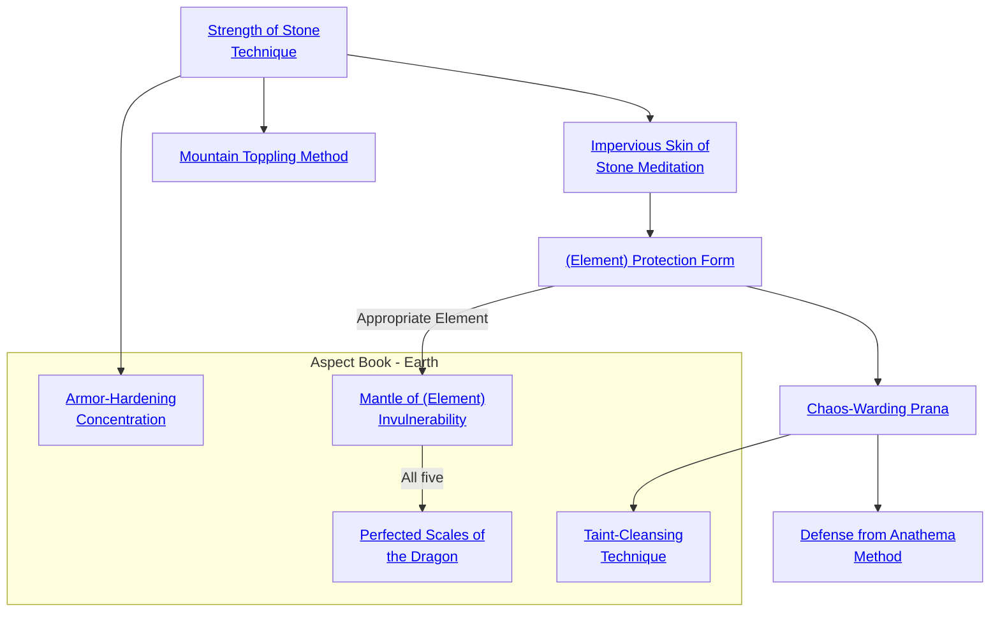

## Strength of Stone Technique

Cost: 2 motes per person
Duration: One scene
Type: Simple
Minimum Resistance: 2
Minimum Essence: 1
Prerequisite Charms: None

One of the most notable traits of the element of Earth
is its strength and resistance to damage. Through this
Charm, a Dragon-Blooded can take on some of the strength
and hardness of stone and share it with other people.
After a short meditation spent holding and concentrating
upon the Essence within a pebble, the character
becomes stronger and tougher, gaining one dot each of
Strength and Stamina for the next five minutes. If the
Dragon-Blooded character wants to include other people
in the Charm, they must all hold hands in a circle with a
pebble between each pair of palms. A character can only
benefit from one application of Strength of Stone Technique
at a time.

## Impervious Skin of Stone Meditation

Cost: 1 mote per 2L/2B soak
Duration: One scene
Type: Simple
Minimum Resistance: 2
Minimum Essence: 2
Prerequisite Charms: Strength of Stone Technique

With this Charm in effect, a Dragon-Blood's skin
gains the toughness of the native rock of the earth itself.
Swords and arrows glance from her skin as if off a cliff face.
Every mote of Essence invested in the Charm give the
character two points of additional soak against lethal and
bashing damage. The bonus to soak cannot be greater than
the character's Essence. This Charm is weak against Essence
and does not apply to damage caused by sorcery or by
attacks enhanced with Charms.

## Mountain Toppling Method

Cost: 4 motes
Duration: One turn
Type: Supplemental
Minimum Resistance: 2
Minimum Essence: 2
Prerequisite Charms: Strength of Stone Technique

Through this Charm, a Dragon-Blooded character
links his own Essence to the Essence within any great mass.
By inverting the principles of resistance against the mass, it
enables him to exert vastly magnified strength. After a
moment's concentration, the Dynast can hurl boulders,
topple pillars, stomp on the edge of a cliff to start a
landslide or perform other momentary feats of superhuman
strength. In game terms, for one turn, the character's
Strength increases by 5, but he can only apply that extra
Strength to objects made of earth or stone. This height-
ened Strength may be used in an attack (for instance,
throwing a boulder at an opponent for Strength-based
damage), and jade-alloy weapons such as daiklaves are
&quot;stone&quot; enough to benefit from the effects of this Charm.

## (Element) Protection Form

Cost: 3 motes
Duration: One scene
Type: Simple
Minimum Resistance: 3
Minimum Essence: 2
Prerequisite Charms: Impervious Skin of Stone Meditation

This is actually a cluster of five separate Charms, each
offering protection from the harmful effects of the element
of one of Five Immaculate Dragons. While this Charm in
effect, the character gets a bonus to lethal and bashing soak
equal to her Essence when attacked by an appropriate
source of elemental damage. This soak applies to attacks as
well as to environmental damage (from say drowning;
crushing rock or molten lava). For the purposes of this
Charm, metal is earth and fists, teeth and other natural
attacks are wood. As with Impervious. Skin of Stone
Meditation, this protection is brittle and offers no additional
resistance against attacks enhanced with Charms or
against damage caused by sorcery.
These Charms must be each bought separately. A
character may apply the discount for buying Charms of her
own elemental attunement when learning the protection
technique for her element.

## Chaos-Warding Prana

Cost: One scene
Duration: 5 motes, 1 Willpower
Type: Simple
Minimum Resistance: 3
Minimum Essence: 3
Prerequisite Charms: (Element) Protection Form

The disruptive predations of beings and creatures of
the Wyld are a constant danger to the Realm. Naturally,
the Dynasts of Earth - paragons of stability - have
developed methods for combating these roiling energies.
For the remainder of the scene after invoking this Charm,
a Dynast may ignore the warping effects of the Wyld. Both
his person and his gear are protected and cannot be
mutated or changed by Wyld effects. The character can
extend this protection to others by paying the full cost of
the Charm and touching them.

## Defense from Anathema Method

Cost: 6 motes, 1 Willpower
Duration: One scene
Type: Simple
Minimum Resistance: 5
Minimum Essence: 4
Prerequisite Charms: Chaos-Warding Prana

The most powerful of the Terrestrial Exalted know
methods to shield themselves from the powerful magic of the
Anathema. For the remainder of the scene after invoking this
Charm, a Dynast may add her Essence to the difficulty of
magical attacks made against her by the Anathema. This
includes both Charm-enhanced attacks and sorcery. These
are effective automatic successes to avoid the attack and are
additive with dodges and parries. This Charm offers no
protection against more subtle effects, such as mind control.

## Armor-Hardening Concentration

Cost: 2 motes per person
Duration: One scene
Type: Simple
Minimum Resistance: 3
Minimum Essence: 2
Prerequisite Charms: Strength of Stone Technique

The Exalt focuses, invoking the durability of the Earth
as an enchantment upon his armor. The degree of benefit
depends on the composition of his armor according to the
table below. The Exalt can extend this Charm to any ally
within his (Essence x 3) yards by paying the same cost, and
a character may simultaneously evoke protection on as
many allies within range as his Essence reserves permit.
Characters may only benefit from one application of this
Charm at a time and immediately lose the enchantment if
they remove their armor for any reason.

Armor Type Soak Bonus
Non-Magical Armor 1L/2B
Magical Armor 2L/2B
Jade Armor 2L/3B
White Jade Armor 3L/3B

## Mantle of (Element) Invulnerability

Cost: 6 motes, 1 Willpower
Duration: One scene
Type: Simple
Minimum Resistance: 5
Minimum Essence: 3
Prerequisite Charms: Appropriate (Element) Protection Form

Like the lesser (Element) Protection Form upon
which this Charm builds, Mantle of (Element) Invulnerability
is actually a cluster of five separate Charms that
must be purchased separately. Each confers unsurpassed
protection, allowing the Exalt to completely ignore all
non-magical sources of injury associated with the respective
element and adding the character's permanent
Essence to her soak against magical attacks involving the
element. This Charm uses the same guidelines for determining
the elemental association of a damage source as
(Element) Protection Form (see Exalted: The Dragon-Blooded, p. 201).
Dragon-Blooded always consider the Mantle of (Element)
Invulnerability for their own element to be a
favored Charm, even if they do not actually have Resistance
as an Aspect or Favored Ability. However, because
this Charm is still based on Resistance, Earth Aspects
never pay an elemental surcharge to use any of the five
elemental permutations.

## Perfected Scales of the Dragon

Cost: 12 motes, 1 Willpower, 1 health level
Duration: One scene
Type: Simple
Minimum Resistance: 5
Minimum Essence: 5
Prerequisite Charms: All five Mantle of (Element) Invulnerability Charms

The Exalt dons the fivefold aegis of the Elemental
Dragons, his anima roaring out in a gale of destructive
power as if he had spent 16+ motes of Peripheral
Essence. For the rest of the scene, the character is at one
with the harmony of the elements and suffers no damage
from any non-magical object or force native to the
Tapestry of Creation. Beings and forces from outside of
Fate can hurt the character normally by mundane
means, but all others must use magically enhanced
attacks or weapons of the Five Magical Materials to
harm the Exalt. Unlike the individual Mantle of (Element)
Invulnerability Charms, Perfected Scales of the
Dragon offers no additional soak versus damage sources
that penetrate its limited perfection.

## Taint-Cleansing Technique

Cost: 20 motes, 1 Willpower, 1 aggravated health level, 1 experience point
Duration: Instant
Type: Simple
Minimum Resistance: 5
Minimum Essence: 4
Prerequisite Charms: Chaos-Warding Prana

The Dragon-Blood kneels in humble supplication
to the Elemental Dragons, briefly setting aside his
authority as a Prince of the Earth to become a vessel of
greater divinity. As the Charm activates, a sphere of
living Essence spreads from the Chosen's heart and
grows to envelop a radius of her Essence in yards. Taint-Cleansing
Technique cannot be placed in a Combo but
may be used synergistically. In order to obtain the
synergistic benefit, all participant Dragon-Blooded must
stand in an outward-facing circle with each no more
than five yards from all other participants. The total
number of participants cannot exceed the Essence +
Performance + applicable specialty (usually Leadership)
of the Exalt leading the combined effort. A
synergistic use of this Charm combines the spheres of
Essence from each character into a single sphere emerging
from the center of the participant circle. This
sphere has a radius in yards equal to the (highest
Essence in the group) x (the number of participants).
Within the radius of the sphere, the energy of the
Wyld is completely displaced, turning the affected
area into a bubble of perfect and inviolate stability.
Every decade of contact with the Wyld erodes one
foot of radius from the protected region. Fair Folk and
Wyld mutants can freely enter regions of stability
created with Taint-Cleansing Technique without suffering
any more harm than they experience in any
other part of Creation.
