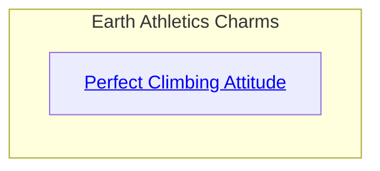
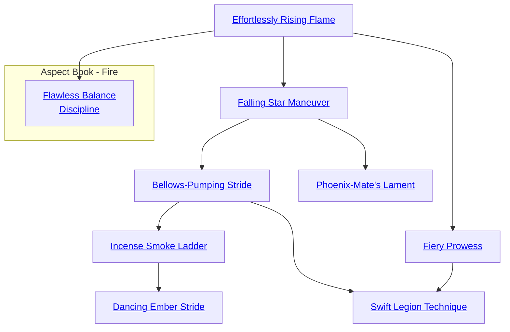

## Perfect Climbing Attitude

Cost: 1 mote
Duration: One scene
Type: Simple
Minimum Athletics: 2
Minimum Essence: 1
Prerequisite Charms: None

The Dragon-Blooded of Earth include some superb
mountaineers and rock-climbers, all because of this Charm.
Not only does the character cling to a rock face like a
limpet, she leaves indentations in the rock that other
people can use as hand- and footholds, making the climb
easier for them. The character can climb a sheer stone wall
at a rate of 10 feet per turn, or 20 feet or more per turn up
a rough cliff face (or a surface where someone already made
handholds in the rock). Surfaces that are worse than sheer,
such as overhangs, require multiple successes.
Cascade Charms:
• More skilled Dragon-Blooded can find or make
projections sufficient to support a hammock. Sleeping 50
feet up a cliff face may not be comfortable, but with this
Charm it sure is safe.
• More powerful Dynasts of Earth can leave a virtual
ladder or stairway in the rock, making ascent or descent
quite safe and easy for anyone else.

## Effortlessly Rising Flame

Cost: Instant
Duration: 1 mote
Type: Reflexive
Minimum Athletics: 2
Minimum Essence: 1
Prerequisite Charms: None

Fire does not oppose Earth in the same way that it opposes
Water, but a glance at a bonfire shows the obvious: Fire abhors
Earth. With this Charm, a burst of fiery energy propels the Exalt
from the earth's surface in as much time as it takes a man to take
just a single step. The Dragon-Blooded may rise from a prone
or supine position without taking an action to do so. This
Charm can also be used to add two dice to the Exalted's
Athletics for the purposes of determining how far she can jump.

## Falling Star Maneuver

Cost: 1 mote per two dice
Duration: Instant
Type: Supplemental
Minimum Athletics: 2
Minimum Essence: 1
Prerequisite Charms: Effortlessly Rising Flame

Fire lifts the Exalt's every footstep. The Dragon-Blooded
with Falling Star Maneuver may jump, tumble, roll or
outrun a foe in hand-to-hand combat gaining a positional
advantage that allows him to strike devastating blows.
Mechanically, this Charm add to dice per mote expended
to the damage of an attack. No more motes can bespent
than the character's permanent Essence rating. This damage is
added before soak is applied. Normally, this Charm can be used
only with hand-to-hand attacks, but with a stunt, the Charm
can even be used to gain a bonus to the character's Thrown or
Archery damage. However, this generally only happens when
a target has left himself wide open to attacks from the sides and
the Exalt can reach his flank swiftly. This Charm can explicitly
be used in Combos with Charms from other Abilities.

## Bellows-Pumping Stride

Cost: 1 mote
Duration: One scene
Type: Reflexive
Minimum Athletics: 3
Minimum Essence: 2
Prerequisite Charms: Falling Star Maneuver

The Exalt can double his movement rate for the scene
with this Charm. As he does so, he leaves fiery footprints in the
ground behind him. At a full sprint, he leaves a trail of fire —
this is normal fire and can cause problems in flammable areas.
To his own perceptions, he is not moving any faster;
walking is still walking, and running is still running.
However, his walk is twice as swift as normal. Resultingly,
he can move up to (Dexterity + 12) yards and still act in
a turn and up to (Dexterity x 5) + 25 yards as his only action
for the turn. This Charm does not increase the character's
attack speed; it only affects his movement.

## Incense Smoke Ladder

Cost: 2 motes
Duration: Instant
Type: Reflexive
Minimum Athletics: 4
Minimum Essence: 2
Prerequisite Charms: Bellows-Pumping Stride

Like a burning ember, the Exalt is propelled away from the
ground beneath him, so long as he has a surface to guide his feet.
During any turn this Charm is active, the Dragon-Blooded can
run up walls, trees and other vertical surfaces as easily as across
an open courtyard. This is not a casual shuffle - the Exalt must
get a running start of at least two steps and then run up the wall,
using his relationship to the rising element of fire to push
himself away from the earth below. The character's feet do not
stick to the wall, and he cannot stand on the wall's surface -
he can only run up it. Similarly, the Dynast may run across the
surface of water while this power is active, though he cannot
stop. If he should attempt to run across the surface of dangerous
liquids, such as lava or acid, he will stay on the surface, but his
feet may be burned badly.

## Dancing Ember Stride

Cost: 3 motes
Duration: Instant
Type: Simple
Minimum Athletics: 5
Minimum Essence: 3
Prerequisite Charms: Incense Smoke Ladder

The character drifts upward, buoyed by a hot updraft. He
may move a distance up to nice his ordinary movement rate
upward, or once he is in the sky, he can move horizontally as
if he were standing on the ground or ascend or descend as he
wishes. As with many of the other Charms in this cascade, the
only restriction is that the Exalt must keep moving; he cannot
remain still, or he will plunge to the ground. The Dragon-Blood
can carry as much weight as he can normally lift while
using this Charm, as determined by his Strength + Athletics.

## Phoenix-Mate's Lament

Cost: 1 mote per 2 soak
Duration: Instant
Type: Reflexive
Minimum Athletics: 5
Minimum Essence: 2
Prerequisite Charms: Falling Star Maneuver

The character's affinity for fire's movement continues to
grow as he learns this Charm. So long as the Exalt maintains ar
least a jog — that is to say, moving at least half of his maximum
running speed he can largely ignore many environmental
hazards. These include open natural flame, poisonous gas,
falling rock sand so on. The Dragon-Blood may add 2 to his soak
against nonmagical environmental hazards for every mote
spent, up to a maximum of his Athletics score. This ability does
not protect against magical effects or Charms; however, strong
elemental effects that come as a result of a character's proximity
to an elemental pole are considered natural environmental
hazards and are therefore protected against. This ability acts in
addition to any anima effect, Charms, sorcery or other protec-
tions the character may enjoy.

## Fiery Prowess

Cost: 1 mote per two dice
Duration: Instant
Type: Supplemental
Minimum Athletics: 2
Minimum Essence: 1
Prerequisite Charms: Effortlessly Rising Flame

The Exalted feels a burning in his veins as he pushes his
body to its limits. Using this Charm, the Dragon-Blooded
can improve his Athletics Ability by two dice per mote of
Essence spent. However, he cannot increase his Athletics to
more than double its base value. Extra Essence spent is lost.
For Example: If Targan has Athletics 3 and spends 2 motes
on Fiery Prowess, his effective Athletics becomes 6, not 7.
The increase in Athletics lasts for a full turn, and the
character's Athletics dice pool can be split normally while
under the influence of this Charm.

## Swift Legion Technique

Cost: 2 motes per-subject
Duration: One scene
Type: Simple
Minimum Athletics: 4
Minimum Essence: 2
Prerequisite Charms: Bellows-Pumping Stride, Fiery Prowess

The Dragon-Blood with Swift Legion Technique can
greatly increase the swiftness of his traveling companions
or allies and himself. The fire at the core of his being
invigorates and rejuvenates his companions as they move.
He must choose the subjects of this Charm when he
activates it and spend 2 motes of Essence for each of them
(including himself). For the rest of the scene, those characters
all double their basic speeds, as per Bellows-Pumping
Stride, above. Because of the malleable nature of time in
the Exalted system, this Charm can aid long-distance
travel. A day's travel is usually a single scene. However, if
the characters' travel is interrupted, the Dragon-Blood
would have to activate the Charm again. A character
cannot aid more companions with this Charm than his
permanent Essence.

## Flawless Balance Discipline

Cost: 3 motes
Duration: One scene
Type: Simple
Minimum Athletics: 3
Minimum Essence: 2
Prerequisite Charms: Effortlessly Rising Flame

Use of this Charm grants the Dragon-Blood the
ability to maintain his footing and move gracefully regardless
of adverse conditions. By becoming more attuned
to his sense of balance, the Exalt can keep his footing at all
times and never need worry about falling. Anything he
could normally do on flat ground, he can do on slick ice, on
a slanted roof, on a lurching ship's deck or on a wire
suspended between two towers (while being buffeted by
winds that would blow lesser men off their feet).
