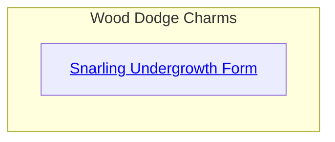
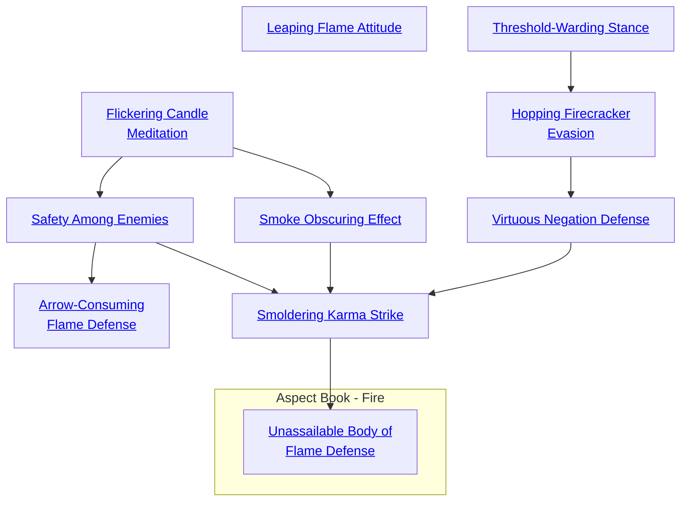

## Snarling Undergrowth Form

Cost: 3 motes
Duration: 1 turn per success
Type: Reflexive
Minimum Dodge: 2
Minimum Essence: 1

This Charm reverses the effect of the Forest Passage
Method and turns it against an enemy. For a short time, the
local plant life hinders the Dragon-Blooded character's opponent
any way it can. Branches somehow manage to get in the
way of his sword arm. Twigs and briars catch at his clothes.
Even someone fighting on a close-cropped lawn finds his feet
slipping on the grass. The player rolls Charisma + Dodge. For
every success, the effect hinders the target for one turn. As a
result of this hindrance, the Dynast's foe suffers a + 1 difficulty
penalty on all attack and Dodge rolls, and has his movement
speed halved. The Dragon-Blooded character can even use
this Charm to add to natural combat penalties from vegetation.
The Charm only works against one opponent per use.
Cascade Charms:
• One obvious improvement is a Charm that hinders
every opponent of the Dragon-Blooded character.
• Another version increases the degree of hindrance,
or its duration.
• A still more powerful version could actually trap an
enemy so that he could not fight at all. This requires fairly
sturdy vegetation, though — shrubbery or heavy vines at least.
• Snarling Undergrowth Form and the Forest Passage
Method are a splendid Combo.

## Leaping Flame Attitude

Cost: 5 motes
Duration: The Dragon-Blooded's Essence in scenes
Type: Simple
Minimum Dodge: 2
Minimum Essence: 1
Prerequisite Charms: None

Fire is the most mobile of the elements. The Dragon-Blooded
who learn its mysteries can infuse the Essence of
Fire into themselves or a single target, granting them the
agility of a leaping flame. The player rolls Wits + Dodge.
The target gains one dot of the Dodge Ability for every
success rolled by the Dragon-Blooded character, to a
maximum of the target's own Dodge rating, for the duration
of the Charm. The recipient also gains one extra dot
in Athletics (no more), but only for purposes of jumping
and keeping his balance. The target cannot more than
double his Dodge ability, even if multiple Dragon-Blooded
invoke this Charm on him.
Cascade Charms:
• An improved Charm could increase the recipient's
movement rate, allowing the character to move his full
distance (walking, running or sprinting) while still per-
forming other actions in a turn.
• A considerably more powerful Dynast might learn
to perform an Essence-fueled dodge so agile that she
becomes impossible to hit by any hand-to-hand attack that
is not itself reinforced with Essence.

## Threshold-Warding Stance

Cost: 1 mote
Duration: Instant
Type: Reflexive
Minimum Dodge: 2
Minimum Essence: 1
Prerequisite Charms: None

Ordinarily, when dodging an attack, the defender
must have ample space in which to move around. The
character using the Threshold Warding Stance can dodge
attacks while keeping his balance and leaving his feet in
one place; as he does so, his torso, arms and legs flicker back
and forth like a candle flame exposed to high wind. The
Dragon-Blooded cannot dodge attacks when he is entirely
immobilized, but so long as he has some degree of freedom
to move, he can use his full Dodge dice pool. This Charm
works whether the character is standing on a tree limb, is
hemmed in by walls on three sides, is up to his shins in
quicksand or is dangling by his arms from a great height.

## Hopping Firecracker Evasion

  ###
Cost: 2 motes
Duration: Instant
Type: Reflexive
Minimum Dodge: 3
Minimum Essence: 2
Prerequisite Charms: Threshold Warding Stance

When this Charm is activated, the Dragon-Blooded's
dives to avoid attack become truly pronounced. The
Exalted with Hopping Firecracker Evasion can move more
than just a few steps as he avoids attacks. He can leap, dive
or tumble up to his normal running pace, which is half of
(Dexterity + 12) yards, when he succeeds in dodging an
attack. If he is in hand to hand combat, this is likely to
take him out of handi-to-hand combat range after a single.
attack, unless the attacker is able to move and continue
attacking. This effectively allows bim to evade the effects
of many multiple attack Charms.

## Virtuous Negation Defense

Cost: 2 motes
Duration: Instant
Type: Reflexive
Minimum Dodge: 4
Minimum Essence: 2
Prerequisite Charms: Hopping Firecracker Evasion

This altruistic Charm allows its wielder to move his
allies out of the way of incoming attacks. When he
notices an attack coming toward a companion, the
Dragon-Blood can dive toward that friend and shove him
out of the way of the attack. The companion must be
within leaping distance — 5 yards, ordinarily - for the
Exalt to interpose himself.
The attack almost always misses the character's companion;
the Dynast's player should now roll his character's
own dodge against the attack as though he were its original
target. If he does not receive enough successes to make the
attack miss outright, it hits the Exalted rather than his
original target. However, if the Exalted rolls no successes
on his dodge, the attack strikes its original target.

## Flickering Candle Meditation

Cost: 1 mote per two dice
Duration: Instant
Type: Reflexive
Minimum Dodge: 2
Minimum Essence: 1
Prerequisite Charms: None

The character's outline and form become more difficult
to perceive as his movements accelerate and blur. The
Exalted can improve his Dodge dice pool with this Charm,
at a cost of one mote Essence for every two dice added to
his Dodge dice pool for this dodge attempt. As with most
Charms of this type, no more dice can be added than the
character's Dodge Trait.

## Smoke Obscuring Effect

Cost: 1 mote per two dice + 1 mote per ally
Duration: One scene
Type: Simple
Minimum Dodge: 4
Minimum Essence: 2
Prerequisite Charms: Flickering Candle Meditation

The Exalted conjures up a visual distraction for his
enemies, allowing his allies to more easily avoid their blows.
This effect might be smoke, as the Charm's name suggests, or
it might be the flaring up of a nearby campfire; anything to
distract opponents and give allies a bonus to dodge. The Exalt
expends 1 mote of Essence per ally that he wishes to subject
to this power, plus 1 mote per to dice to be added to the allies'
Dodge pools. The Dragon-Blood may not contribute more
dice than he has dots in the Dodge Trait, and his allies cannot
do more than double their own Dodge Abilities, regardless of
how many dice are contributed. A character may not use this
ability on more allies than he has Essence.
For Example: Plana has Dodge 3 and Smoke Obscuring
Effect, and his allies Orbro and Tamota are in a combat with
him. Orbro has Dodge 2; Tamota has Dodge 5. Plana must
spend 4 motes of Essence to activate Smoke Obscuring Effect
(two allies, plus 2 motes for all three of Plana's Dodge dice).
Orbro receives two bonus dice to his Dodge (since he cannot
more than double his Dodge Trait), and Tamota receives
three bonus dice (since that is all that Plana can donate).

## Safety Among Enemies

Cost: 3 motes
Duration: Instant
Type: Reflexive
Minimum Dodge: 4
Minimum Essence: 2
Prerequisite Charms: Flickering Candle Meditation

In a fashion similar to Virtuous Negation Defense, the
Dragon-Blooded moves toward another person as an attack
is incoming. However, unlike Virtuous Negation Defense,
this maneuver is intended to cause an attack aimed at the
Exalted to strike another person - presumably an enemy,
since the best use of this defense is to let a well-armored foe
absorb blows on the Exalt's behalf. The new target must be
within three yards of the Exalted for this Charm to work.
Rather than rolling a standard dodge, the player should roll
Dexterity + Dodge, with a total of four successes needed. If
the roll succeeds, the new target is struck by the attack, and
the user of this Charm avoids it. Treat the attack as though
it had been aimed at the new target all along. The new target
can attempt a dodge himself if he's able to. A character
cannot force an enemy to attack himself.

## Arrow-Consuming Flame Defense

Cost: 5 motes
Duration: One scene
Type: Simple
Minimum Dodge: 5
Minimum Essence: 3
Prerequisite Charms: Safety Among Enemies

This Charm creates a coruscating aura of fire that,
radiates for a few feet around the Exalted who activates it.
The aura destroys any wooden projectiles such as arrows,
that approach the character; it also weakens the blows of
other weapons intended to harm him.
Arrows automatically fail to harm the character, as the
shaft of the arrow is consumed by fire before the arrow can
reach him; at most, a harmless arrowhead might bounce off
the character's clothing or armor. Additionally, the Exalted
receives +2 to his soak against metal and wooden weapons
— be they hand-to-hand or ranged attacks — as the blows
are weakened by their passage through the Arrow-Consuming
Flame Defense. Only hard stone weapons and gear made
from the Five Magical Materials are unaffected by this
Charm. Anyone attempting to make an unarmed against a
Dragon-Blooded with this Charm active takes 3L fire dam-
age each time she attacks, soaked normally.

## Smoldering Karma Strike

Cost: 3 motes
Duration: Instant
Type: Reflexive
Minimum Dodge: 5
Minimum Essence: 3
Prerequisite Charms: Virtuous Negation Defense, Smoke Obscuring Effect, Safety Among Enemies

The character's talent at avoiding attack and placing
himself to take advantage of a foe's weakness has been
honed by this point to allow him to instantly strike back at
any enemy whose hand-to-hand combat attack he has
successfully avoided. When attacked at such close range, if
the attacker fails to achieve any net successes on his attack
roll (that is, when he either cleanly misses on his own or the
defender's dodge successes reduce his attack to a miss), the
defender with Smoldering Karma Strike can spend Essence
and immediately make reflexive hand-to-hand attack at his
full dice pool. This Charm cannot be used to respond to a
counterattack launched with this or any other Charm.

## Unassailable Body of Flame Defense

Cost: 4 motes and 1 Willpower
Duration: Instant
Type: Reflexive
Minimum Dodge: 5
Minimum Essence: 4
Prerequisite Charms: Smoldering Karma Strike

Perhaps the most difficult of all the Dodge Charms
known to the Dragon-Blooded, Unassailable Body of Flame
Defense momentarily turns the character's body into pure
flame where an enemy's weapon touches it, generally
allowing the weapon to pass harmlessly through the
character's body. The Fire Aspect must have his fiery
elemental anima ignited in order to use this Charm. Only
then can he become sufficiently attuned to the element of
fire that he can transform his own body into insubstantial
flames. In any turn in which the character has used this
Charm, he can dodge all physical attacks with his full
Dexterity + Dodge dice pool.
