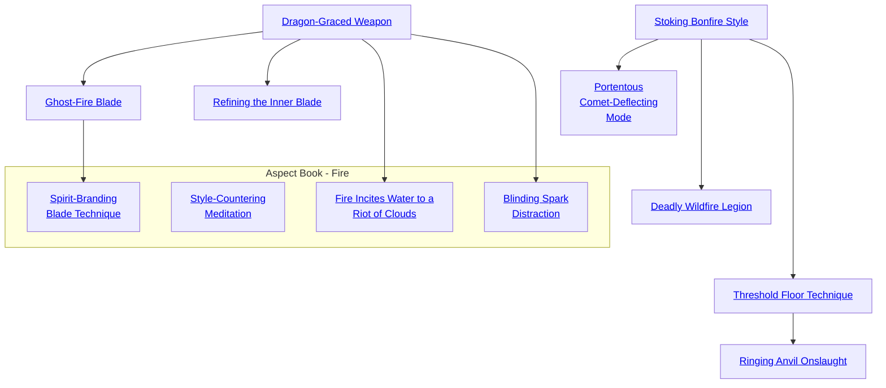

## One Mind Technique

Cost: 2 motes per person
Duration: 5 minutes
Type: Simple
Minimum Melee: 2
Minimum Essence: 2
Prerequisite Charms: None

Just as speech is a form of modulated wind, so thought
is silent speech. A Dynast of Air can enable a group of
armsmen to know each other's thoughts, at least to a
limited degree. What one soldier knows, the others know.
As a result, a group that fights with one mind displays
uncanny coordination. They trade opponents without a
hitch; one fighter parries a blow aimed at another; an
enemy seen by one cannot hide from any.
The player rolls Charisma + Melee. For each success
that the Dragon-Blooded character receives, the recipients
gain one dot each of Wits, Perception and Melee, up
the Dragon-Blooded character's own Melee rating. The
character can link as many people with one mind as she has
dots of Essence. Typically, this includes the character
herself, but this is not strictly necessary, Dynasts typically
use this Charm to magnify the fighting prowess of their
bodyguards or minions.
Characters linked by this Charm must have trained
together for at least a week. They must spend a turn on a
shared breathing exercise and battle cry to initiate the
link. The characters must stay within 50 feet of each other.
If any character moves beyond that range, the link breaks
and the Charm ends. No character can benefit from
multiple uses of the One Mind Technique at the same
time, even if different Dragon-Blooded activate the Charm.
Cascade Charms:
• Instead of Melee, an Aspect of Air can leam a
variation that employs Brawling, Martial Arts or Archery.
• Fighters of extraordinary skill might learn how to
link two characters per dot of Essence, or even more.

## Dragon-Graced Weapon

Cost: 1 mote
Duration: Instant
Type: Supplemental
Minimum Melee: 2
Minimum Essence: 2
Prerequisite Charms: None

The character with Dragon-Graced Weapon can
impart special properties to the melee weapon in hand by
merely concentrating for a moment. The effect on the
character's weapon is based on his elemental aspect, as
described below. This effect is instantaneous; the Exalt
must pay Essence for every attack, and he must do so before
making his attack roll.
Air: Fierce winds surround the weapon, knocking
your foe off his feet. A successful hit means the enemy takes
normal damage and her player must succeed at a Dexterity
+ Athletics roll at difficulty 2 or have her character
knocked prone.
Earth: A thunderous shaking of the earth accompanies
the weapon's strike. The enemy loses two dice
from all dice pools for physical actions until he's done
with his next turn.
Fire: The target bursts into flames and, on his next
action, must soak another 4L damage from fire. This
damage is separate from the normal attack and without any
extra successes added. The fire gutters out after one turn.
Water: The target is gripped in a drowning embrace.
Next turn (or this turn, if he hasn't acted yet) subtract 3
from his initiative total as struggles to clear water from his
lungs and throat.
Wood: Thorns cover all the striking surfaces of the
weapon, and it increases the damage of the attack by + 2L.

## Ghost-Fire Blade

Cost: 2 motes
Duration: Instant
Type: Supplemental
Minimum Melee: 3
Minimum Essence: 2
Prerequisite Charms: Dragon-Graced Weapon

Ghosts and dematerialized spirits cannot be hit by
ordinary weapons. Though many powerful weapons can
strike those immaterial beings, warriors caught without
that kind of armament are in great danger when facing
spirit foes. This Charm allows a Dragon-Blooded warrior
to call upon the Dragon of Fire to enchant his weapon,
allowing it to strike immaterial creatures normally. The
character must spend the Essence and activate the Charm
before making her attack, and her player must still roll to
hit the creature as if it were material. This Charm provides
no additional bonus beyond allowing the character to hit
dematerialized spirits.

## Refining the Inner Blade

Cost: 3 motes, 1 Willpower
Duration: One scene
Type: Simple
Minimum Melee: 4
Minimum Essence: 3
Prerequisite Charms: Dragon-Graced Weapon

With a few seconds' concentration, the Exalted can
conjure up a weapon created entirely from his favored
element. This weapon has the same qualities as an ordinary
weapon of its type; it also has the qualities of a weapon
enchanted by the Dragon-Graced Weapon Charm (see
above). As the weapon is created out of raw elemental
matter and Essence, it does not last for long, but a combat-
ant can be sure that it will remain intact until the end of
his current battle. When the scene ends, the elemental
weapon dissipates, evaporating into a sparkle of light and
a whiff of the character's aspected element. The conjured
weapon can be any sort of melee weapon.

## Stoking Bonfire Style

Cost: 1 mote per two dice
Duration: Instant
Type: Supplemental
Minimum Melee: 2
Minimum Essence: 1
Prerequisite Charms: None

The Exalt with this basic Charm learns how to lend the
ferocity of fire to his weapon's blows. His hand becomes
steadier, and his strike truer. Add two dice to the character's
Melee dice pool for every mote spent; however, a Dragon-Blood
cannot more than double his Melee Ability with this
Charm. The player must declare that his character is using this
Charm and spend the Essence before making the attack roll.

## Portentous Comet-Deflecting Mode

Cost: 3 motes, 1 Willpower
Duration: Instant
Type: Reflexive
Minimum Melee: 5
Minimum Essence: 3
Prerequisite Charms: Stoking Bonfire Style

This particularly costly Charm is also particularly effective.
Fiery sparks leap from the Exalted's weapon, interposing
themselves between the Exalt and a potentially deadly
blow. Spend the necessary Essence and roll Dexterity +
Melee after an opponent's hand-to-hand attack. If even one
success is achieve, regardless of how many successes the
Dragon-Blood's opponent achieved, the attack is blocked
completely. The Charm may be invoked after the opponent's
player makes his attack roll. This Charm provides no
protection against sorcery or attacks enhanced by Charms.

## Deadly Wildfire Legion

Cost: 1 mote per 2 dice + mote per subject
Duration: One scene
Type: Simple
Minimum Melee: 4
Minimum Essence: 2
Prerequisite Charms: Stoking Bonfire Style

With this Charm, you briefly empower a group of your
allies to attack at greatly improved effectiveness. They are
surrounded by a fiery halo when this empowerment occurs,
and the tips of their weapons scorch the air as the blades
cut through their opponents' defenses. You may ensorcel
one ally per mote spent, to a maximum of your Essence
Trait; you must spend additional Essence to improve their
Melee Ability, by two dice per mote spent. You cannot add
more dice to your allies' Abilities than you have in Melee,
nor can you more than double their effective Melee.

## Threshold Floor Technique

Cost: 2 motes + 1 more per targeted ally
Duration: One turn
Type: Simple
Minimum Melee: 5
Minimum Essence: 2
Prerequisite Charms: Stoking Bonfire Style

There is a practical limit, imposed by geometry and space,
on the number of people that can attack a single target at once.
Although it is unlikely that a Dragon-Blood has ever participated
in grain threshing, this technique was so named due to its
similarity to that activity. Only five foes can possibly effectively
attack a single target simultaneously, and that number is greatly
reduced should a target find himself in a defensible position -
his back against a wall, for instance, or standing between two
trees. With Threshing Floor Technique, the only limit to the
number of attackers that can assault a single foe in one turn is
the amount of Essence the Dragon-Blooded spends. The Exalt
designates a target and spends 2 motes of Essence to activate the
Charn and l mote of Essence per attacker. Then, so long as an
attacker is within her ordinary movement distance from the
target (that is, [Dexterity + 12] &divide; 2 yards), she may make a melee
attack at the designated target on her normal action; she dashes
in, makes an attack normally and then pulls back to her
previous position. Characters so empowered are not required to
attack the target on their action, though, if they do not, the
Essence spent to enable them to do so is still lost. Likewise, if the
target is slain, Essence spent to empower characters who never
got their shot is also still lost.

## Ringing Anvil Onslaught

Cost: 8 motes
Duration: Instant
Type: Extra Actions
Minimum Melee: 5
Minimum Essence: 3
Prerequisite Charms: Threshold Floor Technique

With this Charm, a Dragon-Blooded character can keep
a foe entirely off-balance until he is slain, if his skill is sufficient
to the task. The Exalt using Ringing Anvil Onslaught designates
a single target, and his player rolls the character's Melee
Ability (no Attribute is added) For each success, the Exalted
gains an extra attack against the target this turn. The Dynast
cannot gain more extra attacks than his Melee.

## Fire Incites Water to a Riot of Clouds

Cost: 2 motes + 1 mote per turn beyond the first
Duration: Instant
Type: Supplemental
Minimum Melee: 2
Minimum Essence: 3
Prerequisite Charms: Dragon-Graced Weapon

Seen by some as a refinement of Dragon-Graced
Weapon, Fire Incites Water to a Riot of Clouds allows the
Dragon-Blood to channel her connection with the element
of fire through a metal weapon and into a body of water to
generate a large volume of steam. The moment the Exalt
activates this Charm and plunges her weapon into a body of
water at least two feet deep, huge roiling clouds of white
steam surge from the water around the Dragon-Blood's
weapon. This steam isn't particularly hot and cannot be
used to scald others, but it is highly effective at dampening
opponents and creating a dense, billowing curtain of fog
through which enemies cannot see. Due to its thickness, this
fog is equal to fog at night on the visibility table (see Exalted,
p. 237), limiting those caught in it to a maximum of three
yards of murky visibility. The Exalt's weapon generates
another 10 yards of steam each turn it remains in the water.
The steam will tend to roll away from the Dragon-Blood,
and in the absence of any prevailing wind, the character can
make a Willpower roll (difficulty 3) to control which
direction the cloud of steam billows.
Using this Charm to supplement an attack on a water
elemental inflicts aggravated damage.

## Style-Countering Meditation

Cost: 5 motes
Duration: Varies
Type: Simple
Minimum Dodge: 4
Minimum Melee: 4
Minimum Essence: 2
Prerequisite Charms: None

This Charm allows the Dragon-Blood to adapt perfectly to an opponent's combat style. By watching and
analyzing an opponent in combat for no fewer than five
turns (during which she can do nothing else), the Exalt
reads the subtle strengths and flaws in the target's fighting
technique and adjusts her own combat style accordingly,
exploiting the target's weaknesses and defending against
particular strengths. Roll Intelligence + Melee (or the
appropriate Ability). This Charm lasts three turns plus two
turns per success, during which the Dragon-Blood gains a
bonus of one die per point of permanent Essence on all
Dodge and Melee rolls made by her character against that
one stated target.
Versions of this Charm exist that use Brawl or
Martial Arts in place of Melee, but the minimum requirement
of 4 remains the same, and all versions require
Dodge 4. The Melee, Brawl and Martial Arts versions of
this Charm must be learned separately. These versions
are still Melee Charms. They simply analyze an enemy's
use of different combat Abilities.
Due to the complexities and mental demands involved
in reading and analyzing a target so thoroughly, the
character can only be prepared to fight one opponent who
has points of Intelligence. This is a dice-adding Charm.

## Blinding Spark Distraction

Cost: 2 motes
Duration: Instant
Type: Reflexive
Minimum Melee: 3
Minimum Essence: 2
Prerequisite Charms: Dragon-Graced Weapon

It is common in the course of combat for clashing
weapons to give off sparks. This Charm gives the Exalt the
ability to direct a spray of sparks into a foe's opponent's
face any time their weapons clash.
The Dragon-Blood can use this Charm any time she
parries or blocks an opponent's metal weapon with her own or
whenever her weapon hits anything metal or stone in the
course of combat. Essence multiplies what would normally
be a few (low Dexterity characters) or attacking (high Dex-
terity characters) sparks aimed right into her opponent's
eyes. The opponent will be blinded the following turn (as
per the poor visibility rules on p. 232 of Exalted).
Subtracting two successes from all attack rolls made for
him. The player of the target of the spray of sparks must
also make a reflexive Wits + Dodge roll to have his
character turn away from the spray of sparks. If the roll
succeeds, the Exalt is down only two dice on his next turn's
attack roll instead of two successes.

## Spirit-Branding Blade Technique

Cost: 4+ motes
Duration: Essence in days
Type: Supplemental
Minimum Melee: 4
Minimum Essence: 3
Prerequisite Charms: Ghost-Fire Blade

The Dragon-Blood channels Essence to her weapon
on an attack, and if that attack succeeds, not only does the
Exalt cause lethal damage with the blow, she also marks
the target with a smoking brand that can lead the Exalt to
her target should the target escape. The brand is difficult
to hide and smolders through any clothing or for that hides
it. While the brand cannot burn through metal armor, it
can make the armor tremendously hot — so much so that
it's intensely uncomfortable to wear next to the skin. Every
three turns the target keeps the mark covered with armor,
he suffers one level of bashing damage (which may be
soaked as normal). This mark is plainly visible to all who
see it, including mortals (who see it as a red and inflamed
tattoo), but the brand also remains visible if the target
becomes invisible or takes on a new form (making it very
helpful when dealing with Fair Folk and Lunar Exalts).
While marked by the spirit brand, the target cannot lose
his pursuer by non-supernatural evasion techniques,
and his player suffers a three-die penalty to all Stealth and
Survival rolls.
A trail of black spirit smoke pours from the brand,
which is visible to any who can perceive dematerialized
spirits or Essence effects. This plume of smoke rolls in the
direction of the brand's traveler. It cannot be touched or
smelled, nor can it be dissipated by wind, by hands or
bodies passing through it or by any natural means.
The burning mark is usually in the shape of the
Dragon-Blood's weapon, although some advanced combatants
have learned to deliver a more personalized
brand (use the rules for stunting on page
238, but the roll to mark is reflexive, and the attack does
damage as normal).
