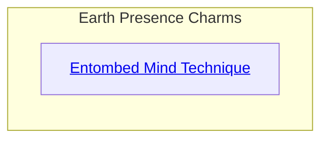
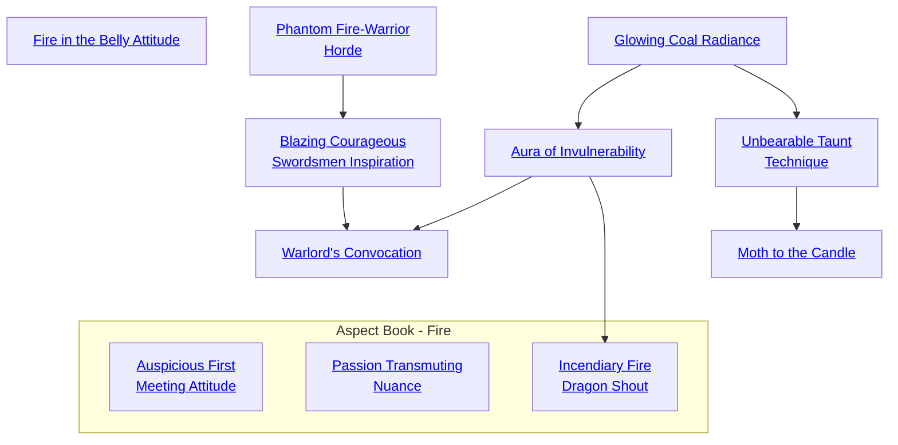

## Entombed Mind Technique

Cost: 5 motes
Duration: 5 minutes
Type: Simple
Minimum Presence: 2
Minimum Essence: 1
Prerequisite Charms: None

Earth is the most static and quiescent of the elements.
This Charm enables a Dragon-Blooded character to infuse
some of that somnolent stasis into another person's mind,
putting them to sleep. Some Dynasts work this Charm
through speaking in a low, droning voice; others prefer to use
a glittering gemstone, such as the jewel in a ring, to fix their
victim's attention and convey the flow of Essence. One can
only bury someone's mind if one can keep them sitting still
for five minutes, so this Charm calls for a fair bit of guile.
The player rolls Manipulation + Presence, with a
difficulty equal to the target's Essence. A simple success
causes the target to sleep for an hour, and each extra
success adds one hour to the total. During that hour, noise,
light and movement do not awaken the victim. You could
send the entire Red-Piss Legion past with cymbals and he
wouldn't wake up. At the end of this period, the victim
passes to normal slumber.
While in the grip of magic sleep, the victim dreams
strange, still dreams of the caves beneath the earth and the
mysteries within them. Once in a while, someone wakes up
afterward knowing where to dig a well that never goes dry,
or the location of an ore deposit.
Cascade Charms:
• More powerful versions of this charm can put a victim
to sleep for longer periods. Old tales tell of great lords of the
Silver Age whose bound enemies still slumber in hidden
locations, or maidens cursed to sleep for a hundred years.
• A still more powerful variation petrifies the victim's
body as well as her mind. Only occult means can rouse such
a stone sleeper.

## Fire in the Belly Attitude

Cost: 2 motes per person
Duration: The Dragon-Blooded's Essence in scenes
Type: Simple
Minimum Presence: 2
Minimum Essence: 1
Prerequisite Charms: None

People often describe strong passions as flames, and
the Aspects of Fire take this metaphor literally. Through
this Charm, a Dynast can whip up the flames of courage
and anger, making a person more brave and aggressive.
The character must say something fierce and rousing to his
troops, and his player makes a Charisma + Presence roll. If
the Charm succeeds, each recipient gains one dot of both
Valor and Willpower for the next five minutes, up to the
maximum possible. Alas, the Charm does not work on the
character himself— and if the Dragon-Blood cuts and runs
or otherwise shows cowardice, the Charm's effects end at
once. An individual cannot benefit from multiple simultaneous
uses of this Charm, even if different
Dragon-Blooded invoke it.
Cascade Charms:

## Phantom Fire-Warrior Horde

Cost: 1 mote per two dice
Duration: Instant
Type: Supplemental
Minimum Presence: 2
Minimum Essence: 2
Prerequisite Charms: None

When activating this Charm, the Dragon-Blooded ap-
pears to be surrounded by a group of fiery warriors. These
individuals are nor visible when looked at directly; they are only
visible through the target's peripheral vision, for indeed, they
are only phantoms. The phantoms are intimidating, however,
and they serve to increase the Exalted's intimidation abilities
and make his presence more imposing. The character using this
Charm can add two dice to his Presence for every mote spent
but can no more than double his Presence Ability.

## Blazing Courageous Swordsmen Inspiration

Cost: 1 mote per subject
Duration: One scene
Type: Simple
Minimum Presence: 3
Minimum Essence: 2
Prerequisite Charms: Phantom Fire-Warrior Horde

The Exalted calls up a fiery passion in soldiers under his
command, and they charge to the offensive, heedless of
personal danger. The Dragon-Blood spends one mote of
Essence per warrior that he commands, to a maximum of
twice his Essence, and each of those warriors receives a single
temporary Bruised health level. This temporary level is the
first one lost when damage is taken, and it cannot be healed
back even if curative magic is somehow applied to the soldier
during the same scene that the Charm is activated.
If the soldier is undamaged when the scene ends, the bonus
health level fades; if he is damaged, the lost health level disappears
with no further ill effect. This Charm can only be used on
soldiers that the Exalted directly commands (typically those
purchased with the Command Background): While it can be
used on other players' characters, any subject of the Charm loses
the bonus health level immediately if he does not act as part of
a unit under the Exalted's command. A given individual can only
benefit from one application of this Charm in a scene.

## Glowing Coal Radiance

Cost: 2 motes
Duration: One turn
Type: Simple
Minimum Presence 3
Minimum Essence: 1
Prerequisite Charms: None

A nimbus of fire encircles the character's head and torso
making it difficult for others to so much as look at him, much
less attack him directly. The player of any foe that wishes to
attack the Exalt in hand-to-hand combat any time before the
character's next turn must first succeed at a reflexive Will-
power test. One success allows the enemy to act normally.
Enemies may attack the Exalted at range without concern.

## Aura of Invulnerability

Cost: 3 motes
Duration: One scene
Type: Simple
Minimum Presence: 4
Minimum Essence: 2
Prerequisite Charms: Glowing Coal Radiance

The character's overwhelming force of personality takes
on a life of its own, as he can stare down even the strongest foe,
causing enemies to flinch slightly before their weapons hit
him. The Dragon-Blooded gains a point of soak and three
temporary. Bruised health levels, which last for this scene,
only. Those health levels are the first lost when the character
takes damage, and they cannot bế healed back, even if magics
are applied which would ordinarily restore lost health levels.
When the scene is over, the three health levels fade, whether
they have been last to combat or not, the fading has no other
ill effects on the character. A character cannot benefit from.
this Charm more than once pet scene.

## Warlord's Convocation

Cost: 8 motes, 1 Willpower
Duration: One scene or instant
Type: Simple
Minimum Presence: 5
Minimum Essence: 3
Prerequisite Charms: Blazing Courageous Swordsmen Inspiration, Aura of Invulnerability

The Exalt's aura of might and his overwhelming charisma
combine to sway the loyalty of nearly any character.
The Exalt can spend 8 motes and 1 Willpower to attempt to
gain a Storyteller character's loyalty. Roil Manipulation +
Presence; the target of the Charm reflexively resists with his
Willpower. For every net success the Dragon-Blood achieves,
the target will serve him as a loyal servant for one week; at
the Storyteller's discretion the Exalted can extend that
period by asking only minor or trivial tasks of the target.
If the Exalt achieves five or more successes, the target
will serve him for the long term; characters swayed to serve
the Exalted for the long term essentially become Henchmen.
However, they do need to be treated well, or they,
may eventually overcome the effects of the Charm.

## Unbearable Taunt Technique

Cost: 2 motes
Duration: Exalt's Essence in turns
Type: Simple
Minimum Presence: 2
Minimum Essence: 1
Prerequisite Charms: Glowing Coal Radiance

The Dragon-Blood becomes adept at getting an-
other person's attention and, in so doing, making that
person look foolish. In combat, this Charm can get the
attention of an enemy within 20 yards. The target loses
two dice from his dodge and parry dice pools when
fighting anyone other than the Exalt who targeted him
with this Charm due to distraction.
Unbearable Taunt Technique can also be used outside
of combat, in which case a successful Manipulation +
Presence roll and a suitably cutting comment are all that
is needed to make the target look foolish in front of an
assembled crowd. Obviously, the social use of this Charm
may prove dangerous; the wise Dragon-Blooded is advised
to use it sparingly - and only in front of a friendly crowd.

## Moth to the Candle

Cost: 4 motes, 1 Willpower
Duration: One turn
Type: Simple
Minimum Presence: 4
Minimum Essence: 2
Prerequisite Charms: Unbearable Taunt Technique

The character using this Charm becomes an irresistible
target to the Charm's subject. The target of this Charm will
cross through hazards and place himself into great danger in
order to get off a hand-to-hand combat attack against the Exalt
who uses it. The Dragon-Blood must spend the required
Essence to activate this Charm; her target, who must be within
10 yards and have an Essence lower than the Exalts, must use
his next action to approach the Exalted and attack her (if he
can), regardless of the intervening hazard or the danger in doing
so. Characters cannot be compelled to obvious suicide through
the use of this Charm (they will not, for example, leap into a
chasm), but they will attempt to cross damaging hazards such
as fires and raging rivers to reach the Exalt.

## Auspicious First Meeting Attitude

Cost: 2 motes
Duration: One scene
Type: Simple
Minimum Presence: 2
Minimum Essence: 2
Prerequisite Charms: None

This simple Charm can only be used the first time the
Dragon-Blood meets another in a social context. It allows
the Exalt to read the other perfectly, allowing him to adjust
his own behavior in any way necessary to make a perfect
first impression. The Charm gives its user some insight into
what drives the other person (political power, love, resentment,
etc.) and also leaves a lasting impression on the
target. The other person is left feeling that the Exalt is an
unusually worthy individual of good breeding, great virtue
or the like. The difficulty of all Social rolls against this
individual are at -2 for this initial meeting and -1 the next
time the Exalt meets this person (for a total of this Exalt,
difficulty can be lowered below a minimum of 1). Even if
the target never sees the Exalt again, she will be inclined
to speak well of him to others.
Note that this Charm works only in social circumstances
where a pleasant first impression can realistically be
expected. A Dragon-Blood trying to be charming in the
field of battle is going to be sorely disappointed (although if
he somehow manages to pull it off, the warrior is probably
less likely to desecrate his corpse out of spite).

## Passion Transmuting Nuance

Cost: 3 motes
Duration: One scene
Type: Simple
Minimum Presence: 2
Minimum Essence: 2
Prerequisite Charms: None

The Presence-savvy Exalt knows that the three passions
— lust, rage and terror — are all closely linked.
Through the use of subtle words and inflection, the
Dragon-Blood can transform a target's passions from one
to another, thereby making an enraged target feel amorous,
a terrified target feel enraged or the like. Roll the
character's Manipulation + Presence. The difficulty is the
target's Essence, minus one for every point the character
has above the target's (minimum of 1). The effects of this
Charm do not take effect immediately. The Exalt must
spend a number of turns in conversation with the target
equal to 10 - her Essence in order to nudge the subject's
emotional state in the right direction.
Successful use of this Charm results in a two-die bonus
on pertinent rolls (on seduction rolls if the Dragon-Blood
changed rage into lust, for example). A target who has
been manipulated into a rage by the Dragon-Blood acts as
through he had a Temperance Virtue of 1 for the remainder
of the scene.

## Incendiary Fire Dragon Shout

Cost: 4 motes
Duration: Instant
Type: Simple
Minimum Presence: 4
Minimum Essence: 3
Prerequisite Charms: Aura of Invulnerability

The Dragon-Blood using this Charm binds his powerful
affinity with the Fire Dragon to his voice, resulting in
a shout so powerful that it ignites flammable objects, even
up to 40 yards away. This Charm cannot damage flesh
directly, but it can ignite clothes, wooden wagons, thatched
huts and the like from a distance. The size of the fire started
by this technique is not large, only about the size of a man's
open hand, but the initial blaze is fairly hot and will easily
ignite nearby material in the absence of countervailing
conditions (rain, extreme humidity), often resulting in a
huge blaze. If the substance is wet, the fire flickers out after
one turn per point of the Exalt's Essence.
The player of a target whose clothes have been ignited
must succeed on a simple Stamina + Endurance roll, or her
character takes a level of lethal damage each turn until the
garment is removed or the fire is extinguished.
This Charm has a range of (the Exalt's Essence x
20) feet.
