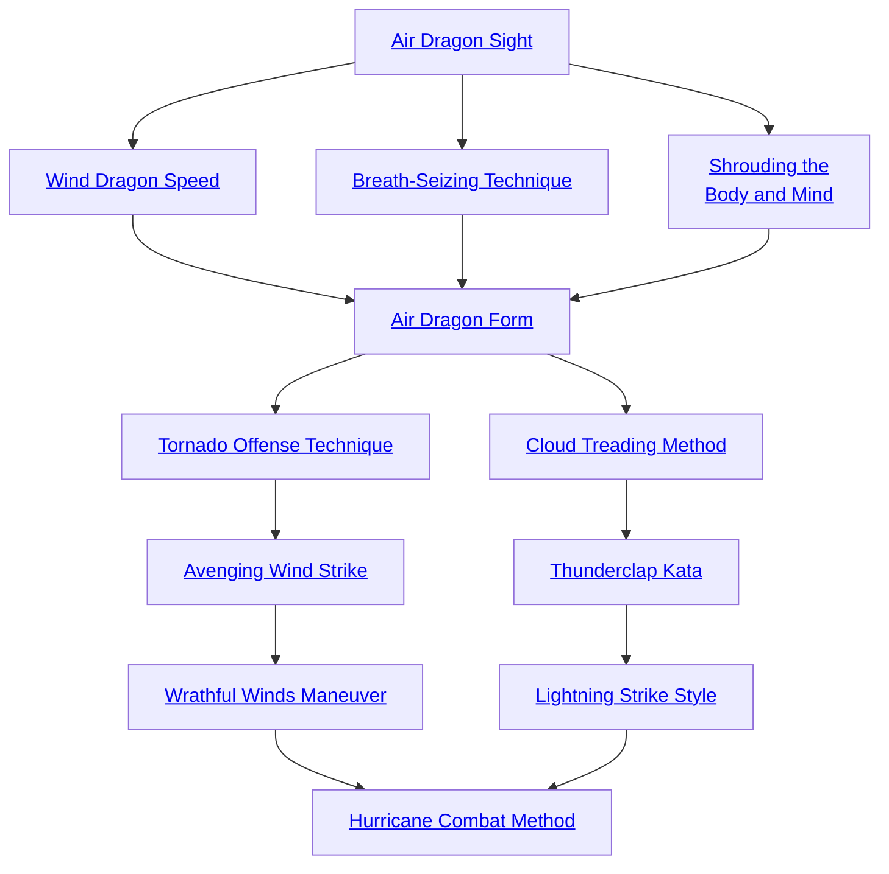

## Air Dragon Sight

Cost: 3 motes
Duration: One scene
Type: Simple
Minimum Martial Arts: 2
Minimum Essence: 1
Prerequisite Charms: None

To one fully in tune with the movements of the
mercurial Air, sight is no longer a necessity. Immaculates
learning this discipline attune themselves to the ebb and
flow of their patron element. The awareness of the martial
artist invoking this Charm become supernaturally acute,
as the slightest eddy of current in the air speaks volumes to
her. The minutest disturbance in the air warns her easily
of any danger. For the remainder of the scene, the Immaculate
cannot be surprised or ambushed and is considered
aware of any attacks against her.
Outside of combat, this Charm is used as a focusing
tool and has an additional benefit. In addition to all-around
awareness, the character may add her Essence to
any Awareness roll, as long as she takes a minute to stand
perfectly still and feel the Dragon's breath.

## Wind Dragon Speed

Cost: 2 motes
Duration: Instant
Type: Reflexive
Minimum Martial Arts: 2
Minimum Essence: 2
Prerequisite Charms: Air Dragon's Sight

Bolstered by the wings of the Air Dragon, the
Immaculate's speed increases greatly, and she moves with
a speed that seems like a just a blur to the naked eye. For
one turn, the Immaculate may add her Martial Arts rating
to her initiative total.

## Breath-Seizing Technique

Cost: 4 motes
Duration: Martial Arts in turns.
Type: Simple
Minimum Martial Arts: 3
Minimum Essence: 1
Prerequisite Charms: Air Dragon's Sight

Not every blow struck by the Immaculates is intended
to kill. The disciples of the Air Dragon have a special
maneuver that rains a series of carefully placed blows down
upon an enemy, actually driving the air from his lungs and
potentially knocking him unconscious.
When this blow is struck, do not figure damage as
normal. Instead, roll the Immaculate's Strength + Martial
Arts against the target's Stamina + Endurance in a reflexive
opposed test. Each success the Immaculate's player
rolls gives his opponent a - 1 penalty for a number of turns
equal to the Immaculate's Martial Arts. The impairment
inflicted by this Charm can accumulate over multiple
applications. If the target's impairment from this Charm
ever equals double her Stamina, she is rendered unconscious
for the rest of the scene.
This Charm only works on creatures that must breathe
to survive. Automatons, the undead, spirits and other
beings without the need to breathe are totally unaffected
by it, as are beings under the influence of magic that
removes the necessity for breathing.

## Shrouding the Body and Mind

Cost: 4 motes
Duration: Martial Arts in turns
Type: Simple
Minimum Martial Arts: 3
Minimum Essence: 2
Prerequisite Charms: Air Dragon's Sight

The realm of the Air Dragon is the realm of hidden
things, concealed secrets and quiet movement. By gathering
the element of Air about her, an Air Dynast
emulates the Air Dragon. The air itself wraps around the
Immaculate, shrouding the Exalt from view. For the
character's Martial Arts score in turns, she is rendered
invisible. It is possible to invoke this Charm while being
watched — or even while in hand-to-hand combat!
However, those watching may be able to guess where the
character has gone. This Charm is best used while those
looking at the character are distracted, and many Air
Dragons carry a supply of flash bombs, blinding powders,
etc. for just that purpose.
Enemies may attempt a reflexive Perception + Awareness
roll each turn to spot the Immaculate. If the observer
saw the Dragon-Blood disappear, spotted the Dragon-Blooded
last turn or witnessed an attack launched by the
character, the difficulty for the check is only 1. However,
the difficulty increases by one every turn that the character
remains undetected, to a maximum of 5. If the
observer has some reason to believe that someone is
around (a knocked over vase, footprints in the sand) the
difficulty for spotting the character starts at 3 and scales
up. Just casually looking for the shrouded Immaculate has
a difficulty of 5. Even when spotted, any actions taken
against the Dynast are at a +2 difficulty.

## Air Dragon Form

Cost: 5 motes
Duration: One scene
Type: Simple
Minimum Martial Arts: 4
Minimum Essence: 2
Prerequisite Charms: Wind Dragon Speed, Breath-Seizing Technique, Shrouding the Body and Mind

With a quick series of hand movements cutting the air
in front of him and a deep cleansing breath, the Immaculate
Dragon matches his breathing to that of the Air
Dragon itself. This Charm requires a successful Dexterity
+ Martial Arts roll, representing the successful execution
of the form itself. If the roll fails, the Charm has no effect,
and the motes invested in it are unspent, but the character's
action is wasted for the turn.
If the invocation of the Air Dragon Form is success-
ful, the Exalt may add her Martial Arts to her Ability
total for any ranged attack or dodge attempt she makes
for the rest of the scene. This can no more than double
the Ability the Immaculate is using to make the ranged
attack or dodge and is applied before any penalties for
splitting her dice pool. If she wishes, the character may
reflexively dodge attacks with her Martial Arts score.
The above benefits are specifically cumulative with and
independent of any other Charms or anima powers
invoked by the Immaculate.

## Tornado Offense Technique

Cost: 4 motes per attack
Duration: Instant
Type: Extra Actions
Minimum Martial Arts: 4
Minimum Essence: 2
Prerequisite Charms: Air Dragon Form

The powerful force of tornadoes can be tapped by an
Air Immaculate, turning her into a whirlwind of death —
at least for short periods. For every 3 motes the Immaculate
invests in this Charm, she may make an additional martial
arts or ranged attack without any penalties. The maximum
number of attacks a character may make in a turn is equal
to her Martial Arts rating.

## Avenging Wind Strike

Cost: 3 motes
Duration: Instant
Type: Supplemental
Minimum Martial Arts: 5
Minimum Essence: 3
Prerequisite Charms: Tornado Offense Technique

By infusing an attack with a tiny bit of the gusting
breath of the Air Dragon, an Immaculate can send a
target flying backward. An attack boosted by Avenging
Wind Strike is rolled as a normal attack, and damage is
figured normally — with one extra effect. After being hit,
the target's player must immediately make a reflexive
Strength + Athletics roll. The target is blown the Exalted's
Martial Arts x 10 yards, -5 yards per success on the
Athletics roll. This effect occurs whether or not the
Immaculate's strike actually does any damage to the
target. Obviously additional damage could occur of the
victim is blown off a cliff, into a lava pit, etc.
This Charm can be used with hand-to-hand or ranged
attacks. Many an opponent has laughed as a seemingly
harmless chakram sped toward her, only to suffer the wrath
of the Avenging Wind Strike.

## Wrathful Winds Maneuver

Cost: 5 motes, 1 Willpower
Duration: Instant
Type: Simple
Minimum Martial Arts: 5
Minimum Essence: 3
Prerequisite Charms: Avenging Wind Strike

With a mighty Essence-focusing shout, a savage
blast of wind issues from the character's mouth, wreaking
havoc on objects and beings caught in the gale. The
wrath affects a 90 degree arc directly in front of the
Immaculate, out to a distance of her Essence rating x 10
feet. The player of anyone standing even partially in the
area of effect must make a reflexive Strength + Athletics
roll against a difficulty equal to the Exalt's Martial Arts.
If the roll fails, the character is knocked off his feet. Any
concentration is shattered, and his player must make a
Wits + Resistance roll. A target whose player fails to get
at least a single success is stunned for the next turn, his
entire action taken up with clearing his head and regaining
his balance.
By spending a point of Willpower when activating the
Charm, the Aspect of Air can turn it into a much more
precise weapon, focusing the Wrathful Winds to hit a
single target. This target is automatically hit unless he has
some sort of impenetrable defense with which to block the
attack. The target takes the Exalt's Strength + Essence in
lethal damage from the sudden blast of air, which can be
soaked only with Stamina and other non-armor defenses.
In addition, his player must make the regular reflexive
Strength + Athletics roll for the character to keep his feet,
but the difficulty is increased to the attacking Exalt's
Strength + Essence. The range remains the martial artist's
Essence x 10 feet.

## Cloud Treading Method

Cost: 3 motes
Duration: Martial Arts in turns
Type: Reflexive
Minimum Martial Arts: 5
Minimum Essence: 3
Prerequisite Charms: Air Dragon Form

The Air Dragon can lighten the tread of his disciples,
opening paths to them that are closed to their earth-bound
brethren. The Immaculate invoking this Charm can move
like the wind itself, skirting obstacles with ease and grace.
For the character's Martial Arts rating in turns his
movement rate is doubled, as is the distance that he can
leap. Also, the character need not actually set foot on solid
ground to continue moving. A cloud-treading Dragon-Blooded
could easily scamper up a trail of smoke, across the
surface of a lake or leap across treetops, his feet touching
only the flimsiest branches.
The character must keep moving while crossing such
delicate surfaces; if the Exalt pauses for even a moment,
gravity takes over. This does not mean that a character
must end each turn on a solid surface. As long as he
continues moving into the next turn, a character may
also immediately invoke Cloud Treading Method again
without penalty, assuming he has enough motes to use
the Charm again.
Cloud treading heroes can take offensive and other
actions during their movement as long as the normal
penalties for attacking while moving are applied. The
Storyteller may increase the difficulty of any action at her
discretion, depending on circumstance.

## Thunderclap Kata

Cost: 5 motes
Duration: Instant
Type: Simple
Minimum Martial Arts: 5
Minimum Essence: 3
Prerequisite Charms: Cloud Treading Method

The realm of the Air Dragon is the realm of the
storm, and its disciples can tap into the force of this to
belabor their opponents. After a moment of centering
and a few deep breaths, the Immaculate brings her hands
together. The resultant clap of thunder can stun and
deafen those who hear it.
Players of those within the Exalt's Essence x 10
yards of the Thunderclap Kata must make a reflexive
Stamina + Resistance roll with a difficulty equal to the
character's Essence. Characters whose players get even
a single success manage to cover their ears in time -
but they lose any further action for the rest of the turn
as a consequence. Those whose players failed take
bashing damage equal to the Immaculate's Strength +
Martial Arts, which can be soaked only with Stamina
and other non-armor protection. In addition, they are
also deafened for a number of turns equal to the
Immaculate's Essence and, during that time, suffer a
penalty to all actions equal to the attacking character's
Essence from disorientation.
Obviously, this Charm does not affect those without
the need to hear — with one very important exception.
While normal beings are susceptible to the Thunderclap
Kata, it has an even greater effect on spirit beings. All this
Charm's effects are doubled against spirits, whether materialized
or not. The Immaculate does not need to be Spirit
Walking to gain this benefit and, in fact, does not even
have to know that a spirit is present.
The Dragon-Blooded is also immune to her own
Thunderclap Kata and may invest 1 extra mote per being
to insulate her compatriots from its effects. Spirits can't be
insulated in this manner.

## Lightning Strike Style

Cost: 4 motes, 1 health level
Duration: Martial Arts in turns
Type: Simple
Minimum Martial Arts: 5
Minimum Essence: 3
Prerequisite Charms: Thunderclap Kata

When this Charm is invoked, blue and white flickers
of electricity arc across the character's body, lighting his
face in an eerie glow. When the character punches or
kicks, brilliant strokes of lightening lance from his feet or
fingertips, striking distant opponents as if the Immaculate
was standing toe to toe with them.
For the Charm's duration, the character can make
martial arts attacks out to a distance of his Essence x 10
feet, and the attacks do lethal damage equal to the
character's Strength + Essence. Martial arts weapons add
to the accuracy and damage of these attacks, as normal.

## Hurricane Combat Method

Cost: 10 Essence, 1 Willpower, 1 health level per turn
Duration: Martial Arts in turns
Type: Reflexive
Minimum Martial Arts: 5
Minimum Essence: 4
Prerequisite Charms: Wrathful Winds Maneuver, Lightning Strike Style

The Exalt becomes a whirlwind of speed and mayhem
for the duration of the Charm. While using the Hurricane
Combat Method, the Immaculate adds her Martial Arts
total to her initiative and all dodge rolls (use her Martial
Arts alone if she has no other dodge pool), triples her
movement and doubles her possible jumping height. It also
allows her to make at number of extra martial arts or ranged
attacks equal to her permanent Essence rating every turn.
The health level cost of this Charm is not paid until
the Charm has expired. The Willpower point and motes
must be paid up front as normal. The character can end this
Charm prematurely at the end of any turn. Obviously, care
should be taken when invoking this Charm. Used by a
weakened Exalt, the consequences can be deadly.
