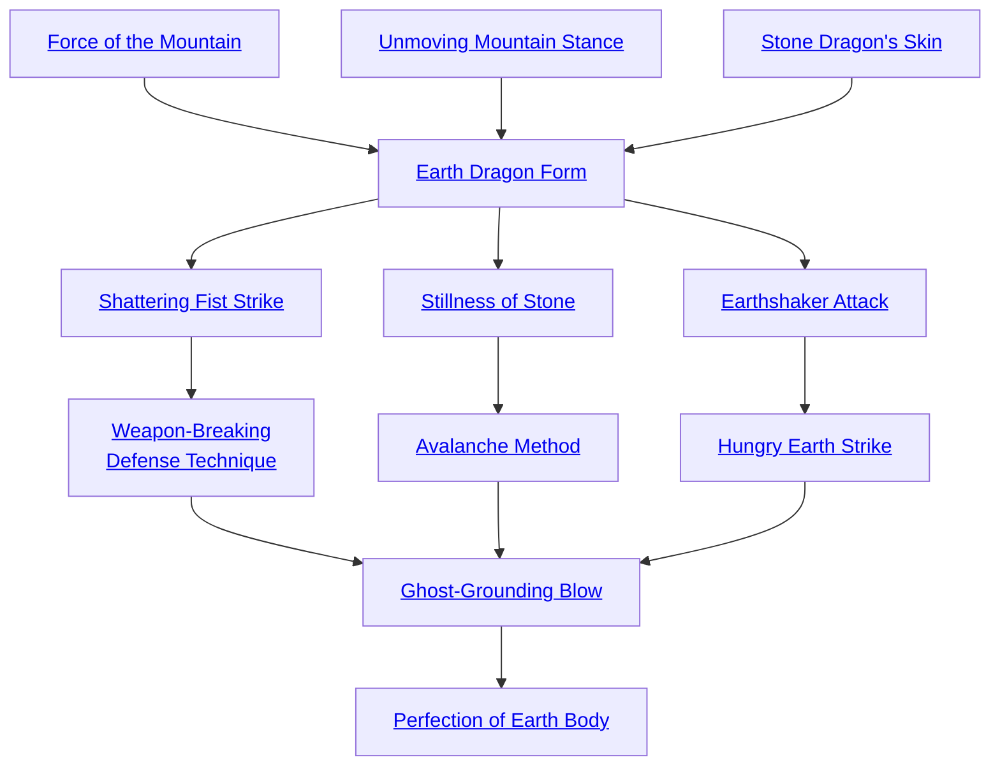

## Force of the Mountain

Cost: 2 motes
Duration: Instant
Type: Supplemental
Minimum Martial Arts: 3
Minimum Essence: 1
Prerequisite Charms: None

The power of the earth is massive indeed, bearing as
it does the entire weight of Creation. Martial artists of the
Path of Earth can channel some of that power through
their bodies and into their opponents. The Exalted takes
a moment to center himself, then unleashes a powerful
blow. The Immaculate may add his Essence to the damage
of the next Melee, Brawl or Martial Arts attack he lands.
If the blow is with a weapon, the character must pay an
additional point of Essence to channel the power of the
earth through it— unless the weapon in question is the
Earth Dragon's signature weapon, the seven section staff.
This attack can also affect dematerialized spirits as if
they were material. Obviously, the character must be using
Spirit Sight to see the spirit and thus attack it.

## Unmoving Mountain Stance

Cost: 3 motes
Duration: Martial Arts in minutes
Type: Simple
Minimum Martial Arts: 3
Minimum Essence: 1
Prerequisite Charms: None

This Charm is a combination of martial arts move and
meditative technique. The disciples of the Earth Dragon
can often be seen standing as still as statues in the gardens
of the Cloister of Wisdom, for while invoking this Charm,
a martial artist's body takes on the very stillness and
semblance of stone.
But aside from its meditative function, the Unmoving
Mountain Stance has applications in combat. Displacing
a monk invoking the stance is no easy task. For the
purposes of the Immaculate holding his ground or keeping
from being knocked down, treat her permanent Essence as
automatic successes in any contested roll to displace her.
Fighting opponents using this Charm can be a disconcerting
experience, as they simply refuse to be knocked off
their feet no matter what sort of mayhem is applied to
them. They are immune to all knockback or knockdown
effects as well.
The Charm also has some non-combat advantages. If
an Earth Immaculate is attempting to hide, the ability to
remain absolutely still and silent can be a great boon.
Assuming the Immaculate has found an appropriate hiding
place and is totally still, any attempt to locate her by
hearing, sound, body heat, etc. must overcome the
character's Essence in automatic opposing successes.

## Stone Dragon's Skin

Cost: 2 motes
Duration: One turn
Type: Reflexive
Minimum Martial Arts: 4
Minimum Essence: 2
Prerequisite Charms: None

With the invocation of this Charm, the Exalt's skin
briefly becomes as hard as the stony hide of the Earth
Dragon. The Immaculate's Martial Arts Ability acts as
armor against both lethal and bashing damage for the rest
of the turn. The martial artist may also parry weapons with
his bare hands without the use of a stunt. This Charm may
only be used once per turn.

## Earth Dragon Form

Cost: 4 motes
Duration: One scene
Type: Simple
Minimum Martial Arts: 4
Minimum Essence: 2
Prerequisite Charms: [[#Force of the Mountain]], [[#Unmoving Mountain Stance]], [[#Stone Dragon's Skin]]

By executing a series of katas, the Earth Immaculate
comes into true contact with the Earth Dragon and can
directly channel some of its power. For the remainder of
the scene after successful invocation of the Earth Dragon
Form, the Exalt adds his Martial Arts to his bashing and
lethal soaks against any attack. This armor even applies
to aggravated damage, which cannot normally be soaked.
Invoking the form also requires a successful Dexterity
+ Martial Arts roll. If the roll fails, the motes for this
Charm are not spent, but the action is wasted. The
above benefits are cumulative with any other Charms or
anima powers invoked by the Immaculate. Only one
Form-type Charm can be used at any one time. Invoking
a Form-type Charm immediately terminates the benefits
of any other Form-type Charm the character may
have active.

## Shattering Fist Strike

Cost: 3 motes
Duration: Martial Arts in turns
Type: Simple
Minimum Martial Arts: 4
Minimum Essence: 2
Prerequisite Charms: [[#Earth Dragon Form]]

The raw power of the elemental Earth is fearsome to
behold. By channeling this power into his body, an Im-
maculate can create a great deal of destruction. This
Charm doubles the Exalt's raw damage for the purposes of
destroying objects. This boost lasts for the character's
Martial Arts in turns. The Charm has absolutely no effect
on the amount of damage that a character does to living
things. The effect of Shattering Fist Strike stacks with
other effects, such as a Slayer Khatar's, that increase a
character's damage against objects.
Great care is taken in training disciples in how to use
this Charm properly, as careless use can be dangerous.
Even though the Charm does not affect living beings,
improper application can cause damage to the character
indirectly. For example, if an Exalt were to use Shattering
Fist Strike on a pillar supporting the roof, he would
probably be crushed. The Storyteller should apply appropriate
damage in these situations.

## Weapon-Breaking Defense Technique

Cost: Special, plus 1 Willpower
Duration: Instant
Type: Reflexive
Minimum Martial Arts: 3
Minimum Essence: 3
Prerequisite Charms: [[#Shattering Fist Strike]]

This maneuver can be attempted either bare handed
or with martial arts weapons. Roll normally to parry an
attack. If the roll succeeds, the character has successfully
captured the weapon between her hands or with her
weapon. Her player immediately makes a reflexive Strength
+ Martial Arts roll. This roll is difficulty 1 for normal
weapons but difficulty 3 for exceptional weapons and 5 for
weapons forged from the Five Magical Materials. If the roll
succeeds, the weapon the character was attacked with is
broken, shattered or otherwise rendered useless. Even if
the Immaculate fails to break the weapon, the weapon's
owner's player must succeed in a reflexive opposed Strength
+ Athletics test with the Immaculate player's or be immediately
disarmed. The cost of this Charm is a number of
motes of Essence equal to the difficulty of the roll to break
the weapon, and is paid before the parry attempt is made.
Weapons affected by this Charm are not totally destroyed,
just rendered immediately useless. They can
typically be repaired or reforged given time and skill.

## Stillness of Stone

Cost: 3 motes
Duration: Special
Type: Supplemental
Minimum Martial Arts: 5
Minimum Essence: 3
Prerequisite Charms: [[#Earth Dragon Form]]

With a precision martial arts attack, the Immaculate not
only strikes at certain critical nerve junctures, she instill a
small amount of Earth Essence into the target. The target is
paralyzed and completely unable to act for one turn per health
level of damage suffered in the character's attack. If an
opponent is reduced below Incapacitated by such an attack,
he is not only killed, but turned to stone. The character's body
calcifies into rock, and he remains in that state forever, a
ghastly trophy to the Immaculate's martial skill.
This attack cannot be channeled through a
weapon. The character must actually hit the target
with her bare hands.

## Avalanche Method

Cost: 5 motes
Duration: Until line of sight is broken or the character is incapacitated
Type: Supplemental
Minimum Martial Arts: 5
Minimum Essence: 3
Prerequisite Charms: [[#Stillness of Stone]]

The Exalted invokes this Charm as he makes a normal
attack, raining a flurry of blows down upon his opponent,
driving her to the ground — or at least into some inferior
defensive posture.
If the character successfully strikes his opponent,
make a reflexive opposed roll pitting the Immaculate's
Strength + Martial Arts against the target's Stamina +
Athletics. If the target exceeds the character's number of
successes, she suffers normal damage but no additional
effect. If the character ties or exceeds the target's successes,
Earth Essence courses from him into his target's body,
weighing her down as if beneath the crushing weight of an
avalanche. For every success he gets, the target suffers a
one die penalty to all physical tasks so long as the Exalt can
maintain line of sight to the target. These successes are not
cumulative if the target is subjected to the Avalanche
Method on a subsequent turn — only the highest number
of successes rolled applies.
If the Exalt accrues more points of impairment than
the target has points of Stamina, the target is &quot;buried,&quot;
completely immobilized and unable to take any physical
action unless released by the Exalt. The Earth Dragon
Immaculate must maintain physical contact with the
target to maintain this immobile state. The Exalted can
take actions as normal, but all physical tasks are at +1
difficulty, reflecting the inconvenience of maintaining
contact with the target of the Avalanche Method.
Earth-aspected Terrestrial Exalted are totally im-
mune to this Charm, although they may suffer normal
physical damage from the blow charged with it. This power
cannot be channeled through weapons.

## Earthshaker Attack

Cost: 5 motes
Duration: Instant
Type: Simple
Minimum Martial Arts: 5
Minimum Essence: 3
Prerequisite Charms: [[#Earth Dragon Form]]

To use this Charm, the martial artist must be standing
on the earth itself or on an earthen surface (stone, masonry,
etc.). The Immaculate brings her foot down upon
the ground with a mighty stomp, and the Earth Dragon
heaves and tosses in response.
The players of everyone within the invoker's Essence
x 10 feet must make a reflexive Dexterity + Resistance roll
with a difficulty equal to the Exalt's Essence as the earth
shakes and rocks beneath their feet. A character whose
player fails the roll is thrown violently off his feet and into
the air, taking one die of bashing damage per point of the
Immaculate's Martial Arts. This damage is soaked as
normal. See the rules on knockback and knockdown rules
on page 234 of the Exalted main rulebook.

## Hungry Earth Strike

Cost: 5+ motes, 1 Willpower
Duration: Instant
Type: Simple
Minimum Martial Arts: 5
Minimum Essence: 3
Prerequisite Charms: [[#Earthshaker Attack]]

After a moment of focus, the Exalt crouches down and
seems to simply strike the ground with an open palm. But
far from being a simple strike, shockwaves ripple through
the ground toward a target of the character's choice. The
earth beneath opens up like a gaping maw — then closes
back up again with immobilizing force.
The Immaculate's player should roll his character's
Strength + Martial Arts in a reflexive opposed roll against
the target's Wits + Athletics. The target's defense roll is
reflexive. Each success the Immaculate gets causes the
target a difficulty penalty of + 1 for any physical activity, as
well as adding one to the Strength rating of the grip of the
earth. The impairment continues until the target breaks
free, and until she breaks free, the target may not move
from the spot at which the Hungry Earth struck her. The
victim's player may make a Strength + Athletics roll with
a difficulty equal to the strength of the earth's grip to free
herself. This escape attempt takes a full action. If the target
succeeds, she is free of the Hungry Earth.
If the character manages to actually exceed the target's
Strength with the strength of the Hungry Earth, the target
is sucked down into the ground. She may do nothing
except try to free herself, and the Strength rating of the
earth's grip is doubled.
Additional targets can be affected by the Hungry
Earth Strike for the price of 1 mote per extra target. The
Immaculate's player makes one Strength + Martial Arts
roll, while each target's player gets her own Wits + Athletics
rolls to evade the cracks. The maximum number of
targets the Exalt can affect is double her Essence. Obviously,
the subjects of this Charm must be standing on the
ground to be affected.

## Ghost-Grounding Blow

Cost: 5 motes, 1 Willpower
Duration: Instant
Type: Supplemental
Minimum Martial Arts: 5
Minimum Essence: 3
Prerequisite Charms: [[#Weapon-Breaking Defense Technique]], [[#Avalanche Method]], [[#Hungry Earth Strike]]

With a carefully placed melee strike, the Earth
Dragon warrior infuses a bit of elemental Earth directly
into a spirit's form, making it solid enough to be affected
by his attacks.
To use this Charm, the Immaculate must first be
Spirit Walking (see page 242). Upon making a successful
martial arts attack on a spirit, the martial artist's player
should roll his character's Wits + Martial Arts in a reflex-
ive opposed contest against the spirit's permanent
Willpower. If the martial artist loses the contest, the blow
has no effect. If he wins this contest, the spirit takes no
damage, but it is dragged into the material world. The spirit
must first drain its own Essence to pay for the materialization.
If the spirit's Essence isn't sufficient, the remainder is
drained from the character. If the Exalt doesn't have
enough either, the Essence is still lost from both parties,
but the spirit remains immaterial.
The spirit must remain materialized for a number of
hours equal to the Immaculate's Martial Arts Ability. It
is in all ways a normally materialized spirit that is prohibited
from dematerializing and can use its Charms as
normal, assuming it still has enough Essence to do so.
Should the Immaculate and the spirit tie on the opposed
roll, the spirit is driven into the material world but need
remain for only a single turn.
No spirit likes to be forced into the material
world, and most spirits are inclined to dramatically
display this displeasure. Needless to say, Earth-aspected
Immaculates usually use this move as a prequel to
destroying the spirit in question.
This Charm has no effect on spirits with permanent
Essences higher than the Dragon-Blood's.

## Perfection of Earth Body

Cost: 10 motes, 1 Willpower
Duration: One scene
Type: Simple
Minimum Martial Arts: 5
Minimum Essence: 5
Prerequisite Charms: [[#Ghost-Grounding Blow]]

This Charm is the pinnacle of the Earth Dragon Path,
representing the Immaculate truly becoming one with the
Earth Dragon — if only for a short time. The martial artist
drops to his hands and knees for a few moments, putting
himself fully in contact with the elemental Earth. The
Immaculate's body twists and shifts, his skin becoming rough
and craggy, his body hardening and calcifying. The Dynast
becomes a being of living stone for the rest of the scene.
The affects of this are quite dramatic. The character's
Strength is doubled by the powerful Earth Essence coursing
through his body, and blows from the character's fists
become deadly weapons, with Accuracy, Parry and Damage
ratings equal to the character's permanent Essence and
a Speed equal to twice the character's permanent Essence.
The character's unarmed attacks do lethal damage. The
Immaculate's granite-like skin also gives enormous protection,
increasing his lethal and bashing soaks by his
permanent Essence score and allows him to soak lethal
damage with his entire Stamina. This protection is incompatible
with armor but works with any other defensive
Charms that character may be using. The character also
ignores the penalties of losing health levels. He still takes
the damage normally but functions as if unwounded until
incapacitated. If the character is wounded already when
invoking Perfect Earth Body, those penalties are eliminated,
although the damage is not healed.
