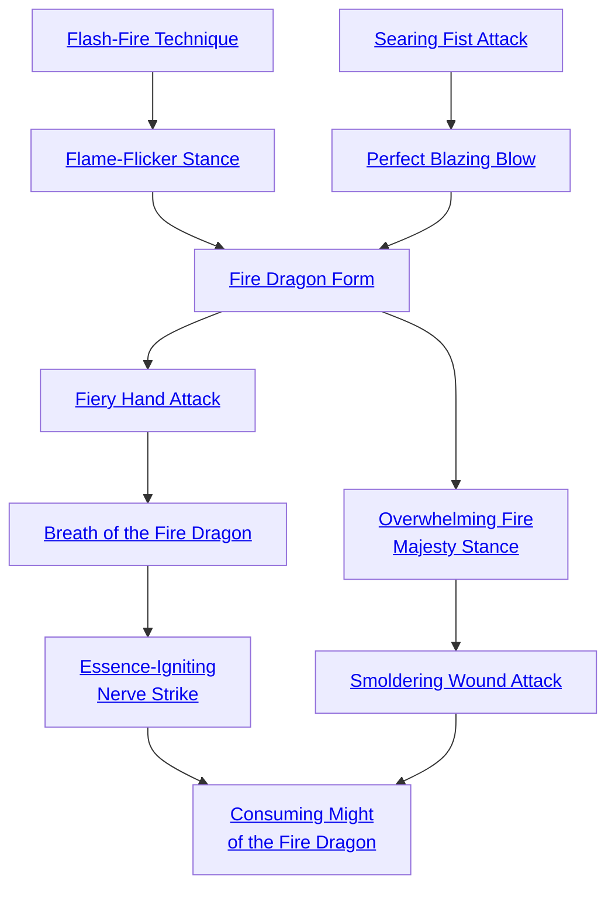

## Flash-Fire Technique

Cost: 3 motes
Duration: Instant
Type: Reflexive
Minimum Martial Arts: 3
Minimum Essence: 1
Prerequisite Charms: None

The special training the Fire Dragon Immaculates
undergo allows them to take action with the speed of a
spark igniting bone-dry tinder. By spending 3 motes of
Essence, a Fire Immaculate may reroll his initiative and use
the best of the two results.

## Flame-Flicker Stance

Cost: 1 mote per +1 difficulty
Duration: One turn
Type: Reflexive
Minimum Martial Arts: 3
Minimum Essence: 2
Prerequisite Charms: [[#Flash-Fire Technique]]

After invoking the Flame-Flicker Stance, the
character's body seems to shift and move like a burning
flame. Until the martial artist's next action, all attempts to
physically attack her are at a +1 difficulty per mote of
Essence expended. A character cannot have more of a
bonus active at any one time from this Charm than her
permanent Essence.

## Searing Fist Attack

Cost: 3 motes
Duration: One turn
Type: Supplemental
Minimum Martial Arts: 3
Minimum Essence: 2
Prerequisite Charms: None

The damage done by the Searing Fist Attack is not
that terrible — but the pain is. An attack enhanced by this
Charm leaves a deep burning sensation where it lands,
distracting an opponent. The Fire Dragon Immaculate
focuses his Essence and strikes his opponent, a slight scent
of brimstone suffusing the air. Figure damage as normal for
the martial arts attack. A target taking damage from the
Searing Fist Attack suffers a -1 penalty to his dice pools for
the rest of the scene. The character must actually do
damage to his target to inflict this penalty. The effect of
multiple Searing Fist Attacks is cumulative.

## Perfect Blazing Blow

Cost: 2 motes
Duration: Instant
Type: Reflexive
Minimum Martial Arts: 3
Minimum Essence: 2
Prerequisite Charms: [[#Searing Fist Attack]]

After the character attacks, but before the defense is
rolled, the Immaculate's player can choose to reroll the
attack and pick which result he wants to use. A character
can only use this Charm once on any given attack.

## Fire Dragon Form

Cost: 5 motes
Duration: One scene
Type: Simple
Minimum Martial Arts: 4
Minimum Essence: 2
Prerequisite Charms: [[#Flame-Flicker Stance]], [[#Perfect Blazing Blow]]

Flames seem to glow in the eyes of the martial artist
as she completes a quick series of katas to invoke the
strength of the Fire Dragon. The Dynast's movements
afterward are more like the fire she seeks to emulate, and
she seems to dance beneath attacks aimed at her with
frightening ease.
For the remainder of the scene after successful
invocation of the Fire Dragon form, add the Exalted's
Martial Arts score as successes to any dodge rolls. This
bonus is added to each dodge roll separately. The
character cannot use these successes as a reflexive
action — in order to dodge an attack, she must still
either abort to a full dodge or have dedicated actions
to dodging ahead of time.
invoking the fire dragon form also requires a
successful Dexterity + Martial Arts check, representing
the successful execution of the move itself. If the
roll fails, the motes for this Charm are not spent, but
the action is wasted. The above benefits are cumulative
with any other Charms or anima powers invoked
by the Immaculate but are not compatible with the use
of armor.
Only one Form-type Charm can be invoked at
any one time. Invoking a new Form-type Charm
automatically ends the effects of any currently active
Form-type Charm.

## Fiery Hand Attack

Cost: 4 motes
Duration: Instant
Type: Supplemental
Minimum Martial Arts: 5
Minimum Essence: 3
Prerequisite Charms: [[#Fire Dragon Form]]

A successful Fiery Hand Attack does normal damage
plus the character's Martial Arts rating, as the flaming
touch sears his enemy. The attack does lethal damage,
even if it wouldn't normally. Upon striking an opponent,
the Immaculate's player also reflexively rolls the character's
Strength + Martial Arts versus the target's Stamina +
Resistance. A being magically attuned to water may add
two dice to her roll when resisting this attack. If the target
wins or ties, the attack has no additional effect on her
beyond the damage. If a target loses, burning Fire-aspected
Essence is unleashed upon her, and she bursts into flame.
While it looks, smells and feels just like normal
fire, the flames from a Fiery Hand Attack are partially
magical and can't be doused normally. Only magic or
the expiration of the Charm kills the flames. If not
doused, a target set aflame will continue to burn for the
Exalted's Essence in turns. Treat the fire as a bonfire as
per the environmental damage rules on page 244 of the
main Exalted rulebook — every turn, the target's
player must make a reflexive Stamina + Resistance roll
at difficulty 3, the character taking 2L damage if the
roll succeeds or 6L damage if it fails. This damage is
soaked normally.

## Breath of the Fire Dragon

Cost: 1 mote per Essence lethal damage
Duration: Instant
Type: Simple
Minimum Martial Arts: 5
Minimum Essence: 3
Prerequisite Charms: [[#Fiery Hand Attack]]

With a momentary centering kata, a Fire Immaculate
can spit a gout of fire up to his Essence in yards. To
attack, roll the Immaculate's Perception + Martial Arts,
with his Essence rating acting as automatic successes.
This fiery breath does the character's Essence in lethal
damage per mote the Fire Dragon Immaculate invests in
the Charm. A character cannot invest more motes in this
attack than his Martial Arts score.
By expending a point of Willpower, the Dragon-
Blood can empower the Breath of the Fire Dragon to affect
spirits as well as material objects.

## Essence-Igniting Nerve Strike

Cost: 5 Essence, 1 Willpower
Duration: Instant
Type: Simple
Minimum Martial Arts: 5
Minimum Essence: 3
Prerequisite Charms: [[#Breath of the Fire Dragon]]

With a series of quick nerve touches, the Exalt actually
causes the Essence in his opponent's body to flare,
potentially causing a great deal of damage. The Immaculate
makes a martial arts attack as normal, but if he hits, the
attack does no damage. Instead, for every mote currently
in a target's Personal Essence pool, he takes one health
level of lethal damage, up to a maximum of twice the
Immaculate's permanent Essence. This damage ignores
armor but may be soaked normally with Stamina and other
non-armor defenses. Obviously, this Charm is of limited
use against non-Exalted, but Exalts could potentially suffer
up to 10 health levels of damage. The target's Essence
remains totally available, it simply serves as a catalyst for
the attack and is not reduced.

## Overwhelming Fire Majesty Stance

Cost: 4 motes
Duration: Until abandoned
Type: Supplemental
Minimum Martial Arts: 5
Minimum Essence: 3
Prerequisite Charms: [[#Fire Dragon Form]]

The power and majesty of a raging conflagration can
cow even the bravest of hearts. By striking an aggressive
pose and channeling this aspect of fire, a follower of the
Fire Dragon can strike fear into lesser foes.
Attacking a character who is using Overwhelming
Fire Majesty Stance is not an easy prospect. Anyone able
to see who tries to attack the Fire Dragon Immaculate must
subtract the character's Martial Arts rating from their dice
pools when doing so. Additionally, anyone trying to attack
those who are clearly allied with the martial artist must
subtract half that number of dice (rounded down). This
latter effect has a range equal to the Dynast's Essence in
yards centered on the Immaculate.
While maintaining the stance, the Immaculate can
defend himself and take normal actions, but he may not
make any attacks or use other Charms. He may also move
at half his normal speed. If the martial artist is struck and
suffers any health levels of damage, the stance ends immediately.
If the character abandons the Overwhelming Fire
Majesty Stance voluntarily, the effects linger on for a
single turn after the character drops the stance.

## Smoldering Wound Attack

Cost: 4 motes
Duration: Varies
Type: Supplemental
Minimum Martial Arts: 5
Minimum Essence: 3
Prerequisite Charms: [[#Overwhelming Fire Majesty Stance]]

This Charm focuses Essence into the Exalt's blow,
investing the attack with the heat of burning embers. If the
character manages to damage her opponent, the wound
smolders like a dying fire. At the beginning of the turn
following the one in which the Smoldering Wound Attack
was successful, the victim suffers the same post-soak
damage that the original attack caused. Soak does not
apply to this damage, but the damage is rolled normally.

## Consuming Might of the Fire Dragon

Cost: 6 motes, 1 Willpower
Duration: One scene
Type: Simple
Minimum Martial Arts: 5
Minimum Essence: 4
Prerequisite Charms: [[#Essence-Igniting Nerve Strike]], [[#Smoldering Wound Attack]]

This Charm enhances the natural anima flare of a Fire
Exalt. For Aspects of Fire, it triples the fire damage that
their anima causes. If the character using the Charm is not
a Fire-aspected Exalted, the Charm causes him to erupt in
the Aspect of Fire anima power — but without the tripled
damage. Anyone viewing the invoker is also subject to the
same effects as if the Exalt was using the Overwhelming
Fire Majesty Stance, except that the effect doesn't end if
the character attacks or uses Charms.
