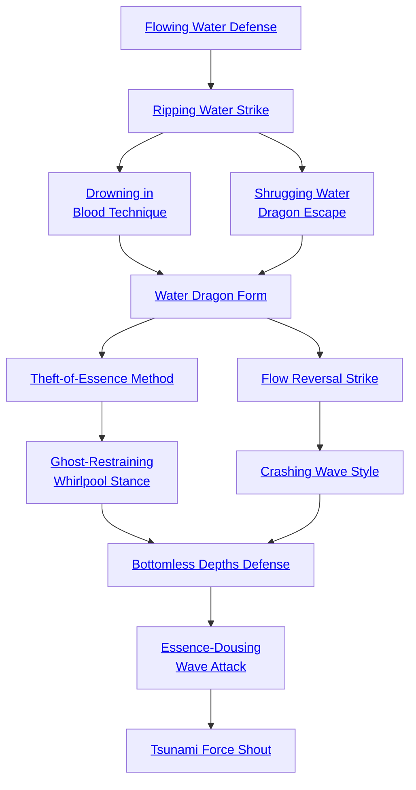

## Flowing Water Defense

Cost: 1 mote
Duration: Essence in turns
Type: Reflexive
Minimum Martial Arts: 2
Minimum Essence: 1
Prerequisite Charms: None

The peculiar liquid, dancing moves of the Water
Dragon fighting style allows those trained in them to flow
out of the way of opponent's blows like water. For a number
of turns following invocation equal to her Essence, subtract
one die from the martial artist's own attack pools.
Anyone attempting any attack against the Dragon-Blooded
during that time subtracts three dice from his pool for that
action. A character can only benefit from the effects of this
Charm once at any given time.

## Ripping Water Strike

Cost: 2 motes
Duration: Instant
Type: Supplemental
Minimum Martial Arts: 3
Minimum Essence: 2
Prerequisite Charms: Flowing Water Defense

Like ripples emanating from a pebble dropped into
the glassy surface of water, the force of an attack enhanced
by Ripping Water Strike spreads outward from the point
of impact to affect those nearby. The target of the attack
takes normal damage, but everyone but the Immaculate
within 10 feet of the target takes bashing damage equal to
the successes rolled on the damage roll - if the target takes
no health levels of damage, there is no ripple damage. This
bashing damage can be soaked as normal and cannot be
converted to lethal.
The Immaculate cannot be selective about who is
affected by the Ripping Water Strike. Friends are as
susceptible as foes.

## Drowning in Blood Technique

Cost: 4 motes
Duration: Instant
Type: Simple
Minimum Martial Arts: 3
Minimum Essence: 2
Prerequisite Charms: Ripping Water Strike

The body, as anyone can see, contains a lot of water
- blood. Dragon-Blooded warriors who learn the hidden
tides and currents of blood can strike in such a way as to
cause internal bleeding into an enemy's lungs. The victim
can literally drown in his own blood.
To use this Charm, the attacker makes a successful
Martial Arts attack against his opponent, which does no
damage. However, if the attack succeeds, the Immaculate's
player then rolls a reflexive opposed test of the Exalt's
Strength + Martial Arts against the target's Stamina +
Resistance. If the Immaculate wins the contest, the target
loses one point of Stamina for as many turns as the player
rolled extra successes. Though the Drowning-in-Blood
Technique itself does not inflict health levels of damage,
it may look like a series of rapid-fire punches or some other
attack. Subsequent uses of the Charm are cumulative. A
character whose Stamina reaches zero from the effects of
this Charm is dead.

## Shrugging Water Dragon Escape

Cost: 3 motes
Duration: Instant
Type: Simple
Minimum Martial Arts: 3
Minimum Essence: 2
Prerequisite Charms: Ripping Water Strike

With a focusing of Essence, the Immaculate can cast
off any restraint, magical or physical. Chains shatter, ropes
snap, handcuffs drop from the Exalt's wrists. Anything
restraining the movement of the Immaculate is cast aside.
In the case of artifacts and naturally occurring phenomena,
their effects are suspended for a number of turns equal
to the Exalted's Martial Arts score.

## Water Dragon Form

Cost: 5 motes
Duration: One scene
Type: Simple
Minimum Martial Arts: 4
Minimum Essence: 3
Prerequisite Charms: Drowning-in-Blood Technique, Shrugging Water Dragon Escape

Bodies of water absorb force directed against them,
dissipating damage. With the execution of a few fluid body
movements, the Immaculate invoking the Water Dragon
Form becomes more like the watery element she serves.
For the remainder of the scene after successful invocation
of the Water Dragon Form, the martial artist gets a
bonus to her lethal and bashing soaks equal to her Martial
Arts Ability and can soak lethal damage with her Stamina
for the duration of the Charm. In addition, whenever
successfully attacked, the Exalt may spend additional
Essence points for extra soak on a 1 mote per 2 points of
soak basis. The character may declare how much Essence
she is spending after her normal soak has been applied but
before the attacker's player rolls damage.
In addition, the character's fluid form makes her
blows harder to evade. Mechanically, this Charm increases
her Martial Arts by an amount equal to her
permanent Essence for the duration of the Charm. This is
a Charm enhancement and counts against the maximum
amount the Dragon-Blood may increase her Martial Arts
by with Charms.
Invoking the form also requires a successful Dexterity
+ Martial Arts check, representing the basic execution of
the move itself. If the roll fails, the Charm does not
activate, and the motes spent to power it are not expended,
but the character's action is wasted.
Only one Form-type Charm can be invoked at any
one time. Invoking a new Form-type Charm automatically
ends the effects of any currently active Form-type Charm.

## Theft-of-Essence Method

Cost: 4 motes, 1 Willpower
Duration: Instant
Type: Supplemental
Minimum Martial Arts: 5
Minimum Essence: 3
Prerequisite Charms: Water Dragon Form

After a successful attack, the player of the Water
Dragon Immaculate invoking this Charm makes an Essence
+ Martial Arts roll. For every success, the
Immaculate steals 3 motes of Essence from the target and
adds them to his own reserves. This target's lost Essence
is recovered normally.
This stolen Essence can be used by the character —
but only on other Water Dragon Path Charms. Essence
stolen in this manner fades from the Immaculate at a rate
of 1 mote per minute.

## Ghost-Restraining Whirlpool Stance

Cost: 5 motes, 1 Willpower
Duration: Until abandoned
Type: Simple
Minimum Martial Arts: 5
Minimum Essence: 3
Prerequisite Charms: Theft-of-Essence Method

By executing a few special katas, the Immaculate
invoking the Ghost-Restraining Whirlpool Stance sets up
a vortex of water Essence capable of immobilizing even
very powerful spirits.
To make an attack to set up a Ghost-Restraining
Whirlpool, the martial artist spends her turn executing the
movements necessary to start the Charm. The player
should roll the Immaculate's Dexterity + Martial Arts.
The player of any spirit in the area of effect should
reflexively roll Essence in an opposed contest against the
Immaculate. If the spirit wins, the whirlpool has no effect.
For every success the Dynast gets, all spirits in the area of
effect must add a + 1 difficulty penalty to any actions they
take, as the roiling whirlpool of Essence draws them in.
If the difficulty penalty ever exceeds a spirit's permanent
Essence rating, the spirit is totally immobilized,
unless its permanent Essence rating is higher than the
Immaculate's. In that case, it still suffers the difficulty
penalties but, otherwise, acts as normal. The Ghost-Restraining
Whirlpool has a radius of (10 x the character's
Essence) in yards. While sustaining the whirlpool, the
character must add +2 to the difficulty of any tasks she
attempts, to reflect the enforced formality of her move-
ment, and cannot move out of the area of effect without
dropping the Charm.

## Flow Reversal Strike

Cost: 4 motes
Duration: Instant
Type: Simple
Minimum Martial Arts: 5
Minimum Essence: 3
Prerequisite Charms: Water Dragon Form

If the Dragon-Blood hits his target, for a fraction of
a second, every moving fluid in the target's body reverses
itself. Needless to say, living creatures do not
react well to this.
The character makes an unarmed martial arts attack,
which does normal damage. The target's player should roll
her character's Stamina + Resistance against the
Immaculate's original attack roll to hit, unreduced by
attempts to dodge or parry it.
If the target does not exceed the Dragon-Blood's
successes, the effects vary. Normal mortals and animals of
less than twice the Immaculate's size failing the Resistance
roll are killed outright. Exalted and other magical
beings take a single automatic level of unsoakable lethal
damage. Aquatic or amphibious creatures take two levels
of damage. Even if a target's player succeeds at the
Resistance roll, she must subtract two dice from any
action involving physical activity for the Immaculate's
Martial Arts in turns.
This Charm only works against living corporeal beings.
Spirit, magical constructs and other non-living (or
unliving) beings are unaffected.

## Crashing Wave Style

Cost: 4 motes
Duration: Instant
Type: Extra Actions
Minimum Martial Arts: 5
Minimum Essence: 3
Prerequisite Charms: Flow Reversal Strike

The ocean pounds the shores with savage fury, and
Water-aspected Immaculates can channel that fury. Upon
making a successful martial arts attack, the Dragon-Blood
may invoke this Charm and immediately make another
attack, at -1 die to her pool. If that attack is successful, the
Immaculate may make a further attack, but the penalty to
her dice pool doubles to -2, on the third to -4, and so on.
Each additional attack doubles the penalty yet again. If the
penalties reduce an Immaculate's dice pool to zero, she
may not make any further attacks. The maximum number
of attacks a Dragon-Blood may make in this manner is
equal to her Martial Arts rating.

## Bottomless Depths Defense

Cost: 5 motes, 1 health level
Duration: One turn
Type: Reflexive
Minimum Martial Arts: 5
Minimum Essence: 3
Prerequisite Charms: Ghost-Restraining Whirlpool Stance, Crashing Wave Style

When this Charm is invoked, the Immaculate immediately
takes a single health level of aggravated damage.
All other damage the Immaculate suffers for the rest of the
turn is negated, drawn down into the bottomless abyss of
the Water Dragon. This Charm may be used reflexively in
response to being attacked, but it must be invoked before
the damage for the attack is rolled.
Most walkers on the Water Dragon Path save this
Charm for very extreme circumstances. The benefits can
be high, but so are the consequences.

## Essence-Dousing Wave Attack

Cost: 8 motes, 1 Willpower
Duration: Varies
Type: Supplemental
Minimum Martial Arts: 5
Minimum Essence: 4
Prerequisite Charms: Bottomless Depths Defense

The dark, smothering Essence of the Water Dragon
can be channeled through a Dynast's blows to douse the
metaphorical fire of an opponent's magic.
To invoke this Charm, the Exalted makes a normal
martial arts attack, either armed or unarmed. The attack
does normal damage, and if the target is actually
hurt by the attack (that is, loses health levels), the
martial artist's player should make an immediate reflexive
Martial Arts + Essence roll with a difficulty equal to
the target's Essence. For a number of turns equal to the
successes that the Immaculate gets, all Charms and
sorcery affecting the target are suppressed. If the num-
ber of successes exceeds the Essence of the character
who invoked an affected Charm or cast an affected
spell, the magic is actually dispelled.
Characters affected can renew Charms on themselves
during the duration of the suppression. Unless the Charms
are specifically noted as having cumulative benefits, characters
who suddenly have the same Charm active on them
twice when the suppression ends gain no special benefits,
and even cumulative Charms cannot exceed their normal
maximum effectiveness.
This Charm can be used on friendly targets, but the
martial artist must do at least one health level of bashing
damage to trigger the effect.

## Tsunami Force Shout

Cost: 10 motes, 1 Willpower, 1 health level
Duration: Instant
Type: Simple
Minimum Martial Arts: 5
Minimum Essence: 4
Prerequisite Charms: Essence-Dousing Wave Attack

The Tsunami Force Shout radiates out from the
Immaculate in a 45-degree arc, reaching out to her Essence
in yards. Anyone, friend or foe, caught in the area of effect
takes twice the Dynast's Martial Arts + Essence as damage,
as a wave of Water Essence washes over them.
The type of damage varies, depending on the characters'
strength of spirit. The players of everyone caught
in the area of effect must make a reflexive Essence check.
If the roll botches, the damage is aggravated and automatic
- everything not soaked translates into an
automatic health level of aggravated damage. If the roll
fails, the damage is aggravated but rolled normally. If the
roll succeeds, the damage is lethal and rolled normally.
With at least three successes on the Essence roll, the
damage is bashing.
