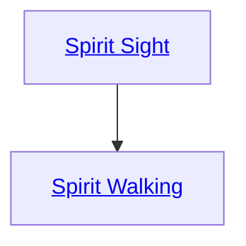

## Spirit Sight

Cost: 5 motes
Duration: One scene
Type: Reflexive
Minimum Martial Arts: 3
Minimum Essence: 2
Prerequisite Charms: None

As mentioned previously, a basic part of Immaculate
training is that of interacting with the spirit world. The
first step in this training is to comprehend how to perceive
the spirit world. This ability is gained as part of the basic
training of a Dragon Path, whether the Exalt becomes an
Immaculate during character creation or joins the Order
later in life. Possessing it is a requirement for learning the
Charms on the Dragon Path.
The practical upshot of this is that by spending a
single mote of Essence, an Immaculate can perceive spirits
and incorporeal beings. Normally invisible spiritualized
beings become visible to the Spirit Walker. This power
lasts for an entire scene — or until the Exalt consciously
reattunes herself to the normal world. Reattuning to the
normal world is a dice action.
Tuning in to the spirit world does tend to distract
one from the concerns of the material one though. The
Exalt invoking this ability suffers a +1 to the difficulty
of any activity relating to the corporeal world while
using Spirit Sight.

## Spirit Walking

Cost: 3 motes, 1 Willpower
Duration: One scene
Type: Simple
Minimum Martial Arts: 3
Minimum Essence: 3
Prerequisite Charms: Spirit Sight

The Immaculates are widely known for their ability
to interact with and combat spirits. By merely concentrating
for a moment, a properly trained Dragon-blood
can do more than just see the spirit world. She can &quot;Spirit
Walk,&quot; mystically attuning herself to the spirit world on
a physical level.
This Charm allows the Immaculates who know it to
interact with spirits as if they were normal corporeal
beings. Physical damage dealt by a Spirit Walker that
would normally pass right through a spirit's immaterial
form affects it as if the spirit were flesh and blood, as do
the Charms and abilities of the Exalted. The Immaculate
is still in the physical world, however, and has to deal
with any physical limitations that may apply. Also,
unless the Immaculate uses Spirit Sight, she cannot see
dematerialized spirits.
Spirit Walking puts the character truly in tune with
both the spiritual world and the corporeal one. When
Spirit Walking is used with Spirit Sight, the +1 penalty to
difficulties for physical world action is negated.
