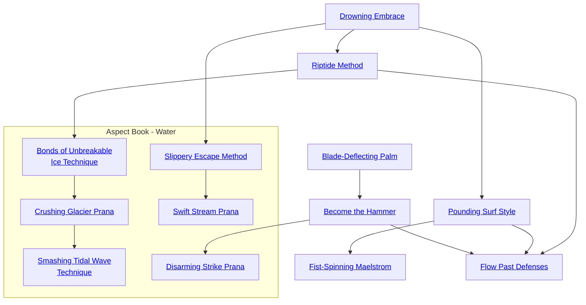

## Drowning Embrace

Cost: 1 mote
Duration: Instant
Type: Supplemental
Minimum Brawl: 2
Minimum Essence: 2
Prerequisite Charms: None

The victims of this Charm drown on dry land, locked
into a fierce clinch with the Exalt. Survivors of the
assault actually cough up water from their lungs. This
Charm must be used in conjunction with a clinch attack
against the target. The Dragon-Blooded's clinch does
lethal rather than bashing damage. For each successive
turn the clinch is maintained and this Charm is invoked,
the clinch does an additional + 1L damage. Stopping the
use of this Charm for even a turn will reset the damage of
the clinch to normal.

## Riptide Method

Cost: 1 mote per attack/foe
Duration: One turn
Type: Extra Action
Minimum Brawl: 4
Minimum Essence: 2
Prerequisite Charms: [[#Drowning Embrace]]

A brawler using this Charm is capable of wrestling up
to four opponents at once — theoretically, one for each
limb, though combatants of particularly large girth may
simply immobilize opponents with their bulk.
The Exalt's player makes Dexterity + Brawl rolls to
initiate the attacks, which must be clinches or holds. Each
attack costs a single mote, each must be made against a
different target, and the Exalt may not make more than four
such attacks. The targets may dodge or parry as normal,
meaning that some may escape while others may not.
In subsequent turns, the Dragon-Blood may, after
initiative is rolled but before anyone acts, spend Essence to
keep this Charm active. Again, the cost is 1 mote per
already-restrained victim per turn. If the character has less
than four victims and others are still within reach, then on
his action, he may pay more motes and attempt to put them
in clinches or holds.
If the Exalt does not pay the motes of Essence each
turn to maintain the assault, then he must let some of the
grappled opponents free. The Dragon-Blood may not
move while using this Charm after the initial assault — his
Victims must come to him.

## Pounding Surf Style

Cost: 1 mote
Duration: Instant
Type: Supplemental
Minimum Brawl: 2
Minimum Essence: 1
Prerequisite Charms: [[#Drowning Embrace]]

Not even the Blessed Isle is immune to the inexorable
power of water, as it is slowly shaped over the eons
by the pounding of the waves. A Dragon-Blood emulates
the repeated crashing of the surf with this style, wearing
down the protection of his foe's armor with a flurry of
blows. The Exalt makes a Brawl attack. Damage for the
first such attack that lands ignores one point of the
target's soak. If the character uses this Charm and strikes
the target again later in the scene, each successive such
blow ignores a an additional point of soak. Thus, on the
second successful attack, the character would be at -2
soak and on the third attack, -3. The target's armor is not
physically damaged, just temporarily compromised to the
benefit of the attacking Dragon-Blood— no other at
-tackers gain this benefit, and the armor penalties do not
last past the end of the scene.

## Fist-Spinning Maelstrom

Cost: 2 motes per attack, 1 Willpower
Duration: Instant
Type: Extra Actions
Minimum Brawl: 4
Minimum Essence: 2
Prerequisite Charms: [[#Pounding Surf Style]]

A Dragon-Blood using this Charm attacks her enemies to
all sides with lightning-quick, accurate strikes. Each extra attack
costs 2 motes. The Exalt must be facing multiple opponents, and
she must attack each opponent at least once. She cannot launch
more attacks in a turn than she has dots of Brawl.

## Blade-Deflecting Palm

Cost: 1 mote
Duration: Instant
Type: Reflexive
Minimum Brawl: 3
Minimum Essence: 1
Prerequisite Charms: None

The average street brawler quickly falls back before any
sharp pointy object waved at him. A true student of the art,
however, can turn aside armed blows without dismay. Upon
activating this Charm, the user may parry any incoming
brawl, martial arts or melee attacks with his Brawl, including
specialties, and with no penalty or harm for fighting unarmed.

## Become the Hammer

Cost: 1 mote
Duration: Instant
Type: Supplemental
Minimum Brawl: 3
Minimum Essence: 2
Prerequisite Charms: [[#Blade-Deflecting Palm]]

This Charm turns the Dragon-Blood's brawling strikes into
deadly, crushing blows that are extremely difficult for an unarmed
opponent to turn aside. A punch or kick delivered with
this Charm does lethal damage rather than bashing and is treated
as an attack with a weapon for the purpose of parrying. As usual,
additional strikes made using this Charm during the same turn
require that the Essence cost of the Charm be paid again.

## Flow Past Defenses

Cost: 2 motes + 1 mote each additional turn
Duration: One turn
Type: Supplemental
Minimum Brawl: 5
Minimum Essence: 2
Prerequisite Charms: [[#Riptide Method]], [[#Pounding Surf Style]], [[#Become the Hammer]]

A master brawler unafraid to go toe to toe with a powerful
enemy can use this Charm to aid her allies' attacks. While
applying a hold to her foe, she exposes him to greater harm
while keeping her own limbs more or less out of the way.
After the Exalt makes a successful hold attack, she may
use her extra successes on that roll to reduce her enemy's
lethal and bashing soak totals by that amount until her next
action or until the enemy breaks the hold. The result may be
maintained through additional turns by paying two additional
motes. Once each turn the hold is maintained, the
Dragon-Blood's player may roll her character's Essence. Every
success on this roll further reduces the target's soak by a point.
The Exalt is not normally harmed by attacks aimed at the held
foe, although a botched attack may still injure her.

## Bonds of Unbreakable Ice Technique

Cost: 3 motes, 1 Willpower
Duration: Essence in turns
Type: Supplemental
Minimum Brawl: 3
Minimum Essence: 2
Prerequisite Charms: [[#Riptide Method]]

Just as ice on a frozen sea can hold a ship fast in place,
the character can use bonds of Essence to maintain a hold
on an opponent. The character makes a hold attack on her
opponent normally and uses this Charm. If the hold attack
is successful, then, at the beginning of the next turn, the
character can let go and act normally. The opponent will
remain held as if by the character for an additional number
of turns equal to the character's Essence score. The opponent
can attempt to break free normally, and all such
attempts are made as if against the character. Even if the
opponent cannot break free, once the duration of this
Charm is up, he is automatically freed. The character can
use this Charm to immobilize multiple opponents one
after the other and can enhance the hold by placing this
Charm in a Combo.

## Crushing Glacier Prana

Cost: 10 motes, 1 Willpower
Duration: Essence in turns
Type: Supplemental
Minimum Brawl: 5
Minimum Essence: 4
Prerequisite Charms: [[#Bonds of Unbreakable Ice Technique]]

The character can now also maintain a clinch after she
ceases to touch her opponent. The character makes a
normal clinch attack and uses this Charm. If the clinch
attack is successful, then, the next turn, the character can let
go and act normally. The opponent will continue to be
crushed by waves of Essence for an additional number of
turns equal to the character's Essence score. The opponent
can attempt to break free normally, and all such attempts are
made as if against the character. Even if the opponent
cannot break free, once the duration of this Charm is up, the
opponent is automatically freed. The character can use this
Charm to attack multiple opponents one after the other and
can enhance the clinch by placing this Charm in a Combo.

## Smashing Tidal Wave Technique

Cost: 3 motes + 3 motes per additional target, 1 Willpower
Duration: Brawl in turns
Type: Supplemental
Minimum Brawl: 5
Minimum Essence: 4
Prerequisite Charms: [[#Crushing Glacier Prana]]

Just as a tidal wave can crush many people at once,
the character can attempt to hold a number of targets
equal to his permanent Essence. In addition, this attack
can be made at a range of (Essence x 5) yards. The
opponents can be all together in a single group or
standing separately — so long as all opponents are in
range, the player rolls normally for his character to
attempt to place each of them in a hold. The player
rolls each hold attempt separately. Unless they
break free, all opponents are held for a number of
turns equal to the character's Brawl score. All such
attempts are made as if against the character who
activated this Charm. Once the duration of this
Charm is up, all opponents are automatically freed. The
character must maintain these holds as if he were maintaining normal holds. Taking any other non-reflexive
action automatically frees everyone effected by this Charm.

## Slippery Escape Method

Cost: 1 mote per two dice
Duration: Instant
Type: Supplemental
Minimum Brawl: 3
Minimum Essence: 2
Prerequisite Charms: [[#Drowning Embrace]]

As water flows past all obstacles, the character can
escape from clinches and holds by literally flowing through
the arms of her opponent. For each mote of Essence spent
on Slippery Escape Method, the player adds two dice to
the roll for her character to escape from clinches and
holds. In addition, the player can also add this same
bonus to any Larceny roll made to escape from bonds or
for any Athletics roll made to squeeze through tight
spaces. The character cannot spend more motes on this
Charm than her permanent Essence.

## Swift Stream Prana

Cost: 2 motes
Duration: Instant
Type: Reflexive
Minimum Brawl: 4
Minimum Essence: 3
Prerequisite Charms: [[#Slippery Escape Method]]

Like a stream of water runs rapidly past stationary
obstacles, the character can use this Charm to allow his
player to make a reflexive roll for the Dragon-Blood to
escape from a clinch or hold or to slip out of bonds.
Regardless of whether this roll succeeds or not, the character
can then act normally in the turn with no penalty to
his dice pools. This Charm can be placed in a Combo with
others that can be used to increase his chances of successfully escaping.

## Disarming Strike Prana

Cost: 3 motes, 1 Willpower
Duration: Instant
Type: Simple
Minimum Brawl: 4
Minimum Essence: 3
Prerequisite Charms: [[#Become the Hammer]]

Even the most skilled brawlers know the difficulties
they have when facing well-armed opponents. This Charm
allows a character to reduce the difficulty of an attempt to
disarm her opponent by 1. This Charm does not allow the
character to take or break the weapon. It only allows her
to make a barehanded strike that will cause the weapon to
fly out of the opponent's hand and land (5 + 1 per
additional success) yards away. The character can choose
in which direction the weapon will land.
