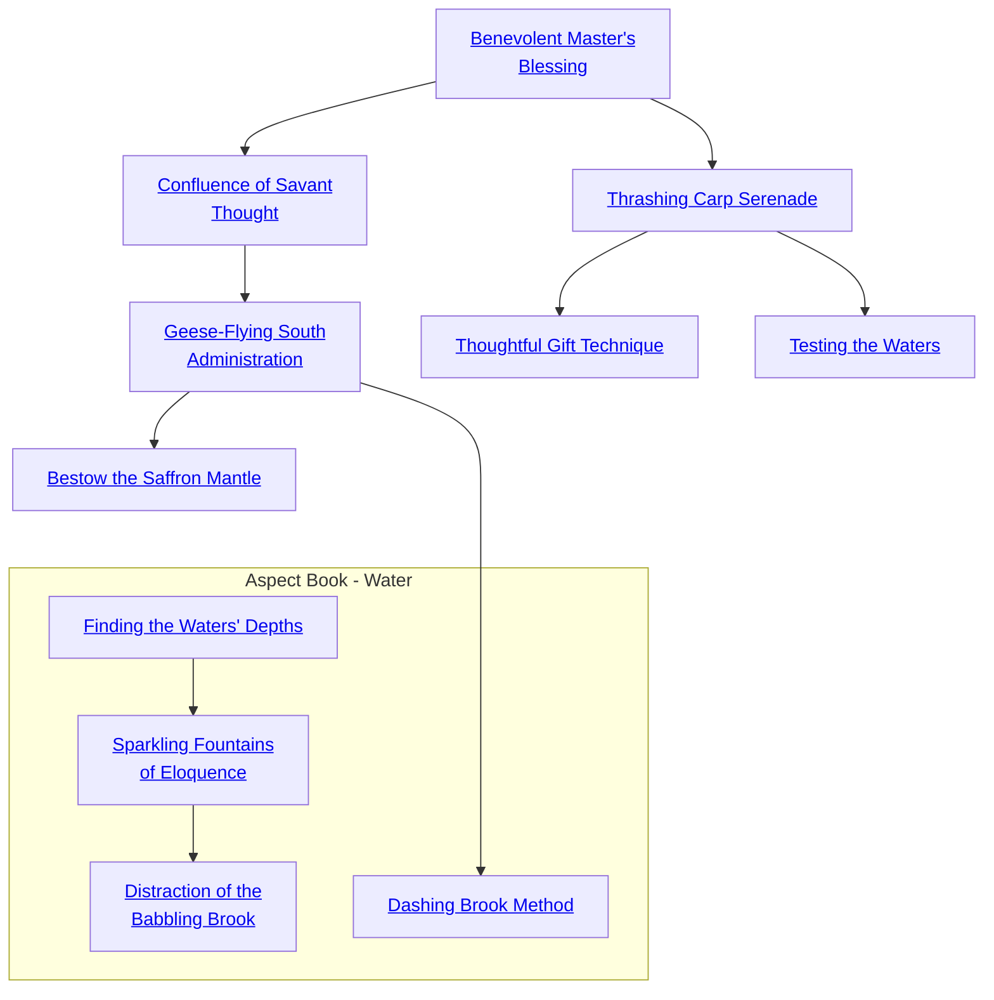

## Benevolent Master's Blessing

Cost: 1 mote or 1 mote per two dice
Duration: One scene
Type: Simple
Minimum Bureaucracy: 2
Minimum Essence: 1
Prerequisite Charms: None

Using this Charm, a Dragon-Blood administrator can
imbue his underlings with an echo of his own innate grasp of
the workings of state. The bureaucrat may grant one trusted
assistant a bonus of two dice per point of Essence spent. The
assistant may not more than double her Bureaucracy, and the
Exalt cannot donate more Ability than he has.
Alternately, for merely 1 mote of Essence, the Dynast may
turn a group of dullards or even the soul-dead victims of the Fair
Folk into passable temporary help by splitting his Bureaucracy
Ability among them, giving a maximum of one point to each.
This Charm requires some supervision — the assistants will
have questions, and if they cannot find the Dragon- Blood to ask
him their questions, the Charm fails. While supervising, the
Dragon-Blooded technically has no Bureaucracy, and can do
nothing but look after his charges. Temporary assistants must
have originally possessed no dots in Bureaucracy.

## Confluence of Savant Thought

Cost: 2 motes
Duration: One scene
Type: Simple
Minimum Bureaucracy: 3
Minimum Essence: 2
Prerequisite Charms: [[#Benevolent Master's Blessing]]

The Essence of bureaucracy is the same everywhere -
the day-to-day affairs of a household or mercantile establishment
tend to pool and eddy in predictable patterns no
matter how grand or humble the scale. An Exalt may use this
Charm to tap into the bureaucracy around her and under-
stand its general nature and some specifics of its operation,
such as where goods or documents are kept or who is
responsible for what aspects of administration. This Charm
does not grant unfettered access to guarded or locked areas,
but it does allow the Dragon-Blood to use her Bureaucracy
Ability in place of her Socialize Ability for purposes of
dissembling about paperwork, permissions and passage.

## Geese-Flying South Administration

Cost: 5 motes, 1 Willpower
Duration: One task
Type: Simple
Minimum Bureaucracy: 4
Minimum Essence: 2
Prerequisite Charms: [[#Confluence of Savant Thought]]

An administrator with this Charm can bend her entire
bureaucratic apparatus to expedite a designated task: tax collec-
tion, troop recruitment or selling merchandise, for example.
Her followers perform their duties exceptionally well for the
duration of the task, serving with the utmost dedication. At the
completion of the task, the Dragon-Blood reaps additional
benefits. Monetary profits increase by one percent per success
on an Intelligence + Bureaucracy roll. If the end result is goods
rather than coin, the amount is increased by two percent per
success. Conscription and other recruitment are improved by
two percent per success on a Charisma + Bureaucracy roll. The
Storyteller is responsible for determining the base result of any
such endeavor, before the improvements granted by this
Charm. These improvements are strictly magical and do not
actually improve the bureaucracy in the long term.

## Bestow the Saffron Mantle

Cost: 1 mote + 1 mote per dot lent
Duration: Special
Type: Simple
Minimum Bureaucracy: 4
Minimum Essence: 3
Prerequisite Charms: [[#Geese-Flying South Administration]]

This Charm is priceless to Dragon-Blooded who must
travel but cannot bear to leave their affairs in the hands of
others. Before leaving on a journey, a Dragon-Blood knowing
this Charm may designate a proxy to make decisions on his
behalf (most give a token of some kind, perhaps a seal, scroll
or garment). The designee administers precisely as the Exalt
would have were he present, making decisions and placing
resources with her master's remarkable skill. Dusty legends
popular only among scribes tell of assassinated Dynasts who
reach out from beyond the grave to wreak havoc on the affairs
of their murders by way of their faithful servants.
The Charm is effective for a number of weeks equal to
the successes scored on a Perception + Bureaucracy roll, but
the exact duration is not obvious to either the proxy or the
Dragon-Blooded, who must simply trust in his abilities. The
Dragon-Blood may end the Charm sooner if he wishes. If he
does so, the committed Essence begins returning normally.

## Thrashing Carp Serenade

Cost: 3 motes
Duration: One scene
Type: Simple
Minimum Bureaucracy: 3
Minimum Essence: 1
Prerequisite Charms: [[#Benevolent Master's Blessing]]

There is an art to impeding the flow of a bureaucracy.
The Thrashing Carp Serenade is only the beginning of that
art. By means of this Charm, an Exalt may slow administrative
tasks and productive deliberation in the area within the sound
of his voice to a near standstill. In order to make any progress,
the player of the opposing bureaucrat must best the wielder of
this Charm's player in an opposed Stamina + Bureaucracy
test. Any Water-aspected novice can hold a roomful of aged
scribes at bay, but only the experienced or rash use this
technique in an august body such as the Deliberative.

## Thoughtful Gift Technique

Cost: 2 motes
Duration: Instant
Type: Simple
Minimum Bureaucracy: 4
Minimum Essence: 2
Prerequisite Charms: [[#Thrashing Carp Serenade]]

Presenting an appropriate gift can take the edge off an
uncomfortable social gathering or gain favors and access
that would otherwise seem unattainable. Using this Charm,
a Dragon-Blood intuits what would make the perfect gift, for
public presentation, or the perfect bribe, for private dealings.
Specifying gift or bribe, the Exalt's player rolls Perception
+ Bureaucracy. The Exalt must know the intended recipient;
knowing him by reputation raises the difficulty of the
roll by 2. This Charm does not provide the gift — or even
easy access to it — it merely provides the information. The
brutish administrators of the tributary lands may be fondest
of gifts of wealth, but the nuanced tastes of the Dynasts may
require that the would-be gift-giver acquire unusual items
such as a lock of hair from a vain rival or a sapphire exactly
the color of a favored mistress's eyes.

## Testing the Waters

Cost: 3 motes
Duration: Instant
Type: Simple
Minimum Bureaucracy: 5
Minimum Essence: 2
Prerequisite Charms: [[#Thrashing Carp Serenade]]

The quickest path to disaster for a political gambit is to
call a vote before knowing how the votes will fall. Armed
with this Charm, a master bureaucrat can safely avoid that
pitfall. With but a moment's consideration, the Exalt knows
how many votes yea, nay or abstaining would result should
the matter under discussion be called to a vote. It does not
reveal by whom the votes would be cast. The Dragon-Blooded
do not only use this Charm to pass their own
agendas. They also hurry their rivals' plans to failure or
simply judge where their vote will bring the highest price.
Note that this Charm can only be used on groups of seven
or more; it simply fails if used on a smaller group.

## Finding the Waters' Depths

Cost: 2 motes
Duration: Instant
Type: Simple
Minimum Bureaucracy: 3
Minimum Essence: 2
Prerequisite Charms: None

The Dragon-Blooded of the Realm frequently buy and
sell goods and negotiate agreements much like ordinary
mortals. Since most deals are accomplished through elaborate haggling, this Charm is invaluable. It instantly allows the
character to know if the person she is bargaining with has
reached the limit of the price she is willing to pay or the
general degree of concessions she is willing to make. In
addition, the Charm allows the character's player to make a
roll to determine if the target is approaching the limit she is
willing to spend or agree to or if this limit is far beyond what
the character is currently asking. A single success on a Wits
+ Bureaucracy roll allows the character to know if the current
offer is half or more of her target's maximum or minimum
offer, two successes allows the character to determine her
target's limit within 10 percent, and three or more successes
allows the character to exactly determine the target's limit.

## Sparkling Fountains of Eloquence

Cost: 1 mote per two dice
Duration: Instant
Type: Simple
Minimum Bureaucracy: 3
Minimum Essence: 2
Prerequisite Charms: [[#Finding the Waters' Depths]]

This Charm lends special timbre and eloquence the
character's voice for the purpose of convincing someone to
buy an item or to agree to a deal. So long as the roll is being
made for one of these two purposes, the character can
improve her Bureaucracy dice pool by two dice for every
mote of Essence spent. The character cannot more than
double her Bureaucracy Trait with this Charm, and she
must pay the full motes of Essence even if she can only raise
the Trait by a single die.

## Distraction of the Babbling Brook

Cost: 4 motes, 1 Willpower
Duration: Instant
Type: Simple
Minimum Bureaucracy: 4
Minimum Essence: 2
Prerequisite Charms: [[#Sparkling Fountains of Eloquence]]

The Dynasts of the Realm must regularly engage in
trickery to preserve their ancient empire. One of the keys to
such trickery is convincing someone to agree to a deal without
looking too closely at the fine print. This Charm increases the
difficulty for a character to discover hidden traps in a contact
or to be able to locate hidden defects in merchandize the
character is offering for sale. In all cases, the tricks or traps
must be reasonably subtle. This Charm will not cause someone to sign a contract to sell themselves instantly into slavery
when they think they are signing a contract to purchase a
villa, nor will it cause a character to overlook the fact that the
horse she is buying only has three legs.
However, if noticing a problem would require a roll, this
Charm adds 1 to the difficulty of the Wits + Bureaucracy roll
needed to discover the problem. This Charm has no effect on the
Intelligence + Bureaucracy roll the character's player can use to
attempt to further conceal such problems. As a result, the
most subtle of the hidden problems become almost impossible
to find, while problems that are more obvious are simply
slightly less easy to spot. This Charm only works on a single
target. If several people are examining the item or contract,
then the character must use it on each of them separately.
Also, the target must be examining the item or contract while
the character is present for the character to use this Charm.

## Dashing Brook Method

Cost: 4 motes, 1 Willpower
Duration: One task
Type: Simple
Minimum Bureaucracy: 5
Minimum Essence: 3
Prerequisite Charms: [[#Geese-Flying South Administration]]

Regardless of whether they are working for or against a
character, large bureaucracies almost always move quite
slowly. This Charm does nothing to sway the outcome of a
petition or to dictate the success of an edict, but it will cause
any single request to be processed at the maximum possible
speed. Reduce the time needed by 10 percent for every
success, to a minimum of 10 percent of the unmodified time.
In the most extreme cases, a petition that would normally
take several days to be resolved requires only a few hours.
