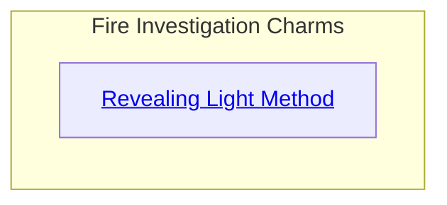
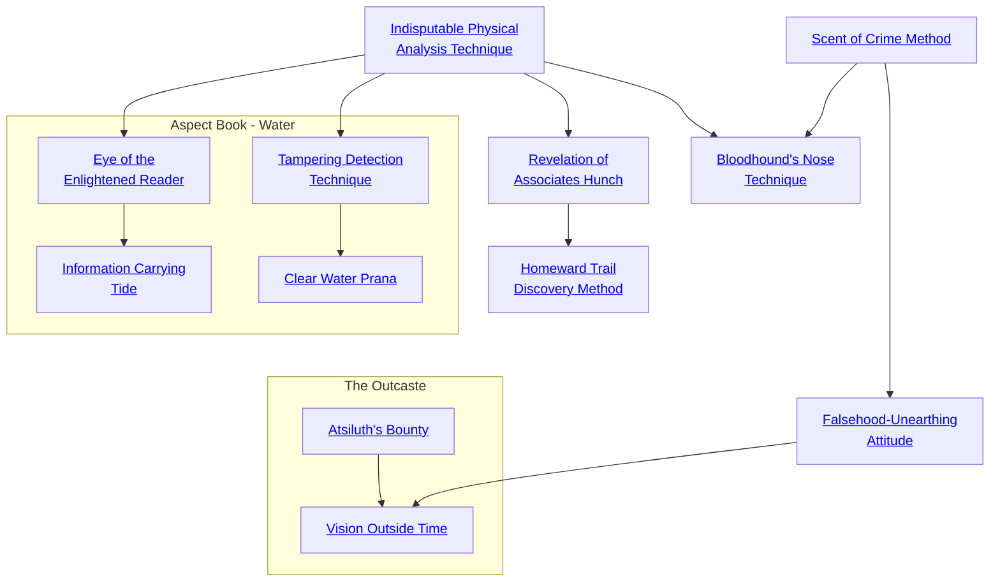

## Revealing Light Method

Cost: 5 motes
Duration: 1 minute
Type: Simple
Minimum Investigation: 2
Minimum Essence: 1
Prerequisite Charms: None

Fire reveals what is hidden. Its light pushes aside the
darkness; its heat reveals the metal within the ore. A
Dynast can use Essence to make an ordinary flame blaze up
with a glaring, pitiless light that reveals whatever another
person tries to conceal. Secret cupboards, chambers and
passages are easily located as the hair-fine crack of their
hidden doors suddenly stand out like gaping black chasms.
A person's disguise looks laughably false.
The player rolls Perception + Investigation. A simple
success rolled for this Charm negates any physical attempt
to make one object or person look like another. In cases
where something is hidden by misdirection or being placed
in or behind other objects (such as a letter hidden in a stack
of other missives, or within a long-necked vase) the
Storyteller must set a difficulty rating based on how clev-
erly or thoroughly the object is concealed, and the player
must meet that difficulty when rolling for the Charm.
Cascade Charms:
• The Revealing Light Method does not penetrate
magical forms of concealment and disguise. An improved
Charm can — or at least, each success rolled cancels one
success from any Charm of concealment.
• A more powerful or skilled Dynast could develop a
Charm that would reveal any attempt to tell a deliberate
lie. The Dragon-Blooded &quot;sees it in his eyes&quot; that the target
was fibbing.

## Indisputable Physical Analysis Technique

Cost: 1 mote per two dice
Duration: Instant
Type: Supplemental
Minimum Investigation: 2
Minimum Essence: 1
Prerequisite Charms: None

The magistrate or investigator with this Charm learns
the myriad ways of the criminal; his eye is better able to
connect seemingly disparate clues, and his intuition greatly
improves. The character can improve his Investigation
dice pool by two dice for every mote of Essence spent. The
character cannot do more than double his Investigation
Trait with this Charm, and he must pay the full motes of
Essence even if he needs to raise a Trait by only one die.

## Scent of Crime Method

Cost: 2 motes
Duration: One scene
Type: Simple
Minimum Investigation: 3
Minimum Essence: 1
Prerequisite Charms: None

A good investigator quickly learns to discern the nervous
habits, tics and mannerisms of people suffering under
a load of guilt. Since most guilt is associated with a crime, the
character becomes better able to discover a criminal among
a group of people. After spending Essence, the character's
player should make a Manipulation + Investigation roll. A
success here will point the investigator to the character
within eyesight currently suffering from the greatest load of
guilt. This is purely subjective, of course, and mostly left in
the hands of the Storyteller. Additionally, characters who
commit heinous crimes without a shred of conscience might
feel no guilt whatsoever from the acts they perform, making
this Charm useless in finding them.

## Falsehood-Unearthing Attitude

Cost: 5 motes + 1 Willpower
Duration: One scene
Type: Simple
Minimum Investigation: 3
Minimum Essence: 2
Prerequisite Charms: [[#Scent of Crime Method]]

The Exalted's ability to sense dishonesty finally reaches
supernatural levels when he learns this Charm. With it, he
can ferret out false statements in conversation, helping
him find the truth of a situation. This Charm does not
detect evasions or half-truths; it only points out statements
that the speaker knows to be false. The Exalted must pick
a target and spend the Essence and Willpower necessary to
activate this Charm; for the rest of the scene, falsehoods
spoken by that target will trigger a tingling sensation on
the back of the character's neck. If the target is aware of the
scrutiny he is under, he may conceal lies by spending 1
point of Willpower per statement. This Charm has no
effect if the target's permanent Essence is equal to or higher
than the Essence of the Exalt using this Charm.

## Bloodhound's Nose Technique

Cost: 6 motes, 1 Willpower
Duration: One scene
Type: Simple
Minimum Investigation: 4
Minimum Essence: 2
Prerequisite Charms: [[#Indisputable Physical Analysis Technique]], [[#Scent of Crime Method]]

The Exalted spends around 10 minutes walking around
the scene of a crime (or any event he wishes to investigate);
his player must then make an ordinary Investigation roll for
the Dynast to find ordinary pieces of evidence (footprints,
stray hairs, blood, etc.). This Charm uses a touch of sympathetic
magic to trace that evidence back to its creator. Roll
Intelligence + Investigation after spending the necessary
Essence to activate the Charm. With one success, the character
receives an impulse — a mild tugging — that pulls him
in the direction of the culprit. With three or more successes,
the character receives that impulse along with a fleeting
glimpse of the culprit as he appeared at the time of the crime.

## Revelation of Associates Hunch

Cost: 4 motes, 1 Willpower
Duration: Instant
Type: Simple
Minimum Investigation: 4
Minimum Essence: 2
Prerequisite Charms: [[#Indisputable Physical Analysis Technique]]

By simply meeting a person and coming within a few
yards of him, the Exalted can sense the identities of his
closest associates. Typically, these will be the character's
family members, business associates and members of any
sworn brotherhoods the Exalt belongs to, but they can also
be characters delineated by certain Backgrounds. Roll
Perception + Investigation; every success gives the name
and one-sentence description of two of the target's compatriots
or servants. Even if the roll fails, the Dragon-Blood
will still learn information about one of the target's associates.
Associates are revealed in roughly the following
order: family members, members of sworn brotherhoods,
allies, mentors, connections, henchmen; the Storyteller
can change that order as he sees fit.

## Homeward Trail Discovery Method

Cost: 5 motes, 1 Willpower
Duration: Instant
Type: Simple
Minimum Investigation: 5
Minimum Essence: 3
Prerequisite Charms: [[#Revelation of Associates Hunch]]

By simply meeting a person and coming within a few
yards of him, the Exalted can determine the place that the
person calls home. Usually, this is the character's primary
residence, but in the case of the Dragon-Blooded, who
might have several residences, it is the place that the
subject truly considers to be his home. If the subject has
any dots in the Manse Background, the Charm is almost
certain to point directly at his Manse of primary residence.
If the subject or one of his allies is a sorcerer, his home may
be warded against such divinations. In that case, this
Charm will point to another of the character's residences.
The Charm will only identify a building, not a particular
apartment or room within that building — and in the case
of longtime travelers or the impoverished, the Charm will
simply indicate that the subject has no true home.

## Atsiluth's Bounty

Cost: 1 mote
Duration: Instant
Type: Simple
Minimum Investigation: 2
Minimum Essence: 1
Prerequisite Charms: None

Those who live in Atsiluth Eternal dwell in luxury such
as even the Forest Witches cannot imagine. With a moment's
study of the Essence flows around her, a character can bring
forth unbounded wealth. Invoking this Charm within Atsiluth
Eternal, a character can conjure any mundane object or
structure, as well as any artifact or Manse up to level 5.
However, the artifacts and Hearthstones this Charm creates
only affect the &quot;material&quot; reality of Atsiluth Eternal. They can
improve the user's perceptions but cannot otherwise divine
information or directly affect the minds of others. They
cannot act at range without some physical effect that conveys
their power to the target. Outside of Atsiluth Eternal, they do
not function at all. The Sea of Mind chooses where the
summoned thing appears — the character cannot summon a
Manse into the air above an enemy, although she can expect
a summoned weapon to appear in her hand.

## Vision Outside Time

Cost: 2 motes, 1 Willpower
Duration: One scene
Type: Simple
Minimum Investigation: 4
Minimum Essence: 3
Prerequisite Charms: [[#Atsiluth's Bounty]], [[#Falsehood-Unearthing Attitude]]

The Exalt sprinkles a few drops of blood upon the dust of
Atsiluth Eternal and calls forth her vision soul: an image of
herself drawn from a dream of future days. Such images are
vicious, twisted and perverted liars, desiring primarily to
torment those who call them forth with false hopes and false
despairs. A wise Witch can, nevertheless, finagle hints from
them about the future, the present and the past. The player
makes a Manipulation + Investigation roll. If the Storyteller
wishes to play out the conversation, then each success represents
an opportunity to force out such a truth. The Exalt can
spend one of these successes at any time to determine the
vision soul's motivation behind a given statement — for
example, to tease the Exalt with obfuscation, to encourage
unwarranted despair or to save face after being tricked into
making some admission. Otherwise, the difficulty of the roll
is 3, and success tells the character one thing she should watch
for, one thing she should fear and one thing she should desire.

## Tampering Detection Technique

Cost: 2 motes
Duration: Instant
Type: Simple
Minimum Investigation: 3
Minimum Essence: 2
Prerequisite Charms: [[#Indisputable Physical Analysis Technique]]

A character using this Charm can instantly tell if an
object has been tampered with and how the tampering was
done. If a lock has been picked, forced or opened with any
form of magic or if a document has been altered in any way
or if a signature or seal has been forged, this Charm will
reveal both the changes and the method by which they were
accomplished. Each use of this Charm reveals all changes to
a single object that have been made in the last year. This
Charm does not reveal who made the changes and only
gives general information about when the tampering was
performed, but it will identify everything from a crude lock-
picking to a use of the Solar Charm Lock-Opening Touch.

## Clear Water Prana

Cost: 5 motes, 1 Willpower
Duration: Instant
Type: Simple
Minimum Investigation: 5
Minimum Essence: 3
Prerequisite Charms: [[#Tampering Detection Technique]]

When a character examines a room or a similar-sized
location to determine what occurred there, one of the
greatest risks is overlooking details that have been deliberately concealed or clues that have been hidden. This
Charm enables the character to find everything that was
deliberately hidden or concealed in a space no larger than
five yards on a side. When the character uses this Charm,
a tide of Essence sweeps through the area and glows briefly
when it encounters anything that has been deliberately
hidden. If the character is searching several small rooms or
one large room, she must use this Charm multiple times to
cover the entire area. Also, there is no guarantee that
something that has been hidden in the room has anything
to do with the events in which the character is interested.
If the character uses this Charm in a room where a murder
was committed, she might just as easily turn up the small
cache of opium the victim had stashed under the floorboards. Also, while the Charm automatically detects items
hidden by mundane means, to detect items hidden using
Charms or sorcery, the character's player must make a
successful resisted Perception + permanent Essence roll
against the Essence of the individual who used the Charms
or sorcery. It cannot discover matters concealed by Celestial Circle Sorcery or some equivalent or greater power.

## Eye of the Enlightened Reader

Cost: 3 motes
Duration: Instant
Type: Simple
Minimum Investigation: 4
Minimum Essence: 2
Prerequisite Charms: [[#Indisputable Physical Analysis Technique]]

This Charm does not help the character find the
sources he is looking for, but it does provide equally
important information about those sources that are useless
to the character. The character need only touch a book,
scroll or other manuscript, concentrate on the information he seeks and then use this Charm. In an instant, the
character will know if the document he is holding actually
contains the desired information. Of course, specifying a
particularly broad category of information, such as &quot;The
Realm,&quot; can provide general information that more specific requests can miss. However, such generalities may be
useless. In contrast, asking if a book contains a biography
of some particular person will instantly reveal if the book
contains such information, but it does nothing to let the
character know that this same book also contains useful
anecdotes about the same person buried in the biographies
of several other famous figures.

## Information Carrying Tide

Cost: 4 motes
Duration: Instant
Type: Supplemental
Minimum Investigation: 5
Minimum Essence: 3
Prerequisite Charms: [[#Eye of the Enlightened Reader]]

When confronted with a great library or some other
large collection of books and/or other records, the primary
challenge is winnowing through the information to find
the few grains of wheat amidst the vast amounts of chaff.
When a character uses this Charm, an invisible tide of
Essence flows outward and causes the most relevant and
useful materials within the collection to glow softly. This
Charm reduces any difficulty penalties to Investigation
rolls made because the Exalt is looking through large
numbers of books or other written records that are poorly
organized. This Charm reduces these penalties by the
character's permanent Essence but cannot lower the difficulty of a roll below 1. It merely makes looking for
information among a pile of random tomes no more
difficult that seeking it among the best organized and
cataloged library in the Realm. However, if the desired
information cannot be found in the library the character
is looking in, this Charm will not suddenly cause it to be
present. Instead, the character will merely be certain that
this information cannot be found in the collection of
manuscripts.
